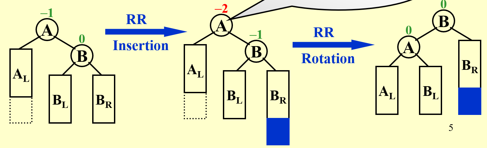
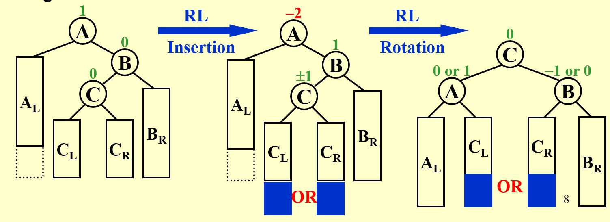

# class 1/2024.2.27
## chapter 0：课程要求
评分标准：
1. homework/10
2. discussion/10
3. project+peer review/30（including bonus）

project共8个，可选其中2个来做
需要pre，从3人中随机抽取1人
4. midterm/10
5. final/40

## chapter 1：AVL Trees, Splay Trees, and Amortized Analysis
### AVL Tree:
#### 目的及定义
- 加快搜索速度（通过降低树的高度）

> 原因是虽然说树的搜索速度是O(logn)，但由于树形状的不确定性，有较大概率呈现出O(n)的结果。

> 本质是二叉搜索树

因此可以理解为，AVL Tree的操作方式是：优化何者作为**根**的元素。

由此，可以考虑AVL Tree的定义：

T为height balanced当且仅当：
- $T_L$与$T_R$为height balanced
- $|h_L-h_R|\leq 1$

同时定义balance factor: BF(node) = $h_L-h_R$。

则我们可以将AVL Tree定义为：

**对任意节点p，BF(p) = -1或0或1**

#### 操作：旋转
显然，我们希望所有的树尽可能地变为AVL Tree，为此，我们需要通过操作来纠正树的根节点。

> 这种操作一般是伴随建树而进行的，否则调整会变得困难。

当对根节点p，BF(p)超过了-1到1的范围，说明此时需要调整。

对此，一共有四种情况：
- 左节点的左节点多出：LL
- 左节点的右节点多出：LR
- 右节点的左节点多出：RL
- 右节点的右节点多出：RR

RR/LL具体的操作如下：

举例：对一个AVL Tree的根节点A，有$A_L$, $A_R=B$, $B_L,B_R$均存在

插入一个节点，发现在B_R处且打破AVL的平衡

则令：
- B为根节点
- $B_L=A, B_R=B_R$
- $A_L=A_L,A_R=B_L$

于是调整完成，结果为AVL Tree。

RL/LR具体的操作如下：（事实上就是再往下一层来调整）

*注：此处较难理解：事实上树的可能问题只有这四种形状，要注意到可以通过调整子树来解决。*

这也就是为什么LR和RL要拿出来单独说，这是因为LL和RR在两层内就可以解决了，但LR和RL必须要三层才能发现问题。

在操作结束后，是以所处理的树此时的根节点为第一个节点，然后接着往上回溯。
**这里有待论证是否正确！**

- 如何检测是哪种情况呢？
- 由于出现了RL/LR的情况，我们需要确认**三层**BF的值。
- LL：0/1/2
- RR：0/-1/-2
- LR：1或-1/-1/2
- RL：1或-1/1/-2

**思考：是否只有这几种情况会出现？**

论证如下：

首先明确检测的方式：从插入点寻找父节点，直至根节点。

因此，2/-2只会出现1次，故而情况变为如下12种：

0/1/2；0/1/-2；0/-1/2；0/-1/-2；1/1/2；1/1/-2；1/-1/2；1/-1/-2；-1/1/2；-1/1/-2；-1/-1/2；-1/-1/-2

对于0/-1/2型：

如若BF为0的节点左右均无节点，则不构成冲突

如若有节点，则应当同时存在2个以上的节点，那么在前一次插入其中一个节点时，就应当进行调整。

故而可得，只存在如上几种情况，因此这个方法是完备的。

时间复杂度通过类似斐波那契数列的方式解决，此时确定为O(logn)。

### Splay Tree:
#### 与AVL Tree对比：
相比于AVL Tree，Splay Tree不再要求每次插入都进行检查。

（预处理）：amortized time: 对于整个算法复杂度为O(logn)的算法，其中某些操作为O(n)（但不多），这是被允许的。

这种方式叫做amortized time（摊还时间）。

而Splay Tree的想法：正常插入，最后再统一调整。

但由于这种方式产生的可能性极多，单纯用AVL的方法显然是行不通的。

#### 方法：zig-zag/zig-zig
从探测到处理，大部分沿用AVL的方式，但对于单旋（即LL/RR）要求更严一些：

我们要求做两次单旋而非一次，具体操作如下：先将P与G交换，再将G与X交换。

另外，调整后的下一步与AVL也相同。

#### 应用
删除节点时，用Splay Tree的可能显然要比AVL大。

具体操作与正常删节点相同。

#### 时间复杂度分析：
（此部分需要重新细致推导）
$worst-case bound \geq amortized~bound \geq average-case bound$

（此处需补充实例等）
以multi-pop为例，解释三种分析方法：

> multi-pop即将堆种所有元素pop，直至堆空

显然，不同位置的元素需要的时间是不同的。

- aggregate analysis (聚合分析)

对于总时间T(n)，摊还时间即为T(n)/n.

- accounting method (核算法)

对不同的操作采用不同的代价，当摊还代价大于实际代价时可以“存储”这个时间。

在push时，我们可以额外加一些代价，在pop和multi-pop时来使用。

> 这是一个比较形象的方法，主要是为了引出下一种方法（代价的量化等并没有一个较好的标准）

- potential method (势能法)

更为定量的算法，将核算法中的“代价”定量为一个函数。

