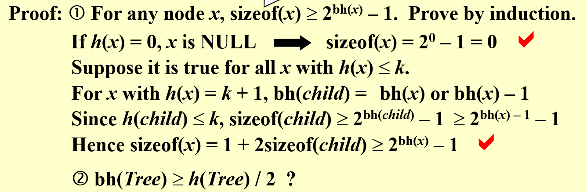
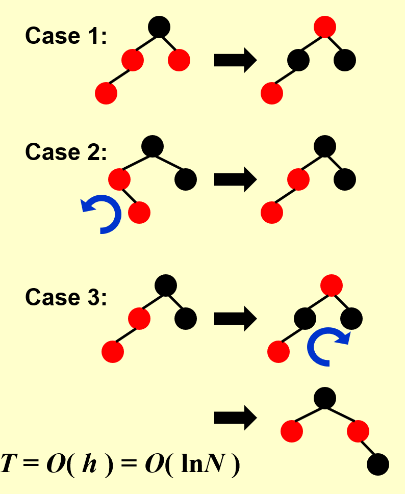
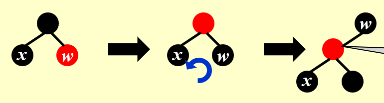
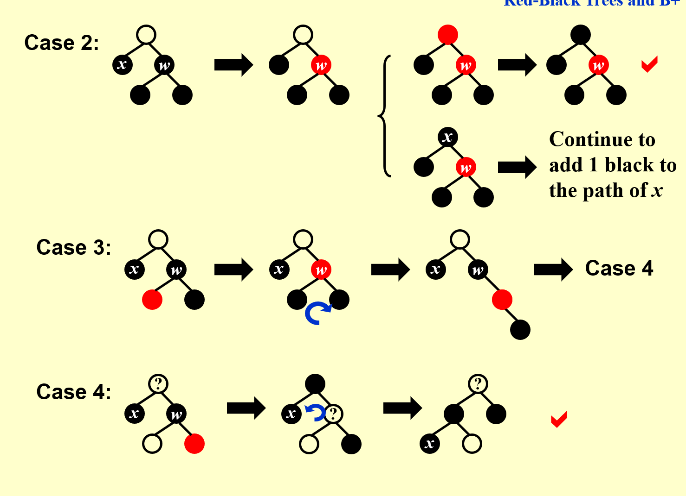
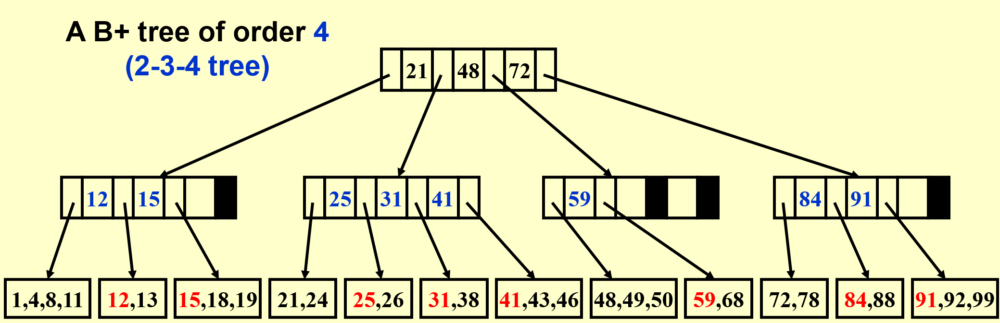

# class 2/2024.3.5
## chapter 2: Red-Black Trees and B+ Trees
### red-black tree:
#### 红黑树的定义：
> 注：红黑树中，要求树的数据结构中存在color的控制变量

红黑树与AVL tree相同，也是为了加速BST的操作，但要比AVL tree复杂更多。

红黑树本质上也是二叉搜索树。

红黑树要求树满足如下条件：
- 所有节点非红即黑；
- 根节点是黑的；
- 所有的叶子节点/NIL是黑的；
- 如果一个节点是红的，那么它的两个孩子都是黑的；
- 对每个节点，所有从它到它叶子节点的简单路径中，含有的黑色节点是相同的。

**注意：实例中给出的树都省略了最后的空节点，事实上每一个实例中的“叶子节点”都有两个黑色的子节点，这个节点才是叶子节点！**

**注意：在计算黑高时，是不计算目标节点本身的。**

#### 黑高（black-height）

定义bh(black-height)为对节点x到任意叶子节点的简单路径，含有的黑色节点。

并且定义：bh(Tree) = bh(root)。

**要注意NIL的隐藏节点是需要计入黑高的！**

于是有定理：对一个拥有N个内部节点的红黑树，其高度最多为$2ln(N+1)$。

证明如下：

将两个式子结合起来，容易得到该定理。

#### 操作：插入

在插入新元素（我们初始设其颜色为红色）后，需要检查它的父节点是否为红色。

如是，那么需要调整颜色/旋转：

case 1：只需调换颜色即可，内容不需要改变；

case 2：对两个红节点左旋，将情况转化为case 3；

case 3：先换颜色，与case 1相同，再右旋。

同时，与这三种情况对称的还有三个情况。

最后，根节点如果为红，直接把它变成黑的就行了，只是黑高+1，不会出现其他的问题。

#### 操作：删除

如果删除的节点是红的，有如下三种分类：

1. 删除的是叶子节点：把它的父节点对应的子节点设为空即可。

2. 删除的是有一个子节点的父节点：把它用这个子节点替代即可。

3. 删除的是有两个子节点的父节点：

如果删除的节点是黑的：

1. 它的两个子节点一黑一红：

2. 它的两个子节点全是黑的：有如下情况及解决方案：

**注：只有case 2.2中需要往上再看，直到父节点有红色节点或者父节点为根节点为止。**

**注：case 1要转为case 2.1或2.2，case 3要转为case 4.**

### B+ Trees
#### 定义：
B+树有如下定义：

- 根要么是一个叶子节点要么有2-M个子节点；
- 所有非叶子节点含有$\leftceilling M/2 \rightceilling$到M个子节点；
- 所有叶子节点具备同样的深度。

