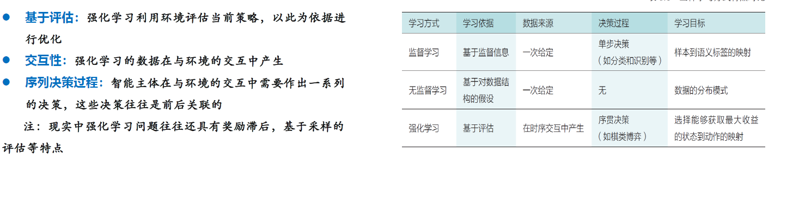
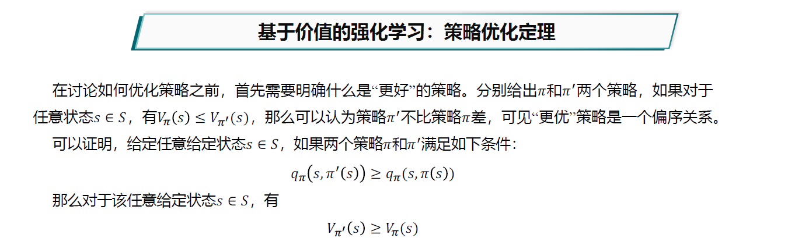
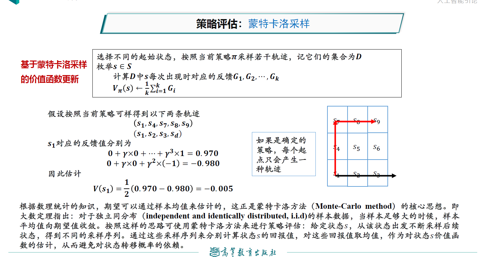
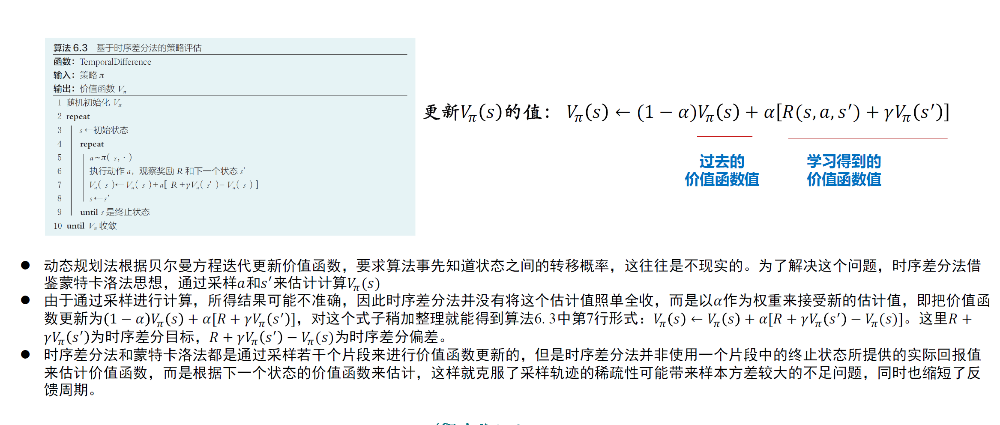
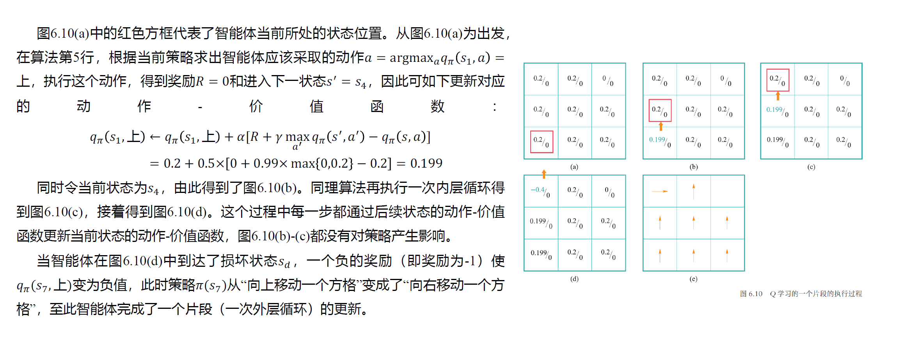
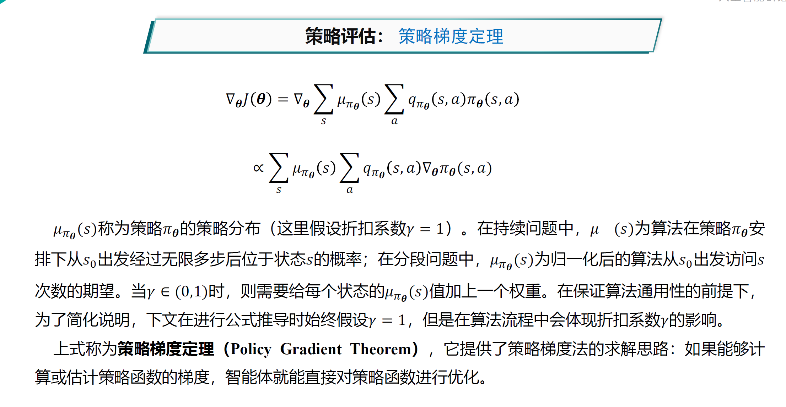

# 人工智能前沿复习

## 搜索

### A*算法

#### A*算法原理

f(n) = g(n) + h(n)

f(n): 评价函数（用于选择下一步的节点）
g(n): 起始节点到节点n的代价
h(n): 启发函数，节点n到目标节点的代价

#### A*算法特征

可容性：对h(n)估计的代价小于等于实际代价

即，启发函数不会过高估计代价

$$
h(n) \leq h^*(n)
$$

一致性：可以近似理解为“两边之和大于第三边”

即，从n到n',再从n'到目标节点的代价要大于等于n直接到目标节点。

$$
h(n) \leq c(n,a,n') + h(n')
$$

其中，$c(n,a,n')$指的是n通过动作a达到n'的代价。

一致性必然包含可容性，只需要将所有步骤一步一步用一致性放缩，最终就能得到可容性结论。

如果一个启发函数满足一致性条件，那么该启发函数必然满足可容性条件

#### A*算法完备的条件

如果求解问题和启发函数满足以下条件，则A*算法完备：
- 搜索树中分支数量有限，即每个节点的后继节点数量有限（保证最终结果收敛）
- 单步代价的下界是一个正数（避免走回头路）
- 启发函数有下界

#### A*算法是否最优

如果启发函数是可容的，那么A*算法满足最优性

### alpha-beta剪枝算法

Alpha-Beta剪枝搜索算法在Minimax算法中可减少被搜索的节点数，即在保证得到与原Minimax算法同样的搜索结果时，剪去了不影响最终结果的搜索分枝。

（这个结合ADS看）

### 蒙特卡洛树搜索

#### $\epsilon-贪心算法$

它与贪心算法的区别在于：平衡**探索**与**利用**。

它在$\epsilon$概率是随机选取机械臂执行，否则采用根据之前经验得出的最佳机械臂执行。

#### 上限置信区间算法（UCB1）

由于刚才的贪心算法采用的是**对探索次数较少的机械臂优先探索**，这不一定是最佳的，因为只需要少量次数就能确定方差较小（不确定性较小）的期望。因此应当优先探索估计值不确定度高的决策。

UCB1会对每一个动作估计一个置信区间（即获得奖励的期望范围），并选择置信区间上界最高的动作执行。

## 强化学习

智能体通过“尝试与试错”，“探索与利用”等机制在所处状态采取行动。

马尔科夫链模型：MP=(S,P)(S为状态，P为状态转移概率)

马尔可夫奖励过程：MRP=(S,P,R,Y)(R为奖励函数，Y为后续时刻奖励对当前动作的价值系数)

$R(S_t,A_t,S_{t+1})$指从$S_t$到$S_{t+1}$的奖励

马尔可夫决策过程：MDP=(S,A,P,R,Y)

A为动作集合

马尔可夫决策过程得到的一个状态序列叫做**轨迹**。如果轨迹包含终止状态，则问题为**分段问题**，否则为**持续问题**。在分段问题中，一个从初始状态到终止状态的完整轨迹称为一个**片段**。

策略函数：$\pi(s,a)$刻画了智能体选择动作的机制。给定状态s的情况下，只有一个a使得这个函数值为1。一个好的策略函数能使智能体在采取一系列行动后可得到最佳奖励。

价值函数：$V_{\pi}(s)$:表示智能体在处于状态s时，按照$\pi$策略采取行动时能获得回报的期望。

动作-价值函数：$q_{\pi}(s,a)$表示智能体在处于状态s时，选择了动作a后，在t时刻后根据策略$\pi$采取行动获得回报的期望。

强化学习相当于：给定一个MDP，学习一个最优策略$\pi^*$，对任意s使得价值函数值最大。

强化学习可以基于价值、基于策略、基于模型等不同方法。

当前状态的价值函数等于瞬时奖励的期望（R(s,a,s')）加后续价值函数的期望（乘Y折扣）。动作价值函数同理。

### 基于价值的强化学习

步骤：
- 策略评估：通过策略计算价值函数
- 策略优化：通过价值函数优化策略
- 策略迭代：策略评估、策略优化交替进行（GPI）

三种策略评估的方法：
- 动态规划
- 蒙特卡洛采样
- 时序差分

动态规划：智能体需要事先知道状态转移概率，无法处理状态集合大小无限的情况。

动态规划通过迭代计算$V = \sum \pi(s,a) \times q_{\pi}(s,a)$计算V

蒙特卡洛采样：通过采样轨迹来计算s的回报值，再对它们取平均值作为价值函数的估计，从而避免对状态转移函数的依赖。

时序差分：上述两方法的有机结合，避免蒙特卡洛采样轨迹稀疏以及反馈周期长的问题，且可以从之前的结果中进行学习。

价值迭代算法：动态规划的基础上，每次迭代只对一个状态进行策略评估和策略优化。

Q学习算法：只计算动作-价值函数。问题在于采样不足和难以收敛。

深度Q网络：（DQN）次啊用经验重现的方法。

### 基于策略的强化学习

策略梯度法

