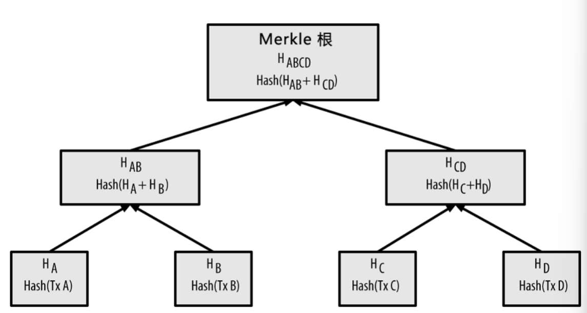

## class 1: Overview

### 成绩构成

- hw 1: 10%
- hw 2: 20%
- hw 3: 10%
- final: 60%(with a cheating paper)

### 题目总结

1. 什么是非对称加密技术？有何作用？

> 来源：chapter 1 P26

非对称加密技术，即加密函数的密钥和解密函数的密钥不同。（例如公钥密码学中，将公钥作为加密函数的密钥，私钥作为解密函数的密钥）。

它的作用就是解决了密钥传输的问题，加密时使用的公钥是公开的，而解密时使用的私钥是保密的。这样不必要求传输信息双方预先约定好密钥，进一步保证了信息的安全性。

（非对称加密技术有如下几种方法）：
- 基于大素数分解难题：RSA
- 基于离散对数难解问题：椭圆曲线加密；DH加密（Diffie-Hellman加密）

2. 什么是Merkle树？它有什么作用？

> 来源：chapter 1 P43

Merkle树是一种哈希二叉树，它是一种用作快速归纳和校验大规模数据完整性的数据结构。这种二叉树的结构为：
- 叶节点是数据块的哈希值
- 非叶子节点的哈希值是根据它下面子节点的值哈希计算得到。

其结构如下图所示：

（注：其中的`Hash`代表两次SHA256算法计算）

Merkle树中插入一个新的交易叶子时：
- 若当前叶子节点总数为奇数，则让其替代单个节点的副本
- 若当前叶子节点总数为偶数，则让它生成一个副本，作为新的非叶子节点的两个叶子节点。

（即：时刻保持Merkle树为完全二叉树，每个非叶子节点都有两个子节点）

作用：
- 在比特币网络中，Merkle树被用来归纳一个区块中的所有交易，同时生成整个交易集合的数字指纹，且提供了一种校验区块是否存在某交易的高效途径。
    - 快速比较大量数据：如果两个Merkle树的根哈希值相同，那么说明二者所代表的数据都相同
    - 快速定位修改：如果某个交易发生修改，从根向下可以快速定位被修改的数据
    - 快速验证数据：像验证交易是否存在于Merkle树，只需要逐层向上计算哈希值，最终与根节点哈希值比较即可判断