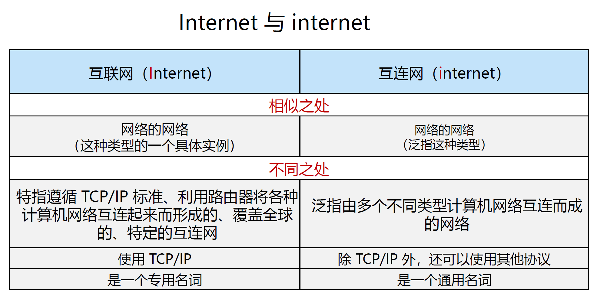
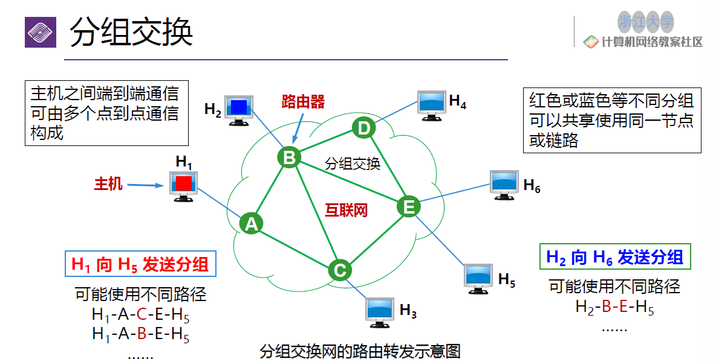
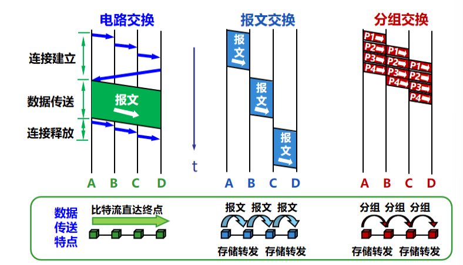
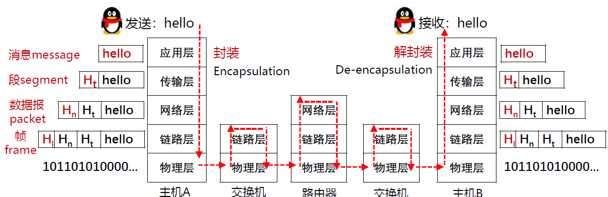
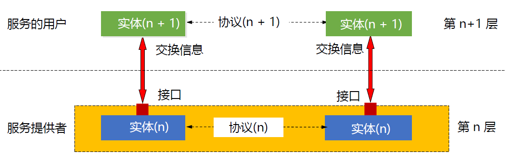
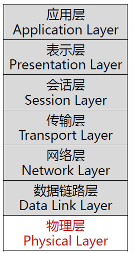
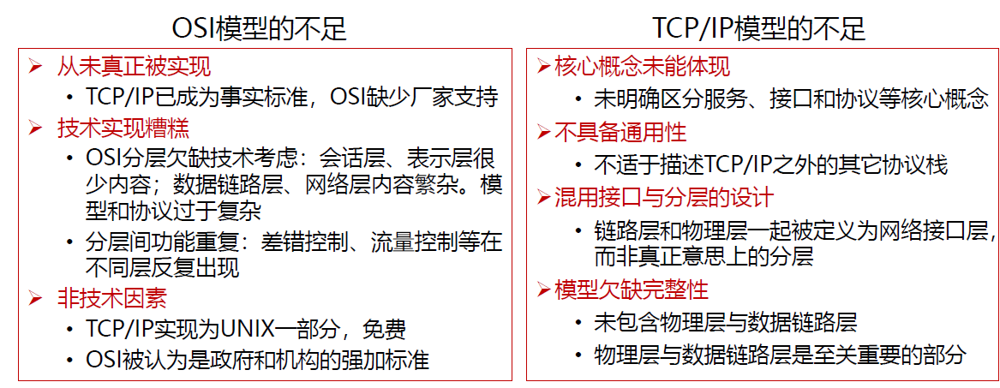
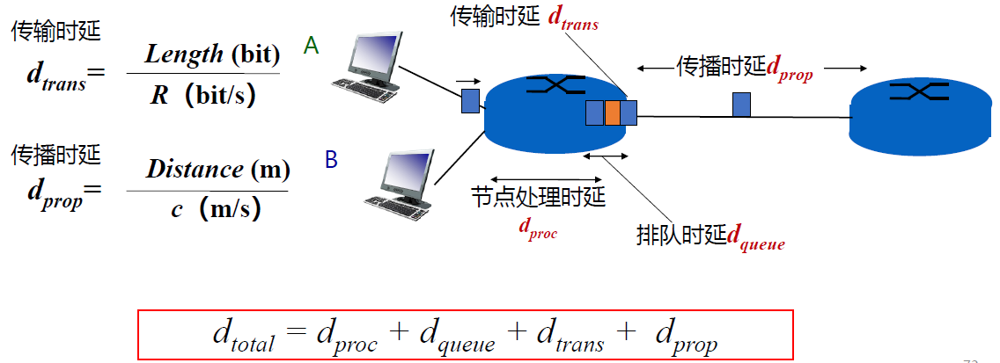

## class 1: Overview

### 评分构成

- 平时：50%
    - 作业：7-8次
    - 实验：6次
    - quiz：3-4次
- 期末考试：50%（全客观，英文）

### 概述

#### 1. 计算机网络简述

- 网络的基本功能：信息传递
    - 准确性（例如邮件需要每个字节都准确）
    - 实时性/低延迟（例如视频可以不必每个字节都正确，但要保证传输速度）

网络的分类可按照规模分类如下：

- 个域网（personal area network/PAN）
    - 蓝牙
    - 无线鼠标
- 局域网（local area network/LAN）
    - WLAN
    - 路由器
- 城域网（metropolitan area network/MAN）
    - 范围覆盖一个城市的网络（网络意义上已被弃用）
    - 运营商（物理意义上）
- 广域网（wide area network/WAN）
    - 范围扩大到一个省/国家

**Internet和internet的区别**

互联网的层级结构：

- Tier-1 ISP：全球最高级别的ISP，互不结算
    - 中国电信/中国联通
- Tier-2 ISP：往往需要向更高级别ISP交流量费
    - 中国移动/教育网

#### 2. 互联网的构成

##### 2.1 物理介质

- 传输单元
    - 位（bit）用于传输，如Mbps
    - 字节（Byte）用于存储，如MB
    - 1B=8b
- 物理媒体
    - 引导性介质（在固体介质中传播）：铜/光纤
    - 非引导性介质（自由传播）：无线电

##### 2.2 总体构成

互联网由 **网络边缘** 和 **网络核心** 构成。

##### 2.3 网络边缘

- 主机Host组成端系统（位于互联网边缘与互联网相连的计算机和其他设备）
    - 客户端
    - 服务器
    - 主机通过 **接入网** 连接到边缘路由器上

###### 2.3.1 接入网

接入网有如下方式实现：
- 有线方式：
    - 光纤到户（fiber to the home, FTTH）
    - 数字用户线（DSL）
    - 同轴电缆（Cable）
- 无线方式：无线局域网（WLAN/Wi-Fi）/广域蜂窝接入网（2G/3G/4G/5G）
    - *对nG的情况，一般在探索更高频率的信号传输；频率越高，带宽越大，传输量越大，但绕射能力越弱（基站需要越密集）*
    - 边缘路由器是Host去往任何其他远程端系统的路径上的第一台路由器

##### 2.4 网络核心

目标：将海量的端系统互联起来

定义：由各类交换机（路由器）和链路，构成的网状网络

功能：
- 路由（routing）：确定源到目标的路径，记在路由表中
- 转发（forwarding）：通过路由表，进行实际转发的操作

网络核心的运作方式可以类比电话接线员：
- 用户打电话，先将电话转到接线员处（路由器）
- 接线员确认用户要打给谁（路由）
- 接线员接线，开始通话（转发）

实现方式：
- 电路交换：无法应对bursty message（即通信的时长是无法预测的，因此无法预留合适的空间），难以重连，线路专用等问题。
- 报文交换：存储/转发模型，路由器在接收到完整的数据报文后，才能开始发送，但具备较大的延迟。
- 分组交换：流水线式的报文交换，并且可以共享节点，实时判断接下来的传到路径，但问题在于由于选用了不同路径并且分组，数据包抵达的顺序不完全为发出的顺序。

分组交换的例子：数据包到了每个节点再进行路径判断。

总体实现方式可以看如下图解：

#### 3. 协议（protocol）

##### 3.1 基本定义

网络协议（network protocol）：为进行网络中的数据交换而建立的规则、标准或约定

该协议通信双方需要共同遵守、互相理解。

协议的三要素：
- 语法：规定传输数据的格式
- 语义：规定所要完成的功能
- 时序：规定各种操作的时序

##### 3.2 协议的分层结构

由于计算机网络本身的复杂与异构（即不同的层面有不同的实现方式）以及高速的更新迭代，因此统一一个计算机网络的协议是不现实的。通过分层结构将模块之间互相独立起来，可以更好地解耦。

协议的具体分层架构：

- 层次栈（a stack of layers）：即层次结构的协议栈，即不同层次之间信息传递的协议
- 对等实体（peers）：同一层次的实体互为对等实体
- 接口（interface）：相邻层次间信息传递的具体方法，定义了下层向上层提供的 **服务原语**
- 网络体系结构（network architecture）：层和协议的集合

传递的实例如下：

##### 3.3 服务原语（service primitives）

所谓服务原语，就是服务中使用的传递服务相关信息的语言。

服务大致可以分为：
- 面向连接传输服务（传递过程需要应答，例如打电话需要逐步响应）
- 无连接传输服务（传递过程不需要应答，直接根据信息进行传输）

六个核心服务原语（以面向连接服务为例）：（对照：客户机-服务器）
- 连接请求-接受响应
- 请求数据-应答
- 请求断开-断开连接

与协议的关系：协议是水平的，服务是垂直的

#### 4. 参考模型

##### 4.1 OSI参考模型

OSI模型一共有 **7** 层：

- 1. 物理层（physical layer）：定义如何在信道上传输0，1
    - 机械接口的大小/形状
    - 电子信号（电压/电流）
    - 时序接口：采样频率、波特率、比他率等
    - 介质
- 2. 数据链路层（data link layer）：实现相邻网络实体间的数据传输
    - 成帧（Framing）：每n个比特提取一个完整的帧
    - 错误检测：对每一帧（frame）进行检测
    - 物理地址（MAC address）：48位，理论上唯一的网络标识，烧录在网卡
    - 流量控制，避免淹没（overwhelming）
    - 共享信道上的访问控制（MAC）
- 3. 网络层（network layer）：将数据包跨越网络从源设备发送到目的设备（host to host）
    - 路由
    - 服务质量
    - 异构网络互联
    -  **思考：为何在唯一的MAC地址之外，还需要唯一的 IP 地址？** 这是因为MAC地址的标识编制是厂商/生产日期等，的确具备独一无二的性质，但是MAC地址并不能够提供“当前设备所在地址”的信息（因为这个信息是实时的，但MAC地址是出厂时就确定的），所以我们需要IP地址来确认这个信息，从而更快地定位到当前的设备。
-  4. 传输层（transport layer）：将数据从源端口发送到目的端口（进程到进程）
    - 面向终端开发者提供端到端的数据传输控制
- 5/6/7:
    - 5. 会话层（session layer）：在应用程序间建立和维持会话（session）
    - 6. 表示层（presentation layer）：处理传递信息的语法和语义
    - 7. 应用层（application layer）：提供应用程序便捷的网络服务调用

##### 4.2 TCP/IP参考模型

TCP/IP模型总共有 **4** 层。

*先有TCP/IP协议栈，然后有TCP/IP参考模型*

TCP/IP采取 **端对端** 原则，由端系统负责丢失恢复等。

OSI与TCP/IP模型的比较如下：

#### 5. 计算机网络度量单位

- 比特率（bit rate）：主机在数字信道上传送数据的速率：bps/kbps/Mbps/Gbps等
- 带宽：网络中某通道传送数据的能力（即上限）：/s
- 包转发率（PPS）：packer per second，表示交换机或路由器以包为单位的转发速率。

**思考：既然以包为单位，为什么包的大小不设置为尽可能小来提升转发率呢？**

> 事实上，每个包都需要header，而header在分割包时是不会变化的，那么如果包被分割的数量越多，则重复的、无效的header越多。

- 时延（delay）：
    - 传输时延/发送时延（transmission delay）：数据从节点进入传输媒体所需时间
    - 传播时延（propagation delay）：电磁波的传播花费时间（一般较小，可大约理解为：距离/光速）
    - 处理时延（processing delay）：主机或路由器处理分析数据的时间
    - 排队时延（queueing delay）：多个传输包在路由器中FIFO的排队等待时间
    - 往返时延（round-trip time）：从发送方发送数据开始，到发送方收到来自接收方的确认经历的总时间（即一来一回），ping中显示的就是往返时延。
    - 时延带宽积：传播时延x带宽；单位为bit

- 吞吐量（throughput）：单位时间内通过某个网络的数据量：b/s
- 有效吞吐量（goodput）：单位时间内目的地正确接收到的有用信息的数目：b
- 利用率
    - 信道利用率：信道被利用的时间占比
    - 网络利用率：全网络的信道利用率的加权平均值
- 丢包率：丢失数据包数量占比

- 时延抖动：同样操作但发生变化的时延

#### 6. 网络安全与威胁

网络空间（cyberspace）已成为继陆、海、空、天之后的第五大战略空间。

恶意软件：
- 病毒（Virus）：需要某种形式的用户交互来不断传播的恶意软件
- 蠕虫（Worm）：一种无需用户明显交互即可运行和传播的独立程序

如何防御：
- 身份验证
- 保密（加密）
- 完整性检查（数字签名）
- 访问限制（加密VPN）
- 防火墙（网络安全）

#### 7. 标准化组织

- 国际标准组织：ISO（international organization for standardization）
    - ISO 7498提出了OSI七层参考模型
- 国际电信联盟：ITU
- 国际电气和电子工程师协会（IEEE）
    - IEEE802.11发布了WiFi的主协议
- WIFI联盟
- 万维网联盟（W3C）
- 互联网工程任务组（IETF）
    - 制定TCP/IP/HTTP
- Internet研究任务组（IRTF）

#### 8. 互联网发展史与启示