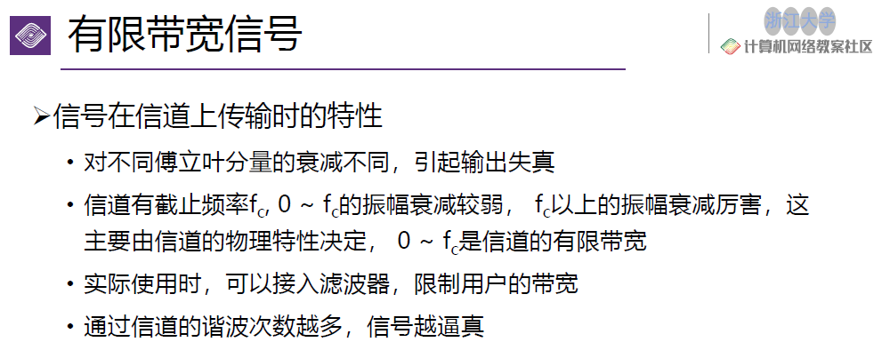

## chapter 2: 物理层

### 1. 物理层的基本概念

物理层的功能：

- 位置：网络体系中的最低层
  - **不是** 链接计算机的具体物理设备
  - **不是** 负责信号传输的具体物理媒体
- 功能：如何在连接各计算机的传输媒体上传输数据比特流
  - 数据链路层将比特流传送给物理层
  - 物理层将比特流按照传输媒体的需要进行编码
  - 信号通过传输媒体传输到下个节点的物理层
- 作用：尽可能屏蔽掉不同传输媒体和通信手段的差异

物理层需要定义的特性：

- 机械特性（形状、尺寸、引线等）
- 电气特性（电路特性等）
- 接口功能特性（每一个引脚的作用）
- 过程特性（指明对于不同功能的各种可能事件的出现顺序）

物理层的常用标准

- 点对点通信线路：直接连接两个结点
  - EIA RS-232-C
  - EIA RS-449
- 广播通信线路：一条公共通信线路连接多个结点
  - IEEE 802.3系列（以太网）
  - 无线局域网

### 2. 数据通信

主要内容：研究信号在通信信道上传输时的数学表示及其收到的限制。

即：联系起电磁信号与比特流之间的转化关系。

**傅立叶分析：**

信息是以电磁信号的形式传输的：

- 时域观：电磁信号是时间的函数
- 频域观：电磁信号也是频率的函数

#### 2.1 傅立叶分析

注意将$nf$结合来看，事实上就是正余弦函数在频率倍数情况下的累加。

具体转化的流程为：

比特流（01010100...）-> g(t)（在一个周期内描述整个比特流）-> 傅立叶变换后得到的三角函数和-> 形成电磁波形，电磁波形尽可能拟合g(t)的图像

对信号的频谱分析：对于上图中e图的分析：它的频谱从f到8f（因为它是8谐波，也就是之前傅立叶分析n取到8），则其贷款为8f-f=7f。

显然，信号的信息承载能力与带宽有直接关系，带宽越宽，信息承载能力越强。

但是，信道有一定的截止频率，在截止频率之上的信号分量衰减的更厉害，这就意味着信道从0到截止频率就是它的有限带宽。

其中，接入滤波器可实现多路复用（不同的信号使用不同的频段）

下图很好地讲述了计算传输速率的方式：

看到$N=24000/B$可知：要传输信息的速度越快，在一个周期内的数据变化越大，g(t)越复杂，电磁波越难以刻画，因此N（可传输的谐波数量）越小。

奈奎斯特定理：最大数据传输率为$2Hlog_2V$, H为带宽，V为信号电平,即假设最大电平为1V,将其平均分为2份表示0/1,3份表示0/1/2等等。

奈奎斯特定理：无噪声；完全无损

symbol rate (== baud rate)

data rate = symbol rate * bits per symbol

- 香农定理: 引入更广泛的噪声干扰

从这里接入<信息理论>:信息量的概念等

$I= -log_ap$

#### 2.2 数据通信模型

总体的数据通信模型如下:

数字通信与模拟通信:

- 数字通信:以数字信号传递消息
- 模拟通信:以模拟信号传递消息
- 二者之间可以转换:A/D;D/A

传输方式:串行/并行

传输对象:点到点/点到多点传输

传送方向:单工/半双工/全双工

- 单工:只能从A传到B
- 半双工:能够双向传递,但数据同时只能单向传递
- 全双工:能够随时双向传递

是否搬移频谱:基带传输/频带传输

- 基带传输:不带频谱,频率成分宽,但最简单,最基本
- 频带传输:利用调制解调器搬移信号频谱的传输体制(例如0-5000Hz的说话声搬移频谱到2.4GHz频段上,通过更高效的信道进行传输)

#### 2.3 数据编码

##### 2.3.1 基带传输编码

常用的编码方式:

- 归零制编码:
  - 低电平表示0;高电平表示1,每一位之后有一个零电平
  - 缺点:
    - 每次多传一位,效率低下
- 不归零制编码(NRZ):
  - 低电平表示0;高电平表示1
  - 缺点:
    - 难以分辨一位的结束与另一位的开始
    - 发送方和接收方必须有始终同步
    - 如果连续出现0或1,信号直流分量将累加
    - 容易出现传播错误
- 曼彻斯特编码(Manchester):
  - 每一位中间有一个跳变,低到高是0,高到低是1
  - 优点:
    - 克服NRZ码的不足,同时跳变本身即可作为时钟,能够自同步.
- 差分曼彻斯特码(Differential Manchester):逢"0"NRZ码+曼彻斯特编码
- 逢"1"变化的NRZ码
- 逢"0"变化的NRZ码

##### 2.3.2 频带传输编码

频带传输:指在一定频率范围内的线路上,进行载波传输.

三种调制技术:

- 幅移键控法:用振幅表示
- 频移键控法:用频率表示
- 相移键控法:用相位表示

具体调制方法:调整IQ信号的幅度(可以理解为对x/y进行调整,此时变化越快,频率越高;半径越大,振幅越大;I+Q即为当前的相位)

具体使用I/Q信号代表信息的方式:

### 3. 传输介质

#### 3.1 导引型传输介质

> 电磁波被导向沿着某一媒体传播

举例：双绞线、同轴电缆、光纤等

1. 磁介质

早期，人们把数据载入到磁盘中，然后将磁盘运到目标地址，再读出数据。传输的带宽显然能够简单地计算出来：

磁介质的成本极低，但是时间成本很高，因此往往用于存放最冷的信息（备份）。

2. 双绞线

将两根具有绝缘保护层的铜导线交缠在一起，适用于模拟传输或数据传输，通信距离为几公里到几十公里：

例如水晶头（网线）等等都是双绞线的应用举例。

3. 同轴电缆

4. 光纤

尽可能让光再纤芯中进行全反射，使其在传输过程中能量损失最小，从而达到光纤的信息传播。

> 因此，光纤不能被大幅度弯折，否则会导致无法完成全反射。

- 多模突变光纤（小容量短距通信）（折射率在纤芯和包层交界面上发生突变）
- 多模渐变光纤（中容量中距通信）（纤芯折射率是渐变的）
- 单模光纤（大容量长距通信）

光纤的光源：

发送端：
- 发光二极管
- 注入激光二极管

接收端：
- 光敏二极管

光纤的损耗：
- 固有损耗：光纤材料本身的性质和微观结构引起的损耗
- 非固有损耗：杂质吸收、结构不规则等引起的损耗

5. 电力载波

- 优点：投资少、连接方便、传输速率高、安全性好和使用范围广
- 缺点：易受其他电器的电磁波干扰

#### 3.2 非导引型传输介质

> 在大气层、外层空间进行的无线传播

举例：短波传输、地面微波、光波传输等

1. 短波传输

短波是指以波长为100m~10m的电磁波

实用短波为3~30MHz

注意到，非导引型传输介质是**全向**的，这也叫做多径传播。

而由于不同路径的传播存在时延差，这叫做多径时散。

同时，非导引型传输介质还会出现**衰落**（收信电平忽高忽低随机变化的现象）。

2. 地面微波

地面微波是指在地球表面上，以微波波长（1m~1mm）的电磁波。

（2.4GHz/5GHz就在这个波段内）

地面微波传输的特点：
- 多路复用
- 射频工作
- 中继接力

自然环境对微波通信可能有如下影响：
- 反射：光滑地面或水面将信号反射到接收天线处，造成干涉
- 绕射：地面障碍物的阻挡，使接收电平降低
- 地面散射：影响较小

3. 光波传输

光波包括紫外线、可见光和红外线，波长大约在300~600000微米。

光波通信有如下分类：
- 按光源特性：
    - 激光通信
    - 非激光通信
- 按传输媒体：
    - 大气激光通信
    - 光纤通信
- 传输波段：
    - 可见光通信
    - 红外线通信
    - 紫外线通信

优点：方向型号，速度高，抗干扰能力强，适用于长距离通信。

### 4. 无线与卫星通信

1. 同步卫星

同步卫星，即与地球自转同步运行的卫星，位于距地球36000km处。只需三个卫星即可覆盖整个地球。

但由于同步卫星的通信距离过大，因此信噪比极大（200dB），且受干扰较强。

2. 移动卫星

3. 低轨道卫星系统

### 5. 多路复用

#### 5.1 概念

由于信道资源是有限的，因此需要采用多路复用技术，将多个用户的信号在同一条信道上同时传输。

多路复用技术的基本思想是：在一条信道上同时传输多个信号，每个信号占用信道的一部分资源。

#### 5.2 多路复用方式

1. 频分多路复用（FDM）

通过让用户在不同的频段在同一个信道上进行传输。

2. 时分多路复用（TDM）

通过让用户在不同的时间占用信道，实现多路复用。

3. 波分多路复用（WDM）

4. 码分多路复用（CDM）

码分多路复用，事实上是通过不同的码分多址技术实现的。

即，多个站点同时通过同一信道发送信息，那么每个站点都有一个互相正交的**码片**。站点发送1时，就发送码片本身；发送0时，就发送码片的反码。

所有站点发送的信息加起来就是最终信道中传输的码片。

在解析时，只需要将最终码片与对应站点的码片点积运算，大于0则发送了1，小于0则发送了0，等于0则没有发送信息。

5. 正交频分复用

- 将信道分成若干正交子信道
- 将高速数据信号转换成并行的低速子数据流

对于正常的频分复用而言，对于较长的带宽，symbol time会变得极小，因此会导致不同的symbol之间出现传递时间上的区别，导致不同symbol之间会因为时延而产生混叠。

因此，正交频分选择将信道也切割成很多的窄信道，通过这种方式增加symbol time，从而减少时延对symbol的影响。

### quiz 1

what is the minimum bandwidth required for achieving B bits/sec using QAM-64 over a channel with signal to noise ratio 20dB?

首先,信噪比为20dB,又已知带宽的值,因此可以通过公式:

$$
C = B \cdot log_k(1 + S/N)
$$

计算.注意到使用QAM-64,因此每位传输的bit量为$log_264$ = 6,

带入香农定理,最小的带宽为:$B = C / log_2(1 + 10^{20/10})$

结果为:

$B / log_2101$
