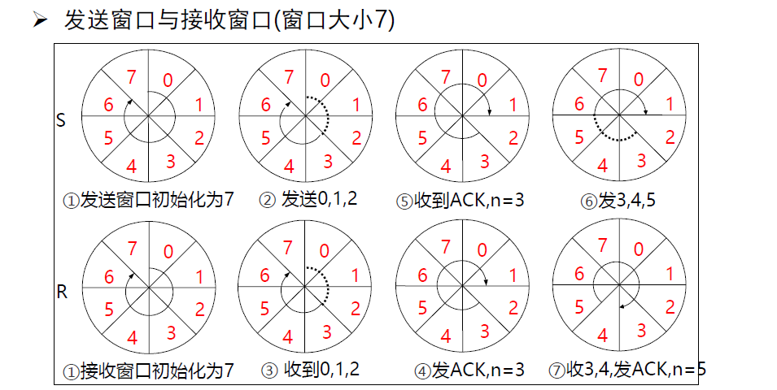
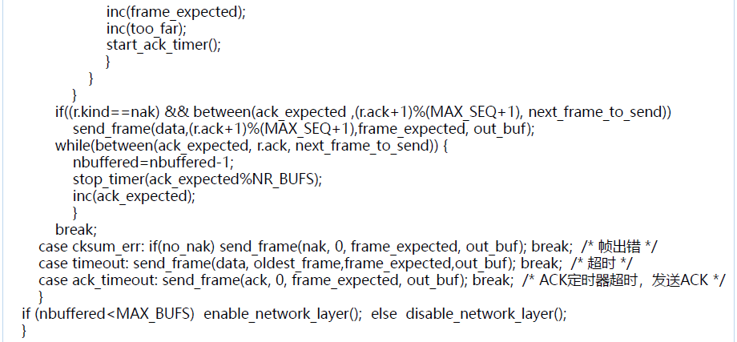

## class 3: 数据链路层

### 1. 数据链路层的设计

#### 1.1 数据链路层的位置

- 向下：利用物理层提供的位流服务
- 向上：向网络层提供明确的服务接口

#### 1.2 数据链路层的功能

- 成帧（Framing）
  - 将比特流划分成帧，从而检测和纠正物理层在传输中可能出现的错误。
- 差错控制（Error Control）
  - 处理传输中出现的差错，如位错误、丢失
- 流量控制（Flow Control）
  - 确保发送方的发送速率不大于接收方的处理速率，避免接收缓存区溢出。

#### 1.3 数据链路层提供的服务

1. 无确认，无连接的服务（Unacknowledged, Connectionless Service）

- 接收方不确认收到的帧
- 使用场景：误码率低的可靠信道，实时通信
- 网络实例：以太网

2. 有确认，无连接的服务（Acknowledged, Connectionless Service）

- 接收方确认收到的帧
- 使用场景：不可靠的信道
- 网络实例：802.11（WiFi）

3. 有确认，有连接的服务（Acknowledged, Connectionless Service）

- 使用场景：长延迟的，不可靠信道

#### 1.4 成帧（Framing）

> 如何标识一个帧的开始？

接收方必须能从物理层接收的比特流中明确区分出一帧的开始和结束，这个问题被称为**帧同步**或**帧定界**。

选择定界符的方法有如下几种：

- 字节计数法（Byte Counting）：在帧的开始处添加一个字节计数器，每接收到一个字节计数器加1。
- 带字节填充的定界符（Flag bytes with byte stuffing）：在帧的开始处添加一个字节填充字符，使得帧的开始和结束处都有定界符。
- 带比特填充的定界符（Flag bits with bit stuffing）：在帧的开始处添加一个比特填充字符，使得帧的开始和结束处都有定界符。
- 物理层编码违例（Physical layer encoding violations）：在物理层编码中加入帧同步的标识符，使得接收方能够检测到帧的开始和结束。

##### 1.4.1 字节计数法

字节计数法，就是每一帧的第一个字节为帧的字节数。

但问题在于，计数字节也可能出现错误。

##### 1.4.2 带字节填充的定界符

通过一个特殊的字节，例如01111110，标识帧的开始和结束。

问题是，如果帧中有01111110，那么就无法区分帧的开始和结束。


解决方式：通过转义字符来解决。即：对01111110以及另一个字段作为转义字符，这两种字节单独传输时都需要被转义：例如：

- 发送“flag”： \flag
- 发送“\”：\\\\
- 发送“\flag”： \\\flag


对于接收方，只需要判断：当收到ESC时，则后一字节无条件成为有效载荷；当收到FLAG时，则为帧的边界。

缺点：定界符与转义符都将成为overhead

##### 1.4.3 带比特填充的定界符

与带字节填充的定界符类似，但使用比特填充字符。它的操作方法为（假设定界符为01111110）：

- 发送方（能够判断哪些是有效载荷）：在有效载荷种进行查验，每当发现有连续的5个1比特，则直接插入1个0比特（这样，有效载荷中必然不会出现6个1（定界符）
- 接收方：
  - 当出现连续5个1比特，若下一比特为0（说明是发送方插入的0）则舍弃0；若下一比特为1（说明到定界符了）则一帧结束。

### 2. 差错检测和纠正

#### 2.1 差错检测

为了解决信道传输的差错问题，可以采用增加**冗余信息**的策略。

- 举例：每个比特传三份，有一位出错则可以纠正。（单冗余信息过大）

因此需要在保证一定的差错检测能力下，减少冗余信息量。

##### 2.1.1 检错码（error-detecting code）

检错码可以让接收方推断是否发生了错误，但不能推断在哪位发生了错误，需要请求发送方重传数据。

- 主要用在高可靠、误码率低的信道上，例如光纤链路
- 偶尔发生的差错可通过重传解决问题

##### 2.1.2 纠错码（error-correcting code）

纠错码可以让接收方定位到出错的位置并且纠正错误。

- 主要用于错误发生比较频繁的信道上，例如无线链路
- 经常用于物理层与更高层
- 使用纠错码的技术通常称为前向纠错（FEC）

##### 2.1.3 实现原理

码字（code word）：一个包含m个数据位和r个校验位的n位单元（$n=m+r$）

码率：码字中不含冗余部分所占的比例（$cr = \frac{m}{n}$）

海明距离（Hamming distance）：两个码字之间不同位的个数。即，如果两个码字的海明距离为d，说明两个码字中有d个不同位，需要d个单比特错将一个码字转换为另一个码字。

一种编码方案的海明距离：为改变吗方案中任意两个合法码字的最小海明距离。

*例：the hamming distance of 2 codewords(10001001 and 10110001) is 3.*

*例：for the coding sheme:*

00 -> 0000000000
01 -> 0000011111
10 -> 1111100000
11 -> 1111111111

在上述编码方案中，海明距离为5。

考虑纠错的方法，我们需要让编码方案的海明距离**尽可能大**，防止过多位错误导致偏向了另一种编码情况（例如0000000000->0000001111（错4位）->0000011111）

在检测码下：

**如果希望检测至多d个错误，那么需要海明距离为d+1的编码方案。**

> 这是因为如果错误为d+1位，那么码字有可能偏移到另一个合法码字。

在纠错码下：

**如果希望纠正至多d个错误，那么需要海明距离为2d+1的编码方案。**

> 这是因为如果错误为d+1位，那么码字最终会更偏向另一个合法码字。

##### 2.1.4 实现方法

###### 2.1.4.1 奇偶校验

增加1位校验位，可以检查奇数位错误。

> 所谓奇数位错误，是指当错误数为1、3、5...时，可被检测出来；但偶数位错误无法检测。

- 偶校验：增加校验位后，保证1的个数为偶数个（原本为奇数个则校验位为1，反之为0）
- 奇校验：增加校验位后，保证1的个数为奇数个

###### 2.1.4.2 校验和

对数据进行16位的二进制补码求和运算，计算结果取反，得到的校验和随数据一同发送。接收方同样进行补码求和运算，计算结果与校验和相加后，如果结果不全为1，则说明有错误（但无法纠错）。


这种方式对不同分组下的同一位数据都错误时（即最终加和结果与正确的加和结果一致）无法检测，但已经能检测较多的错误了。

###### 2.1.4.3 CRC校验

设原始数据为D，其一共有k位。

若要产生一个n位的校验码，事先选定一个n+1位的模式G（生成多项式，双方提前商定），G最高位为1；

将D左移n位，用G对当前的D（共k+n位）做模2除，得到余数R即为CRC校验码。


其中，G是预先约定的数据。图中的除法是对每一组数据进行**异或**操作，而非**减法**。


###### 2.1.4.4 纠错码

首先需要明确纠错码的基本要求：

对于m个信息位，r个校验位，假设要纠正单比特错误：

那么对于所有有效信息（合法码字）的任意一个，都需要有n个与其距离为1的无效码字。

> 可以看作：当这个合法码字出现错误时，可能在n位中的任意一位出现错误，这些错误会产生n个码字。而由于需要纠错，这些码字都不能是合法码字。

而对于这些码字，需要n+1个位模式来标识（1个合法码字+n个非法码字）。

而对于m个信息位，就有$2^m$个合法码字，因此应当有：

$$
(n + 1) 2^m \leq 2^n
$$

利用$n = m + r$即可算出r的下界（至少需要多少位的校验位）

$$
(m + r + 1) \leq 2^r
$$

海明码：提供一位的纠错能力。

海明码的编码方式为：

令$n = 2^r - 1$，r分别在第1、2、4、8...位上。

对于第i位校验位，其以**选n隔n**的方式与其他数据组成一组，并进行偶校验编码。

例如：

- 1、3、5、7、...为一组，1校验码在该组中保证偶校验；
- 2、3、6、7、...为一组，2校验码在该组中保证偶校验；
- 4、5、6、7、12、13、14、15、...为一组，4校验码在该组中保证偶校验；
- 8、9、10、11、...为一组，8校验码在该组中保证偶校验；

也可以按照下图进行理解：


校验表如下所示：


可以看到：对于8位的单位错误，只需要三个校验码即可表示。这也与3位位模式表示的个数为8一致。因此海明码可以理解为一种非常高效的纠错码。

同时注意到：**错误校验码之和就是对应错误的位**。例如：当1、2、4校验码均错误，那么错误的位应当是$1+2+4=7$。


上述图片中叙述了对突发性的连续比特错的纠正方法。方法为不再按行发送，而是按列发送，将“同一组中出现多个错误”转化成“多个组中出现一个错误"，从而可以更好地利用海明码的特点。

###### 2.1.4.5 其他纠错码

- Reed-Solomon code(RS码): 以有限域运算为基础，提供多位纠错能力
- Convolutional code(卷积码): 利用卷积操作，提供多位纠错能力
- Trellis diagram(信道编码图): 利用信道编码图，提供多位纠错能力

阅读Trellis diragram的方法：


每输入一个位（u\[i\]），状态会往后推一位（例如状态00时输入1变为状态10；）

通过计算penalty对所有路径进行计算，如果终点相同则选取最优路径。最终得到的路径就是修正后的路径。

### 3. 基本的数据链路层协议

#### 3.1 定义与假设

关键假设：

- 分层进程独立假设
  - 网络层、数据链路层、物理层都是独立的进程
  - 进程间通过传递消息实现通信
- 提供可靠服务假设
  - 提供可靠的、面向连接的服务
  - 数据链路层发送的数据随时可向网络层获得
- 只处理通信错误假设
  - 不考虑机器崩溃、断电、重启等问题

在基于以上假设的情况下，对基本数据类型可以有一个较基本的定义：

```c
typedef struct {
    frame_kind kind; // 帧类型
    seq_nr seq; // 序列号
    ack_nr ack; // 确认号
    packet info; // 数据（这里不关注具体内容）
} frame;
```

其他相关函数设计如下：


> 简而言之，就是从网络层获取packet或将packet发送给网络层；从物理层获取frame或将frame发送给物理层。

#### 3.2 乌托邦式单工协议

假设：

- 单工（Simplex）协议：数据单向传输
- 完美信道：帧无丢失、受损
- 始终就绪（always ready）：网络层始终就绪
- 瞬间完成：可以生成/处理无穷多的数据

这意味着：

- 不处理任何流量控制与纠错工作
- 接近于无确认、无连接服务


#### 3.3 无错信道上的停等式协议

不再假设：

- 接收方能够处理无限高速进入的数据
- 不会出现“淹没”（overwhelming）情况

仍然假设：

- 通信信道无错
- 数据传输保持单向，但需要双向传输链路（半双工物理信道）

停-等式协议（stop-and-wait protocol）：

- 发送方发送一帧后暂停，等待确认（acknowledgement）到达后在发送下一帧
- 接收方完成接收后，回复ack接收。
- 确认帧的内容是不重要的（即哑帧(dummy frame)）


#### 3.4 有错信道上的单工停等式协议

假设：

- 通信信道可能出错，导致：
  - 帧损坏，接收方可以检测
  - 帧丢失，永远无法到达接收方

解决方法：

- 加一个计时器（timer），如果发送方发帧后经过一段时间没有收到确认（ack），则将再次发送


但同时也会出现：接收方在发送ACK时，ACK丢失，导致发送方进行了重复发送。

解决方法：

- 加入序列号（SEQ，1位）用以确认接收方收到的是原数据还是副本。具体做法如下：
  - 发送方收到ACK后，SEQ取反
  - 接收方收到的发送方的帧，若SEQ与之前的相同，则为重复数据，丢弃，但返回ACK；否则正常处理即可。


在停等式协议中，一个显著的问题就是同时只能由一个没有被确认的帧在发送中，这导致带宽的利用率很低。


### 4. 滑动窗口协议

由于停等协议降低了信道利用率，因此解决办法为通过流水线协议或管道协议，允许发送方在没收到确认前连续发送多个帧。

#### 4.1 滑动窗口协议

* 窗口机制
  发送方和接收方都具备Buffer，使发送方有能力连续发送多个帧
* 对可连续发送的最多帧数做限制

  1. 可以通过循环重复使用有限的帧序号；
  2. 设置发送窗口和接收窗口，分别为最多连续发送的帧数与最多连续接收的帧数
  3. 累计确认：不必对收到的分组逐个发送确认，而是对按需到达的最后一个分组发送确认




#### 4.2 回退N协议（go-back N）

- 出错全部重发
  - 当接收端收到一个出错帧或乱序帧时，丢弃所有后续帧，并且不发送ACK
  - 发送端超时，重传所有未被确认的帧

这种协议的使用场景对应接收窗口为1的情况，即只能按顺序接收帧（那么如果中间帧出错就必定无法接收它以后的帧，只能回滚）

#### 4.3 选择性重传协议（selection repeating protocol）

**IMPORTANT: 关注实现的代码，需要读懂**

- 出错时只重传错误的帧（往往通过以下情况判断是否错误）
  - 发送方该帧的定时器超时
  - 校验后发现错误

分为如下几种情况：

- 1. 发送的包丢失（接收方未收到包）：则不会返回ACK，发送方会重传该包
- 2. 发送的包被错误接收（接收方收到错误的包）：则会返回NAK，发送方会重传该包
- 3. 返回的ACK丢失：与1相似

在出错时，接收方会向发送端返回NAK（Negative Acknowledgement），发送方就会只重传出错的帧。

- 如果窗口内帧未被接受过，那么存储起来，等待所有比它序号小的帧都正确接收后再交付给网络层。
- 数据包需要含有顺序号（SEQ）帮助接收端进行排序（因为接收端不知道重传的包是哪个包）

这种策略对应接收窗口大于1的情况

- 优点：避免重传正确的帧
- 缺点：在接收端需要一定的缓存

**该方法下，** 

这是因为如果发生如下情况：

- 第一批帧均全部成功传递，而接收方返回的最后一个帧的ACK丢失
- 发送方开始重传帧，但重传的帧序号从头开始循环了
- 接收方收到重传的帧，但由于序号错误，会认为该帧是新写入的帧，则会重复接收，导致问题。




### 5. 数据链路协议实例

#### 5.1 PPP协议（点到点链路层协议）

PPP协议由IETF制定，在1994年成为正式标准

PPP协议是目前使用最多的数据链路层协议之一

特点：简单、灵活

实现的功能：

- 利用帧定界符封装成帧
- 填充技术实现透明数据传输：字节填充、零比特填充
- 帧的差错检测
- 实时监测链路工作状态
- 设置链路最大传输单元（MTU）
- 网络层地址协商机制
- 数据压缩协商机制

未实现的功能：

- **帧数据的纠错功能**
  - 数据链路层的PPP协议只进行检错，PPP协议是不可靠传输协议
- 流量控制功能
  - PPP协议未实现点到点的流量控制
- 可靠传输功能
  - **PPP为不可靠协议**，不使用帧的序号。不可靠网络中可能使用有序号的工作方式。
- 多点连接功能
  - PPP协议不支持多点线路，只支持点对点的链路通信。
- 单工和半双工链路
  - PPP协议支持全双工链路

PPP协议的构成：

- 封装
  - 提供在同一链路上支持不同的网络层协议
  - 支持异步链路（无奇偶检验的8比特数据）与同步链路（面向比特）
  - IP数据包是PPP帧的信息部分，长度收到MTU的限制。
- 链路控制协议LCP（Link Control Protocol）
- 网络控制协议NCP（Network Control Protocol）


PPP中的帧格式：

- 异步传输中对帧的封装方法：
  - 字节填充（字符填充）（避免信息字段出现和标志字段一样的比特组合（0x7E））
  - 定义转义字符（0x7D），具体转化方式与之前的FLAG/ESC不同，但原理相似
- 同步传输（例如SONET/SDH链路）中对帧的封装方法：
  - 比特填充（零比特填充）：与之前的比特填充方法基本一致

PPP的工作模式：


#### 5.2 PPPoE协议

Ethernet协议：无认证功能，安全性低

PPP协议：有认证功能

PPPoE（PPP over Ethernet）：提供在以太网链路上的PPP连接。

PPPoE在以太网的上层，并加入一些安全认证机制封装在Ethernet的有效载荷内。


