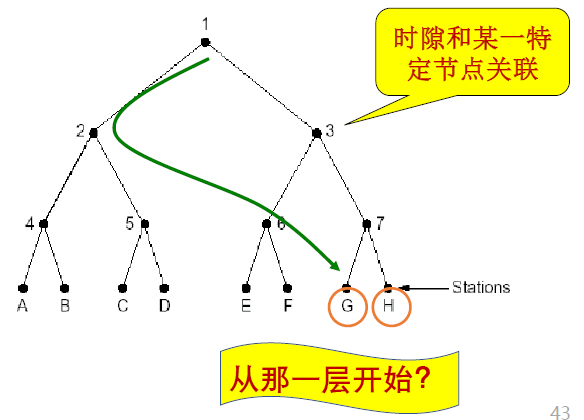
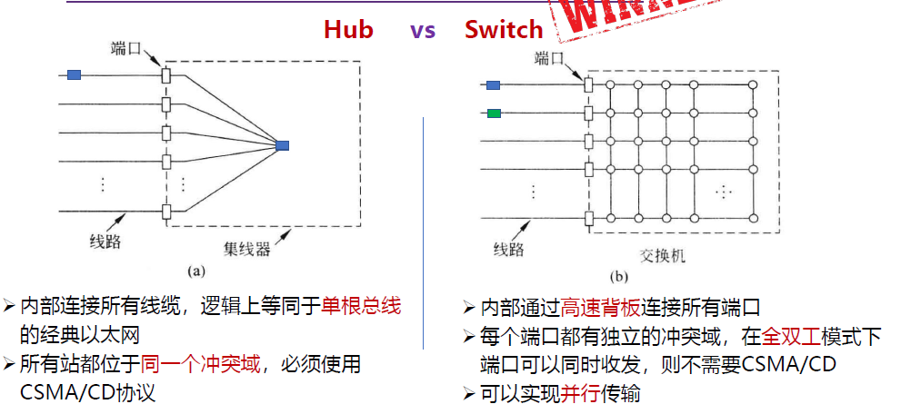
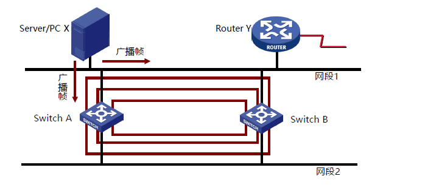
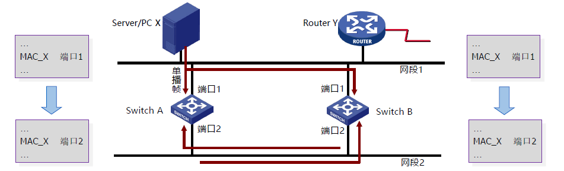
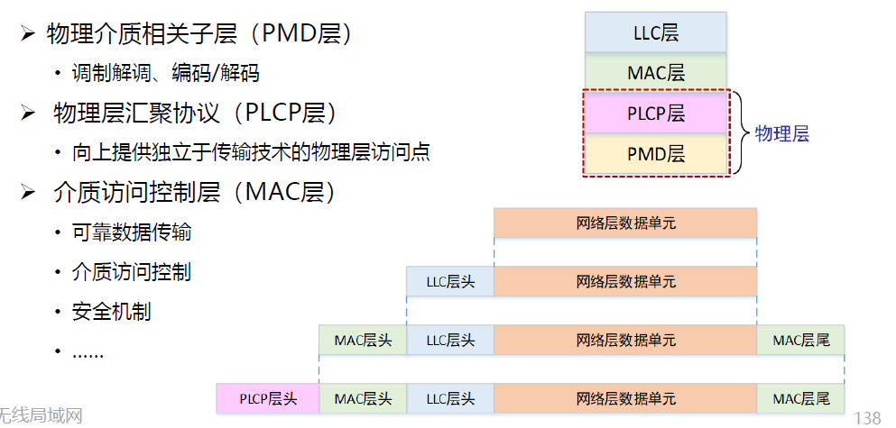

## class 4: 介质访问子层

### 0. Overview

介质访问子层（meta access control sublayer，MAC）是位于数据链路层相对较底层的位置。

### 1. 信道分配问题

信道往往需要共享，也有不同方法的局域网拓扑（总线、星型、环型等），因此需要考虑如何分配信道。

这里讨论的信道分配不仅仅是之前物理层上的时域/频域复用，而是进一步考虑同时同频情况下的分配问题。

#### 1.1 静态分配方法

静态分配方法：TDM/FDM

排队论分析：（M/M/1排队系统模型）：

- M：顾客到达时间间隔分布
  - 帧到达时间间隔服从指数分布
  - 设平均到达率为$\lambda$帧/s
- M：服务时间分布
  - 帧长度服从指数分布
  - 设帧平均长度为$1/\mu$位/帧
  - 信道容量为$C$位/s，则信道服务率为$\mu C$帧/s
- 1：服务器数目

结论：信道等分的份数越多，每个用户的延迟越大，且成正比（增大N倍）。

问题：资源分配不合理；有资源浪费，延迟大

适用于：

- 用户数量少、数量固定
- 通信量大、流量稳定

#### 1.2 动态分配方法：多路访问协议

### 2. 多路访问协议

#### 2.1 随机访问协议

特点：冲突不可避免

##### 2.1.1 ALOHA协议

原理：想发就发，没有限制。

特点：

- 冲突：两个或以上的帧
- 随时可能冲突
- 冲突的帧会被完全破坏
- 破坏的帧需要重传

数学描述：

- 帧时：发送一个标准长的帧所需的时间
- 一个帧时内用户产生的新帧：N
- 一个帧时内信道中产生的帧（包括重传）：G

则当G=N时，信道恰好不会冲突（一个帧时传一个帧，产生一个新帧）；而G>N时会产生冲突，需要重传。

性能分析：

- 吞吐量（S）：在发送时间T内发送成功的平均帧数
  - 显然，$0<S<1$
  - 当S=1时，就是G=N（恰好不会产生冲突，且效率最高）
- 运载负载（网络负载）（G）：时间T内所有通信站总共发送的帧数平均值（包括重发）
  - 不发生冲突时，G=S
  - 发生冲突时，G>S
- $P_0$：一帧发送成功的概率，定义$P_0=\frac{S}{G}$
  - 假设传播延迟为D（即帧占用信道传播的时间），那么冲突危险期为2D（在这一时间段内可能帧会重合）
  - 则该段时间内生成帧均值为2G,不遭受冲突的概率为$P_0=e^{-2G}$

由上述描述可知：$S = P_0G = e^{-2G}G$

可以对S进行分析，发现$G=0.5$时达到最大，S的最大值为0.184。

即，纯ALOHA信道的利用率最高为18.4%。

##### 2.1.2 分隙ALOHA（slotted ALOHA）协议

分隙ALOHA就是将时间分成时隙（时槽）

- 时隙的长度对应一帧的传输时间
- **帧的发送必须在时隙的起点**
  - 因此，冲突只发生在时隙的起点，因此冲突危险期为D（只有在同一帧时内产生的帧才会冲突）

通过Slotted ALOHA，冲突危险期直接减半，因此S最大值为0.368，恰好是纯ALOHA的两倍。

但代价是，每一帧不可随意发送，需要承担最多一个帧时的时间的overhead。

##### 2.1.3 载波侦听多路访问协议（CSMA，carrier-sense multiple access）

原理就是通过侦听信道中的载波判断信道中是否有人在发送信息，从而减少出现冲突。

特点：先听后发

###### 2.1.3.1 非持续式CSMA

特点：

- 侦听发现介质空闲，就发送
- 如果介质忙，**就等待一个随机分布的时间**，再重复侦听

优点：

- 等待一个随机事件可避免再次冲突的可能性

缺点：

- 如果等待时间内介质上没有数据发送，这段时间是浪费的

###### 2.1.3.2 持续式（1-持续式）CSMA

特点：

- 侦听发现介质空闲，则发送
- 若介质忙，则**持续侦听**，一旦空闲立即发送
- 如果发生冲突，等待一个随机分布的时间再进行侦听

优点：

- 延迟时间要小于非持续式

缺点：

- 如果两个以上的站同时处于持续侦听的状态，那么一旦介质空闲就必定会发生冲突。

###### 2.1.3.3 p-持续式CSMA

特点：

- 侦听发现介质空闲，**则p概率发送**，**1-p概率等待一个时间单元发送**
- 如介质忙，持续侦听，一旦空闲立即发送
- 如果发送已推迟一个时间单元，再重复侦听

> 1-持续式CSMA是p-持续式的特例

###### 分析

**CSMA不能避免完全不会发生冲突，因为会出现下述状况：**

- 同时传送（持续式CSMA发生的冲突）
- 传播延迟问题（即A正在使用信道，但载波传播具有延迟，导致B误以为信道空闲）

冲突窗口：发送站发出帧后能检测到冲突（碰撞）的最长时间。

它的树枝上等于最远两站传播时间的两倍，即2D（D为单边延迟）。

##### 2.1.2 CSMA/CD（1-持续）

CSMA with Collision Detection

原理：先听后发，边发边听

- 1. 经侦听，介质空闲则发送
- 2. 介质忙则持续侦听，一旦空闲立即发送
- 3. 若发生冲突，等待一个随机分布的时间再重复1
- 4. 发送的过程中同时侦听是否发生冲突；若发生冲突则发送Jam（强化）信号

自然要求：

- 发送帧的时间不能太短，至少一个冲突窗口的时间（2D）

#### 2.2 受控访问协议

特点：可避免冲突，但有Overhead

##### 2.2.1 位图协议

- 竞争期：每个站在自己的时槽内发送竞争比特（表示要传输数据）
- 传输器：按序发送（明确了使用权，避免冲突）

假设：有N个用户，需要N个时隙，每帧d比特；

信道利用率：

- 在低负荷条件下：$\frac{d}{d+N}$
- 在高负荷条件下：$\frac{d}{d+1}$

具体计算方式：n个征用周期需要预留n个比特来记录哪些用户“举手”了，而确定发送需求后就会直接按照这些比特按顺序发送帧（每个帧为d比特）。

因此，如果“举手”的人越少，那么预留记录的比特占比就会更大（在只有一个人举手的情况下就是$\frac{d}{d+N}$）；反之，如果“举手”的人越多，那么这种做法越有效，所有人举手的情况就是$\frac{Nd}{Nd+N} = \frac{d}{d+1}$。

问题：无法进行优先权控制

##### 2.2.2 令牌传递

令牌：发送权限

令牌的运行：发送工作站去抓取，获得发送权

- 除了环，令牌也可以运行在其它拓扑上，如令牌总线

发送的帧需要目的站或发送站将其从共享信道上去除；防止无限循环

缺点：令牌的维护代价

##### 2.2.3 二进制倒计数协议

为每个站点编号，序号长度相同

有数据发送的站点从高序号到低序号排队，高者得到发送权

- 每个站点逐位发送自己的编号
- 如果站点发现别的站点序号比自己大（比如有人发1，而自己该位为0），则放弃该轮的发送
- 如上所述发送一轮，就可以决定哪个数据先发送

**注意：这个协议只能发现最大的那一个，换言之只能够实现单个帧的选取-传播过程，因此往往用于低负载的场景**

特点：高序号的站点优先

由于是通过二进制编码进行通信，因此信道利用率变为了：$\frac{d}{d + log_2 N}$

二进制编码为位图编码在低负载场景下的overhead进行了优化。

注：**如果规定每个帧的帧头为发送地址，即竞争的同时也在发送。则效率为100%**

即：所有发送人同时发送，每发送一个bit就会有约一半的发送者放弃发送，因为帧的帧头就是发送地址，所以成功选中的发送人（们）事实上已经在传输数据了，所以效率为100%。

#### 2.3 有限竞争协议

特点：结合了上述二者的优势

即上述两种方法复用，在低负荷时使用CSMA/CD，在高负荷时使用受控访问协议。

##### 2.3.1 自适应树搜索协议（Adaptive Tree Walk Protocol）

原理：

- **一般**从根节点开始：
- 第一层：所有站点竞争
  - 左侧继续竞争
  - 右侧在下一时隙继续竞争
  - 特别地，如果只有一个站点竞争，它直接获得信道

注意：如果workload很低，甚至可以不需要从根节点开始，可以直接从子节点开始扫描。

### 3. 以太网

#### 3.1 以太网的历史

设计者：Bob Metcalfe

发展历程：

- 3Mbps（1973）
- 10Mbps（3Com公司，10Mbps）
- IEEE成为以太网官方标准组织（1985）
- IEEE发表10Base5标准，即粗以太网（1986）
- Kalpana推出以太网交换机（1989）
- Cat-3双绞线 10Base-T以太网（1991）
- 10BaseF标准（光纤以太网标准）（1994）
- 100Mbps快速以太网（1995）
- 1000Base-T千兆网（1998）
- 万兆以太网（2002）
- 40G/100G以太网（2010）
- 200G/400G以太网（2014）

#### 3.2 经典以太网

- 最高速率为10Mbps
- 采用**曼彻斯特编码**
- 使用**同轴电缆**和**中继器**连接
- 主机采用CSMA/CD协议
- MAC帧格式有两种标准：
  - DIX Ethernet V2
  - IEEE 802.3 Ethernet

其中，**目的地址和源地址就是MAC地址（物理地址）**

> 即事实上，所谓物理地址与物理层无关，它是指MAC地址，属于数据链路层

MAC地址的长度为6字节，通常由12个16进制数表示。

MAC地址举例：

- 单播（unicast）：5C-26-0A-7E-4E-4C
- 广播（broadcast）：FF-FF-FF-FF-FF-FF
- 组播（multicast）：01-00-5E-00-00-00

MAC地址是全球每个网卡的唯一标识，因此MAC地址的分配是全球性的。（由OUI管理）

> 但事实上MAC地址是可以自己修改的

限制（为保证MAC协议正常工作）：

- 任意两个收发器间距离不得超过2.5km（避免RTT过长）
- 任意两个收费发起经过中继器不能超过4个

根据上述架构可知：

- 最小帧长为46+18=64B
- 最大帧长为1500+18=1518B（即，MTU=1500B）

如果数据字段不足46字节，那么需要填充整数字节（padding）至46字节（往往通过在数据段后添加00补位）以保证MAC帧不少于64字节。

以太网规定最短有效帧长为64字节，凡是长度小于64字节的帧都是异常中止的无效帧。

- 即：保证冲突一定发生在前64字节内，如果发生冲突，传输的帧就必然是小于64字节的。
- 检查出的无效帧直接丢弃；以太网不负责重传帧（这是数据链路层其他部分的事情）

校验和（FCS，frame check sequence）

- 使用CRC32计算除校验和外的其他字段

特别的，在CSMA/CD检测到冲突时，会：

- 立即终止传输
- 发出一个短冲突加强信号
- 等待一段**随机时间**后重发

随机时间的计算方法为：二进制指数后退（Binary exponential backoff）

即：

- 确定基本退避时间槽（为一个争用期，$2\tau$，以太网中设置为512比特时间）
- 定义重传次数k，$k=min\{重传次数，10\}$
- 从$[0,1,...,2^k-1]$中随机取一个数r，时延就是$r\times2\tau$
- 当重传次数达到16次，就丢弃该帧并向高层报告。

#### 3.3 交换式以太网

集线器（Hub）：在交换机之前组建以太网的方法

- Hub的所有端口内部都是联通的
- 使用同一根总线
- 和Repeater一样，也是物理层设备

使用Hub扩展以太网

- 集线器不能增加容量
- 用集线器组成更大的局域网都在一个冲突域中
  - 即：A向B发送时，C不能向D发送（因为使用同一根总线）
- Hub级联：限制网络的可扩展性

交换机（Switch）

- 工作在数据链路层，根据MAC帧的目的地址对收到的帧进行转发
- 交换机通过告诉背板把帧传送到目标端口

混杂模式（promiscuous mode）：

- Hacker
- 网络分析

**与Hub不同的是，Switch不再局限于单一总线，而是通过高速背板连接所有端口，这意味着可以并行传输，每个端口都有独立的冲突域**

#### 3.4 快速以太网

快速以太网（Fast Ethernet）

- 带宽 100Mbps
- 比特时间：10ns（$\frac{1}{100Mbps}$）
  - 电缆的最大长度降低到十分之一（这是因为速度变快，最短帧长变大，为了保持最短帧长不变，需要等比例缩小电缆的最大长度）
- 保留原来的工作方式
- 自动协商（autonegotiation）
- 线缆类型

#### 3.5 千兆以太网

千兆以太网（Gigabit Ethernet）

- 带宽 1000Mbps
- 保留原来的工作方式
- 全双工和半双工两种方式工作
  - 半双工使用CSMA/CD（为了向后兼容）
  - 全双工不需要使用CSMA/CD
- 流量控制和巨型帧
- 线缆类型

#### 3.6 万兆以太网

万兆以太网（10-Gigabit Ethernet）

- 带宽 10Gbps
- 常记为10GE，10GbE或10GigE
- 只支持全双工，不再使用CSMA/CD
- 保持兼容性
- 重点是超高速的物理层

#### 3.7 40G/100G以太网

40GbE/100GbE

- 带宽 40Gbps/100Gbps
- 支支持全双工
- 保留帧格式和MAC方法
- 保留802.3的最小帧和最大帧大小

#### 3.8 总结

以太网的优点：

- 灵活性
- 简单性
- 兼容性
- 易维护
- 易扩展
- 可靠性
- 廉价

### 4. 数据链路层交换

本节将针对交换机内部的原理进行分析。

#### 4.1 原理

物理层设备扩充网络（Hub或Switch）：

这种新建Hub层的连法，导致冲突域变得更大，更容易发生冲突。

因此考虑用其他的方式扩充网络：

##### 4.1.1 网桥

网桥的内部实体是一系列站地址和接口的映射

当转发接口不一致时，网桥会将数据包转发到正确的接口

当转发接口一致时，网桥会直接丢弃这份信息

**解释：可以从分隔冲突域的目的考虑，新建Hub层之所以扩大了冲突域，就是因为同一Hub内部的信息交换会影响到其他Hub，那么只需要隔离同一Hub内部信息交换，不让它传到其他Hub，就能够实现隔离了。**

理想的网桥是**透明**的：

- 即插即用，无需任何配置（即对接口等参数的设置）
- 网络中的站点无需感知网桥的存在与否

如何实现网桥的透明：

1. MAC地址表的构建：逆向学习源地址

由于一开始没有对接口等参数的配置，因此需要构建MAC地址表。可以通过分析从站点发来的数据获取站点的MAC地址，然后将其与端口的映射加入到MAC地址表中。

> 如果发现MAC地址表中已存在对应映射，就更新状态与时间戳

设置老化的时间（默认300s），当老化时间到期时，该数据被清除（为了实现即插即用）。

总结：MAC地址表通过如下三种操作构建：

- 增加表项：帧的源地址对应的项不在表中
- 删除表项：老化时间到期
- 更新表项：帧的源地址在表中，更新时间戳

但因此也存在一定的安全隐患：

- 例如通过频繁改变发送方MAC，让网桥的表溢出，或者通过伪造MAC来攻击网桥

2. 工作模式

根据情况的不同，一共有三种工作模式（假设B向D发送数据帧）：

- 逆向学习源地址
- 根据目的地址查询MAC地址表
  - 1. 找到目的地址对应的端口

    - 1. 端口与发送端口不一致：转发（Forwarding），转发到对应端口
    - 2. 端口与发送端口一致：过滤（Filtering），丢弃数据包
    - 3. 端口无法找到：泛洪（Flooding），广播到所有端口（代价很大，且存在安全隐患，浪费网络资源）

特别的，只对于如下两种目的地址的帧需要泛洪：

- 广播帧：目的地址为 `FF-FF-FF-FF-FF-FF`
- 未知单播帧：MAC地址表中不存在目的地址

##### 4.1.2 链路层交换机

执行数据链路层交换算法

- 多端口透明网桥，网桥的现代名称
- 即插即用

POE（Power Over Ethernet）交换机：

- 常接：网络摄像机、AP、IP电话等
- 主要电源：无需电源（受电端）、无需专门布线

交换方式：

1. 从带宽角度：

- 对称交换：出入带宽相同
- 非对称交换：出入带宽不同

2. 从转发时机角度：

- 存储转发模式（Store and Forward）
- 直通模式（Cut-through）
- 无碎片模式（Fragment-Free）

存储转发模式：

- 特点：转发前必须接收整个帧，执行CRC校验
- 缺点：延迟大
- 优点：不转发出错帧、支持非对称交换，将过滤所有的错误帧

直通交换：

- 特点：一旦接收到帧的目的地址，就开始转发
- 缺点：可能转发错误帧、不支持非对称交换
- 优点：延迟非常小，可以边入边出

无碎片交换：

- 特点：上述两者的折中：接收到帧的前64字节再开始转发
- 缺点：仍可能转发错误帧，不支持非对称交换
- 优点：过滤了冲突碎片，延迟和转发错帧的性能介于上述两种方法之间

##### 4.1.3 生成树协议

###### 4.1.3.1 问题

这是为了保证交换机传输的可靠性建立的协议。

简单的方法就是配置多个交换机，如果其中一个无法使用，还可以使用其他交换机进行传输。

问题为：

1. 广播风暴：交换机在物理环路上无休止地泛洪广播流量，无限循环，迅速消耗网络资源

2. 重复帧：帧会通过不同的交换机线路传输到目的地址，这会导致目的地址收到多个重复的帧

3. MAC地址表不稳定：由于物理环路的存在，因此帧进入交换机的端口会频繁变化

###### 4.1.3.2 生成树协议的方法

生成树协议的目的，就是打破物理环路，获得一个无环的生成树

1. 参与构建生成树的交换机：互相接收、发送BPDU（桥协议数据单元）
2. 选举产生根桥、根端口、指定端口，形成生成树

BPDU包含如下信息：

- 根桥ID（Root ID）：被选为根的桥ID
  - 桥ID为8字节，由2字节的priority和6字节的MAC地址组成
- 根路径开销（Root Path Cost）：到根桥的最短路径开销
- 指定桥ID（Designated ID）：生成和转发BPDU的桥ID
- 指定端口ID（Designated Port ID）：发送BPDU的端口ID

选举过程：

- 选举根桥（Root Bridge）
- 为每个非根桥选出一个根端口（Root Port）
- 为每个网段确定一个指定端口（Designated Port）

1. 选举根桥：

- 同一广播域（广播域：主机发送广播帧（引发泛洪），所有能够接收到该帧的节点与主机）中的所有交换机参与选举
- 桥ID最小的交换机作为生成树的根
  - 比较桥ID的方法：
    - 优先级高的桥优先作为根桥
    - 相同优先级的桥，MAC地址小的桥优先作为根桥
- 给定广播域内只有一个根桥
- 根桥的所有端口都处在**转发状态**（可以接收/发送数据帧）

2. 为每个非根桥选一个根端口：

- 每个非根桥，通过比较每个端口到根桥的根路径开销，选出根端口
- 具有最小根路径开销的端口为根端口
- 如果多个端口路径开销相同，则端口ID最小的端口为根端口
- 非根桥只有一个根端口，根端口处于**转发状态**

> 根路径开销：根桥根路径开销为0；非根桥的根路径开销为到根桥路径上所有端口开销之和

3. 为每个网段确定一个指定端口：

- 对每一个网段，在所有连接到它的交换机端口中进行选择：
  - **一个**具有最小根路径开销的端口，作为该网段的指定端口
  - 若有多个端口具有相同的最小根路径开销，则选择端口ID最小的端口作为指定端口
- 指定端口处于**转发状态**，负责该网段的数据转发
- 连接该网段的其他端口若既不是指定端口，也不是根端口，则阻塞

**根桥的所有连接端口都是指定端口。**

###### 4.1.3.3 出错时生成树协议的重构方法

当由于交换机或链路故障导致网络拓扑改变时，重新构造生成树。

快速生成树协议（RSTP，Rapid Spanning Tree Protocol）：

- 是STP的优化版，在IEEE802.1W中定义，在IEEE802.1D中整合起来

#### 4.2 虚拟局域网

##### 4.2.1 原理

广播域：广播帧能够到达的范围

- 缺省情况下：交换机的所有端口同属于一个广播域，无法隔离广播域
- 广播帧在广播域中传播，占用资源、降低性能、具有安全隐患

因此，我们希望通过交换机将**广播域**也隔离开来。

支持VLAN的交换机：

- 一个VLAN（Virtual LAN）对应一个广播域
- 交换机通过划分VLAN，来分割广播域

**注意：这样的方法是隔断了不同VLAN成员的二层通信（数据链路层通信），它们仍然可以通过三层设备（路由器等）进行通信。**

##### 4.2.2 VLAN

1. 基于端口的VLAN（最常见）

- 创建VLAN
- 指定成员端口（即创建一个VLAN到端口的映射，与MAC地址表类似）

2. 基于MAC地址的VLAN

- 创建一个VLAN到MAC地址的映射表
- 优点：主机在更换端口时，VLAN不会改变

3. 基于协议的VLAN

- 需要服务器的参与，创建VLAN到协议的映射表

4. 基于子网的协议

- 基于子网划分VLAN，与子网掩码一起使用
- 一个子网就是一个VLAN

##### 4.2.3 其他问题

**注意：同一个交换机可能具备隶属于多个不同VLAN的端口，因此不仅需要对端口进行VLAN划分，还需要对传输的数据帧进行VLAN划分。**

如何区分不同VLAN的数据帧？

- 在数据帧中携带VLAN标记
- VLAN标记由交换机添加/剥除，对终端站点透明

更多的端口类型：

- Access链路类型端口
  - 一般用于连接用户设备（无需识别802.1Q帧的设备）
  - Access端口只能加入一个VLAN
  - 一旦Access端口加入VLAN，连接在该端口的设备被视为属于该VLAN
- Trunk链路类型端口
  - 一般用于连接交换机（支持802.1Q帧的设备）
  - 干道链路允许多个VLAN流量通过

### 5. 无线局域网

#### 5.1 无线局域网概述

无线局域网（WLAN）：以无线信道作为传输介质的计算机局域网

设计目标：

- 小的覆盖范围（受限的发射功率）
- 无需授权的频谱（ISM频段）
- 高速率应用
- 支持实时和非实时应用

重要组织：

- IEEE 802.11
- WiFi联盟（WFA）

#### 5.2 无线局域网组网模式

基础架构模式

- 分布式系统（DS）
- 访问点（AP）
- 站点（STA）
- 基本服务集（BSS）
- 扩展服务集（ESS）
- 站点间通过AP转发

自组织模式（Ad hoc）

- 站点（STA）
- 独立基本服务集（IBSS）
- 站点之间直接通信
- 共享同一无线信道

#### 5.3 无线局域网体系结构

需要解决的问题：

- 有限的无线频谱带宽资源
- 共享的无线信道
- 组网模式管理

#### 5.4 802.11 物理层

- 频段：2.4GHz、5GHz
- 调制技术：DPSK → QPSK → CCK → 64-QAM → 256-QAM → 1024-QAM
- 直接序列扩频（DSSS）→ 正交频分多路复用（OFDM）→ 正交频分多址（OFDMA）
- 单天线 → 单用户多入多出（SU-MIMO）→ 多用户多入多出（MU-MIMO）
- 目的：提升传输速率，增强可靠性，支持高密度接入

#### 5.5 802.11 MAC层

问题：如何进行collision detection?

- 冲突检测困难
  - 在接收端，发送功率和接收功率相差太大
  - 站点在发送时关闭接收功能，无法在发送时同时检测冲突
- 同一BSS中，不是所有的站点都能互相感知到对方发送的信号
  - 隐藏终端问题（由于距离太远/障碍物，导致无法检测到竞争对手的存在）
- 暴露终端问题，降低网络的吞吐量（由于侦听到其他站点的发送而误以为信道忙，导致不发送）（但事实上侦听错了，不会出现冲突）

改进：CSMA/CA协议（Carrier Sense Multiple Access with Collision Avoid）：

- 当信道空闲时间大于IFS（帧间隙），立即传输
- 当信道忙时，延迟知道当前传输结束+IFS时间
- 开始随机退后过程
  - 从（0, CWincow）中选择一个随机数作为退后计数器（backoff counter）
  - 通过侦听确定每个时间槽是否活动
  - 如果没有活动，则减少退后时间
- 退后过程中如果信道忙，则挂起退后过程
- 当前帧传输结束后回复退后过程

竞争窗口（CWindow）的选择：

- 应与网络负载情况相适应
- 二进制指数退后算法

差错检测：32位CRC校验

确认重传：采用**停等**机制（发送数据、等待确认、超时重传）

- 之所以不用流水线，是因为WiFi传输速率很高，没有必要使用流水线

不同帧间隙控制优先级：

- SIFS（Short IFS）：最高优先级（ACK/CTS/轮询响应等）
- PIFS（PCF IFS）：中等优先级（SIFS+1槽口时间），轮询服务
- DIFS（DCF IFS）：最低优先级（SIFS+2槽口时间），异步数据服务

结合CSMA/CA协议的定义可知：帧间隙控制优先级越高，帧间隙越小，则越有机会抢占信道。

可选机制：RTS-CTS机制

- 目的：通过信道预约来避免长帧冲突

简要过程：

- 1. 发送端发送信息前先发RTS，指明传输时间（$SIFS+CTS+SIFS+DATA+SIFS+ACK$）
- 2. 接收端收到后，回送CTS，指明传输时间（$SIFS+DATA+SIFS+ACK$）
- 其他站点收到RTS和CTS，则维护NAV（即在这段时间内不再发送数据）NAV：network allocation vector

特点：RTS和CTS很短，即使发生冲突，信号浪费也较少

---

如何应对无线链路较高的出错率：

- 解决办法：采用较小的帧（将用户数据帧分段的机制对用户透明）
- $F_i$帧中携带$F_{i+1}$的传输时间

---

EDCA（802.11e）（不要求掌握）

#### 5.6 802.11 帧结构

802.11的帧格式一般如下结构：

其中主要的字段解释：

- 帧控制：多种用途
- 持续时间：下一个要发送的帧可能持续的时间（用于RTS/CTS等）
- 地址1-地址4：每个地址的含义基于“去往DS”和“来自DS”域段确定
  - 当帧是从源发向AP时（去往DS为1，来自DS为0），则地址1为AP地址，地址2为源地址，地址3为目的地址
  - 当帧是从AP发向目的地址时（去往DS为0，来自DS为1），则地址1为目的地址，地址2为AP地址，地址3为源地址
  - 总之，地址1为接收地址，地址2为发送地址。
- 顺序控制：过滤掉重复帧，或用于分片组合
- QoS控制域段：存放数据流的QoS信息
- 数据：0-2312字节
- CRC校验：802.11采用4个字节的校验码

#### 5.7 无线局域网的构建

基础架构模式：

- 通过AP接入有线网络（互联网络）
- 关键：如何关联到AP：
  - BSSID：AP的MAC地址，标识AP管理的基本服务集
  - SSID：32字节网名，标识一个扩展服务集（ESS），包含一个或多个服务集
  - 关联阶段：扫描（scan）、认证（authentication）、关联（association）

被动扫描：

- AP周期性发送Beacon帧，站点在每个可用的通道上扫描Beacon帧
  - Beacon帧提供的AP相关信息：timestamp, beacon interval, capabilities, SSID, supported rates, parameters, traffic indication map(TIM)

主动扫描：

- 站点依次在每个可用的通道上发出包含SSID的Probe Request帧，AP在收到Probe Request后，回送Probe Response帧
  - Probe Resonse帧包含的AP相关信息：timestamp, beacon interval, capabilities, SSID, supported rates, parameters

认证过程：

- 1. 当站点找到与其有相同SSID的AP，在SSID匹配的AP中，根据收到的AP信号强度选择一个信号最强的AP，然后进入认证阶段。

  - 主要认证方式：
    - 开放系统身份认证（open-system authentication）
    - 共享密钥认证（shared-key authentication）
    - WPA PSK认证（pre-shared key authentication）
    - 802.1X EAP认证（802.1X authentication）

关联过程：

- 身份认证通过后进入关联阶段
- 站点向AP发送关联请求（association request）
- AP收到请求后，回送关联响应（association response）
- AP维护站点关联表，并记录站点的能力

---

自组织模式

- 站点先寻找具有指定SSID的IBSS是否存在，如果存在，则加入；若不存在，则自己创建一个IBSS，发出Beacon，等其他站来加入
- IBSS中的所有站点参与Beacon发送（保证健壮性），每个站点在Beacon窗口竞争Beacon的产生。对于每个站点：
  - 确定一个随机数k
  - 等待k个时间槽
  - 如果没有其他站点发送Beacon，则开始发送Beacon

站点漫游：

- 当前的AP的通道质量下降时，站点漫游到不同的AP
- 通过扫描功能发现通道质量过呢更好的AP
  - 主动扫描/被动扫描
- 站点向新的AP发送重新关联请求（Reassociation request）
- 若AP接受了重关联请求：
  - AP向站点返回重关联响应（Reassociation response）
  - 如果重关联成功，则站点漫游到新的AP
  - 新的AP通过分布系统通知之前的AP

站点睡眠管理：

- 目的：延长电池的续航时间

#### 5.8 前沿WiFi技术

Wi-Fi 6：

- 核心目标：解决网络容量和传输效率问题、降低传输时延，相对于Wi-Fi 5，在高密部署场景中将用户平均吞吐量提升4倍以上，并发用户数提升3倍以上
- 核心技术：
  - OFDMA频分复用技术（实现多站点并行传输）
  - DL/UL MU-MIMO技术（增加系统容量，提升用户的平均吞吐量）
  - 高阶调制技术（1024-QAM）（提升单条空间流的传输速率）
  - BSS着色机制（信道合理划分和利用）
  - 扩展覆盖范围
