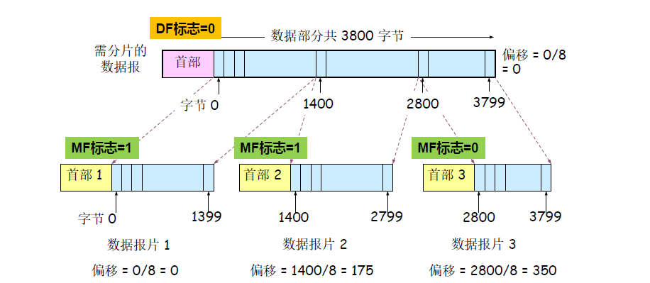
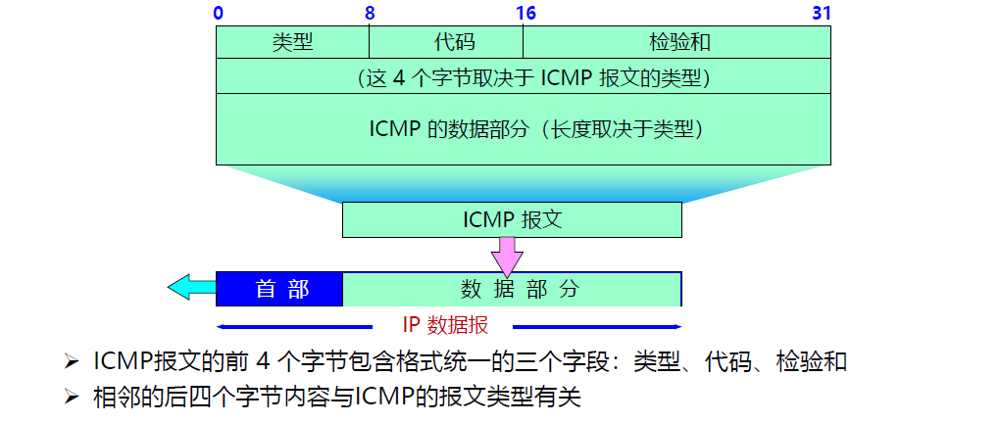

## class 5: 网络层

### 5.1 网络层服务

#### 5.1.1 概述

网络层实现端系统间多条传输可达。

网络层的功能存在每台主机和路由器中。

关键功能：

- 1. 路由（控制面）：选择数据报从源端到目的端的路径

  - 核心：路由算法与协议
- 2. 转发（数据面）：将数据报从路由器的输入接口传送到正确的输出接口

网络通信的可靠交互服务：网络/端系统

网络层应该向运输层提供怎样的服务：面向连接（虚电路）/无连接（数据报）

根据上述两个问题，引申出不同的网络层设计

#### 5.1.2 无连接服务的实现

无连接服务：如寄信

- 不需要提前建立连接

数据报服务：

- 网络层向上只提供简单灵活无连接的，尽最大努力交付的数据报服务
- 发送分组时不需要先建立连接，每个分组独立发送
- 数据报独立转发，相同源-目的的数据报可能经过不同的路径
- **网络层不提供服务质量的承诺**

尽力而为交付：传输网络不提供端到端的可靠传输服务（如丢包、乱序、错误等问题）

- 优点：降低网络造价，运行方式灵活，能够适应多种应用

#### 5.1.3 面向连接服务的实现

面向连接服务：如电话

- 通信之间先建立逻辑链接：如有需要可预留网络资源
- 结合使用可靠传输的网络协议，保证所发送的分组无差错、按序列到达终点

虚电路时逻辑连接

- 虚电路表示这只是一条逻辑上的连接，分组都沿着这条逻辑连接按照存储转发方式传送，而并不是真正建立了一条物理连接
- 注意，电路交换的电话通信是先建立了一条真正的连接
- 因此分组交换的虚连接和电路交换的连接只是类似，但并不完全相同

**注意：面向连接的方法也不一定能完全保证数据的可靠传输，链路中的任何一个组成环节仍有可能失效，而这种失效是严重的，可能导致所有数据丢失**

虚电路的转发策略：虚电路转发决策基于分组标签，即虚电路号


数据报：无连接的方法：

无连接的方法允许分组有选择不同路径的可能性，但这样可能会导致接收数据的失序；为避免增加额外的开销进行数据排序，网络并不会完全随意地发送数据，在大多数情况下，仍然是会尽量沿着某一条路径发送。

#### 5.1.4 虚电路与数据报网络的比较

| 对比内容           | 虚电路服务                         | 数据报服务                     |
| ------------------ | ---------------------------------- | ------------------------------ |
| 可靠传输的保证     | 可靠通信由网络保证                 | 可靠通信由主机保证             |
| 连接的建立         | 必须要                             | 不需要                         |
| 地址               | 每个分组含有一个短的虚电路号       | 每个分组需要有源地址和目的地址 |
| 状态信息           | 建立好的虚电路要占用子网表空间     | 子网不存储状态信息             |
| 路由选择           | 分组必须经过建立好的路由发送       | 每个分组独立选择路由           |
| 分组顺序           | 总是按序到达                       | 可能乱序到达                   |
| 路由器失效         | 所有经过失效路由器的虚电路都要终止 | 失效结点可能丢失分组           |
| 差错处理和流量控制 | 网络或用户主机负责                 | 用户主机负责                   |
| 拥塞控制           | 容易控制                           | 难控制                         |

综合而言，性能比较如下：

1. 从性能角度比较：

- 使用虚电路：
  - 若每个数据源的流量速率都是固定的：带宽不浪费，每个数据源发送数据的带宽都可被保证。
  - 若数据源为突发流量，那么虚电路只能够按照预留的带宽进行服务，这导致网络的利用率降低，还可能导致过载（信道无法承受接收的流量）。
- 使用数据报：
  - 由于数据报中，每个数据都是独立的，因此不会受到流量突变的影响，也不会过载。

2. 从效率角度比较：

分组交换时延为：$n(D+(P+H)/B)$，D为每个转接点的转接延迟时间，P为每个分组长度，H为分组开销bit，B为链路上的数据传输速率（bps），n为转接节点的个数。

对于虚电路而言，它比数据报多了建立连接的时延。

### 5.2 Internet网际协议

#### 5.2.1 IPv4协议

IPv4协议是一种无连接的协议，是互联网的核心，也是使用最广泛的网际协议版本。

internet协议执行两个基本功能：

- 寻址（addressing）
- 分片（fragmentation）

**IPv4数据报格式j(背下来！)**


IPv4由首部和数据两部分组成，其中首部每一行为32bit，从上往下如下所示：

- 版本：4bit，表示采用的IP协议版本
- 首部长度：4bit，表示整个IP数据报首部的长度
- 区分服务：8bit，一般情况下不使用
- 总长度：16bit，表示整个IP报文的长度，最大字节为65535字节
- 标识：16bit，IP软件通过计数器自动产生，每产生一个数据报计数器+1；在ip分片后用来标识同一片分片
- 标志：3bit，目前只有两位有意义：MF：1表示后面还有分片，0表示这是数据报的最后1个；DF：0表示允许分片，1表示不能分片
- 片偏移：13bit，表示IP分片后相应的IP片在总IP片的相对位置
- 生存时间TTL：8bit，表示数据报在网络中的生命周期（用通过路由器的数量计算，即跳数）
- 协议：8bit，标识上层协议（TCP/UDP...）
- 首部校验和：16bit，校验首部
- 源地址：32bit，发送源IP
- 目的地址：32bit，目的地IP
- 选项：长度可变，可扩充部分
- 天聪：用全0字段补齐为4字节的整数倍

数据报分片：

分片的原因：传输的数据报有最大长度限制

MTU（Maximum Transmission Unit）：最大传输单元

- 链路MTU
- 路径MTU（即其中所有链路MTU的最小值）

分片策略

- 允许途中分片：根据下一跳链路的MTU进行分片
- 不允许途中分片：发送的数据包长度小于路径MTU

重组策略

- 途中重组（实施难度太大）
- 目的端重组（互联网采用的策略）
- 重组所需信息：原始数据报编号、分片偏移量、是否收集所有分片

数据位要求：

- 1. 发送的数据报DF=0（允许分片）
- 2. 最后一个分片MF=0，其他的MF=1
- 3. **offset以8个字节为单位**，即数据段的大小再除以8（数据段本身以一个字节为单位）



其他问题：

- IPv4分组再传输图中可以多次分片
  - 源端系统，中间路由器（可哦通过标志位设定是否允许路由器分片）
- IPv4分片旨在目的IP对应的目的端系统进行重组
- IPv4分片、重组字段在基本IP头部
  - 标识、标志、片偏移
- IPv6分片机制有较大变化

#### 5.2.2 IP地址

IP地址是：网络上每一台主机（或路由器）的每一个接口分配一个全球唯一的32位标识符

将IP地址划分为固定的类，每一个类由两个字段组成。

网络号先沟通的这块连续IP地址空间成为地址的前缀，或网络前缀

常见的特殊地址如下：

- 网络号全0：只在系统启动时有效，用于启动时临时通信，又叫主机地址
- 网络127.0.0.0：指本地节点（一般为127.0.0.1），用于测试网卡以及TCP/IP软件，这样浪费了1700万个地址
- 主机号全0：用于指定网络本身，称之为网络地址或网络号
- 主机号全1：用于广播，也称定向广播，需要指定目标网络
- 0.0.0.0：指任意地址
- 255.255.255.255：用于本地广播，也称有限/受限广播，无需知道本地网络地址

**注意：在求解可分配IP地址范围/子网拥有的主机数量时，主机号全0或全1是不能算在其中的**

子网划分（subnetting）：在网络内部将一个网络块进行划分以供多个内部网络使用，对外仍是一个网络。

子网（subnet）：子网划分后得到的结果网络

子网掩码（subnet mask）：32bit，前面必须全1，后面必须全0，1表示网络位，0表示主机位

例如：


---

无类域间路由：CIDR（Classless Inter-Domain Routing）

将32位的IP地址划分为前后两个部分，并采用斜线记法（即在IP地址后“/”，后面给出网络前缀所占的位数。

一个CIDR地址快可以表示很多地址，这种地址的聚合成为路由聚合（route aggregation），也称构成超网（supernet）。

例如：`194.24.0.0/21`含有如下信息：

- 子网的第一个IP地址：`192.24.0.0`
- 子网的最后一个IP地址：`192.24.7.255`
- IP地址总数：2048（2^11）

最长前缀匹配（longest prefix match）

- CIDR可变长子网掩码以及路由聚合，需要最长前缀匹配来实现最精确匹配（即，可能由IP地址同时满足两种CIDR）
- IP地址与IP前缀匹配时，总是选取子网掩码最长的匹配项
- 主要用于路由器转发表项的匹配，也应用于ACL规则匹配等。

分类的IP地址（CIDR之前）

- 在CIDR前，IP分为A/B/C/D/E五类，其中A/B/C为单播地址


---

IPv4地址如何获取：

- 公有IP地址全球唯一：ICANN，即互联网名字与编号分配机构向ISP分配，ISP再向所属机构或组织逐级分配
- 静态设定：申请固定IP地址，手工设定，如路由器、服务器
- 动态获取：使用DHCP协议或其他动态配置协议；当主机加入IP网络，允许主机从DHCP服务器动态获取IP地址；可以有效利用IP地址，方便移动主机的地址获取

#### 5.2.3 DHCP

DHCP：动态主机配置协议

- 当主机加入IP网络，允许主机从DHCP服务器动态获取IP地址
- 可以有效利用IP地址，方便移动主机的地址获取

工作模式：客服/服务器模式（C/S）

- 基于UDP工作，服务器运行在67端口，客户端运行在68端口

工作过程：

- DHCP客户从UDP端口68以广播形式（0.0.0.0,68）向服务器发送发现报文（DHCPDISCOVER）（此时，源地址设置为客户机的MAC）
- DHCP服务器单播（with yiaddr，67端口）发出提供报文（DHCPOFFER）（此时，目的地址设置为客户机的MAC）
- DHCP客户从多个DHCP服务器中选择一个，并向其以广播（with yiaddr）形式发送DHCP请求报文（DHCPREQUEST）
- 被选择的DHCP服务器单播发送确认报文（DHCPACK）

IP地址与MAC地址：

- IP地址放在IP数据报的首部，而MAC地址放在MAC帧的首部（MAC在外，IP在内）
- 在数据流向过程中，每一跳经过处理后的MAC帧的硬件地址会发生改变，但IP数据报中封装的IP地址不发生改变。

#### 5.2.4 ARP

ARP：地址解析协议

- IP数据包转发：从主机A到主机B
  - 检查目的IP地址的网络号部分
  - 确定主机B与主机A属于相同的IP网络
  - 将IP数据报封装到链路层帧中，直接发送给主机B

问题：发送给主机B需要B的MAC地址，给定B的IP地址，如何获取MAC地址？


工作过程：

- 前提：A已知B的IP地址，需要获得B的MAC地址
- 如果A的ARP表缓存有B的IP地址与MAC地址的映射关系，则直接从ARP表中获取
- 如果没有，则A广播包含B的IP地址的ARP query分组
- B接收到ARP query分组后，将自己的MAC地址发送给A（单播）
- A在ARP表中缓存B的IP地址和MAC地址的映射关系
  - 超时后，需要删除这个映射关系

IP包转发的方法：

- 直接交付：与目的主机在同一个IP子网内，直接发给B即可
- 路由到另一个局域网（与目的主机不在同一IP子网内）：
  - A创建IP数据包
  - 在源主机A的路由表中找到路由器R的IP地址
  - A根据R的IP地址，使用ARP协议获得R的MAC地址
  - A创建数据帧、封装IP数据包并发送给R

#### 5.2.5 NAT

NAT（网络地址转换）的目的是为了解决IPv4地址资源不足的问题。

我们知道，IP地址应当是全球唯一的。

但NAT将网络分为了**外网**和**内网**，不同的内网可以有IP地址的重复。通过这种方式就能够完成IP地址资源的扩充。

私有IP地址分为如下几种：

- A类地址：10.0.0.0-10.255.255.255
- B类地址：172.16.0.0-172.31.255.255
- C类地址：192.168.0.0-192.168.255.255

**如上三种就是在内网中使用的IP地址**

> ZJUWLAN使用的就是A类地址。

而当数据报从内网发送至外网时，同一内网发出的所有报文具备相同的源IP地址，以实现在网络中的传播。

而同一内网下的不同主机则用**不同的源端口号**实现区分（这是传输层提供的标识服务）。

而广域网和局域网地址之间的转换关系，在NAT转换表中记录，如下：


NAT的粒度提供到每个主机的每个端口，换言之，同一主机的不同端口在NAT转换表中是不同的表现。

NAT根据不同的IP上层协议进行NAT表项管理

- TCP/UDP/ICMP

传输层TCP/UDP拥有16-bit端口号字段

- 所以一个WAN侧地址可支持60000个并行链接（但也可以通过其他方式提高连接数）

NAT的优势：

- 节省合法地址，减少地址冲突
- 灵活连接Internet
- 保护局域网的私密性

问题：

- 违反IP的结构模型，路由器处理传输层协议
- 违反端到端原则
- 违反最基本的协议分层规则
- 不能处理IP报头加密
- 新型网络应用的设计者必须要考虑NAT场景，如P2P应用程序

**重点在于，NAT导致了三层（网络层）需要看到并处理四层（传输层）的细节（即端口号），这就导致了协议的复杂性**

典型的问题：一个内网的主机希望使用其他的内网主机，但只知道对应主机在内网中的具体IP，此时是**无法直接通过NAT**实现的（因为NAT需要对应的外网IP）。

一个可行的解决方案：加入中继器，解决这个问题。

#### 5.2.6 Internet控制报文协议（ICMP）

ICMP允许主机或路由器报告差错情况和提供有关异常情况的报告，由主机和路由器用于网络层信息的通信。

ICMP报文携带在IP数据报中：IP上层协议号为1

ICMP报文类型：

- ICMP差错报告报文：终点不可达；改变路由（Redirect）；时间超过（Time Exceeded）；参数问题
- ICMP询问报文：回送请求或应答；时间戳请求或应答




例如：

1. Ping指令使用了ICMP回送与回送回答报文，用以测试两个主机之间的联通性。
2. Traceroute指令使用了ICMP时间戳请求与应答报文，用以跟踪数据包的传输路径。

其原理为：源向目的地发送一系列UDP段，第一个TTL=1；第二个TTL=2等，当第n个数据报到达第n和路由器:路由器丢弃数据报，并向源发送一个ICMP报文(类型11, 编码0)。报文的源IP地址就是该路由器的IP地址


思考题：


- 1. TTL of p2?

显然，根据包头结构，TTL位于第9个字节，因此找到对应的位置为 `0x31`，因此TTL=**49**。

- 2. How many routers passed before p6 arrived to host A?

想计算经过的路由，同样根据TTL进行（TTL为跳数）。由于p6是B发出的包，因此我们要做的是：

- 找到A收到的对应的包是哪个
- 找到两个对应的TTL
- 计算差值（题目理解为从B到A的跳数）

显然，通过Identification字段，发现p6和p5是一致的，因此它们是同一个包，对应的TTL分别为 `0x31`和 `0x40`，取差值即可获得对应的跳数为**15**。

- 3. p1 to p4, which is not sent by host A? which needs fill out the minimum frame size at ethernet MAC?

第一问需要我们确定哪些包不是由A发送的。显然，A能够抓取的包只有**A发出的**和**A接收的**。一方面，我们已知A的IP `10.0.0.8`可以对源/目的地址进行判断；另一方面可以结合NAT的转换表进行分析。

显然，p1, p3, p4的源地址（第12-16字节）为 `10.0.0.8`，因此它们是A发出的。题目问并非A发出的，因此答案为**p2, p5**

第二问需要考虑以太网MAC的限制：其最短总帧长为**64**字节，其中数据字段的最小长度为**46**字节。于是可以查看 `total length`字段查看MAC包的数据字段。发现只有p3的数据字段为 `40`字节，小于46字节，因此p3需要填充至最小帧长。

**注意！这个包是网络层，而问题问的是MAC层。因此，网络包的所有字段总长度就是MAC包的数据字段！**

- 4. Public IP of B; Public IP of A

同样地，通过源地址和目的地址找到它们的公网IP，但不同的是需要从目的地址找到（因为从源地址找到的是私网IP）。

因此可得：B的公网IP为 `160.8.0.80`；A的公网IP为 `192.10.1.6`

- 5. if p7 will be fragmented into two fragments, MTU 800, length MF offset?

首先我们需要知道**分片**是怎么做的。重点需要注意的是，分片是以**8个字节**为单位的。

其次需要注意的是，**total length**包括了Header。

首先，通过 `total length`字段得知包的总长度：$6\times 256 = 1536$ 字节。

同时我们注意到，分片的原则是**对数据字段分片**，因此需要求出其数据字段的长度：为$1536-20=1516$ 字节（Header为20字节）。

题目中提到MTU为800字节（注意MTU是分片总长度），因此可知分片数据字段的最大长度为$800-20=780$ 字节。

然而，注意到**分片是以8个字节为单位的**，因此实际上不能够使用780字节的数据字段，而必须是8的倍数，即$776$ 字节。

于是可知：

- 第一分片大小为$776+20=796$ 字节
- 第二分片大小为$740+20=760$ 字节

而到具体的offset，第二分片的offset为：$776/8=97$，也就是最后的答案。

### 5.3 路由算法

路由算法应当满足的特性：

- 正确性
- 简单性
- 鲁棒性
- 稳定性
- 公平性
- 有效性

路由算法的分类：

- 静态路由算法：根据路由表进行路由选择，非自适应
- 动态路由算法：根据路由表和流量信息进行路由选择，自适应

优化原则：尽可能达成汇集树（Sink Tree）：

- 定义：所有的源节点到一个指定目标节点的最优路径的集合构成一棵以目标节点为根的树。

> 单位为步长，树的根是源路由器

最短路径算法：Dijkstra算法

#### 5.3.1 距离向量路由

使用Bellman-Ford算法进行距离向量路由。

Bellman-Ford定义：假设$D_x(y)$为从x到y最小代价路径的代价值，那么：

$$
D_x(y) = min\{c(x,m)+D_m(y)\}
$$

其中，m是x的邻居，c(x,m)是x到m的距离。

简而言之，就是通过**自己到邻居的长度+邻居到目标节点的长度**计算最短路径。

距离向量（Distance Vector）算法的基本思想：

- 每个节点周期性地向邻居发送它自己到某些节点地距离向量
- 当节点x接收到来自邻居的新DV估计，它使用B-F方程更新自己的DV

特点：

- 迭代的：由本地链路费用改变或邻居更新报文导致本地的迭代
- 分布式：各节点依次计算，相互依赖

问题：对好消息反映很快，对坏消息反应很迟（It reacts rapidly to good news, but leisurely to bad news.）

举例：对线性的A、B、C、D、E五个节点，结构如下：

```
A---B---C---D---E
```

- 好消息：假设一开始五个节点都不工作，之后A开始工作，那么就需要5次交换完成所有的路由更新。
- 坏消息：假设A突然不工作，那么B以为C有更短路径，于是更新；C也以为B有更短路径，于是更新；这导致数据出错。


解决方法：毒性逆转（poisoned reverse）：如果C的路径是通过B找到A的，那么C直接告诉B：C->A是infinity，则B在断连A后不会再寻找C到A的路径。

TODO：

- 毒性逆转仍然无法解决这个问题（count to infinity），给出反例。

#### 5.3.2 链路状态路由

链路状态（Link State）路由可分为五个部分：

- 1. 发现邻居，了解他们的网络地址；
- 2. 设置到每个邻居的成本度量；
- 3. 构造一个分组，分组中包含刚收到的所有信息；

  - 分组信息包括：发送方标识、序列号、年龄、邻居列表
- 4. 将此分组发送给其他的路由器；

  - 路由器根据收到分组的情况进行判断：
    - 若为新分组则洪泛广播
    - 若为重复分组则丢弃
    - 若为过时分组则拒绝
- 5. 计算到其他路由器的最短路径。

简而言之，链路状态路由相当于为每一个节点提供整个网络拓扑，这样节点就可以直接哦通过dijkstra算法计算到其他节点的最短路径。

#### 5.3.3 对比

对DV和LS进行对比：

1. 网络状态信息交换：

- DV：邻居间交换
- LS：全网扩散

2. 健壮性：

- DV：计算结果传递，健壮性差
- LS：各自计算，健壮性好

3. 网络状态信息的可靠性：

- DV：部分道听途说
- LS：自己测量

4. 收敛速度：

- DV：慢，可能计数到无穷问题
- LS：快

---

quiz：

1. for F's link state packet, we need to calculate the distance from F to neighbors:

so it is:

```
F
---
Seq.
---
Age
---
E 8
B 6
D 7
```

2. as for DV algorithm:

F's initial distance vector only knows the path to neighbor: so it is:(-1 stands for infinity)

```
A -1 
B 6 
C -1 
D 7 
E 8 
F 0 

```

After receiving the B's initial distance vector, F can update its distance vector:

```
A 10 
B 6 
C 8 
D 7 
E 8 
F 0 
```

---

#### 5.3.5 层次路由

问题：路由器过多，那么需要存储的Entry就会很大，这导致查找困难，开销增大。

层次路由希望解决的问题：

- 网络扩展性问题（控制路由表数目和路由表存储空间的增长）
- 管理的自治问题（网络管理员可以控制和管理自己的网络路由）

**互联网由大量不同的网络互连，每个管理机构控制的网络是自治的**

自治系统（AS，Autonomous System）：一个管理机构控制之下的网络

- 一个AS内部通常使用相同的路由算法/路由协议，使用统一的路由度量（跳数、带宽、时延…）
- 不同的AS可以使用不同的路由算法/路由协议
- 每个AS有一个全球唯一的ID号：AS ID
- 自治系统内的还可以进一步划分层次：私有自治系统或区域

自治系统内部使用内部网关路由协议（Interior Gateway Protocol，IGP）

- 每个自治系统域内路由算法可不同

自治系统之间之间使用外部网关路由协议，Exterior Gateway Protocols (EGP)

- 各自治系统域之间的路由需统一

#### 5.3.6 广播路由

广播：源主机同时给全部目标地址发送同同一个数据包。

- 方法1：向每个主机单独发送一个数据包：效率低，浪费带宽
- 方法2：多目标路由：在需要转发的路由器线路复制一次该数据报；网络利用率高，但难以实现；Server仍然需要知道所有的目的地址。
- 方法3：泛洪：一种将数据包发送到所有网络节点的简单方法
- 方法4：生成树

泛洪的特点：

- 保证性：有效的广播手段，可以确保数据包到达网络的每个节点
- 鲁棒性：即使大量路由器损坏，也可以找到一条传播路径（如果存在）
- 简单性：仅需知道自己的邻居即可

1. 无控制的泛洪（每个路由直接转发向所有的邻居）：

- 最简单
- 环路可能导致广播风暴
- 路由器可能受到多个副本

2. 受控的泛洪（序号控制泛洪/逆向路径转发（RPF））

序号控制泛洪：需要记录该数据包是否已被接收并转发过（如果是则丢弃，否则转发）

- 问题：记录额外数据的代价较高

逆向路径转发：假设路由表中表示到达各网络的最优路径，如果数据包来源是从最优路径来的，那么就转发，否则就丢弃。

- 问题：仍然无法完全避免重复包的产生

> 对“无法完全避免重复包产生”的具体解释：它的意思是指一个节点仍然可能收到重复的包，但可以通过处理不再转发其中的某些包。

换句话说，它并不能完全实现广播路由的最优解（最优解应当是完全按照sink tree的图进行传播，次数最少），由于每个节点都是单独看待的，因此会有冗余的传播。


---

方法4：生成树

- 源节点向所有属于该生成树的特定链路发送分组
- 改进了逆向路径转发
- 没有环路
- 最佳使用带宽
- 最少副本，消除冗余分组
- 一个路由器只需要知道在一棵树中的邻居即可

#### 5.3.7 组播路由

组播（multicasting）：源主机给网络中的一部分目标用户发送数据包。

组播路由算法的目标：

- 为每个组建立多播转发树（到达该组所有成员的路径树）
- 每个组成员应当只收到多播分组的一个拷贝
- 非本组成员不应收到该组的分组
- 从源节点到每个组成员节点的路径应当最佳

组播实现的步骤：

- 确定组成员：边缘路由器通过与主机交互，了解到从它的某个端口可以到达哪些组的成员——主机与路由器之间的组成员关系协议
- 生成树：路由器与路由器之间的协议

常用的组播地址段：`224.0.0.0/24`

- 224.0.0.1 LAN上所有设备
- 224.0.0.2 LAN上所有路由器
- 224.0.0.5 LAN上所有OSPF路由器
- 224.0.0.251 LAN上所有DNS服务器

生成树方案：

- 1. 密集分布：基于源点树（source-based trees）
- 2. 广播分布：基于目的点树（destination-based trees）
     TODO

#### 5.3.8 选播路由

选播（Anycast）：将数据包传送给最近的一个组的成员

典型应用：DNS

- 在没有指定DNS服务器的情况下，用户将始终连接到“最接近”的服务器，可以减少延迟，并提供一定程度的负载平衡。

#### 5.3.9 不同路由模式之间的特点


### 5.4 Internet路由协议

#### 5.4.1 OSPF-内部网关路由协议

OSPF（Open Shortest Path First）：开放最短路径优先协议

基本思想：

- 向本自治系统中所有路由器洪泛信息
- 发送的信息就是与本路由器相邻的所有路由器的链路状态
- 只有当链路状态发生变化时，路由器采用洪泛法发送此信息

链路状态通过如下方式进行度量（metric）：

- 费用
- 距离
- 时延
- 带宽

每个路由器通过互相频繁交换链路状态信息，最终建立链路状态数据库LSDB

这个数据库就是对区域内的拓扑结构图，这在区域内的每个路由器中是一致的（即：LSDB的同步）

OSPF中，区域是指将一组网段组合在一起的集合。区域相关的特点如下：

- 详细的描述拓扑结构的链路状态信息仅在区域内传递，区域间传递的是抽象的路由信息
- 使用层次结构的区域划分，上层的区域叫做主干区域(backbonearea)，其他区域都必须与主干区域相连
- 非主干区域之间不允许直接发布区域间路由信息
- 区域也不能太大，在一个区域内的路由器最好不超过200个
- 划分区域可以缩小LSDB规模，减少网络流量

OSPF分为主干区域和非主干区域：


路由器角色有以下几种：

- 内部路由器（Internal Router, IR）
- 区域边界路由器（Area Bounder Router, ABR）
- 自治系统边界路由器（AS Boundary Router, ASBR）

总结：OSPF具备如下特点：

- 支持无类域间路由（CIDR）
- 无路由自环
- 收敛速度快
- 使用IP组播收发协议数据
- 支持多条等值路由
- 支持协议报文的认证

OSPF协议适合大型网络的原因：使用层次路由

OSPF不会存在“坏消息传得慢”的原因：它内部基于Link state而非distance vector算法，因此不会存在“坏消息传得慢”的问题。

#### 5.4.2 RIP协议

RIP（Routing Information Protocol）是基于距离矢量算法的协议

RIP使用跳数衡量到达目的网络的距离（即：跳数越少越好，距离越短）

RIP允许一条路径最多包含15个路由器

基本思想：

- 仅和相邻路由器交换信息（以DV的方式交换）
- 路由器交换的内容是自己的路由表
- 周期性更新：30s

特点：

- 算法简单，易于实现
- 收敛慢
- 需要交换的信息量大
- 适用于中小型网络

防环路机制：

- 触发更新
- 毒性反转
- 水平分割
- 其他

#### 5.4.3 BGP协议

BGP（Border Gateway Protocol）：外部网关路由协议

- 内部网关协议：IGP，如RIP、OSPF
- 外部网关协议：EGP，如BGP

功能：

- eBGP: 从相邻的AS获得网络可达信息
- iBGP: 将网络可达信息传播给AS内的路由器
- 基于网络可达信息和策略决定到其他网络的“最优”路由


BGP会话：两个BGP路由器通过TCP连接交换BGP报文

- 通告到不同网络前缀的路径，即路径向量协议

例如对如下图片中，AS3-3a对AS2-2c建立连接：


1. AS3-3a向AS2-2c发送一条通告 `AS3,X`，向AS2承诺会向X转发数据包
2. AS2接收到这条通告后，会通过iBGP传播给AS2的所有路由器
3. 根据AS2的策略，AS2的路由器2a通过eBGP向AS1的路由器1c通告从AS3的路由器3a接收到路径，通告为：`AS2, AS3, X`

通过上述方法，路由器可能会学到多条到目的网络的路径：


BGP的特点：

- 其节点数量为自治系统的数量
- 每个自治系统边界路由器的数目很少
- BGP刚刚运行时，BGP的邻站是交换整个的BGP路由表；以后只需要在发生变化时更新有变化的部分
- BGP为每个AS提供：
  - 从邻居AS获取网络可达信息(eBGP协议)
  - 传播可达信息给所有的域内路由器(iBGP协议)
  - 根据“可达信息”和“策略”决定路由

BGP通过TCP的179端口交换报文（也因此，它不能算是网络层的协议）

BGP的报文包括：

- Open报文：用于建立BGP对等体（peer）之间的会话连接，协商BGP参数（该过程需要认证）
- Update报文：用于在对等体之间交换路由信息
- Keepalive报文：用于保持BGP会话连接
- Notification报文：用于差错报告和关闭BGP连接

BGP路径的属性：

- AS路径：IP前缀通过经过的所有AS号
- 下一跳（next-hop）路由器：路由器的IP地址

BGP的路由选择：

路由器可能从多个对等体收到针对同一目的IP的路由，因此需要选择一条最佳路由

选择规则：自上向下，依次排序

- 本地偏好值属性：政策决策
- 最短的AS-PATH
- 最近的NEXT-HOP路由器
- 附加标准…
- 最低路由器ID

BGP路由策略

- 路由器使用策略决定接收或拒绝接收到的路由通告
- 路由器使用策略决定是否向其他相邻AS通告路径信息

#### 5.4.4 MPLS技术

MPLS（multiprotocol label switching）：多协议标签交换

- 多协议表示在MPLS上层可以采用多种协议：如IP/IPv6/IPX
- 标签是指每个分组被分配一个标签，路由器根据该标签对分组进行转发
- 交换是指标签的交换，MPLS 报文交换和转发是基于标签的

MPLS主要有以下三个方面的应用

- 面向连接的服务质量管理
- 流量工程，平衡网络负载
- 虚拟专用网VPN

标签交换路由器：LSR

- 支持MPLS的路由器
- 具备标签交换、路由选择两种功能

MPLS域

- 所有相邻的支持MPLS技术的路由器构成的区域

标签分配协议：LDP

- 用来在LSR之间建立LDP会话并交换Label/FEC映射信息

工作过程：

- 加标签：在MPLS域的入口处，给每一个IP数据报加上标签，然后对加上标记的IP数据报用硬件进行转发
- 标签交换：采用硬件技术对加上标记的IP数据报进行转发称为标签交换
- 去标签：当分组离开MPLS域时，MPLS出口路由器把分组的标签去除。后续按照一般IP分组的转发方法进行转发

> 在MPLS传输过程中，标签的值是会变化的。


### 5.5 路由器工作原理

路由器是互联网最主要的网络设备，包含2个核心功能：

- 控制层；运行各种路由协议，学习路由表（去往不同目的的转发路径）
- 数据层：根据上述路由表，将收到的IP分组转发到正确的下一跳链路

#### 5.5.1 路由器控制层

- 路由器可同时运行多个路由协议
- 路由器也可不运行任何路由协议，只使用静态路由和直连路由
- 路由管理根据路由优先级，选择最佳路由，形成核心路由表
- 控制层将核心路由表下发到数据层，形成转发表（FIB）

#### 5.5.2 路由器数据层

路由器中IP报文转发核心功能

- 链路层解封装，IP头部校验
- 获取报文目的IP地址
- 用目的IP地址，基于最长前缀匹配规则查询转发表
- 查询失败，丢弃报文
- 查询成功
  - 获取转发出接口和下一跳IP地址
  - IP头部“TTL”字段值减1，重新计算IP头部“校验和”
  - 重新进行链路层封装，发送报文

> 注：普通IP报文转发过程中，路由器不查看传输层及以上层协议的内容

IP报文在路由器转发前后的变化:

- 链路层封装更新，IP头部“TTL”减1，IP头部“校验和”更新

中间实现的交换结构：

- 共享内存
- 共享总线
- 纵横式（crossbar），应用于高性能分布式路由器

#### 5.5.3 路由器其他内容

路由器的端系统角色

- 也作为网络端系统进行协议交互
  - 远程网络管理，SNMP
  - 远程网络配置，SSH
  - 文件传输，FTP，TFTP
  - 各种路由协议交互
  - 其他
- 路由器系统包含完整TCP/IP协议栈
  - 传输层协议
  - 应用层协议

### 5.6 拥塞控制算法

> 本节主要在传输层介绍，此处只介绍大体框架

#### 5.6.1 概述

拥塞：网络中存在太多的数据包导致数据包传输延迟或丢失，从而导致网络吞吐量下降

拥塞控制（congestion control）：需要确保通信子网能够承载用户提交的通信量，是一个全局性问题，涉及主机、路由器等多种因素

产生拥塞的原因：

- 主机发送到网络的数据包数量过多，超过了网络的承载能力
- 突发的流量填满了路由器的缓冲区，造成某些数据包会被丢弃

基本策略：

- 开环控制
- 闭环控制

流量调节：显式拥塞通告（ECN，Explicit Congestion Notification）

### 5.7 服务质量

> 本节不作详细讲述

服务质量（QoS）：网络在传输数据流时要满足一系列服务请求，具体可以量化为带宽、时延、抖动、丢包率等性能指标

区分服务（DiffServ：Differentiated services）：是一种计算机网络体系结构，它指定了一种简单且可扩展的机制，用于在IP网络上分类和管理网络流量并提供服务质量（QoS）

### 5.8 三层交换与VPN

VPN：虚拟专用网（virtual private network）

设计原则：安全性、隧道与加密、数据验证、用户验证、防火墙与攻击检测

设计原理：利用公用网络架设专用网络，通过隧道技术在公共网络上模拟出一条点到点的逻辑专线，达到安全数据传输的目的。


### 5.9 IPv6技术

IPv6(Internet Protocol version 6):初始动机为应付地址空间耗尽的问题

IPv6地址长度为128位，是IPv4地址长度的4倍

地址表示法：冒分十六进制 `x:x:x:x:x:x:x:x`

- 简化：每个x前面的0可以省略
- 连续的值为0的x表示为 `::`，但只能出现1次（注意：连续的多个x都可以表示为这个，不一定非要是2个）

例如：

- 简化前：`2001:0DA8:0000:0000:200C:0000:0000:00A5`
- 简化后：`2001:DA8:0000:0000:200C::A5`
- 简化前：`2001:0db8:0000:0000:0000:0000:1428:57ab`
- 简化后：`2001:db8::1428:57ab`

IPv6头部


IPv6头部长度固定40字节，所有“选项”字段都在IPv6扩展头部分（next header）

与IPv4头部的比较

- 去除“首部长度”（首部长度固定为40字节）
- 去除“首部校验和”（传输层校验会涉及伪头部信息），提升转发速度
- 去除分片字段：“标识”“标志”“片偏移”，移至扩展头（分段头）

IPv6分片机制

- IPv6分组不能在传输途中分片，只在源端进行分片
- IPv6设计了专门的分片扩展头，分片字段不存在基本IPv6头部中
- IPv6支持Path MTU发现机制

扩展头：

- 逐跳选项头：转发路径上每个节点都需检查该扩展头的信息
- 路由头：指明转发途中需经过哪些节点，类似于IPv4的源路由机制
- 分段头：包含类似IPv4分片处理信息：片偏移、“更多段”标志、标识符
- 目的地选项头：目的端系统需要确认的信息

IPv6地址分配

- 未指定地址（::/128），不能分配给任何节点
- 回环地址（::1/128），表示节点自己，不分配，类似IPv4中的127.0.0.1
- 组播地址（FF00::/8）
- 链路本地地址（FE80::/10），也称为Link-local地址，仅在本地链路上使用，网络设备根据接口MAC地址自动生成
- 全局单播地址，其它地址
- 分配方式：手动配置/DHCPv6/无状态地址自动配置（基于ND协议的RS报文的IPv6前缀信息生成）

IPv4-IPv6的过渡技术

- 双栈技术
- 隧道技术
- 翻译技术
