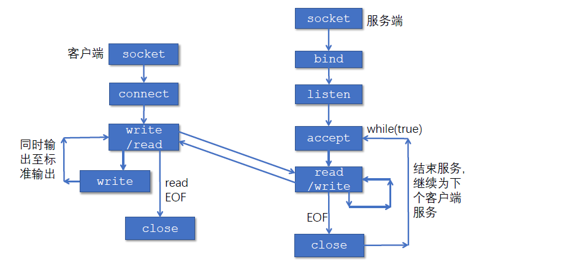

## chapter 6: 传输层

### 6.1 概述与传输层服务

传输层的位置：应用层和网络层之间；基于网络层提供的服务，向分布式应用程序提供通信服务。

按照 **端到端** 的设计原则：应用程序只运行在终端上（路由器、交换机等中间网络设备都不具备传输层）

对于应用程序而言：传输层应当提供进程之间本地通信的抽象（运行在不同终端上的应用进程仿佛是直接连在一起的）

socket（套接字）：是应用层和传输层的接口，也是应用程序和网络之间的API。

---

传输层提供的服务：

- Internet的网络层提供 **尽力而为** 的服务（尽可能在终端间交付分组，但不保证交付/按序交付/数据完整/延迟/带宽等）
- 传输层 **有所为，有所不为** ：可以通过差错恢复/重排序等手段提供可靠、按序的交付服务；但不保证延迟/带宽。

具体而言，传输层提供如下服务：

- 最低限度的传输服务
  - 将端到端的数据交付扩展到进程到进程的数据交付
  - 报文检错
- 增强服务
  - 可靠数据传输
  - 流量控制
  - 拥塞控制
- UDP传输服务：最低限度的传输服务
- TCP传输服务：提供基础服务和增强服务

### 6.2 socket编程

#### 6.2.1 简介

socket事实上就是传输层为应用层提供的接口。

创建一个网络应用：编写一个分布式程序、使其运行在不同的端系统上，并通过网络通信。

传统及主流的客户-服务器体系结构（C/S）：客户（C）只与服务器（S）通信；客户之间不通信。

通过主机的端口号（port number）来作为一台主机的不同进程的标识。

> 因此，进程标识包括：主机地址 + 端口号。

#### 6.2.2 socket API

应用应当 **显式** 地创建、使用和释放套接字。

举例：回音服务（Echo Service）：客户端向服务器发送数据，服务器将数据原样返回给客户端。

一个典型套接字的接口类型如下：

套接字地址有一个通用地址作为虚父类，根据IPv4/IPv6等不同创建不同的继承类。

以IPv4为例：

```c
struct sockaddr_in {
    sa_family_t sin_family; // 地址族，IPv4对应AF_INET
    in_port_t sin_port; // 端口号，16位
    struct in_addr sin_addr; // IP地址
    char sin_zero[8]; // 填充字节
}

struct in_addr {
    uint32_t s_addr; // 32位IP地址
}
```

1. 创建套接字：`socket()`

客户或服务器调用socket()创建本地套接字，返回套接字描述符

- domain指明网络层地址类型（IPv4则为AF_INET）
- type指明传输层协议：
  - SOCK_STREAM代表TCP字节流
  - SOCK_DGRAM代表UDP数据报
- protocol指明协议族（0表示默认协议族）

```c
int socket(int domain, int type, int protocol);
```

1. 套接字描述符：`fd`

套接字描述符在类型上和文件描述符完全兼容；

可以通过 `read()`和 `write()`来读写套接字。

具体而言：

```c
int read(int fd, void *buf, size_t count)
int write(int fd, const void *buf, size_t count)
```

3. 绑定套接字地址：`bind()`

用于将 **服务器** 本地套接字地址sa与描述符socket_fd绑定；

客户程序不需要调用bind()，操作系统为其在1024-5000之间分配一个端口号。

```c
int bind(
    int socket_fd,  // 指定套接字描述符
    const struct sockaddr *addr,    // 指定套接字绑定的地址端口
    socklen_t addrlen   // 地址的长度
)

```

4. 关闭套接字：`close()`，使用套接字描述符直接调用即可关闭：

```c
int close(int fd)
```

#### 6.2.3 举例：使用UDP套接字实现Echo服务

通过 `sendto()`和 `recvfrom()`来发送和接收数据报。


服务器端：

- 1. 服务器创建并配置socket（由于是UDP实现，所以用SOCK_DGRAM）
- 2. 服务器将套接字和服务器地址进行绑定，使用 `bind()`
- 服务器开始监听（建立死循环，里面不断调用 `recvfrom()`接收数据报）

客户端：

- 1. 创建并配置socket
- 2. 不必进行绑定，直接进行发送和接收数据报

#### 6.2.4 举例：使用TCP套接字实现Echo服务

首先要建立一对套接字之间的一条封闭管道，发送端和接收端通过管道进行传输

- 可以保证管道中传输的字节不丢失，且保持顺序。

注意：服务器可以通过多个套接字来服务客户：

- 当服务器的 **监听套接字** 收到了链接请求时，服务器会临时创建一个套接字（称为 **连接套接字** ）和一个新的服务器进程，与客户进程进行通信。
- 服务器进程回到监听套接字上继续等待。
- 结束服务后，服务器销毁进程，并关闭连接套接字。

> 即：监听套接字只负责监听连接请求；连接套接字只负责与建立请求的客户端通信。

1. `listen(int socket_fd; int backlog;)`: 将主动套接字转变为被动套接字，进入监听状态（backlog中为监听队列的长度）
2. `accept(int socket_fd; struct sockaddr *addr; socklen_t *addrlen;)`：服务器取出与对应客户端通信的套接字，返回一个套接字描述符（使用后需要close）。当服务器准备好与下一个客户端通信时，它会再次调用accept()。

在accept()调用后，其返回值为 **连接套接字描述符** ，可以用来进行通信。

3. `connect(int socket_fd; const struct sockaddr *addr; socklen_t addrlen;)`：客户端主动发起连接请求（服务器IP和端口信息在sockaddr中），连接成功后，两个套接字之间建立一条管道。



### 6.3 传输层的复用和分用

- （发送端）复用：传输层从多个套接字收集数据，交给网络层发送
- （接收端）分用：网络层从网络中收到数据，交给传输层分发给正确的套接字

套接字的标识与端口号：

端口号（16位）：每个套接字在本地关联一个端口号。

端口号的分类：

- 熟知端口：0-1023，由公共域协议使用
- 注册端口：1024-49151，需要向IANA注册才能使用
- 动态/私有端口：49152-65535，一般程序使用

> 例如：web服务中，在尚未明确服务器socket端口时，一般会使用默认端口80，即HTTP协议的默认端口

在TCP/UDP报文中，会携带两个端口号：源端口号和目的端口号。

端口号的分配：

- 自动分配（客户端通常使用）：创建套接字时不指定端口号，由操作系统从49152-65535之间分配一个端口号
- 使用指定端口号创建套接字（服务器通常使用）：创建套接字时指定端口号；公共域协议的服务器应分配众所周知的端口号（0-1023）

UDP分用方法：

- UDP套接字使用 `<IP地址，端口号>`二元组进行标识。
- 接收方收到UDP时：
  - 检测报文段中的目的端口号，将UDP交付到具有这个端口号的套接字
  - **目的地址和目的端口号相同的UDP报文段被交付到同一个套接字** ，与源地址、源端口号无关。
  - 源地址、源端口号用于发送响应报文。

TCP分用方法：

- TCP使用两种套接字：
- 1. 监听套接字：用于监听，使用众所周知的端口号
- 2. 连接套接字：用于通信，使用临时分配的端口号

  - **每个连接套接字只与一个客户通信，只有在源地址、目的地址、源端口号、目的端口号完全相同的报文段才会被分发到这个套接字**

> 具体而言，一个连接套接字只与一个地址的一个端口通信。

### 6.4 UDP

UDP提供的服务：

- 进程到进程之间的报文交付
- 报文的完整性检查（可选）：检测并丢弃出错的报文

需要实现的功能：

- 复用和分用
- 报文检错

UDP报文段结构：

- 用于服用和分用的字段：源端口号+目的端口号
- 用于检测报文错误的字段：报文总长度+校验和（可选，如果不需要校验和服务，直接对校验和部分全置为0）
- 数据载荷

注：UDP报文段结构中，报文总长度以字节为单位。


计算UDP校验和时，需要包括伪头、UDP头和数据三个部分。

- UDP伪头取自IP报头：包括源IP地址、目的IP地址、协议号（UDP）、UDP报文段总长度
- 计算校验和时包含伪头信息，是为了避免由于IP地址错误等造成的误投递

（显然，IP头在UDP头的外面，所以理论上可以读到对应的信息，但从层次上并不合理，只是为了保证正确。）


UDP的作用：

- 应用可以尽可能快地发送报文
  - 不需要建立连接
  - 不限制发送速率（不进行拥塞控制和流量控制）
- 报头开销小
- 协议处理简单

UDP适合的应用：

- 容忍丢包但对延迟敏感的应用：
  - 如流媒体
- 以单次请求/响应为主的应用：
  - 如DNS
- 若应用要求基于UDP进行可靠传输，由应用层实现可靠性

### 6.5 TCP

#### 6.5.1 TCP概述

TCP模型：在一对通信的进程之间提供一套理想的管道，其特点为：

- 点对点通信
- 全双工
- 可靠、有序的字节流
  - 不保留报文边界

需要的机制：

- 建立连接
- 可靠数据传输
- 流量控制

#### 6.5.2 TCP报文段结构

TCP报文段结构（仍以32bits为一行）：

- 1. source port(16) + dest port(16): 目的端口号与源端口号
- 2. sequence number(32)
- 3. acknowledgement number(32)
- 4. head len(4) + not used(6) + U/A/P/R/S/F(6) + Receive window(16): TCP头长度（以4字节为单位），各种TCP包本身的标识符，接收窗口大小
- 5. checksum(16) + Urg data pnter(16): 校验和与紧急指针
- 6. options（可变长度）
- 具体的数据

其中：

- 发送序号（sequence number）：发送方发送的第一个字节在字节流中的序号
- 确认序号（acknowledgement number）：期望收到的下一个字节的序号（发送的ACK序号本身没被收到，表示的是它之前的东西都收到了）

> 注意：发送序号和确认序号不是包的编号，而是字节流中的序号。

对于Options字段，有如下重要的可选项：

- 最大段长度（MSS）：TCP段中可以携带的最大数据字节数
- 窗口比例因子（window scale）：实际接收窗口大小为：`window size * 2^window scale`
- 选择确认（SACK）：引入选择确认，允许接收端指出缺失的数据字节。

#### 6.5.3 TCP可靠数据传输

TCP在不可靠的IP服务上建立可靠的数据传输，其基本机制为：

- 发送端：流水线式的发送数据，等待确认，超时重传
- 接收端：进行插座检测，采用累积确认
- 乱序段处理机制：无明确规定
  - 接收端无缓存：可以正常工作，处理简单，但效率低
  - 接收端有缓存：效率高，但处理复杂

先考虑一个高度简化的TCP协议：只考虑可靠传输机制，且数据仅在一个方向上传输

- 接收方：
  - 确认方式：采用累积确认；正确、按序收到报文段后才更新确认序号；否则重复上次的确认序号（与GBN类似）
  - 失序处理：缓存失序的报文段（与SR类似）
- 发送方：
  - 使用流水线式进行报文段发送
  - 定时器的使用：仅对最早的，未被确认的报文段使用定时器，超时重传（与GBN类似）
  - 重发策略：仅在超时后重发最早的未被确认的报文段（与SR类似）

对于发送方：

- 收到应用数据：
  - 创建并发送TCP报文段
  - 若当前没有定时器在运行（没有已发送、未确认的报文段），启动定时器
- 超时:
  - 重传包含最小序号的、未确认的报文段
  - 重启定时器
- 收到ACK：
  - 如果确认序号大于基序号（已发送未确认的最小序号）：
    - 推进发送窗口（更新基序号）
    - 如果发送窗口中还有未确认的报文段，启动定时器，否则终止定时器


- 使用一个定时器的好处：当超时时间过短时，可以减少无效的重复包的传输次数（即第二种情形下，避免两个包都被重传）
- 同时，设置流水线发送以及累积确认的策略，当某些ACK丢失时，可以避免在ACK丢失时重传某些序列号较早的报文段。

设置超时值（RTO）的思想：

- 超时值太小，容易产生不必要的重传
- 超时值太大，丢包的恢复时间太长
- 直观上，超时值应当大于RTT（等待一个完整的发送-ACK的时间），但RTT时时刻变化的。

估算RTT的方法：

- 实时测量从发出某个报文段到收到确认报文段经过的时间（SampleRTT）
- 计算平均值（EstimatedRTT）: 公式如下：

$$
EstimatedRTT = (1-\alpha) * EstimatedRTT + \alpha * SampleRTT
$$

(典型地， $\alpha=0.125$)


这两种RTT具备很大的偏差，因此需要在EstimatedRTT加一个安全距离，其大小与RTT的波动幅度有关。

对安全距离的计算，需要估算二者的偏差（DevRTT）

$$
DevRTT = (1-\beta) * DevRTT + \beta * |SampleRTT - EstimatedRTT|
$$

（典型地， $\beta=0.25$）

因此可以设置重传定时器地超时值：

$$
Timeout = EstimatedRTT + 4 * DevRTT
$$

TCP确认的二义性：由于重传的TCP报文段使用与原报文段相同的序号，发送端收到确认后，无法得知是对哪个报文段进行的确认，那么测量的RTT会出现问题（可能是SEQ与ACK非对应的一次数据传输）

解决方法：可以只对一次发送成功的报文段测量SampleRTT，并更新EstimtedRTT；重传时停止测量SampleRTT

通过定时器确认补偿进一步优化重传后的RTT。

- 即：重传意味着超时值可能偏小
- 因此，让发送方每重传一次，都让超时值增大一倍

例如：Karn算法：

- 使用EstimatedRTT估计初始的超时值
- 若发生超时，每次重传时对定时器进行补偿，直到成功传输一个报文段为止
- 若收到上层应用数据、或某个报文段没有重传就被确认了，用最近的EstimatedRTT估计超时值

对于接收端，为了减少传输的次数，允许 **推迟确认** （即连续收到多个包后，只发送最后一个确认）

- 由于这样会导致RTO计算出现问题，因此规定至少每隔一个报文段就用正常方式传输一个段
- 为避免因延迟过大造成不必要地重传，设置推迟确认的最大时间为500ms


快速重传：发送方利用重复的ACK检测报文段的丢失，当收到三次 **重复的确认** 时，立即重发包含该序号的报文段：

注意：是 **重复的确认** ，而不是 **更新的确认** 。 


小结：TCP的差错恢复机制可以看成是GBN和SR的混合体；TCP在减小定时器开销和重传开销方面要优于GBN和SR

---


崩溃恢复：在于接收方和发送方之间的同步：

1. 服务器崩溃的处理方式：

服务器直接向所有客户端广播一个crash信息，让所有客户端记录当前的状态（可能处于已经传输完的状态S0，也可能处于发送了一个包但没有收到ACK的状态S1）。

当服务器恢复后，只需要让所有处于S1状态的客户端进行重传。此时可能出现两种情况：

- 1. 服务器发出了ACK，但在写入的过程中出现了crash。由于客户端收到了ACK因此不会再重传这个包，导致数据 **丢失** （LOST）。
- 2. 服务器先写入了数据，但在发送ACK前出现了crash。由于客户端误以为服务器没收到包，因此会重传，导致 **重复传输** （DUP.）。


可见：无论如何调整发送方和接收方的程序（限制在本层次中操作），总有一种可能会导致崩溃时无法正确恢复。

> 无法使用seqno来检测duplicate，这是因为在接收方崩溃后，seqno状态可能会丢失，导致无法判断是否是重复报文段。

因此可以得出结论：从在第N层发生的崩溃，恢复方式只能通过第N+1层进行控制（如果N+1层能够记录足够多的状态信息）。

> 例如：上述场景中的“写”操作只有应用层才能够得到状态信息，因此传输层在未知写操作是否发生时是无法完全的实现状态恢复的。

#### 6.5.4 TCP流量控制

接收缓存：

- TCP接收端有一个接收缓存：将收到的数据放入接收缓存；应用进程从接收缓存中读取数据
- 进入其中接收缓存的数据不一定被立即取走
- 这意味着如果到达的数据量过大，可能导致缓存溢出而丢失。

而在GBN/SR中，不需要考虑流量控制，因为它们已经假设上层处理能力无限大，收到即立即交付。

在UDP中，同样不需要考虑流量控制，因为它不负责考虑报文数据因流量问题溢出的问题。

TCP流量控制的方法：

- 接收缓存中的可用空间为 **接收窗口** 。
- 接收方通过将接收窗口放在报头，向发送方通告接收缓存的可用空间
- 发送方限制未确认的字节数不能超过接收窗口的大小。

> 特别地，如果接收方通告接收窗口为0，发送方必须停止发送


- 注：在接收方接收窗口发生更新时，都会向发送方返回一个ACK，表示接收窗口的变化。

在上述图片中的16，可能出现死锁的情况，具体情况如下：

- B一次性释放了多个buf，且接收窗口为最大值，此时B向A发送了ACK通告接收窗口的变化
- ACK通告丢失，此时A仍然认为B的接收窗口为0，因此不会发送新的包
- 而B由于接收窗口不会变化（已经为最大值，且没有再收到A传输的包），因此也不会向A发送ACK。
- 结果就是：A误以为B没有空间，B误以为A没有新的数据，造成互相等待的情况。

解决方法：非零窗口通告：

- 当发送方收到接收方传来的零窗口信号时，会停止发送，并且开启 **坚持计时器** 。
- 当坚持计时器超时时，发送方会发送一次 **零窗口探测** 的报文段，让接收方能够通过它进行响应，将当前的接收窗口情况发给发送方。
- 如果发送方收到的接收窗口仍为0，则重置计时器，实现定时检测的功能。

这样的方式可能出现：糊涂窗口综合症（即：如果接收方消化信息较慢，一直不发ACK，那么发送方就会一直发送零窗口探测。）

解决方法：

- 接收端：
    - 在接收窗口较小时，推迟发送确认
    - 仅当窗口显著增加时，才通告新的窗口大小
- 发送端：
    - 使用Nagle算法，确定发送时机

#### 6.5.5 TCP连接管理

建立连接的定义：

- 前提：双方都同意连接
- 内容：初始化连接参数

##### 6.5.5.1 两次握手连接

即：发送方发送连接请求；接收方发送连接确认

问题：2次握手在不可靠的网络中，不一定总是可行的，会出现如下意外：

- 包传输的延迟变化很大
- 存在重传的报文段
- 存在报文的重排序

在两次握手连接的模型中，可能出现 **半开连接** （即：一方认为连接没有建立，但是另一方认为连接已经建立了）

有两种情形可能造成半开连接：

- 1. 服务器发送的接收请求的包传输较慢，导致客户端重传了建立连接请求的包；这个包传输得更慢，甚至到当前连接已经失效才重传（形成半开连接，没有client）
- 2. 在1情况的基础上，甚至数据也可能在不属于当前连接建立的位置进行传输（形成半开连接，没有client）


另外存在 **延迟重传** （delayed duplicates problem）：即第一次发的包传输延迟极大，导致它在重传包之后才到达接收方。

解决方法：

- 接收方通过判断seq是否见过进行discard

新的问题：如果发生了wrap around或者发送方或接收方发生崩溃，那么seq可能会出现二义性。

- 解决wrap around的方法：规定包的失效时间；如果seq见过且间隔时间较小（重传的概率较大），就discard；如果seq见过且间隔时间较长（发生了wrap around的概率较大），就accept。


实现步骤：

1. 限制一个包的lifetime

packet lifetime设置为一个包在某跳中存活的最大时间。

通过限制$T=n*packet~lifetime$，可以保证在时间T之后，传输的包不可能为重传包。

2. 使用time-of-day clock来限制sending rate

这个方法是用于避免当发送方/接收方在崩溃后恢复时，重置seqno的方法。（如果随机重置seqno，这就有可能发生wrap around）

因此，对于ISN不再使用随机数，而是使用`time-of-day clock`，取其低位32位的bit作为ISN。

具体实现方法为：在每个主机设置一个时钟，每隔一段时间$\Delta T$加一，将其末尾32位作为ISN。

- $\Delta T$应当取较小的值（例如4微秒），确保发送序号的速度不超过起始序号的增加速度（如果超过了，就会发生起始序号刚好设置为发送过的序号，于是出现wrap around）

对于上述方法，会出现forbidden region of seqno:


假设出现了发送方崩溃，在更新后的ISN小于了上一次发送的包seq。

那么在更新后的ISN开始逐一发包，直到与上一次发送的包seq相同时出现问题：

- 对于恢复后的发包情况，只有当t'-t>T时，新发的包才能被识别为 **新的包** ；否则它会被误以为是之前发的包，而导致被丢弃。

因此，对于发送方，存在一个forbidden region：它在恢复后ISN向左偏移`t'-t`的时间，这一时间区域内的某些seq包会出现 **干扰新的包的传输** 的情况。


因此这就意味着发包速度既不能太快，也不能太慢。发送方同样需要控制发包速度，让包的seq不至于落在forbidden region中。

##### 6.5.5.2 三次握手连接

对于三次握手连接：

- 1. 客户端选择ISN=x，发起连接请求`SYN`（SYN=1，Seq=x）
- 2. 服务器接收请求后，确认客户端的ISN，并选择服务器ISN=y，并发送连接确认`SYNACK`（SYN=1，Seq=y，ACK=1，ACKno=x+1）
- 3. 客户端收到确认后并且确认服务器已经收到了接受请求（ACKno=x+1），就会确认服务器的ISN，并对`SYNACK`发一个`ACK`到服务器（ACK=1，ACKno=y+1）
- 4. 服务器收到ACK后，连接建立完成


**注意：SYN和SYNACK包都不包含数据，但对SYNACK的ACK包可能包含数据**

这样的模型能够实现：在任何情况下都不会出现半开的连接。

##### 6.5.5.3 关闭TCP连接

释放连接分为：

- 非对称释放（asymmetric release）：一旦其中一方挂起，那么就结束连接
- 对称释放（symmetric release）：双方都挂起，等待对方的确认

非对称释放会存在abrupt disconnection导致的数据丢失。（例如：当接收方关闭了连接，但发送方并不知道连接关闭了，就导致数据的丢失）


对称释放：

1. 客户端发送关闭连接请求（FIN=1, seq=x），状态变为FIN_WAIT_1
2. 服务器收到请求后，发送一个FINACK（ACK=1，ACKno=x+1），状态变为CLOSE_WAIT
3. 客户端收到FINACK后，只进行接收数据，等待服务器把还没传完的数据全都传完（状态变为FIN_WAIT_2）
4. 服务器发送完所有的包后，发送一个结束的包（FIN=1，seq=y），状态变为LAST_ACK
5. 客户端收到从服务器传来的FIN包后，发送一个ACK（ACK=1，ACKno=y+1），状态变为TIME_WAIT
6. 服务器收到了ACK，关闭连接
7. 客户端等待2MSL（最长报文段寿命），然后释放连接（避免ACK丢失的情况出现）


问题：two army problem:


两个blue army需要约定一个时间共同进攻，设计一个协议。

问题在于：

- A发信息给B
- B知道了信息并回复确认，此时B不知道A是否收到信息
- A收到信息，但又不知道B是否收到A收到确认，又需要发送一个确认信息
- ...

于是形成了一个死循环：A和B都不知道对方是否收到信息，于是一直在发送确认信息。（无论几次握手都无法确定是否完成了信息同步）

因此，对于连接释放也是同理，无法互相确认 **是否准备好了释放连接** ，因此只能使用上面介绍的方法完成连接释放。

##### 6.5.5.4 安全问题

SYN洪泛攻击：

TCP建立连接的方式是：服务器收到SYN后，需要返回SYNACK并且分配资源（因为如果没有收到用户第二次发送的ACK，服务器需要进行超时重传）

服务器在等待一段时间后，会丢弃没有完成的连接（SYN的超时值一般为30s-120s）

那么，攻击者就可以采用伪造的IP地址，发送大量的SYN包，但不发送对SYNACK的ACK包，导致服务器资源耗尽，甚至导致服务器崩溃。

解决方法：

- 通过类似比特币的方法，让两侧的计算量不均等（例如：让客户端的seqno必须为计算哈希后满足一些特征（前nbit为0）），这样正向验证是容易的，但反向验证是困难的。因此攻击者需要的代价要比服务器防御的代价高得多。
- SYN cookie等方式：先不分配资源；直到收到ACK再分配

---

TCP端口扫描：服务器向端口发送SYN段，观察目标端口是否会回复SYNACK。如果：
- 收到SYNACK，说明有服务运行
- 收到RST：说明无服务运行
- 没有收到包：表明路径有防火墙

与上面的SYN扫描相对的，还有FIN扫描（即向端口发送FIN包）：
- 若收到ACK=1，RST=1的TCP段，说明目标端口没有服务监听
- 如果没有响应，表明有服务在监听（RFC 973的规定）
- 某些系统的实现不符合RFC 973的规定，例如Microsoft的实现中，总是返回ACK=1, RST=1的TCP段。

### 6.6 理解网络拥塞

流量控制与拥塞控制：

- 流量控制：限制发送速度，不超过 **接收端** 的处理能力，利用接收窗口（rwnd）控制。
- 拥塞控制：限制发送速度，不超过 **网络** 的承载能力，利用拥塞窗口（cwnd）控制。

> 因此，发送窗口的大小应当取rwnd与cwnd的最小值。

网络拥塞的后果：

- 丢包（由于路由器缓存溢出）
- 分组延迟增大（链路接近满载）

大量的网络资源用于：

- 重传丢失的分组
- （不必要地）重传延迟过大的分组
- 转发最终被丢弃的分组

最终导致：进入网络的负载很重，但是网络的吞吐量很低。

解决方法：

- 网络辅助的拥塞控制
    - 路由器向端系统提供显式的反馈：例如设置拥塞指示比特；给出发送速率的指示
    - ATM、X.25采用此类方法
- 端到端拥塞控制
    - 网络层不向端系统提供反馈
    - 端系统通过观察丢包和延迟，自行推断拥塞的发生
    - TCP采用此类方法

### 6.7 TCP拥塞控制

1. 发送方如何感知拥塞：

通过丢包事件：

- 重传定时器超时
- 发送端收到了三个重复的ACK

2. 发送方采用什么机制限制发送速率：

使用拥塞窗口（cwnd）限制已发送、未确认的数据量：


`Last Byte Sent - Last Byte Acked <= cwnd`

cwnd伴随发送方感知的网络拥塞程度的变化而变化

3. 拥塞调节的策略：AIMD

- 乘性减（Multiplicative Decrease）：检测到丢包时，cwnd的大小减半（但不能小于一个MSS）
- 加性增（Additive Increase）：若无丢包，没经过一个RTT，将cwnd增大一个MSS，直到检测到丢包


#### 6.7.1 TCP的慢启动

由于采用AIMD的策略，其中加性增的方式增大发送窗口太慢。

因此：采用在新建连接上指数增大cwnd，直到检测到丢包。

慢启动的实施方法：

- 每经过一个RTT，将cwnd加倍
    - 具体操作方法：每收到一个ACK段，cwnd增加一个MSS
    - 上述方法就已经可以实现cwnd加倍的效果。

在上述的策略中：与早期TCP按接收窗口发送数据的策略相比，采用慢启动的发送速率增长会较慢。

区分丢包的事件：

- 超时：说明网络的交付能力很差
    - 设置ssthresh（门限） = cwnd / 2
    - cwnd = 1MSS
    - 使用慢启动增大cwnd到门限
    - 使用AIMD调节cwnd
- 收到3个重复的ACK：说明网络仍然有一定的交付能力
    - 将cwnd降到一半
    - 使用AIMD调节cwnd

具体逻辑实现：

- 发送方维护一个变量ssthresh
- 当发送丢包时：ssthresh = cwnd / 2
- ssthresh是从慢启动转化为拥塞避免的分水岭：
    - cwnd低于门限时：执行慢启动
    - cwnd高于门限时：执行拥塞避免(即AIMD)
- 拥塞避免阶段：每当收到ACK：cwnd = cwnd + MSS * (MSS / cwnd)
    - 这样最终的效果，就是当过了RTT后，cwnd加一个MSS。
- 检测到三个重复的ACK后：
    - TCP Reno: cwnd = ssthresh + 3，之后继续线性增长
    - TCP Tahoe: cwnd = 1MSS，执行慢启动

总结： 


#### 6.7.2 其他问题

wireless issue: 因为此时丢包就是常态，那么根据丢包判断网络拥塞情况就不再准确了。

分析TCP拥塞控制的性能：

- 忽略慢启动阶段，只考虑拥塞避免阶段
- 令W为发生丢包时的拥塞窗口，那么through put = W / RTT
- 发生后cwnd=W / 2,则through put = W / RTT / 2
- 因此平均的吞吐量为：0.75 W / RTT

TCP的公平性：当K条TCP连接共享带宽为R的链路，每条连接应当具有平均速度R/K。


在上图中，左上到右下为最大利用的情况；左下到右上为公平性的情况。

可以看到，AIMD算法（图中A-B-C）逐渐在逼近等带宽共享的情况。

因此，AIMD恰好解决了TCP的公平性问题。

但是，对于更复杂的情形（例如一个用户与服务器建立了多个TCP连接），那么就无法保证带宽的公平分配。

### 6.8 传输层协议的发展
