## chapter 7: 应用层

### 7.1 网络应用层概述

每个应用层协议都是为了解决某一应用问题。

- 两台主机的通信，实际上是对应的连个应用进程在通信
- 应用进程：为解决具体应用问题而彼此通信的进程

应用进程在通信时所遵循的方式：

- C/S
- B/S
- P2P

C/S：客户/服务器方式，客户作为服务请求方，服务器作为服务提供方

- 可以面向连接，也可以无连接
- 面向连接时，C/S通信关系一旦成立，通信就是双向的。

B/S：可以看作为C/S方式的特例

- 采用浏览器请求、服务器响应的工作方式
- 采用三层架构：数据层/处理层/表现层实现

B/S架构的特点：

- 界面统一，使用简单（兼容性好）；客户端只需要安装浏览器软件
- 易于维护
- 可扩展性好
- 信息共享度高

P2P：对等方式，通信双方不再是服务器和客户，而是直接对等的。

- 一般使用于音视频流量

---

服务器进程工作方式：

- 循环方式（iterative mode）：
    - 一次只运行一个服务进程
    - 多个客户进程请求服务时，按照请求的先后顺序依次响应（阻塞方式）
    - UDP一般使用循环方式
- 并发方式（concurrent mode）：
    - 可以同时运行多个服务进程
    - 每个服务进程都对某个特定的客户进程做出响应（非阻塞方式）
    - TCP一般使用并发方式

### 7.2 域名系统DNS

#### 7.2.1 概述

一开始，通过`Hosts.txt`文件配置了所有计算机名称和它们的IP地址，所有主机在同一时刻进行这个文件的同步。

伴随互联放的发展，`Hosts.txt`越来越大，并且需要集中管理来防止主机名的冲突。

因此，采用分布式数据库系统实现 **层次的，基于域** 的命名模式，将主机名映射为IP地址。

域名系统（DNS，Domain Name System）是因特网的一项服务，它提供域名到IP地址的转换服务。

Internet采用层次结构的命名树作为主机名，并采用分布式的域名系统。

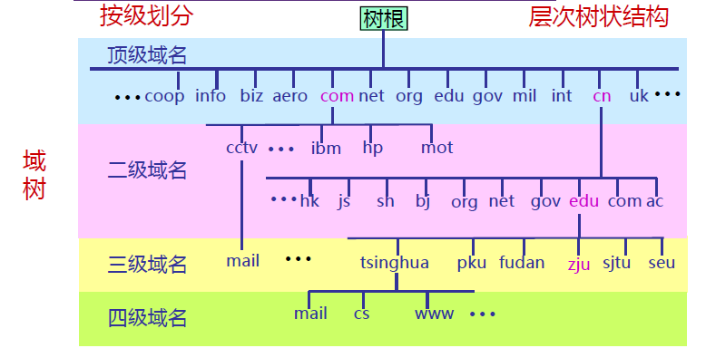

1. 顶级域名：

- 国家或地区顶级域nTLD（ccTLD），例如：.cn表示中国，.uk表示英国等（目前有300多个）
- 基础设施域`.arpa`(address and routing parameter area)：专用于Internet基础设施目的
- 通用顶级域名gTLD：如`.com`、`.org`、`.net`、`.edu`

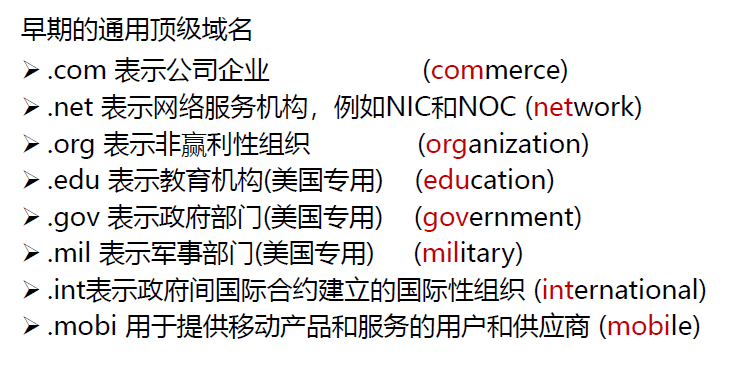

2. 二级域名：

（在.cn下的二级域名有：）

- 类别域名7个：
    - .edu.cn
    - .gov.cn
    - .org.cn
    - .mil.cn
    - .com.cn
    - .net.cn
    - .ac.cn
- 行政区域名34个（省、直辖市等）
- 无类别域名（www.baidu.com等）

分级负责域名的注册（例如：二级域名由国家自行决定，三级域名由二级域名所属机构负责，以此类推）

#### 7.2.2 域名服务器

域名服务器（名字服务器）保存域树（domain tree），负责域名解析工作

- 域名与IP地址可以是一对一、一对多、多对一的关系

同时，域名服务器系统也按照域名层次树状安排，每个名字服务器管辖一部分域

- 一个名字服务器所负责的范围称为管辖区（zone）（而不是以域为单位）
- 管辖区可以小于等于域，但不可能大于域

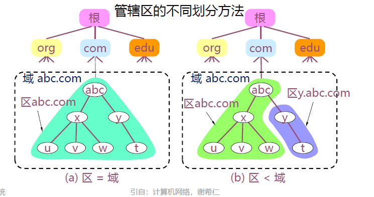

域名服务器的类别：

- 权威名字服务器（authoritative name server）：无需查询其他服务器
    - 每个DNS区至少要有一个IPv4可访问的权威名字服务器提供服务
- 递归解析器（recursive resolver）：以递归方式运行的，使用户程序联系域名字服务器的程序

进一步，权威名字服务器的类别由对应域层次划分：

- 根名字服务器（root name server）/根服务器（root server）
- 顶级域名字服务器（TLD name server）
- 二级域名字服务器（second-level domain name server）
- ...
- 三级域以下的名字服务器（例如zju.edu.cn）通常在用户本地区域，因此三级域以下的名字服务器统称为 **本地域名服务器** 

根服务器：

- 根服务器使特定的任意播（anycast）实例，回答关于根区域内容查询的权威名字服务器
- 每个根服务器直到所有顶级域名服务器的域名及IP地址
- 路由器把查询转发到距离递归服务器最近的一个根服务器(采用了任意播技术)，提高了查询效率
-  **根服务器并不直接把主机用户所查的域名转换成IP地址** 

根服务器一共有13套（不是13台）：相应的域名分别为：`a.rootservers.net - m.rootservers.net`

更改根服务器数据只在`a.rrotservers.net`上进行，然后同步到另外12套中。

对于每套根服务器，又具备多个镜像（mirrored）根服务器，内容定期与上述对应的根服务器进行同步，来减少用户域名解析请求的时延。

二级域名字服务器：

- 各个单位根据自己的具体情况把本单位的域名划为若干个域名管辖区(zone)，也可简称为区
- 每个区设置相应的权威名字服务器，用来保存该区中的所有主机的
域名到IP地址的映射
- 一般来说，每个名字服务器只负责解析本辖域的域名

#### 7.2.3 域名解析过程

当某一进程需要域名解析时：

- 应用进程将域名放在DNS请求报文（UDP数据报， **端口号为53** ）发给递归服务器；递归服务器得到查询结果后，将对应IP地址放在应答报文中返回给应用进程
- 域名查询有
    - 递归查询（recursive query）：一般在主机向递归解析器/本地域名字服务器的查询中使用
    - 迭代查询（iterative query）：一般在本地域名服务器向根服务器的查询中使用

递归查询：由下一步应查询的域名服务器来回应查询请求，直到查询到最终的IP地址（即替递归服务器继续查询），较少使用

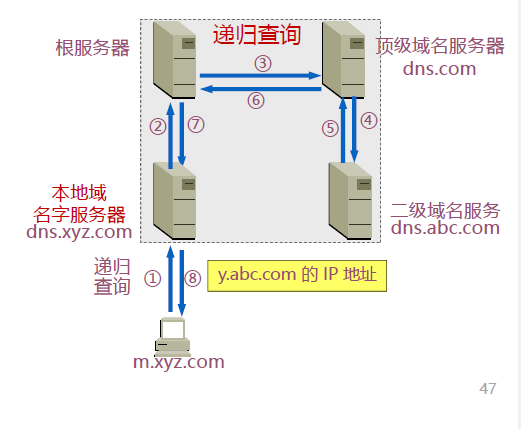

迭代查询：由本地域名服务器向根服务器查询，收到下一级域名字服务器后再向下一级服务器查询，直到查询到最终的IP地址，较多使用

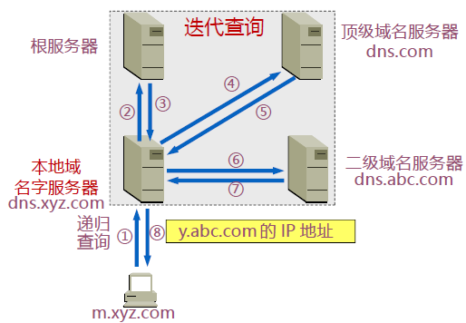

#### 7.2.4 域名系统查询和响应

域名系统的资源（resouce）具备不同的类型，用于表示数据的内容类型。

- SOA：权威记录的起始，指定有关DNS区域的权威性信息，包含主要名字服务器、域名管理员的电邮地址、域名的流水式编号、和几个有关刷新区域的定时器
- A:IPv4地址记录，用于将域名映射到IPv4地址
- AAAA:IPv6地址记录，用于将域名映射到IPv6地址
- ...

DNS报文格式：

- 分为三部分：基础结构(报文首部)、问题、资源记录(RR, Resource Record)
- 报文类型分为查询请求(query)和查询响应(reply)两类，请求和响应的报文结构基本相同

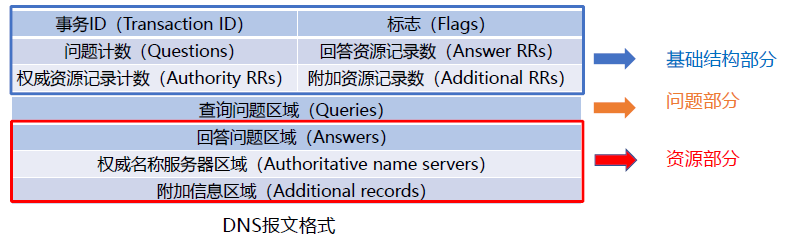

其中，资源记录的格式（RR）由下面组成：

- 域名：DNS请求的域名
- 类型：资源记录的类型
- 类：地址类型（一般为IN）
- 生存时间：以秒为单位，表示资源记录的生命周期，一般用于当地址解析程序取出资源记录后决定保存及使用缓存数据的时间。它同时也可以表明该资源记录的稳定程度，稳定的信息会被分配一个很大的值
- 资源数据长度
- 资源数据：表示按查询段要求返回的相关资源记录的数据

#### 7.2.5 域名系统的安全性

DNSSEC：依靠 **数字签名** 保证DNS应答报文的真实性和完整性。

#### 7.2.6 域名系统高速缓存

域名服务器广泛使用高速缓存，用来存放最近查询过的域名以及从何处获得域名映射信息的记录

好处：

- 减轻根域名服务器的负荷
- 减少DNS相关报文的数量

> 主机一般也缓存域名有关信息

#### 7.2.7 域名系统的隐私

DNS几乎都基于UDP明文传输，同时资源记录没有加上任何认证和加密措施

- 通信链路窃听
- 服务器收集用户信息

### 7.3 电子邮件

#### 7.3.1 电子邮件系统体系结构

- 用户代理（user agent）：邮件客户端
    - 编辑/发送邮件
    - 接收/读取/管理文件
    - 无统一标准
- 传输代理（message transfer agent）：邮件服务器
    - 邮箱：保存用户收到的邮件
        - 邮箱是邮件服务器中的一块内存区域，其标识即为电子邮件地址（邮箱名）
    - 邮件输出队列：存储等待发送的邮件
    - 运行电子邮件协议
- 简单邮件传输协议SMTP（Simple Mail Transfer Protocol）：邮件服务器之间传递邮件使用的协议
    - smtp客户: 发送邮件端
    - smtp服务器: 接收邮件端

#### 7.3.2 SMTP

SMTP利用TCP传递邮件， **端口为25** 。

SMTP采用直接投递的方式，直接从发送端到接收段。

SMTP的三个阶段：

- 连接建立
- 邮件传送
- 连接关闭
- 命令/响应（以HTTP为例）
    - 命令: ASCII字符串
    - 响应: 状态码+短语
- SMTP是一个简单的ASCII协议，邮件必须为7位ASCII

SMTP的不足

- 不包括认证（可以发邮件到任何人）
- 传输ASCII而不是二进制数据
- 邮件以明文形式出现（无加密功能）

#### 7.3.3 邮件格式

邮件格式为：

- RFC 5322
- MIME

- Header：包含一个From和一个To
    - 可选：包含Subject（主题）
- body：邮件正文

MIME加入了消息体结构，采用更多的编码方案，从而不再局限于7位ASCII码的限制。

#### 7.3.4 最后传递

在邮件发送到邮箱后，需要将邮件的一个副本传送到Bob的用户代理来显示。

最终交付协议：

- POP3
- IMAP
- webmail（HTTP）

注：不能使用SMTP协议进行邮件的读取（因为SMTP是一个推协议，不负责对其中的内容进行反解）

1. POP3： **端口为110** 

- 认证（authorization）：用户登录
- 事务处理（transaction processing）：用户对邮件进行操作
- 更新（update）：实际更新邮箱的状态

2. IMAP：

是POP3的改进版，运行在 **端口为143** 的IMAP服务器

通过将每个邮件与一个文件夹进行联系，从而增加更多的使用功能（例如远程文件夹查询邮件等）

3. webmail

提供电子邮件服务的IMAP和SMTP替代方案

使用web作为界面，直接通过HTTP进行用户和远程邮箱的通信

### 7.4 WWW

#### 7.4.1 WWW体系结构与协议

主要通过HTTP协议进行传输

服务器：

- Web页面（HTML文档）：包含到多种对象或连接
- Web对象（包括静态对象和动态对象）：可以是HTML文档、图像文件、视频文件、声音文件、脚本文件等
    - 对象用URL（统一资源定位符）来编址（协议类型://主机名:端口//路径和文件名）

客户端：

- 发出请求、接收响应、解释HTML文档并显示
- 有些对象需要浏览器安装插件

URL（uniform resource locators）：统一资源定位符

协议类型：

- http：超文本传输协议
- https：安全超文本传输协议
- ftp：文件传输协议
- file：本地文件系统协议
- mailto：电子邮件地址
- rtsp：流媒体
- sip：多媒体呼叫

URI（uniform resource identifier）：统一资源标识符

所有的URL都是URI，但有的时候并不需要完整的URL，因此通过URI来刻画。

#### 7.4.2 静态Web

Web对象分为：

- 静态对象与静态网页：
    - 文本，表格，图片，图像和视频等多媒体类型的信息（实现语言：标记语言，如：HTML，XML，PHP等）
    - 字体、颜色和布局等风格类型的信息（实现语言：层叠样式表CSS）
- 动态对象与动态网页：
    - 交互信息，比如，用户注册信息、登录信息等（实现：PHP/JSP等语言+MySQL等数据库）
- 连接：
    - 超链接（HyperLinks）

HTML与XML：

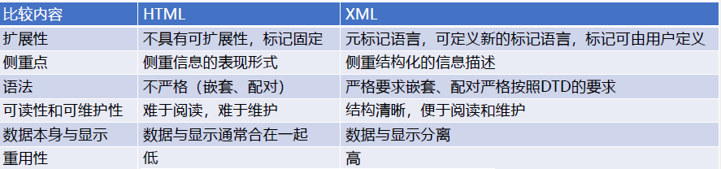

CSS(cascading style sheets): 层叠样式表，通过对标签设置样式，实现网页的美化。

#### 7.4.3 动态Web

动态Web的目的：实现网络交互

动态Web的举例：

- 通用网关接口CGI（\*.cgi）
- 脚本语言+数据库技术（\*.php, \*.jsp, \*.asp等）
- 客户端动态网页（\*.js）

1. CGI（common gateway interface）：一种标准

它是一种直接运行在服务器端的程序

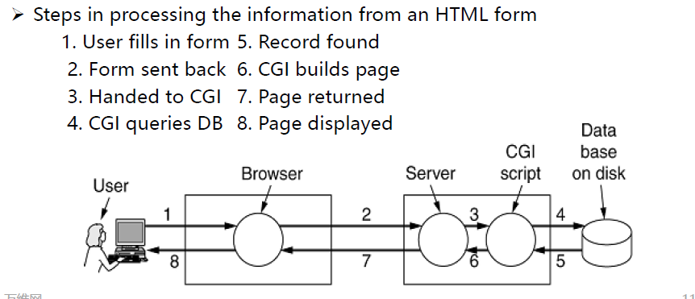

2. 脚本语言+数据库技术：

脚本指的是一个程序，它被另一个程序（即解释程序，如Web浏览器）解释执行，而不是由计算机的处理器来解释或执行

- PHP
- JSP: 动态部分用java语言编写
- ASP.NET: Microsoft's version of PHP and JSP.

PHP（hypertext preprocessor）：

例如：

```php
<html>
<body>
<form action="process.php" method="post">
</form>
</body>
</html>

---

// process.php:

<html>
<body>
<h1>Reply: </h1>
Hello <?php echo $name;?>.
</body>
</html>
```

这样，调用action时，通过PHP就可以转到目标的HTML页面。

3. 客户端动态网页：

某些验证（例如邮箱合法性验证、简单的加减乘除运算等）可以直接由客户端进行处理，而无需向服务器发送请求。

这就是一种客户端动态网页（client-side dynamic web page）

Javascript：

通过在\<head\>标签中进行script编写（例如函数等），再在body中进行调用。

 **对比：PHP在服务器端，JS在客户端** 

典型的动态web技术：AJAX（asynchronous javascript and XML）

> AJAX不是一种新的编程语言，而是一种使用现有标准的新方法

- HTML+CSS
- 文档对象模型 DOM(Document Object Model): 是页面的API，允许程序读取和操作页面的内容、结构和样式， **采用树形结构组织** 。
- 扩展标记语言 XML（extensible markup language）：用于程序与服务器交换应用数据
- 异步工作方式
- JS：将以上功能进行组合，并协同工作

总结：

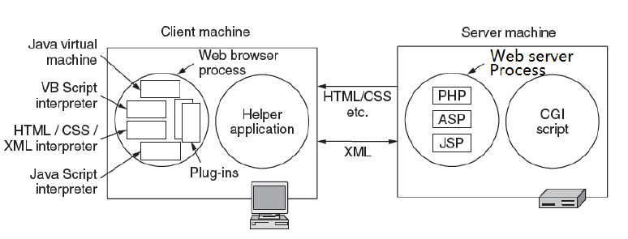

#### 7.4.4 HTTP

HTTP(hypertext transfer protocol): 超文本传输协议，通常使用TCP协议，缺省使用TCP的 **80** 端口。

HTTP为 **无状态协议** （stateless protocol），服务器不保留之前的请求状态信息

- 无状态协议：效率低、但简单
- 有状态协议：维护状态相对复杂，需要维护历史信息，在客户端或服务器出现故障时，需要保持状态的一致性等

HTTP标准：

- HTTP/1.0: 无状态，非持久连接
- HTTP/1.1: 支持长连接和流水线机制；缓存策略优化，部分资源请求及断点续传
- HTTPS: HTTP+TLS, 增加SSL/TLS层，在TCP之上提供安全机制
- HTTP/2: 提高带宽利用率，降低延迟；增加二进制格式，TCP多路复用、头压缩、服务端推送等功能

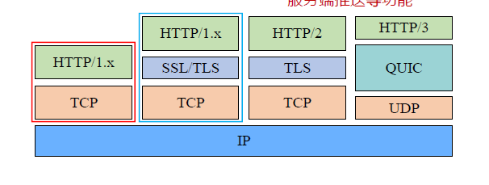

1. HTTP/1.0:缺省为非持久连接

假设用户输入一个URL：

如果该页面包含2幅jpg图像（注意：页面中嵌入的图像、视频等事实上是一个超链接）

- 客户端需要执行三次完整的连接过程（包含三次TCP过程）来进行jpg图像的逐一请求与拉取。

2. HTTP/1.1:缺省为持久连接

如果某些jpg图像事实上在同一个服务器上，那么可以通过保持TCP连接来避免多次建立连接的问题。

同时，HTTP/1.1加入流水线机制

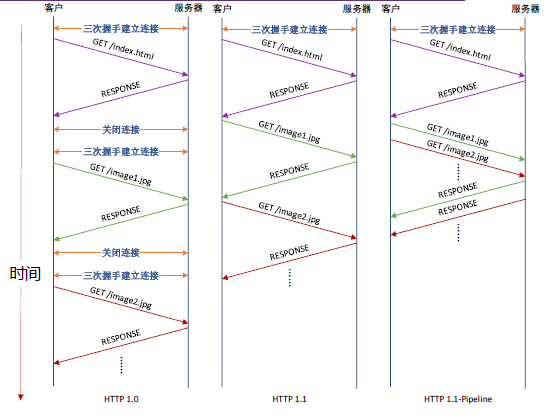

举例：假设一个HTML中有三个小的对象，在同一个服务器上。假设服务器端和客户端间的往返时延（RTT）为RTT：

- 非持久连接，串行请求
    - 2 + 2 + 2 + 2 = 8RTT
- 持久连接，串行请求
    - 2 + 1 + 1 + 1 = 5RTT
- 持久连接，流水线请求
    - 2 + 1 = 3RTT

> 第一个2代表第一次获取index.html的过程，包括TCP建立连接。  
> 暂时不考虑关闭连接占用的时间（在非持久连接中）

HTTP报文结构：

1. 请求报文

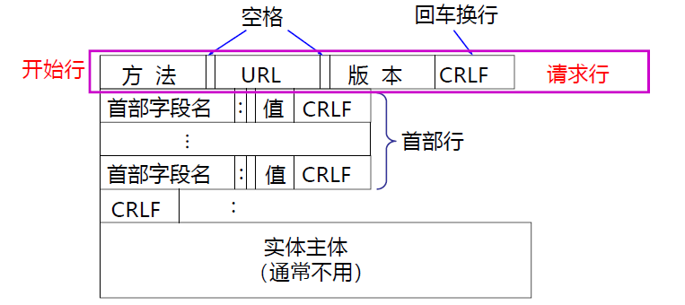

常见的方法：

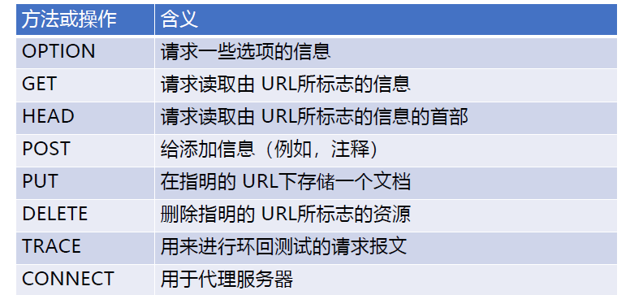

2. 响应报文

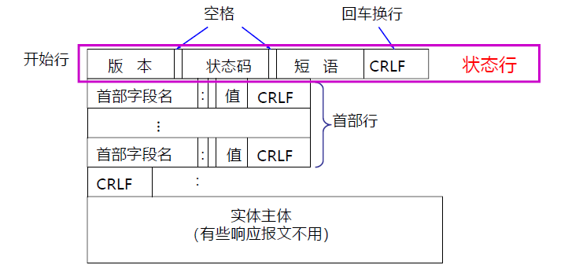

状态码：

- 1xx: 正在处理
- 2xx: 成功
- 3xx: 重定向
- 4xx: 客户端错误
- 5xx: 服务器错误

#### 7.4.5 Web缓存技术与Web代理

1. 浏览器缓存：

在浏览器主机保存用户访问过的服务器web页副本；那么在再次访问时不必从服务器再次传输，提高访问效率

问题：如何检查缓存是否过期？

- 向服务器发送一个条件GET：
    - 如果内容过期，那么返回最新的页面
    - 如果内容未过期，则返回未改变的信号

2. Web代理服务器缓存：

ISP安装web代理缓存服务器，保存ISP客户访问过的服务器web页副本

副本可以供ISP的所有客户进行访问，提高访问服务器的web页效率

出现服务器请求时延的主要问题在于：虽然机构网络的传输速度很快，但是接入公共互联网的链路带宽和公共互联网的传输速度是有限的。

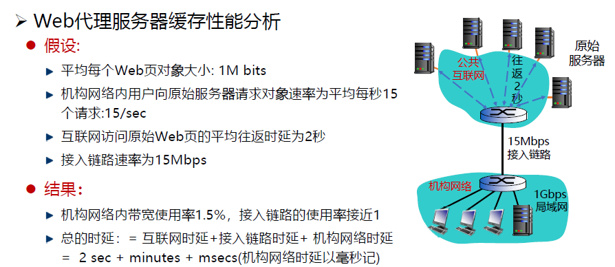

因此，通过在机构网络内部部署一个本地web缓存代理，那么在缓存命中的情况下，只需要在机构网络中进行快速的传输就可以实现请求的处理。

仍然存在的问题：难以判断缓存web的一致性。

- 1. 启发式策略：采用last-modified和expires头，主动判断是否可能过期（但很少使用）
- 2. 询问式策略：通过特殊的关键字头询问原始服务器是否更新了web（利用if-modified-since头；服务器会根据情况返回：304 not modified或更新的页面）

在询问式策略中，使用HEAD请求头，这样就避免了当不需要更新内容时，服务器传输所有的内容，只需要返回头（304状态码）即可完成数据同步。

#### 7.4.6 Web安全与隐私

某些web只希望提供给某些特定用户访问：

- 常规HTTP请求方法：包含关键字authorization进行身份验证，如果请求头中没有authorization，则服务器拒绝访问并在响应头包含`WWW authenticate:`
- cookie

cookie:

- HTTP在响应的首部行中加入关键字头`set-cookie`，其中cookie号具有唯一性
- 后续用户在发送HTTP请求时，必须携带服务器响应分配的cookie
- Cookie文件保存在用户的主机中，内容是服务器返回的一些附加信息，由用户主机中的浏览器管理
- Web服务器建立后端数据库，记录用户信息，cookie作为关键字

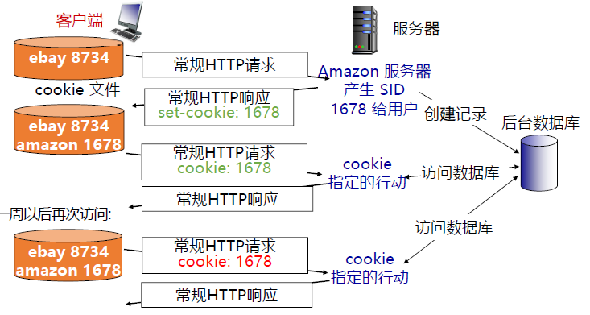

cookie一般包含5个字段：

- 域：指明cookie来自哪里，每个域为每个客户分配cookie有数量限制
- 路径：服务器的文件树中哪些部分可以使用cookie
- 内容：采用 **名字=值** 的形式
- 过期时间
- 安全：如果cookie设置了安全属性（secure），那么它只能够在HTTPS连接中使用

> HTTPS就是安全传输连接

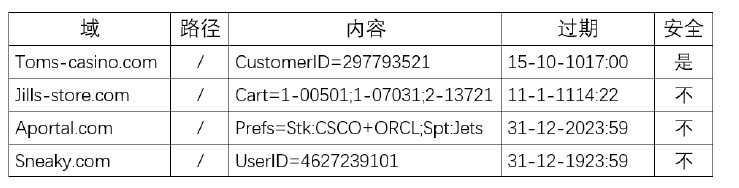

然而，基于cookie的内容字段，会产生很多安全隐患问题（例如可以通过cookie的内容字段分析用户在不同网站中的查询信息等）

- 但是，内容字段只作为一个字符串进行保存，而不存在可执行程序。因此cookie不会从 **植入程序** 方面带来安全隐患。

### 7.5 流式音频和视频

#### 7.5.1 流媒体概述

常见的流媒体：

- 点播：提前录制好，边下载边播放
- 直播：边录制边上传，边下载边播放
- 实时交互：双方或多方实时交互式通信

流媒体概念：连续媒体（音视频）经压缩编码、数据打包后，经过网络发送给接收方；接收方对数据进行重组、解码和播放

流媒体的特性：

- 端到端时延约束
- 时序性约束：流媒体数
- 据必须按照一定的顺序连续播放
- 具有一定程度的容错性：丢失部分数据包也可完成基本功能

流媒体面临的挑战：

- 约束条件：网络特性（带宽有限、动态变化、延迟与抖动、丢失、异构性）
- 目标：流媒体服务质量要素（画质、启动延迟、平滑、交互性）
- 如何在“尽力服务”的网络传输条件下获得良好的视频质量？

#### 7.5.2 数字音视频与编码

MPEG视频压缩方法：

- 摄像机固定不变，演员慢慢走来走去：通过从前一帧减去后一帧得到差分帧，再对差分帧进行编码得到编码帧

MPEG的输出：

- 帧内编码帧（I帧）：包含了压缩的静止图片（帧内编码，用JPEG来压缩静止图像）
- 预测帧（P帧）：是与前一帧的逐块差值（帧间编码，消除跨帧的冗余度）
- 双向帧（B帧）：是与前一帧和后一帧的逐块差值（帧间编码）

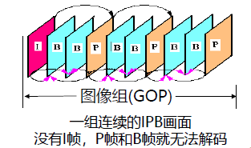

I帧必须周期性地出现在媒体流中

- 流媒体直播中，后加入的观众需要收到I帧才能成功解码
- 如果任意一帧发生了接收错误，则后续非I帧无法解码（由于B/P帧依赖损坏的帧）
- 快进或者回退到某位置时，解码器需要从该位置前面的I帧开始计算

#### 7.5.3 流式存储媒体

问题：由于网络传输是通过分组传输，以及网络传输的抖动特性，因此会出现传输到达的帧并不能够完全以恒定速率播放的问题。

因此，设计客户端缓冲区的方法：

- 客户端播放的是本地缓冲区的内容，而不是立即播放来自网络的实时内容
- 缓冲区内容小于低阈值标记：数据即将播完，容易出现卡顿；需要加速传输
- 缓冲区内容大于高阈值标记：增大播放时延，占用存储空间；可以减慢传输
- 需要的决策：需要多大缓存，服务器以多快速率发送，才能在不稳定的网络中，尽量满足
用户期望：高清、低延迟、不卡顿
- 上述决策需要特定网络协议支持

#### 7.5.4 直播与实时音视频

实时音频/视频所需要的几种应用协议
- 一种是信令协议，对建立的连接起控制作用，如RTSP
- 一种是数据分组传送协议，使音/视频能够以时延敏感属性传送，如RTP/RTCP

实时流式协议RTSP (Real-Time Streaming Protocol)

- RTSP本身并不传送数据，是一个多媒体播放控制协议
- RTSP对用户下载的实时数据的播放情况进行控制，如：暂停/继续、后退、前进等。又称为“互联网录像机遥控协议”
- RTSP 是有状态的协议，它记录用户所处于的状态（初始化状态、播放状态或暂停状态）
- RTSP 控制分组既可在TCP 上传送，也可在UDP 上传送
- RTSP 没有定义音频/视频的压缩方案，也没有规定音频/视频在网络中传送时应如何封装在分组中
- RTSP 协议本身没有规定音频/视频流在媒体播放器中应如何缓存，由协议的具体实现（和算法）负责

实时传输协议RTP (Real-time Transport Protocol)

- RTP 为实时应用提供端到端的数据传输，但不提供任何服务质量的保证
- RTP 是一个协议框架，只包含了实时应用的一些共同的功能
- RTP 不对多媒体数据块做任何处理，而只是向应用层提供一些附加的信息，让应用层知道
应当如何进行处理

实时传输控制协议RTCP (RTP Control Protocol)

- RTCP 是与RTP 配合使用的控制协议
- RTCP 的主要功能：服务质量的监视与反馈、媒体间的同步、播组中成员的标识
- RTCP 分组也使用UDP 传送，但RTCP 并不对声音或视像分组进行封装
- 可将多个RTCP 分组封装在一个UDP 用户数据报中
- RTCP 分组周期性地在网上传送，它带有发送端和接收端对服务质量的统计信息报告

WebRTC协议栈

- 为了满足实时性需求，其核心协议是在右侧基于UDP 基础上搭建起来的
- Secure RTP（SRTP）与Secure RTCP（SRTCP） 是对媒体数据的封装与传输控制协议
- RTCPeerConnection 用来建立和维护端到端连接，提供高效的音视频流传输
- RTCDataChannel 用来支持端到端的任意二进制数据传输
- 流控制传输协议SCTP，提供类似TCP 的特性
- DTLS 对传输内容进行加密，是UDP 版TLS
- ICE、STUN、TURN 用于内网穿透，应对NAT等私有地址转换的问题

#### 7.5.5 流媒体动态自适应传输

问题：客户端可以基于当前网络状况的优劣，向服务器请求视频块，希望视频块的码率能够尽可能靠近可用带宽。

方法：DASH (Dynamic Adaptive Streaming over HTTP)

- 动态自适应流媒体传输协议DASH，由MPEG组织制定的标准
- 类似协议：苹果HTTP Live Streaming（HLS）； Adobe的HTTP Dynamic Streaming（HDS）；微软的Microsoft Smooth Streaming

基本思想：

- 完整视频被拆分为固定时长(2s-10s) 的视频片段(segment)， 每段提供不同码率
- 视频片段与其对应的元文件（URL）一同存放于DASH服务器
- 客户端基于网络条件、缓冲大小等，对每个视频片段，自适应选择合适的视频码率来下载

DASH普遍使用自适应码率ABR（adaptive bitrate）

### 7.6 内容分发

#### 7.6.1 内容和Internet流量

当前Internet流量的特点为：

- 震撼般地转变(email-FTP-Web-P2P-video)
- 大量站点有很少的流量

问题：如何将大量的、分散的视频内容分发给不同的用户

方法：服务器群和web代理

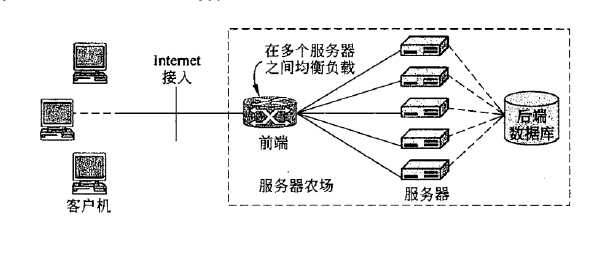

对于这样的方式，使用单个、大型的“服务器”，可能出现的问题：

- 单点故障
- 网络拥塞
- 远程用户的长路径

因此，它的可扩展性较差

CDN（Content Delivery Network）：将内容进行副本复制，将服务器分布在不同的区域，用户请求时只需要访问最近的服务器即可。

优点：

- 降低响应时延，避免网络拥塞
- 避免原始服务器过载及防止DDoS攻击
- 分布式架构，具有良好的可扩展性
- 对用户透明，无需用户感知

CDN服务提供

- CDN服务提供商：Akamai、蓝讯、世纪互联、网宿等
- 互联网内容提供商（ICP）：腾讯、百度等
- 互联网服务提供商（ISP）：移动、联通、电信等

关键问题

- CDN服务器如何布局
- 在哪里缓存、缓存哪些内容
- 如何进行重定向，将请求调度到较近或负载较轻的CDN服务器

可以通过DNS辅助实现CDN

---

P2P网络实现内容分发

协议：BitTorrent

- 文件被划分为256Kb大小的块
- 具有种子(torrents)的节点发送或接收文件

核心技术：分布式哈希表（distributed hash table, DHT）

### 7.7 其他应用层协议

#### 7.7.1 Telnet

Telnet的目的为远程登录。

- 使用C/S方式
- 使用TCP通信，默认监听 **23** 端口

Telnet引入网络虚拟终端NVT（network virtual terminal）；NVT是Telnet协议定义的一组通用字符集，通过这种统一的数据表示方式，来保证不同硬件、软件与数据格式的终端与主机之间通信的兼容性

#### 7.7.2 文件传输协议FTP

FTP的目的为传输文件。

- 使用C/S方式
- 使用TCP通信，默认监听 **21** 端口
- 数据传输进程监听 **20** 端口

FTP在客户请求到来时，服务器主进程会启动 **从属进程** 来处理客户进程发来的请求。

FTP的两个端口与两个连接

- 控制连接在整个会话期间一直保持，客户进程发出的文件传输请求通过控制连接发送给服务器控制进程（工作在TCP21端口），但控制连接不用来传输文件
- 服务器控制进程在接收到客户进程发送来的文件传输请求后就创建数据传输进程（工作在TCP20端口）和数据连接
- 数据连接用来连接客户进程和服务器数据传输进程，实际完成文件的传输。服务器数据传输进程在文件传输完毕后关闭数据连接并结束运行

简单文件传输协议TFTP（trivial file transfer protocol）

- 使用C/S方式和UDP协议实现，监听 **69** 端口
- 只支持文件传输而不支持交互
- 没有庞大的命令集，没有列目录的功能，
也不能对用户进行身份鉴别
- 支持ASCII 码或二进制传送
- 支持对文件进行读或写
- 使用很简单的首部
- 工作方式类似停等式协议

#### 7.7.3 SNMP

SNMP的目的为：网络管理

- 配置管理（Configuration Management）
- 故障管理（Fault Management）
- 性能管理（Performance Management）
- 计费管理（Accounting Management）
- 安全管理（Security Management）

SNMP使用UDP协议，简化设计并降低通信开销

- 代理运行服务器在UDP **161** 端口
- 管理器运行客户端进程在UDP **162** 端口