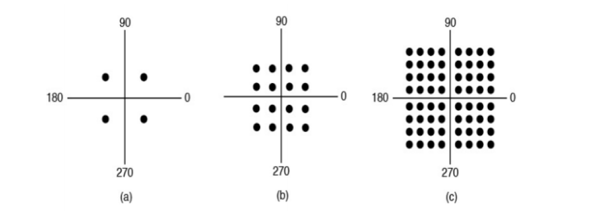
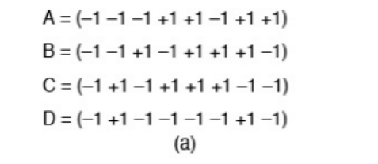

### Homework-2

### Name: Wang Haoyuan

### Number: 3220105114

#### Problem 1

“Fast” Ethernet operates 10x faster (100Mbps) than regular ethernet. Explain why the following changes were made. 

(a) Encoding changed to 4B/5B. 

(b) CAT-5 cable has more twists.

**Answer:**

To achieve the speed of Fast Ethernet(100Mbps), we need to change the encoding method and the cable type.

(a): The normal Ethernet uses Manchester encoding. Although it is simple, but every bit needs two changes of state. That will decrease the efficiency of the transmission. If we use 4B/5B encoding, although the bits need to be transmitted increase from 4 to 5, but the efficiency will be increased, because it  ensures that more data can be transmitted without increasing the signal rate significantly.

(b): In the fast ethernet, we use a CAT-5 cable, which has more twists. More twists can reduce the crosstalk effect and EMI. So it can improve the signal integrity. Because more twists can reduce the noise and decrease the loss in the transmission, so it can support the higher data rate.

#### Problem 2

If a binary signal is sent over a 3-kHz channel whose signal-to noise radio is 20dB, what is the maximum achievable data rate?

**Answer:**

with the shannon theorem:

$$
data~rate=Wlog_2(1+\frac{S}{N})
$$

where $W=3000$, $\frac{S}{N}=10^{\frac{20}{10}}=100$. So the answer is:

$$
data~rate=3000log_2(1+100) = 3000log_2101 ≈ 19974.63bps
$$

with the nyquist theorem:

$$
data~rate=2Wlog_2V = 2 \times 3000 \times log_22 = 6000bps
$$

We need to choose the smaller value between the two.

So the answer is: **6000bps** (or **6kbps**).

#### Problem 3

What are the advantages of fiber optics over copper as a transmission medium? Is there any downside of using fiber optics over copper?

**Answer:**

**Advantages:**

1. Higher Bandwidth: Fiber optic cables can carry higher data rates than copper cables. It has greater capacity and transmits data at a higher speed.
2. Longer Transmission Distance: Fiber optic cables can transmit data over a long distance without much signal loss compared to copper. That allows fiber optics to complete longer transmission.
3. Lightweight: Fiber optic cables are lightweight and can be used in small devices, while the meterial of copper decides that it is bulky and heavy.

**downsides:**

1. Less flexibility: Fiber optic cables cannot be bent or twisted easily, due to its optical properties. Therefore, it is not suitable for applications that require precise alignment.
2. Complexity: the technology of fiber optics is more complex than that of copper, which makes it more difficult to manufacture and install.
3. Higher initial costs: the initial cost of fiber optic cables(such as connectors and optical transceivers) is higher than that of copper cables.

#### Problem 4

Is the Nyquist theorem true for high-quality single-mode optical fiber or only for copper wire?

**Answer:**

**Yes, it is true for high-quality single-mode optical fiber.**

The Nyquist theorem relates to the maximum data rate that can be transmitted over a noiseless channel. Although the material and structure of optical fiber and copper wire are different, they both satisfy the Nyquist theorem. Especially for high-quality single-mode optical fiber, it has higher bandwidth and lower noise compared to copper wire. Therefore, the Nyquist theorem is true for high-quality single-mode optical fiber.

#### Problem 5

What is the minimum bandwidth needed to achieve a data rate of B bits/sec if the signal is transmitted using NRZ and Manchester encoding? Explain your answer.

**Answer:**

We can use the Nyquist theorem to calculate the minimum bandwidth(W) needed to achieve a data rate of B bits/sec:

$$
B=2Wlog_2V
$$

1. for NRZ encoding, its encoding method is that transport exactly what is needed, so it only has two states: 0 and 1. Therefore, $V=2$, so we have:

$$
W_1 = \frac{B}{2log_2(2)} = \frac{B}{2}
$$

2. for Manchester encoding, its encoding method is that when one bit starts and the middle of the bit, the signal changes. So there might be four possibilities in one bit(start position: 0/1; middle position: change/no change). Therefore: $V=2$, and the required bandwidth is twice the bandwidth calculated by Nyquist theorem, so we have:

$$
W_2 = 2\frac{B}{2log_2(2)} = B
$$

#### Problem 6

Is an oil pipeline a simplex system, a half-duplex system, a fullduplex system, or none of the above? What about a river or a walkietalkie-style communication?

**Answer:**

We know the features of these three types of communication systems:

1. simplex system: one-way communication, only one direction of data flow.
2. half-duplex system: two-way communication, but cannot send and receive message at the same time.
3. duplex system: two-way communication, is able to send and receive message at the same time.

For the oil pipeline, it is a **half-duplex system**. Oil can only be sent to either direction using the oil pipeline. However, it cna only be transmitted to one direction at the same time.

For the river, it is a **simplex system**. River can only flow in one direction, from the upper bank to the lower bank.

For the walkietalkie-style communication, it is a **half-duplex system**. Users can send messages to each other, but when one user sends a message, the other user must wait until the user ends to send the message.

#### Problem 7

A modem constellation diagram similar to Fig. 2-23 has data points at the following coordinates: (1,1), (1,-1), (-1,1), (-1,-1). How many bps can a modem with these parameters achieve at 1200 symbols/sec?

**Answer:**

We know there are four corrdinates in the diragram, so it is a 4QAM modulation scheme. That means, every point stands for 2-bit information. So the rate is $1200 \times 2 = 2400bps$. So the answer is: **2400bps can a modem with these parameters achieve at 1200 symbols/sec.**

#### Problem 8

What is the difference, if any, between the demodulator part of a modem and the coder part of codec? (After all, both convert analog signals to digital ones.)

**Answer:**

1. From the **function**: the demodulator targets at recovering the original digital signal from the received analog signal to receive the data. But the codec targets at encoding the analog signal(such as video or audio) into a digital signal, for the purpose of transmission or storage.
2. From the **processing**: the demodulator concentrates on the quality of the received signal, clearing the noise and synchronization. While the codec concentrates on the data compression and error correction.

#### Problem 9

What is the available user bandwidth in an OC-12c connection?

**Answer:**

For OC-12c, the whole columns are:$12 \times 90 = 1080$ for 9 rows. And there are $12 \times 3 = 36$ columns used for line and section overhead. So $1080 - 36 = 1044$ columns are available for user data.

One column is used for the path overhead, so the user data bits transmitted by every frame is:

$$
(1044 - 1) \times 9 \times 8 = 75096 bits
$$

With 8000 frames/sec, so the bandwidth is:

$$
75096 \times 8000 = 600.768 Mbps
$$

#### Problem 10

Suppose that A, B, and C are simultaneously transmitting 0 bits, using a CDMA system with the chip sequences of Fig. 2-28(a). What is the resulting chip sequence?

**Answer:**

If one user transmit 0 bits, then it needs to transfer the convert code of its code clip. So:

A transfer: (+1 +1 +1 -1 -1 +1 -1 -1)

B transfer: (+1 +1 -1 +1 -1 -1 -1 +1)

C transfer: (+1 -1 +1 -1 -1 -1 +1 +1)

Add them together, so the answer is:

**(+3 +1 +1 -1 -3 -1 -1 +1)**