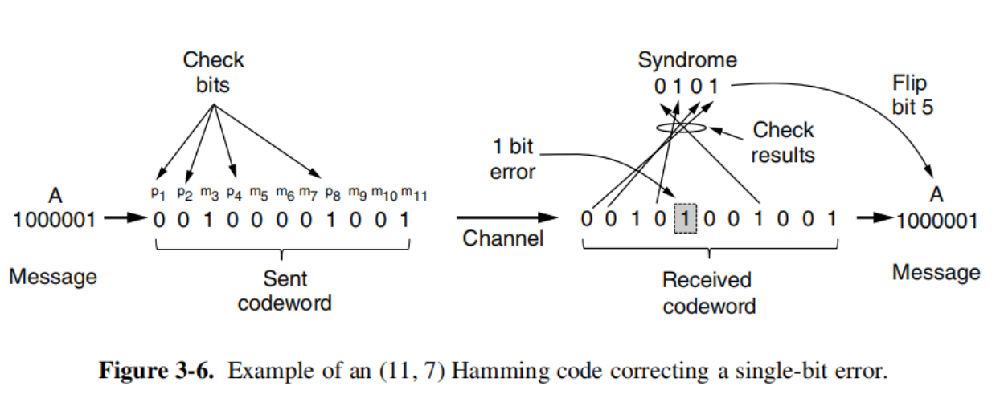

<center>Homework-3</center>

<center>Name: Wang Haoyuan</center>

<center>Number: 3220105114</center>

#### Problem 1

The following character encoding is used in a data link protocol:

A: 01000111 B: 11100011 FLAG: 01111110 ESC: 11100000

Show the bit sequence transmitted(in binary) for the four-character frame `A B ESC FLAG` when each of the following framing methods is used:

(a) Byte count.

(b) Flag bytes with byte stuffing.

(c) Starting and ending flag bytes with bit stuffing.

**Answer:**

(a) Byte count:

At the start of the frame, we put the number of bytes as the first byte.

So the first byte is 5, that is: `00000101`

So the answer is:

`00000101 01000111 11100011 11100000 01111110`

(b) Flag bytes with byte stuffing:

we put FLAG as the edge byte, and if the data contains FLAG or ESC, we stuff it with ESC.

So we have: `FLAG A B ESC ESC ESC FLAG FLAG`，So the answer is:

`01111110 01000111 11100011 11100000 11100000 11100000 01111110 01111110`

(c) Starting and ending flag bytes with bit stuffing:

the FLAG is `01111110`, and if there are 5 consecutive 1s in the data, we stuff it with a 0.

So the answer is:

`01111110 01000111 11 0 100011 111 0 00000 011111 0 10 01111110`

#### Problem 2

Hamming code is an effective way for error correcting. Show that the # of check bits(i.e. r) in the Hamming codes described in the textbook(e.g., Fig.3-6) (almost) achieves the low bound of Eq (3-1).



**Answer:**

we know that the equation is:

$$
(m + r + 1) \leq 2^r
$$

we suppose that the message length is $m$, then the number of check bits is:

$$
r = \lfloor log_2(m + r) \rfloor
$$

after coping with the equation above, we get the theoretical lower bound of $r$:

$$
r = \lfloor log_2(m + r + 1) \rfloor
$$

we can see that if $m + r > 1$, then the number of check bits is exactly the lower bound of $r$.

Thus, we get the answer.

and in practice, from the *Figure 3-6*, we know that: $m = 7, r = 4$

so the restriction of r is as below:

$$
(8 + r) \leq 2^r
$$

so we get:

$$
f(r) = 2^r - r \geq 8
$$

we analyze the value of $r$:

$$
f(r)' = 2^rln2 - 1
$$

so we get when $r > 2$, the function is increasing, and specially:

$$
f(3) = 2^3 - 3 = 5 < 8 \\
f(4) = 2^4 - 4 = 12 > 8 \\
$$

so we can see that the number of check bits is almost achieves the low bound of Eq (3-1).

#### Problem 3

Suppose you have the following 12-bit message: 010100111111

(a) Numbering bits from right to left (ie least-significant bit on the right), insert check bits according to to Hamming’s 1-bit error correction system. Indicate which bits are check bits and which are message bits.

(b) Hamming’s scheme only corrects 1-bit errors. Since it’ s a distance 3 code, it could also be used to detect 2-bit errors. Describe a 3-bit error (3 *1-bit errors) in the above codeword affecting only message bits (not check bits) that would be undetected (and of course uncorrected). Be sure to describe how and why the algorithm fails.

**Answer:**

(a): as for the Hamming's 1-bit error correction system, the 1st, 2nd, 4th, 8th... are the check bits.

So if we get a 12-bit message `010100111111`, the positions of check bits from right to left are:

0_1010011_111_1__

the final message is:

0**0**1010011**0**111**1**1**10**

(the bold numbers are the check bits, others are the message bits)

the answer is(from right to left):

 check bits: 1, 2, 4, 8, 16

message bits: 3, 5, 6, 9, 10, 11, 12, 13, 14, 15, 17

(b): according to the Hamming distance, if we want to detect $n$ bit errors, then we need a code with $n+1$ Hamming distance. So in theory, the algorithm fails to detect 3-bit errors.

In practice, we can simply set the 3rd, 5th, 6th bit to be reversed, which are all the message bits, so the error message is:

`00101001101001010`

we can check whether the hamming code can detect the error:

- 1st: 0, 0, 0, 1, 1, 0, 1, 1 -> 0
- 2nd: 1, 0, 0, 1, 1, 0, 0, 1 -> 0
- 4th: 1, 1, 0, 0, 0, 1, 0, 1 -> 0
- 8th: 1, 1, 0, 0, 1, 0, 1, 0 -> 0
- 16th: 0, 0 -> 0

so it fails to detect the error.

#### Problem 4

Consider an original frame 110111011011. The generator polynomial $x^4+x+1$, show the converted frame after appending the CRC.

**Answer:**

according to the polynomial, we have:

$G = 10011$

we divide `110111011011 0000` with `10011`

```
            110010000011
      |------------------
10011 | 1101110110110000
        10011
        -----
         10001
         10011
         -----
         00010011
            10011
            -----
                0011000
                  10011
                  -----
                   10110
                   10011
                   -----
                     101
```

so the converted frame is:

`1101110110110101`

#### Problem 5

A 3000-km-long T1 trunk (with data rate 1.536Mbps) is used to transmit 64-byte frames. How many bits should the sequence numbers be for protocol 5 and protocol 6 respectively? The propagation speed is 6usec/km.

**Answer:**

The propagation delay is:

$$
T_1 = 6 \times 3000 \times 10^3 usec = 18msec
$$

The trasmission time is:

$$
T_2 = \frac{64 \times 8}{1.536 \times 10^6} = 0.3 msec
$$

so the total RTT is:

$$
RTT = 2 \times T_1 = 36.3msec
$$

So in one RTT cycle, the total number of frames is:

$$
n = \frac{36.3msec + 0.3msec}{0.3 msec} = 121.00
$$

take the round up to 121.

For protocol 5, the receive window size is 1, so the sequence numbers needed are:

$$
b = \lceil log_2(n + 1) \rceil = \lceil log_2122 \rceil = 7
$$

For protocol 6, the receive window size is the same as the send window size(normally), so the sequence numbers needed are:

$$
b = \lceil log_2(n + n) \rceil = \lceil log_2242 \rceil = 8
$$

So the sequence numbers needed for protocol 5 and protocol 6 are 7 and 8 respectively.

#### Problem 6

Frames of 1000 bits are sent over a 1-Mbps channel using a geostationary satellite whose propagation time from the earth is 270 msec. Acknowledgements are always piggybacked onto data frames. The headers are very short. Three-bit sequence numbers are used.

What is the maximum achievable channel utilization for

(a) Stop-and-wait?

(b) Protocol 5?

(c) Protocol 6?

**Answer:**

(a) Stop-and-wait:

Based on given data, we can calculate the time of transmission:

$$
T_1 = \frac{1000 b}{10^6bps} = 1msec
$$

So the RTT is:

$$
RTT = 2 \times T_2 = 270 \times 2 = 540msec
$$

So for stop-and wait, the maximum achievable channel utilization is:

$$
U = \frac{T_1}{RTT + T_1} = 0.185\%
$$

(b) Protocol 5:

the sequence number is 3-bit, so the maximum sequence number is $2^3 - 1 = 7$.

So the maxinmum achievable channel utilization is:

$$
U = \frac{7 \times T_1}{RTT + T_1} = 1.294\%
$$

(c) Protocol 6:

the sequence number is 3-bit, so the maximum number of frames in one RTT cycle is $2^{3-1} = 4$.

So the maximum achievable channel utilization is:

$$
U = \frac{4 \times T_1}{RTT + T_1} = 0.739\%
$$
