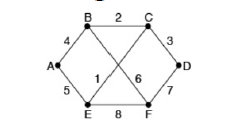
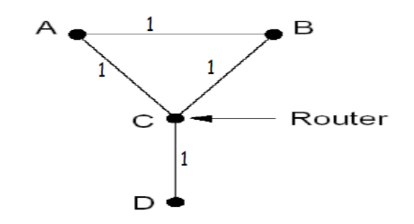

Homework 5

Name: Wang Haoyuan

Number: 3220105114

#### Problem 1

Give two example computer applications for which connection-oriented service is appropriate. Now give two examples for which connectionless service is best.

**Answer:**

1. For connection-oriented service: the applications need a reliable connection, such as **online gaming** or **web browsing**.
2. For connectionless service: the applications need to transfer data quickly, or the applications only transfer data once, such as **DNS service** or **streaming media**.

#### Problem 2

Consider the network of Fig. 5-12(a). Distance vector routing is used, and the following vectors have just come in to router C: from B: (5, 0, 8, 12, 6, 2); from D: (16, 12, 6, 0, 9, 10); and from E: (7, 6, 3, 9, 0, 4). The cost of the links from C to B, D, and E, are 6, 3, and 5, respectively. What is C’s new routing table? Give both the outgoing line to use and the cost.

**Answer:**

So we need to calculate the new routing table of C by its neighbors:

C to A:

- From B: 6 + 5 = 11
- From D: 3 + 16 = 19
- From E: 5 + 7 = 12

C to B:

- From B: 6 + 0 = 6
- From D: 3 + 12 = 15
- From E: 5 + 6 = 11

C to C: 0

C to D:

- From B: 6 + 12 = 18
- From D: 3 + 0 = 3
- From E: 5 + 9 = 14

C to E:

- From B: 6 + 6 = 12
- From D: 3 + 9 = 12
- From E: 5 + 0 = 5

C to F:

- From B: 6 + 2 = 8
- From D: 3 + 10 = 13
- From E: 5 + 4 = 9

So the new routing table of C is:

| Destination | Next hop | Cost |
| ----------- | -------- | ---- |
| A           | B        | 11   |
| B           | B        | 6    |
| C           | /        | 0    |
| D           | D        | 3    |
| E           | E        | 5    |
| F           | B        | 8    |

#### Problem 3

Please give an example in which the poisoned reverse technique cannot prevent the count-to-infinity problem and explain why.

**Answer:**

Consider the situation below:

since we just need to give an especially example, so we can set the status of message transformation(lost, or the time to arrive the router).

The scenario is as below:

- the link between C and D is broken, C will update its distance to D as infinity, and send the information to A and B.
- the information to B is lost, A get the information. A will know that the path A-C-D is infinity, so it will update the path as A-B-C-D(because now B doesn't update its DV), the distance from A to D will be 3. A send the information to B and C(because of the poison reverse, A will tell B, B to A is infinity).
- the information to B is lost, C get the information. Now C thinks that the distance from A to D is 3(whether the former distance from A to D is infinity or not), so C will record the path: C-A-B-C-D to D, then C will update the distance to D as 4. After that, C sends the information to A and B.
- B get the information first, B will still think the path B-C-D is available(because now B to A is infinity), so B will update its distance to D as 5.

After the situation above, the count-to-infinity problem has happened.

The reason of this situation is that the poison reverse cannot avoid the path including circle. Also, it has to do with the synchronization between different routers.

#### Problem 4

A router has just received the following new IP addresses: 57.6.96.0/21, 57.6.104.0/21, 57.6.112.0/21, and 57.6.120.0/21. If all of them use the same outgoing line, can they be aggregated? If so, to what? If not, why not?

**Answer:**

We analyze the IP addresses:

1. `57.6.01100000b.0/21`
2. `57.6.01101000b.0/21`
3. `57.6.01110000b.0/21`
4. `57.6.01111000b.0/21`

we can find that they are all in the same subnet, and they are continuous, so they can be aggregated to `57.6.01100000b.0/19`, that is: `57.6.96.0/19`.

#### Problem 5

The set of IP addresses from 29.18.0.0 to 29.18.128.255 has been aggregated to 29.18.0.0/17. However, there is a gap of 1024 unassigned addresses from 29.18.60.0 to 29.18.63.255 that are now suddenly assigned to a host using a different outgoing line. Is it now necessary to split up the aggregate address into its constituent blocks, add the new block to the table, and then see if any reaggregation is possible? If not, what can be done instead?

**Answer:**

We analyze the IP addresses:

1. start of unassigned address: `29.18.00111100b.0`
2. end of unassigned address: `29.18.00111111b.255`

so we can use the following subnet to represent the unassigned addresses:

subnet: `29.18.60.0/22` (the position of unassigned addresses)

When the unassigned addresses come, it will both satisfy `29.18.0.0/17` and `29.18.60.0/22` subnets, but because of the maximum prefix length, it will finally choose the `29.18.60.0/22` subnet.

Thus, it doesn't need to split up the aggregate address into its constituent blocks, we can just add one new subnet to the table.

#### Problem 6

A router has the following (CIDR) entries in its routing table:

| Address/mask   | Next hop    |
| -------------- | ----------- |
| 135.46.56.0/22 | Interface 0 |
| 135.46.60.0/22 | Interface 1 |
| 192.53.40.0/23 | Router 1    |
| default        | Router 2    |

For each of the following IP addresses, what does the router do if a packet with that address arrives?

(a) 135.46.63.10

(b) 135.46.57.14

(c) 135.46.52.2

(d) 192.53.40.7

(e) 192.53.56.7

**Answer:**

we analyze the IP addresses:

- Interface 0: `135.46.001110 00b.0/22`
- Interface 1: `135.46.001111 00b.0/22`
- Router 1: `192.53.0010100 0b.0/23`

(a): 135.46.63.10 is `135.46.00111111b.10`, so it is in `135.46.60.0/22` subnet, so it will be sent to **Interface 1**.

(b): 135.46.57.14 is `135.46.00111001b.14`, so it is in `135.46.56.0/22` subnet, so it will be sent to **Interface 0**.

(c): 135.46.52.2 is `135.46.00110100b.2`, so it is not in the routing table, so it will be sent to **Router 2**.

(d): 192.53.40.7 is `192.53.00101000b.7`, so it is in `192.53.40.0/23` subnet, so it will be sent to **Router 1**.

(e): 192.53.56.7 is `192.53.00111000b.7`, so it is not in the routing table, so it will be sent to **Router 2**.

#### Problem 7

When the IPv6 protocol is introduced, does the ARP protocol have to be changed? If so, are the changes conceptual or technical?

**Answer:**

Conceptually, there are no changes.

Technically, in IPv6, the ARP protocol is replaced by Neighbor Discovery Protocol (NDP), which is a more powerful and flexible protocol for address resolution. Also, the space used to store the IP addresses should be longer.

#### Problem 8

Consider the user of differentiated services with expedited forwarding. Is there a guarantee that expedited packets experience a shorter delay than regular packets? Why or why not?

**Answer:**

No. The expedited forwarding is a mechanism that allows the sender to request a higher priority for a packet, but it does not guarantee that the packet will experience a shorter delay than regular packets. If there is too many packets are expedited, the bandwidth eeach of then get can be little. So it will transmit much slower, even slower than regular packets.

#### Problem 9

A token bucket scheme is used for traffic shaping. A new token is put into the bucket every 5 μsec. Each token is good for one short packet, which contains 48 bytes of data. What is the maximum sustainable data rate?

**Answer:**

We can calculate the number of tokens put into the bucket per second:

$$

\frac{1s}{5\mu s} = \frac{10^6}{5} = 2 \times 10^5

$$

and each token is good for one short packet, so the maximum sustainable data rate is:

$$

2 \times 10^5 \times 48 \times 8 = 76.8 \times 10^6 bps = 76.8 Mbps

$$

So the answer is 76.8 Mbps.