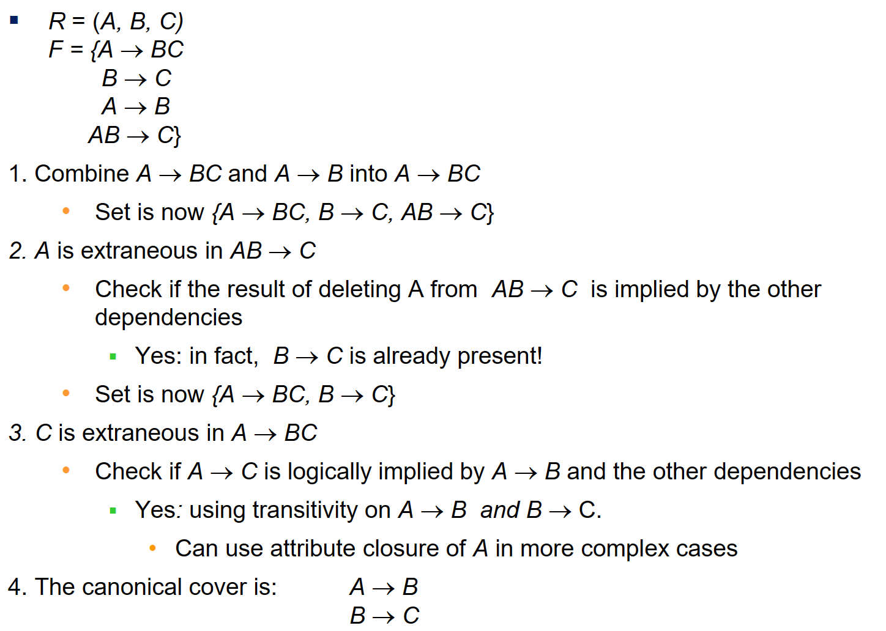

# chapter 7: 范式

## 正则覆盖

### 无关变量

对无关变量的定义，左侧和右侧并不完全相同

事实上，就是当把这个变量拿掉之后，通过其他函数依赖能够推断出这个变量控制的关系

### 定义

正则覆盖应当满足如下条件：
- $F_c$闭包$F$
- $F$闭包$F_c$
- $F_c$中没有无关变量
- $F_c$左值互不相同

### 构造

事实上，就是将所有小范围的关系合并为大范围的关系

可以将其理解为关系的化简

{A, B, C, D}

A->B

B->A

AC->D

设超键为(B, C); (A, C)

它满足三范式，但不满足BCNF（因为A和B单独并不是超键）

拆分为
{A, B} 和 {A, C, D}；后者显然是BCNF，但前面的为什么是？

{A, B}的超键是什么？