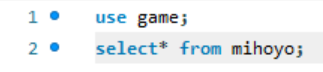

	实验1：DBMS的安装与使用

## 实验目的：
1. 通过安装某个数据库管理系统，初步了解DBMS的运行环境。
2. 了解DBMS交互界面、图形界面和系统管理工具的使用。
3. 搭建实验平台

## 实验平台：
1. 操作系统：Windows
2. 数据库管理系统：MySQL

## 实验内容：
### 1. 下载安装MySQL：

> 注：新版本的MySQL的workbench和server并不在同一个安装程序中，需要逐个安装。

完成结果如下：

- MySQL在命令行中运行样例：

- MySQL Workbench打开界面：

### 2. 更改账户密码：
在安装MySQL时，安装程序会令用户设置初始密码。

完成结果可见内容1中，命令行运行MySQL需要输入密码。

> 注：在设置密码和更改时验证密码的情况下，似乎是安装程序有保护机制，无法进行系统截图。

### 3. 创建表：
#### 前置：创建一个数据库：
- 在workbench主界面，点击MySQL connection与本地连接：

- 创建一个名为“game”的数据库：

#### 方法一：通过企业管理器创建：
- 在“game”数据库的“table”栏中右键，点击“create table”即可：

- 在弹出界面中，我们可以设置其中的元素：

#### 方法二：通过查询分析器创建：
- 在query界面，用命令的方式创建一个表：

- 通过选取元素来验证确实创建了：

### 4. 选取一个表中的元素：
#### 用select* from table：
我们使用`select* from table`进行访问：

运行后会弹出如下窗口：

#### 用select* from user.table：
我们也可以用`select* from base.table`进行访问：

运行后会弹出如下窗口：
