

	实验2：SQL数据定义和操作

## 前言
本报告较长（截图较多），可根据索引查找相应的实验部分。

## 实验目的：

1. 掌握关系数据库语言SQL的使用。
2. 使所有的SQL作业都能上机通过。

## 实验平台：

1. 数据库管理系统：SQL Server 2000或MySQL

## 实验内容和要求：

1. 建立数据库。
2. 数据定义：表的建立/删除/修改；索引的建立/删除；视图的建立/删除。
3. 数据更新：用insert/delete/update命令插入/删除/修改表数据。
4. 数据查询：单表查询、多表查询、嵌套子查询等。
5. 视图操作：通过视图的数据查询和数据修改。
6. 所有的SQL作业都能上机通过。

## 实验过程：

### 建立数据库：

打开MySQL Workbench，本地登录；

点击创建图标后如下图所示：
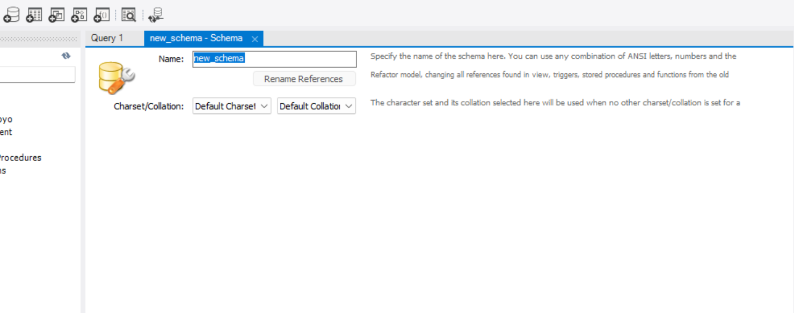

我们命名之为“honkai3”，于是发现成功创建了：
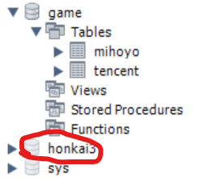

### 数据定义：表的建立/删除/修改；索引的建立/删除；视图的建立/删除：

点击SQL+，打开一个SQL文本：
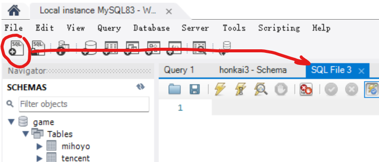

> 注：选中要执行的部分，点击“闪电”即可运行，要刷新才能看到数据库的当前状态。

#### 表的建立：

- 这个数据库中现在还没有表：
  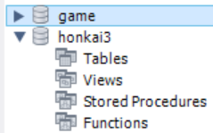
- 运行如下代码：
  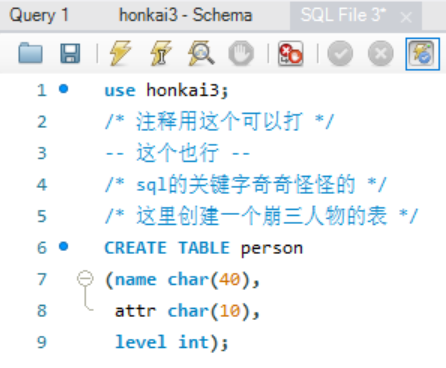
- 刷新后我们发现新建了一个表：
  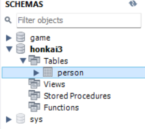

#### 表的修改：

- 用下面这段命令添加一个“武器是否装备”的行：
  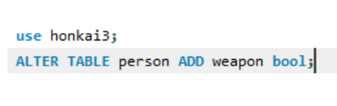
- 运行刷新后发现确实出现了：
  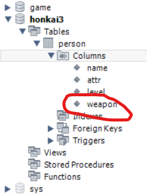

#### 表的删除：

- 我们先建好一个将要被删除的表：
  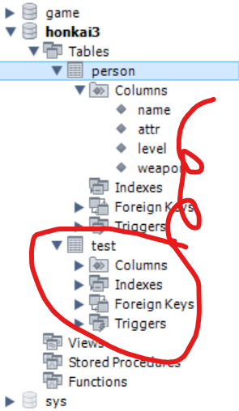

> 要把红圈内的东西删掉

- 利用 `DROP TABLE test`来删掉它：
  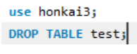

结果如下：

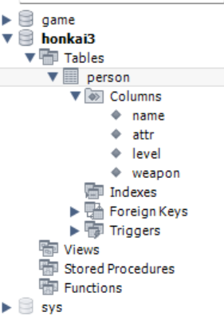

#### 索引的建立：

- 现在这个表是没有索引的：
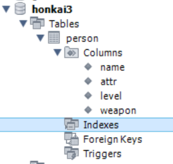

- 我们用如下语句来建立一个索引：
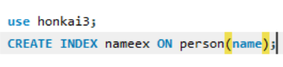

- 于是出现了索引：
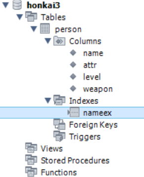

#### 索引的删除：

- 接上面步骤，执行下面的语句：
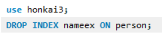

- 发现索引确实删除了：
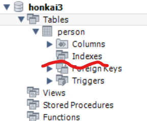

#### 视图的建立：

- 用如下命令调整数据库中的数据，并建立视图：
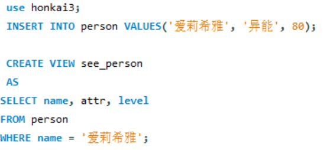

- 发现建立了视图：
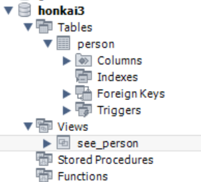

#### 视图的删除：

- 用如下命令进行视图的删除：
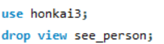

- 发现视图确实删除了：
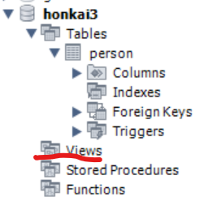

### 数据更新：用insert/delete/update命令插入/删除/修改表数据。

#### 插入数据：

- 执行如下语句，插入一些数据：
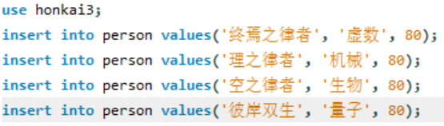

- 执行`select* from person`后如下图所示：
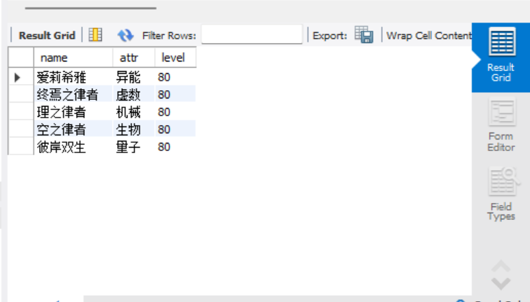

#### 修改数据：

- 执行如下语句，将“爱莉希雅”的等级修改为100：

> 要注意在安全模式下，'where'后面跟的必须是key

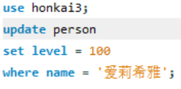

- 效果如下：
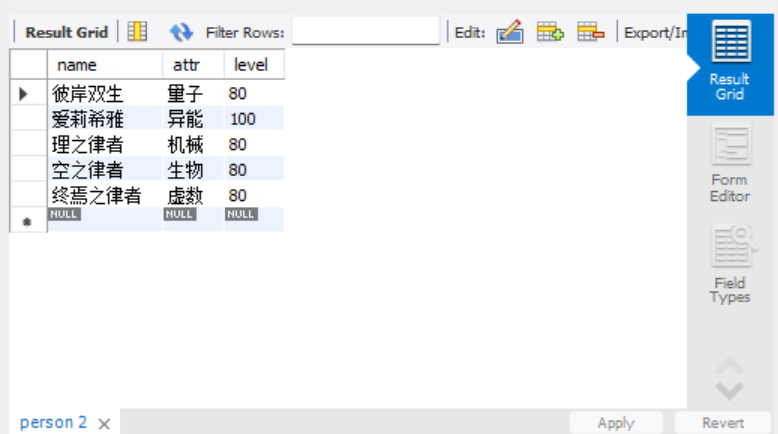

#### 删除数据：

- 执行如下语句，将“爱莉希雅”删除：
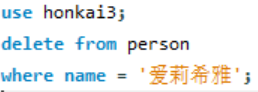

- 效果如下：
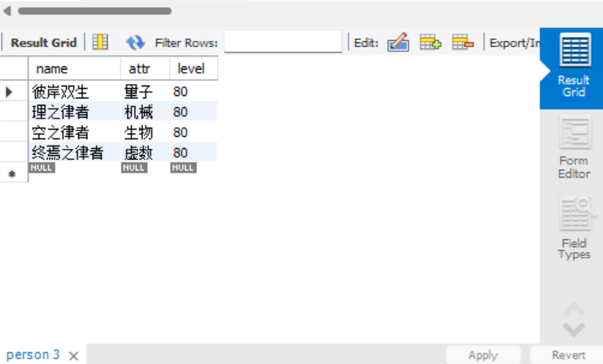

### 数据查询：单表查询、多表查询、嵌套子查询等。
#### 单表查询：
- 查询名称为“彼岸双生”角色的属性和等级：
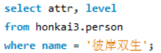

- 结果如下：
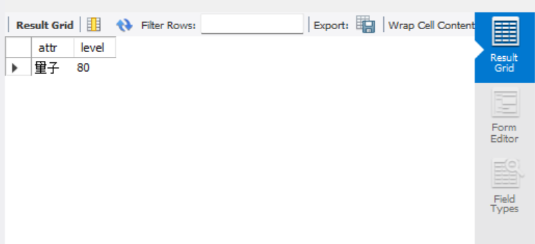

#### 多表查询：
更新表单数据，现在数据库内有两个表，其中的数据如下所示：
- 表1名为person，数据如下：
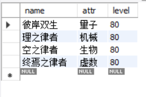

- 表2名为other，数据如下：
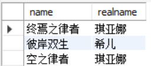

- 现在，将用多表查询的方式，将两个表“合并”起来：
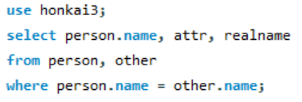

- 结果如下（提取到名字相同的角色的属性和实名）：
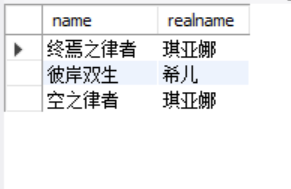

#### 嵌套子查询：
我们可以利用`()as`来进行嵌套的限制，最终找到我们想要的数据。
这里，我们先将“彼岸双生”的等级设置为100；
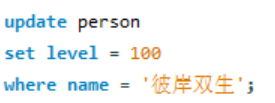

我们运行如下命令：
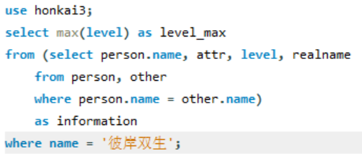

它的意思是：
- 在person和other中，寻找name相同的元素组，提取它们的名称/属性/等级/实名，并将提取表定义为information
- 从information中，在name为“彼岸双生”的元素组中，选取level最大的值，作为level_max显示出来

最终效果如下：
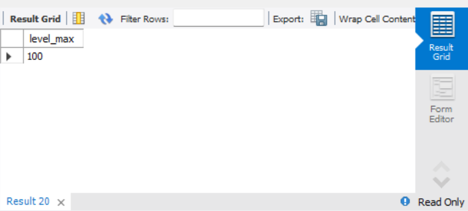

#### 视图数据查询：

- 利用如下代码，创建视图并查询其中姓名的数据：
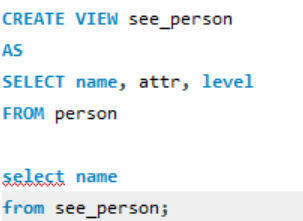

- 结果如下：
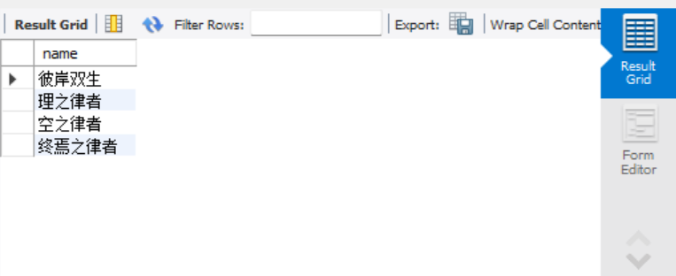

#### 视图数据修改：

- 利用如下代码，将“彼岸双生”的等级乘2：
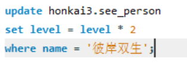

- 效果如下：
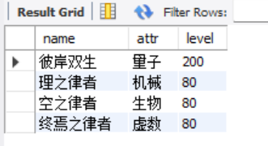

- 再看表中的数据，彼岸双生的等级也被更改为了200：
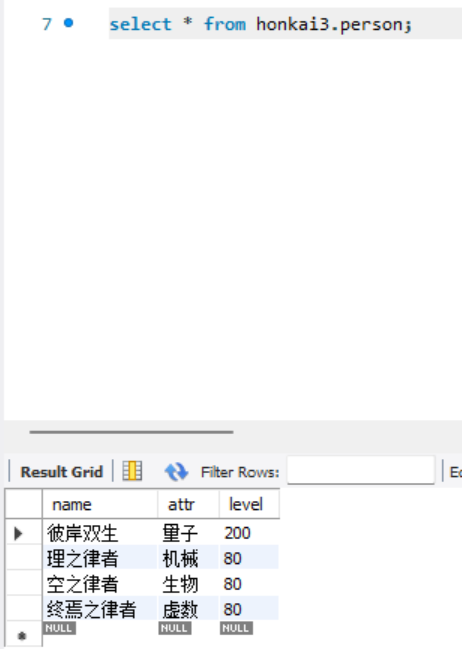

