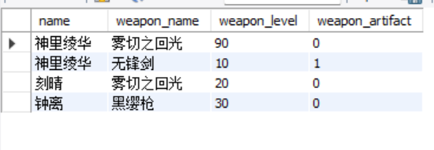

	实验3：SQL数据完整性

### 实验目的：
1. 熟悉通过SQL进行数据完整性控制的方法。

### 实验平台：
1. 数据库管理系统：MySQL

### 实验内容和要求：
1. 定义若干表，其中包括primary key, foreign key和check的定义。
2. 让表中插入数据，考察primary key如何控制实体完整性。
3. 删除被引用表中的行，考察foreign key中on delete子句如何控制参照完整性。
4. 修改被引用表中的行的primary key，考察foreign key中on update子句如何控制参照完整性。
5. 修改或插入表中数据，考察check子句如何控制校验完整性。
6. 定义一个assertion，并通过修改表中数据考察断言如何控制数据完整性。
7. 定义一个trigger，并通过修改表中数据考察触发器如何起作用。

### 实验过程：
#### 1. 定义若干表，其中包括primary key, foreign key和check的定义。
- 我们建立3个表，分别代表人物/武器/圣遗物；并且key均指向人物的名称，并对其中的某些元素进行限定：

- 效果如下：

#### 2. 让表中插入数据，考察primary key如何控制实体完整性。
- 先插入几个数据：

- 接下来，我们再插入一次“神里绫华”的状态：

- 运行后发现报错：这是因为primary key重复了，同一个表中不会存在两个相同的primary key：

#### 3. 删除被引用表中的行，考察foreign key中on delete子句如何控制参照完整性。

- 我们插入一条关于“神里绫华”武器状态的描述：

- 然后删除person表中的“神里绫华”：

**注：在实验的时候并没有出现“安全模式”的意外状况，因此在这里只粘贴本实验需要证明的图片：**

- 发现报错，这是因为weapon表的foreign key指向了person表，因此只有在weapon表中的数据删除后，才能够删除person表中对应的数据。

#### 4. 修改被引用表中的行的primary key，考察foreign key中on update子句如何控制参照完整性。

- 我们试图将作为primary key的“名称”更改；将属性为冰的角色名改为“甘雨”：

- 结果报错：

#### 5. 修改或插入表中数据，考察check子句如何控制校验完整性。

**注：此处与MySQL例中不同，check子句确实起到了作用：**

- 我们试图插入错误数据，令“纳西妲”的命之座为7（check设定必须小于等于6）：

- 结果报错：（提示：第三个check子句没有通过，符合预期）

- 我们再把命之座数据换成6，发现又能够插入了：

- 效果如下：

#### 6. 定义一个assertion，并通过修改表中数据考察断言如何控制数据完整性。

**注：我使用的MySQL经查证后发现不支持assertion，因此在这里将语句内报错的图片粘贴在此处：**

#### 7. 定义一个trigger，并通过修改表中数据考察触发器如何起作用。

- 我们先更新下weapon表中的内容，设定如下：

- 我们设置下面这个触发器：

它的意思是：
- 当我们对person更新时：
- 对weapon表中的name, 如果name在person中的等级小于80
- 那么对weapon表中的这个name，设置它武器的精炼值为6.

- 然后我们尝试改变person表中的人物，看看会发生什么：

- 效果如下：

**我们看到，现在等级更新为30的“神里绫华”，以及等级一直为75的“刻晴”，她们武器的精炼值都更新为6。这说明触发器起到了作用。**

