

	实验4：SQL安全性

#### 实验目的：

1. 熟悉通过SQL进行数据完整性控制的方法。

#### 数据库的管理系统：MySQL

#### 实验内容和要求：

1. 建立表，考察表的生成者拥有该表的哪些权限。
2. 使用SQL的grant和revoke命令对其他用户进行授权和权力回收，考察相应的作用。
3. 建立视图，并把该视图的查询权限授予其他用户，考察通过视图进行权限控制的作用。

#### 实验过程：

##### 1. 建立表，考察表的生成者拥有该表的哪些权限。

- 这里我们试图模拟成绩数据库的建立，以观察权限的运作方式。
- 首先，我们利用如下命令建立一个数据库及表，然后查询root（即表的建立者）对数据库的权限：
  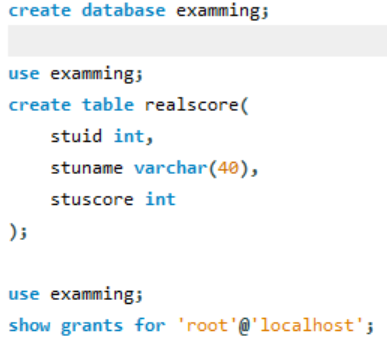
- 效果如下：
  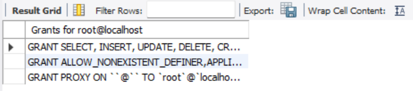

可见表的生成者基本具备一切对数据库的权限。

- 我们再去探究下一级的user建表时对表的权限：
  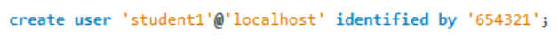
- 连接这个user：

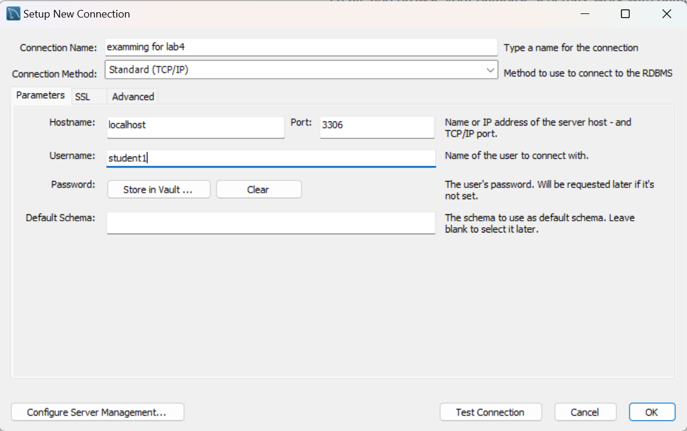

- 最终连接成功效果如下：
  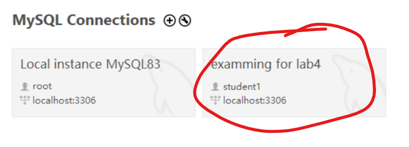

在未授权之前，以正常方式访问examming库都是不被允许的（哪怕是use examming）：

- 于是我们需要下放权限：
  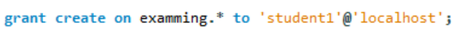

（意为：令student1在examming下属表中能够使用create语句）

- 我们再次尝试建表发现成功了：
  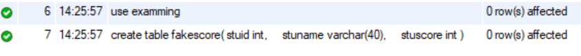
- 假设这个人是李四，他喜出望外想要改成绩：
  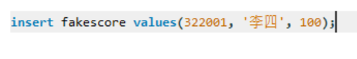
- 结果发现还是不行，因为insert权限仍然没有下放：
  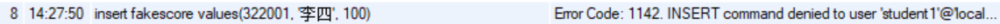
- 但root用户，可以顺利地insert李四创建的表，并把他的成绩改成0分：
  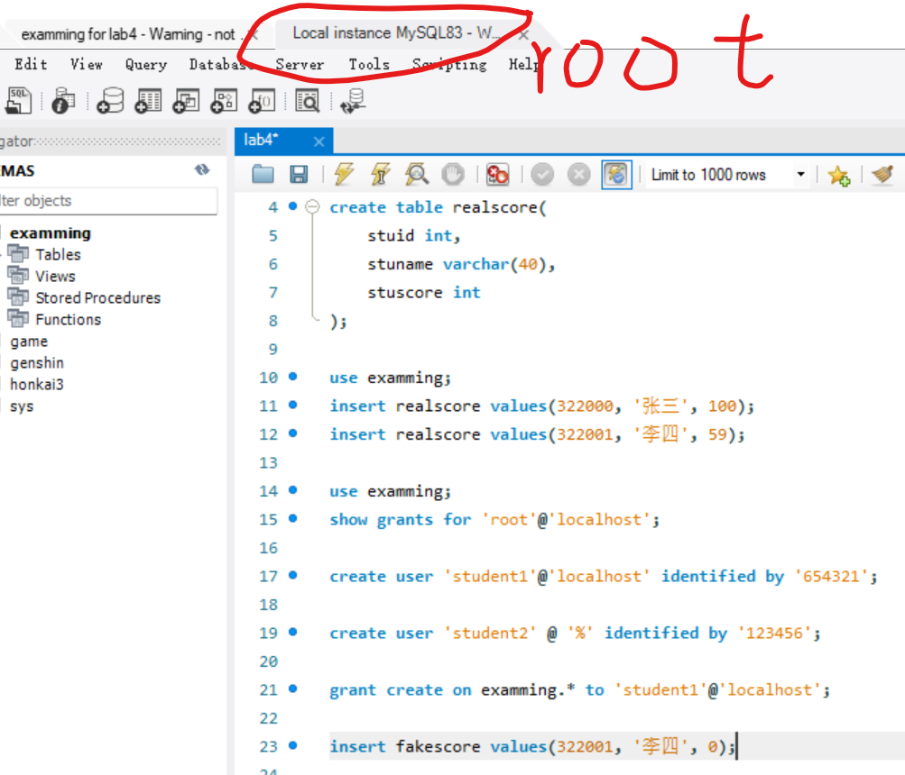
- 显然成功了：
  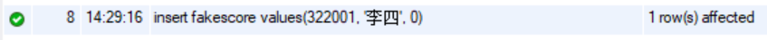

##### 2. 使用SQL的grant和revoke命令对其他用户进行授权和权力回收，考察相应的作用。

事实上上面那步已经操作过了这部分的内容，但这里还是更进一步的做一些操作：

- 我们给student1下放insert的权限：
  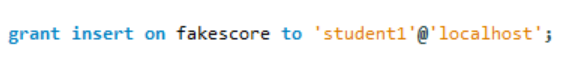
- 接下来，在student1视角下给why同学insert100分：
  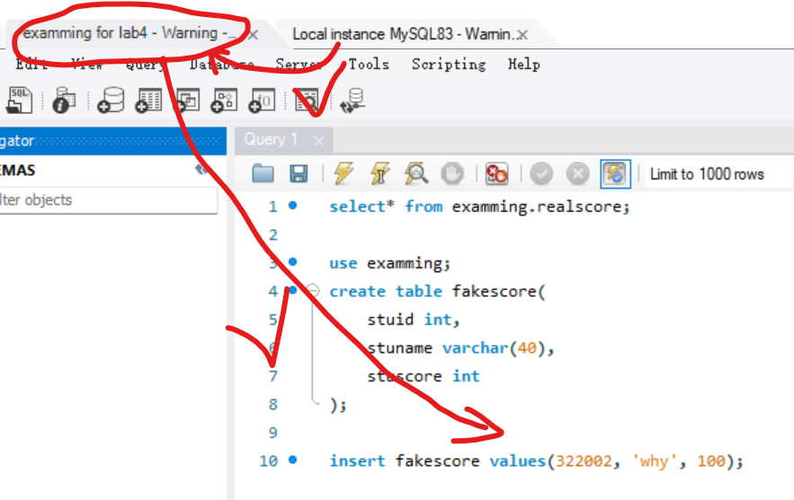
- 显然这成功了：
  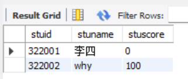
- 我们再尝试收回insert的权限：
  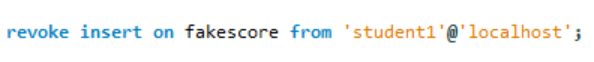
- 再在student1视角下给赵五同学insert1000分：
  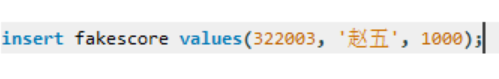
- 发现报错了，说明权限确实被收回了：
  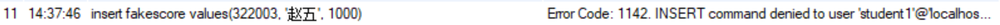

##### 3. 建立视图，并把该视图的查询权限授予其他用户，考察通过视图进行权限控制的作用。

（假设成绩发放的日子到了，教务网可以把成绩视图公布给同学们）

- root先建立一个realscore的成绩视图：
  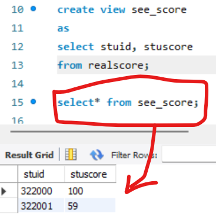
- 接下来，root把视图的select权限给到student1：
  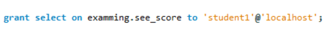
- 再在student1视角下调用select，结果发现自己挂科的事实没有改变（悲：
  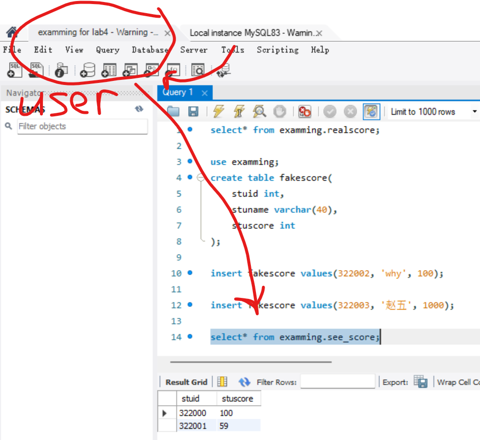

#### 小结

经过这个实验我们不难发现，整个sql系统的权限管理是系统化且严格化的，几乎每一个操作的权限都被独立封装，这也让数据管理者能够更好地保护数据的安全。
