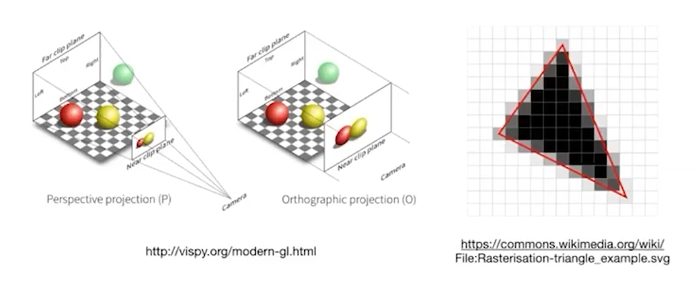
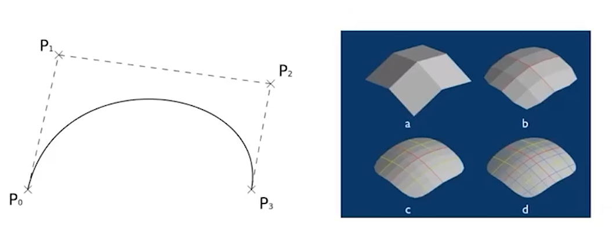
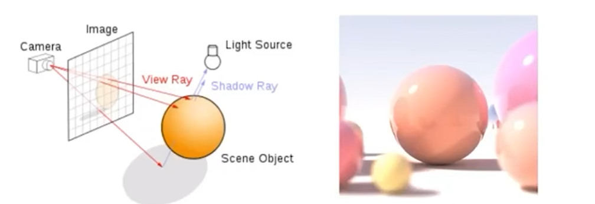

## Lecture 1: 计算机图形学概述

### 学习目的

- **交互**：创建真实世界与虚拟世界的交互
- **模拟**：对物理世界的进一步理解的需求
- **技术**：新的计算机方法、技术等

### 技术需求

- 数理基础
- 光学物理
- 3D建模
- 动画/模拟

### 课程主题

#### 主讲内容

- 光栅化（rasterization）

具体而言，光栅化就是**将三维物体投影到二维平面上的技术**。

*与传统的光线追踪技术相比，光栅化更容易实现“实时”的渲染效果。*

- 曲线/曲面（curves and meshes）

如何在计算机中表示出曲线/曲面的拓扑结构。

- 光线追踪（ray tracing）

通过光学理论计算折射与阴影，从而达成更好的表现效果。

*在CG中经常涉及到trade-off（权衡）；例如光线追踪技术形成的图片效果更好，但计算花费的时间也更长。*

- 动画与模拟（animation/simulation）

对一个物体运动的描述（球的反弹、锁链的悬垂、弹簧的伸缩等等）

#### GAMES101简述

GAMES101本身不对：

- *OpenGL/DirectX/Vulkan*等程序的应用以及
- *Maya/3DS MAX/Blender/VR*等3D建模软件以及
- *Unity*等游戏开发软件以及
- *计算机视觉*领域

做讲解。

反之，将更多地介绍技术性的知识，而不是单纯的API的使用。

#### 模型（model）与图像（image）的区别

模型通过计算机图形学（CG）降维成图像；

*事实上，计算摄影学（CP）与计算机图形学（CG）是不同的，计算摄影学的本质是探究拍摄图像的角度从而获取尽可能多的物体的性质表现，而计算机图形学涉及更为全面。*

图像通过计算机视觉（CV）升维成模型。