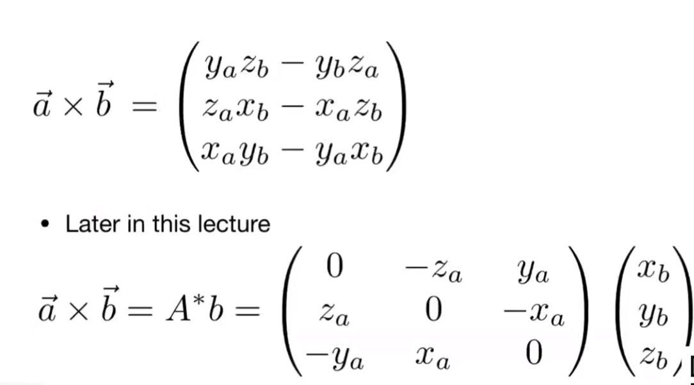
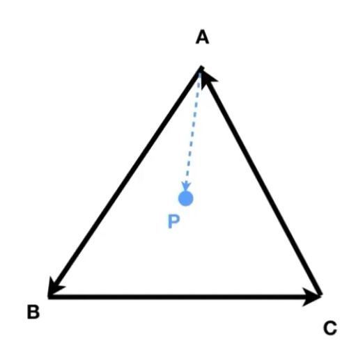
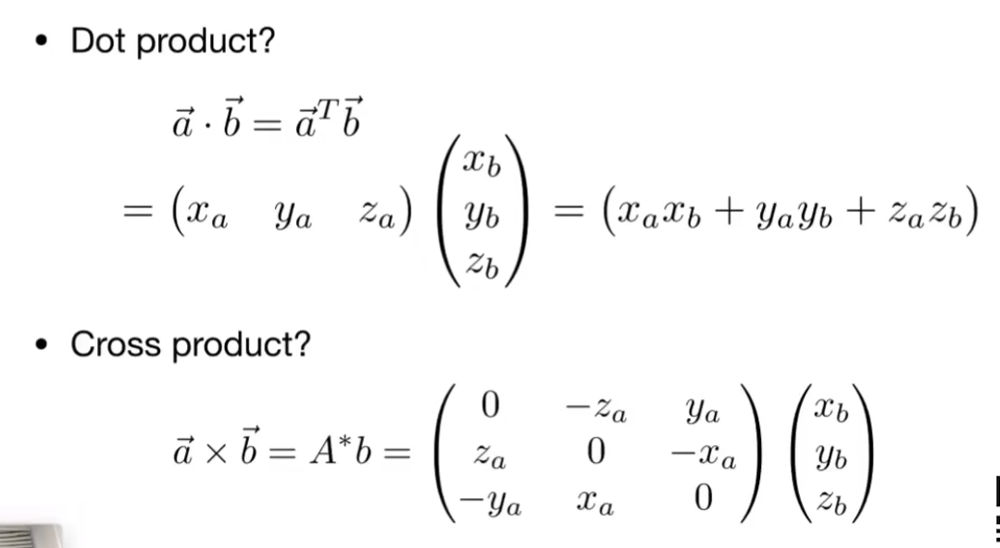

## lecture 2: 向量与线性代数

> tips：通过课程视频可见，授课教师希望通过尽可能地降低学习的门槛，good！

### 前言：CG的数理依赖

- 基础数学：
  - **线性代数**
    - 向量
    - 矩阵
  - 微积分
  - 统计学
- 基础物理
  - 光学
  - 运动学
- 其他
  - 信号处理
  - 数值分析
- （一点点）艺术审美

### 1. 向量基础

#### 基础定义（可跳过）

定义：有方向的量

写法：$\mathop{a}\limits ^{\rightarrow}$ 或 **a**

向量的长度：$||\mathop{a}\limits ^{\rightarrow}||$

单位向量：长度为1的向量

#### 向量计算

##### 向量求和（可跳过）

- 平行四边形法则
- 三角形法则

*在图形学中，向量默认写成列向量。*

##### 向量点乘

$\mathop{a}\limits ^{\rightarrow} \cdot \mathop{b}\limits ^{\rightarrow}=||\mathop{a}\limits ^{\rightarrow}||||\mathop{b}\limits ^{\rightarrow}||cos\theta $

向量点乘的结果为**值**。

向量的点乘满足交换律、分配律与“结合律”

在笛卡尔坐标系内，向量的点乘结果为对应维系数乘积之和。

**在图形学中，点乘的作用：**

1. 求两向量的夹角
2. 求一个向量在另一个向量上的投影，可用于：
   - 度量两向量的距离
   - 分解向量
   - 获取“前与后”的信息（即两向量的方向关系）

> “度量两向量的距离”可以这样理解：当光打到金属表面形成反光时，在理想状态下显然眼睛越“靠近”反射光则看到的反射现象越明显（也就是亮度越大），因此在模拟光线的时候即可通过这种方式对亮度有一个简单的定性。

##### 向量叉乘

$\mathop{a}\limits ^{\rightarrow} \times \mathop{b}\limits ^{\rightarrow}=||\mathop{a}\limits ^{\rightarrow}||||\mathop{b}\limits ^{\rightarrow}||sin\phi $

向量叉乘的结果是**向量**，其方向通过右手螺旋定则从左侧向量到右侧向量得到。

向量叉乘满足分配律与结合律。

在笛卡尔坐标系中，向量的叉乘可以写成如下形式：

**在图形学中，叉乘的作用：**
- 判定“左和右”的信息（即向量a在同一平面内通过逆时针/顺时针旋转的方式能够与向量b同方向）
- 判定“内和外”的信息（通过上一条来判定点与线之间的“左和右”的关系来判定）

**举例：**

首先定义点P与向量AB之间位置的判断方法：

若$AB \times AP $方向为法线正向/法线反向，从而定义二者关系为“P在AB左”还是“P在AB右”

> 事实上所谓“左”和“右”都是相对主观的说法，但我们只需了解对于一个平面图形而言，通过这种方式必然能确认P与AB之间的关系为二者中的一种。

在此基础上，判断P在三角形ABC（或多边形，可凸可凹）内的方法为：

将多边形的边沿顶点依次首尾相接形成向量，依次判断这些向量与P的关系，如果判定的“方向”均相同，则P在该多边形内；反之则在多边形外。

> 以ABC为例，只需分别判断AB与AP；BC与BP；CA与CP这三组向量的关系是否一致，即可判定P是否在ABC内。

**这是作为三角形进行光栅化的基础。**

**特别的，对于刚好位于边界的点，对它是否在图形内不做要求，自由决定。**

#### 正交坐标系（orthonormal coordinate frame）

通过构建一个相互正交（即点乘结果为0）的几个单位向量为基底组成的坐标系即为正交坐标系。

> 关于基底的一系列性质（例如何种基底可表示某空间内所有向量等）在高中已经充分介绍，此处略过

相比于一般的坐标系（比如互成一般角度的基底），正交坐标系的好处在于可更方便地表示所有的向量。

例如：对于一个由向量w、u、v构成的正交坐标系，对于任意向量p有：

$$
\mathop{p}\limits ^{\rightarrow} = (\mathop{p}\limits ^{\rightarrow} \cdot \mathop{u}\limits ^{\rightarrow})\mathop{u}\limits ^{\rightarrow} + (\mathop{p}\limits ^{\rightarrow} \cdot \mathop{v}\limits ^{\rightarrow})\mathop{v}\limits ^{\rightarrow} + (\mathop{p}\limits ^{\rightarrow} \cdot \mathop{w}\limits ^{\rightarrow})\mathop{w}\limits ^{\rightarrow}
$$

则向量p即可在u、v、w方向进行分解。

### 2. 矩阵基础

#### 基本定义

定义：一组构成M行N列的数

单位矩阵：只有对角线为1，其余位置均为0的值

#### 矩阵运算

##### 矩阵的乘法

$(M\times N)(N\times P)=(M\times P)$

矩阵的乘法具备结合律与分配律

**矩阵的变换：**矩阵的乘法，能够做到对矩阵进行一系列的变换（在lecture 3展开说明）

##### 矩阵的转置

$B=A^T$为$A$的转置，具体定义为$b_{ij}=a_{ji}$

对矩阵转置有：$(AB)^T=B^TA^T$

##### 矩阵的逆

设$E$为单位矩阵，则有：

$AA^-=E$

##### 与向量的关系

通过矩阵的乘法与转置，可以完成两个列向量之间的点乘/叉乘的操作：

$a\cdot b = a^Tb$

$a\times b = Ab$，其中A为a的矩阵表示

