## lecture 3: 变换

### 1. 学习变换的目的

变换分为**模型变换**与**视图变换**。

对于模型变换，事实上就可以理解为一个模型（无论是人还是物体）的运动状态的变化，包括旋转、伸缩、平移等等。

对于视图变换，就是对视角的角度、维度进行处理，例如投影、透视等等。

### 2. 二维变换

对于二维变换，首先我们需要将矩阵与变换联系起来。

我们先从比较简单的**线性变换**开始：

#### 1. 线性变换

##### 1. 放缩

假设有一个矩形，其四个顶点为$(0,0), (x,0), (0,y), (x,y)$；我们希望通过某种矩阵乘法将它的长度（x）与宽度（y）进行不同比例的**放缩**。

显然，通过如下矩阵乘法能够达到这一点：

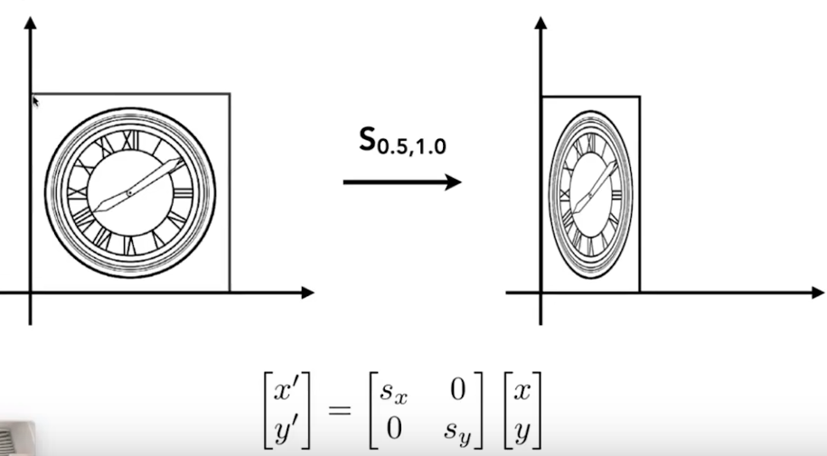

##### 2. 反射

更普遍地，我们尝试对$s_x$与$s_y$取负值，那么就达成了**反射**的效果：

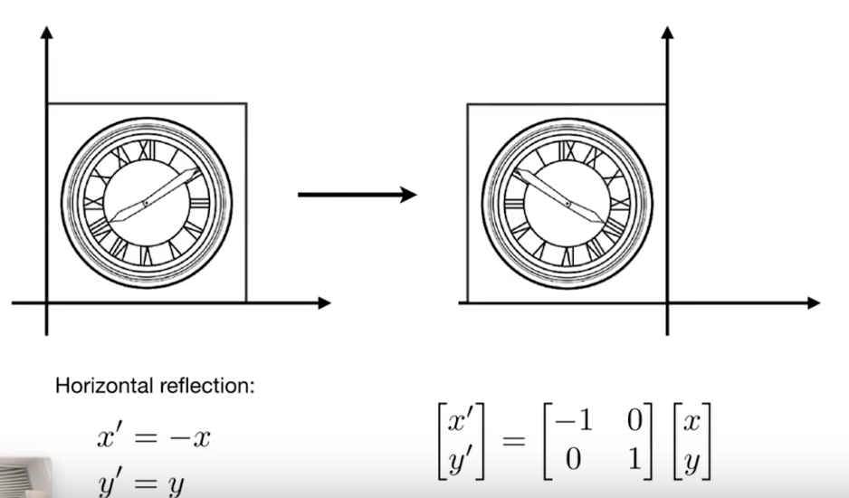

##### 3. 切变

再普遍一点，我们将非对角线的两个0利用起来，则会做出**切变**的效果：

> 从矩阵的乘法角度而言，对角线上的数相当于原坐标的对应系数，而非对角线上的数相当于建立起了原坐标中x和y之间的关系。

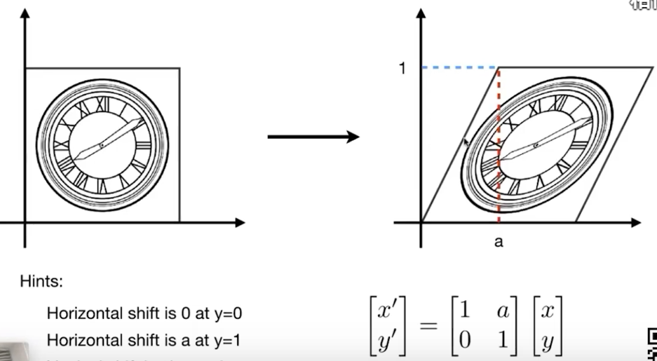

此时，$x'=x + ay;y'=y$

**注意：作为代数学的良好习惯，我们在调整系数（这里调整的是系数矩阵）时，系数中最好不要带未知量。**

##### 4. 旋转

同样的，我们期望找到这个图形绕(0,0)旋转$\theta$角度的方式。

> 由于视频中的解法相对取巧，这里给出具体证明：

根据之前的经验，我们事实上就是要求x',y'关于x,y的函数，如果函数是一次的，那么就可以用矩阵乘法的方式来进行表示。

在旋转中，图形的每一个点都相当于是原来的点绕原点旋转$theta$，那么我们取其中一个点A与其旋转后的点A';

设$OA' = OA = r$, $OA$与x轴夹角为$\phi$，则有：

$$
x'=rcos(\phi+\theta) = rcos\phi cos\theta - rsin\phi sin\theta
$$

$$
y'=rsin(\phi+\theta) = rsin\phi cos\theta + rcos\phi sin\theta
$$

并且：$x=rcos\phi, y=rsin\phi$，代入即可获得最终的式子。

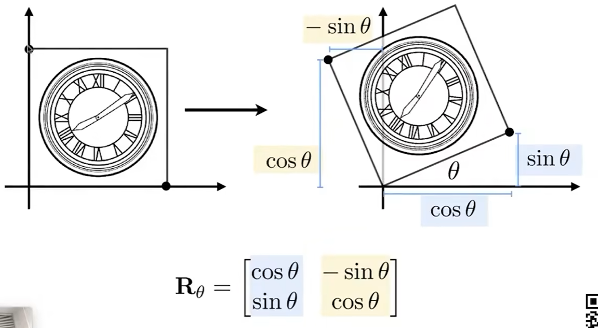

##### 5. 小结

以上四种变换具备相似之处，那就是它们的变换公式都满足$x' = ax + by$以及$y' = cx + dy$，这也就意味着它可以用简单的矩阵乘法表示整个变换。这类变换命名为**线性变换**。

事实上，所谓“线性”是因为$x'=f(x,y)$,$y'=g(x,y)$中f和g这两个函数都仅有**一次项**，甚至常数项都不能够存在。

#### 2. 非线性变换

##### 1. 平移

一个简单的平移操作，很容易能够想到它变换的公式为$x'=x+t_x,y'=y+t_y$。然而，它由于存在常数项，并不能够将它用简单的矩阵乘法表示。退而求其次，我们可以通过这种方式来表示它：

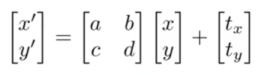

但显然，作为如此频繁使用的操作却没有与其他变换统一，这是难以接受的（在深入计算机编程后会发现，归并和封装能够大幅减少代码量，而它的基本要求就是对象们的基本特点相同，或者说它们能够被同一个定义描述）。

因此我们需要扩展矩阵的维度，添加一个用于描述**常数**的维度，那么平移也可以用矩阵乘法来表示了：

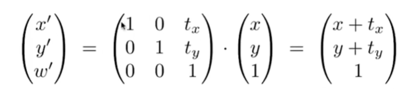

对这个多出来的维度进行必要的约束：
- 当图形作为一系列的**点**进行平移操作时，令它为1
- 当图形作为与原点连接的一系列**线段**进行长度改变（对应放缩、反射），或角度改变（对应旋转）时，令它为0

> 特别的，切变属于一种“特殊”的长度改变，这是因为它长度改变的参量包含的另一个坐标。

> 这个“多出的维度”在齐次坐标将做出进一步解释。

刚才的这个过程，就是**齐次坐标**的处理。

### 3. 齐次坐标

#### 构建模型

在添加了一个维度后，我们对所有的二维变换都有了一个共同的处理方法：通过一个矩阵乘法运算即可完成对应的变换。

但对于多出的维度，仍然没有一个比较好的描述手段。在这种情况下，基于在**平移**操作中对该维度的分析，我们可以直接有如下定义：

- 对形如(x,y,1)的矩阵，它代表在(x,y)的**点**
- 对形如(x,y,0)的矩阵，它代表从(0,0)到(x,y)的**向量**

> 事实上，这种“人为定义”很危险，我们还需要论证它符合“点”和“向量”的计算方式。

我们查验这个定义是否满足点和向量的计算（直接利用矩阵的加法即可）：
- 向量+向量=向量：$(x_1,y_1,0)+(x_2,y_2,0)=(x_1+x_2,y_1+y_2,0)$
- 向量+点=点：$(x_1,y_1,0)+(x_2,y_2,1)=(x_1+x_2,y_1+y_2,1)$
- 点+点=点：$(x_1,y_1,1)+(x_2,y_2,1)=(x_1+x_2,y_1+y_2,2)=((x_1+x_2)/2, (y_1+y_2)/2, 1)$

这里只有**点+点**略微反直觉，因此我们直接定义：**两点相加的结果是二者连线的中点**以符合这个数学模型。

返回再看图像的各种二维变换，我们会发现：对线性变换（第三维为0）都是将图形“分割”成一条条线进行变换的，而对非线性变换（第三维为0）都是将图形“分割”成一个个点进行变换的。

这样，我们就成功从一个图像中抽离出两个最基本的变换单元：点与向量，而它们所能做出的二维变换可以用矩阵乘法运算完全描述。根据这样一个数学模型，我们就可以将所有的二维变换以数据的方式载入计算机了。

#### 仿射变换

仿射变换=非线性变换+线性变换

成功实现“齐次坐标”这样一个方法后，我们就可以将任意一个仿射变换转化为矩阵乘法的形式：

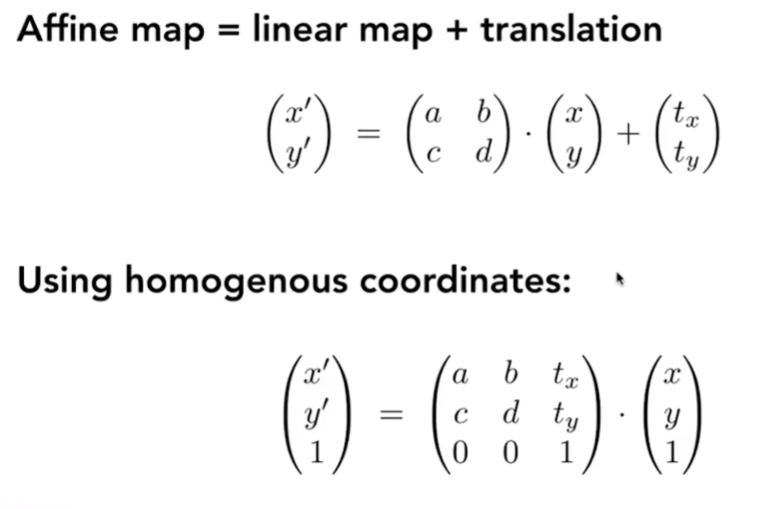

总结一下，针对单个二维变换，其对应公式如下：

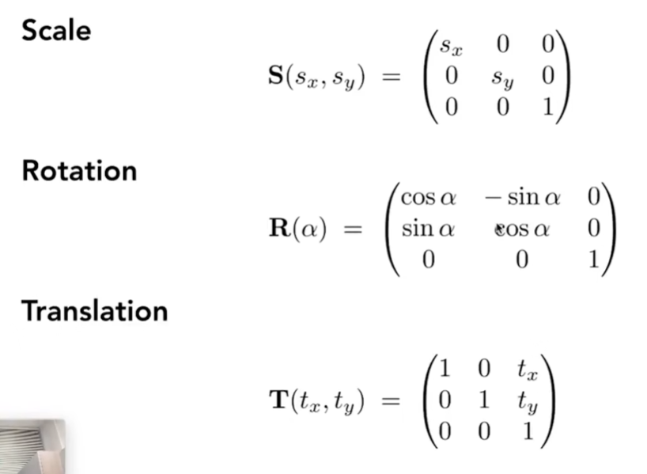

### 4. 其他变换

#### 逆变换

逆变换表示为$M^{-1}$，即从变换后的状态返回变换前的状态。

逆变换的矩阵等于变换的矩阵的逆。

**特别的，尝试一下旋转操作的变换：**

当旋转$\theta$与旋转$-\theta$时，其变换矩阵为$sin\theta$取反，$cos\theta$不变，也可以说：

$$R_{-\theta}=R_{\theta}^{T}$$

而根据定义，这两个操作互为逆，那么我们就有：

$$R_\theta^{-1}=R_\theta^T$$

#### 组合变换

##### 定义

对一些复杂的变换，我们可以拆解为简单的变换组合：

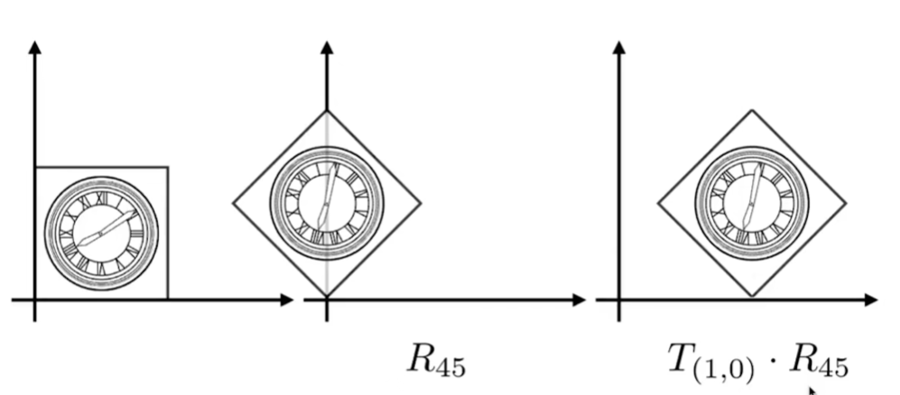

**需要注意的是，变换的先后顺序很重要！同时注意，我们的旋转一直是以原点为轴进行的。**

也因此，变换不满足交换律。

在组合变换时，我们只需要在原坐标的左边进行矩阵的乘法即可。也就是说，完成组合变换的关键，就是计算矩阵的连续乘法，例如：

$$
R_{45}T_1X=(R_{45}T_1)X
$$

通过矩阵的结合律可以发现，对于组合变换而言，同样可以使用一个3x3的矩阵进行描述。

##### 应用

通过组合变换，我们就可以实现一些更复杂的变换。例如希望以某个特定的点为轴进行旋转，那么只需要将那个点平移到原点处，进行旋转操作后在平移回去即可；这里的每一步都可以用简单变换来进行求解：

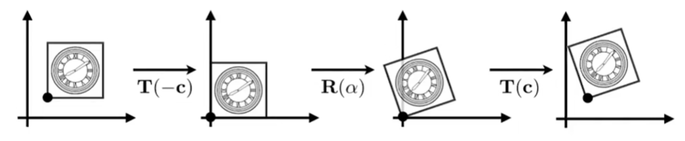

> 这里的“平移回去”，就是乘一个平移矩阵的逆。

### 5. 三维变换

从二维类比三维，我们同样可以引入齐次坐标对三维的点与向量进行描述：

- 三维的点：$(x,y,z,1)^T$
- 三维的向量：$(x,y,z,0)^T$

那么，三维变换的公式如下：

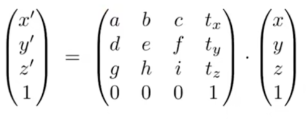

> 注意：在组合变换中，先进行线性变换，再进行平移变换。