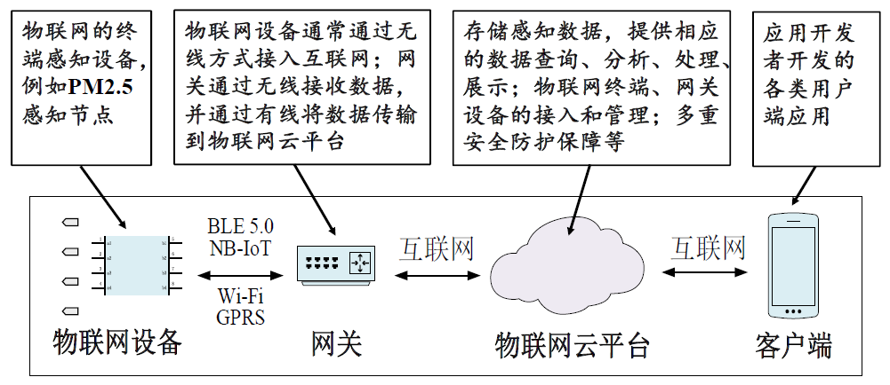

## class 1/2: Overview

### 课程目的：

掌握端-管-云主流技术

- 端：物联网设备
- 管：端云两侧连接的协议
- 云：云平台

### 评分规则：

- quiz: 10%
- experiment: 40%
- final(close): 50%

### 物联网概述

#### 1. 物联网的定义和发展趋势

##### 1.1 定义

物联网就是 **物理设备** 以及其他 **嵌入了电子器件、软件、传感器的物件** 组成的网络。这些
物件具有 **感知能力、计算能力以及连接能力** ，从而能更直接地将物理世界集成到数字世
界中。

##### 1.2 起源与发展

- 1995年，比尔·盖茨（Bill Gates）在《未来之路》一书中提出了物物互联的基本思想
- 2005年，国际电信联盟指出，无所不在的“物联网”通信时代即将来临。
- 2009年，IBM公司提出了“智慧地球”的概念。
- 同年，中国提出了“感知中国”的概念。
- 近年来，人工智能技术赋能物联网(AloT)具有广阔发展前景，人类社会将迈向万物智联

##### 1.3 典型物联网应用架构

- 物联网设备
- 网关
- 物联网云平台
- 客户端

部分常见的设备/平台与软件如下：

- 传感器
- 开发板（Contiki/RIOT/Zephyr/RT-Thread/HaronyOS）
- 网络设备（OpenWrt/EdgeX/KubeEdge）
- 云服务（ThingsBoard/IoTSharp）

