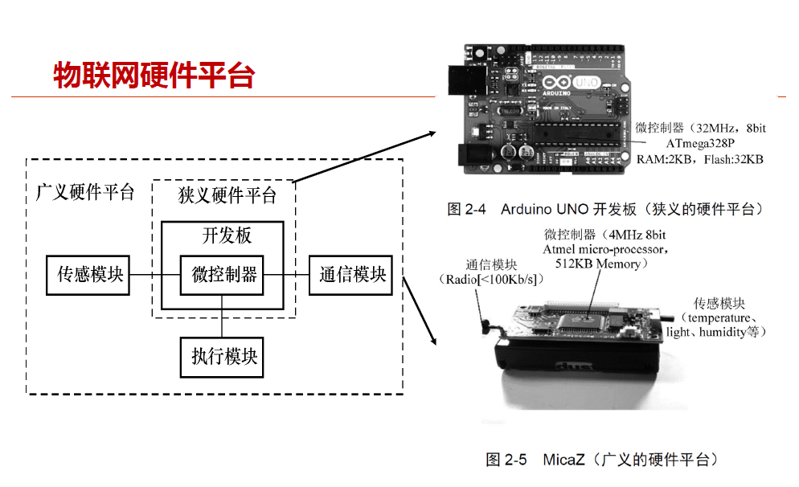
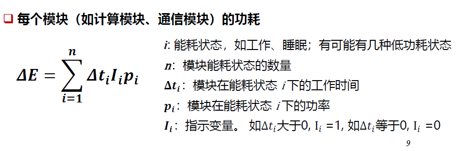
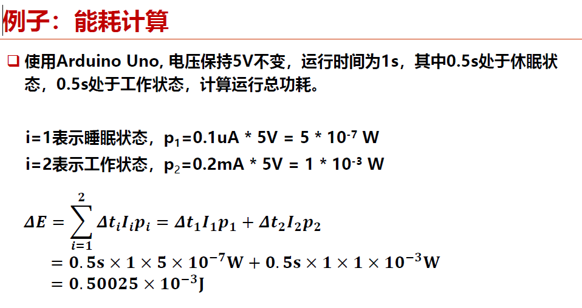
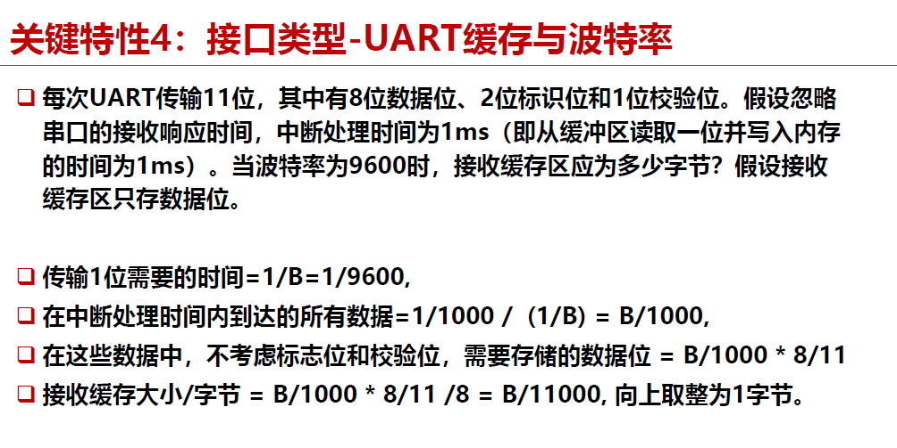
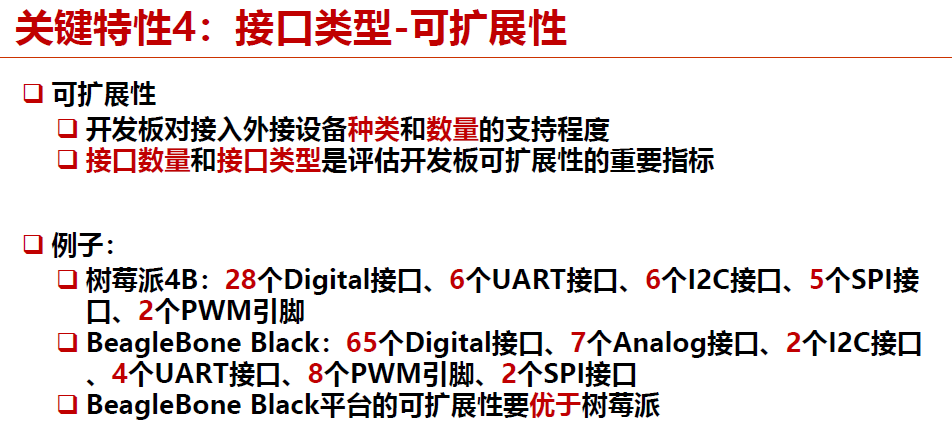
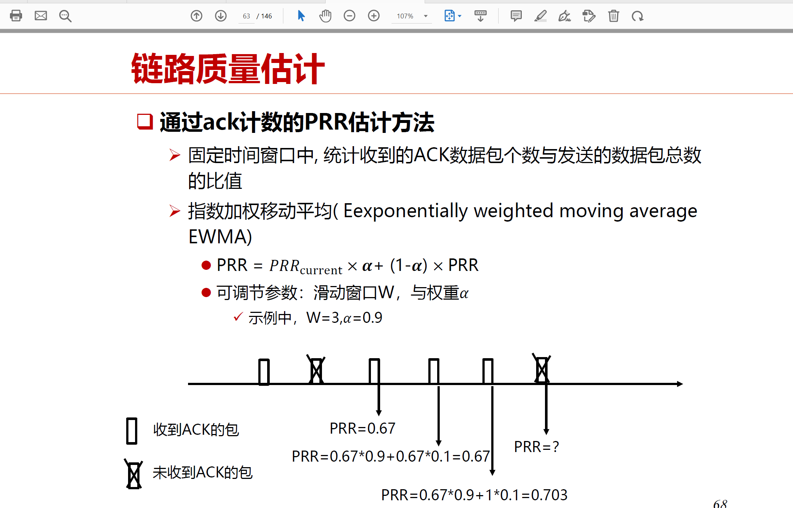

## chapter 2: 物联网硬件平台

### 物联网硬件平台分类：

- 类PC的嵌入式设备：功能强大，就是缩小版的PC机
- 智能物件：功能相对强大，可以执行相对复杂的智能运算
- 物件：功能比较弱小

硬件平台有如下定义：

- 广义硬件平台：包括狭义硬件平台、传感模块、通信模块、执行模块
- 狭义硬件平台：包括开发板以及其中的微控制器

### 物联网硬件的关键特性

1. 低成本与微型化
2. 功耗/能耗

功耗计算方式如下：

3. 运算速度和内存大小

能耗与主频的关系为：$P=CV^2FT$

运算速度与主频的关系：$IPS = F / CPI$

对内存而言：

- RAM：存数据，易失性
- Flash：存放程序，非易失性

4. 接口类型

- 物理接口：杜邦线/套接口
- 通信协议：
  - 模拟信号（Analog）：使用模拟量表示数据的信号，需要ADC转化
  - 数字信号
  - PWM：基于数字信号的脉冲调制技术
  - UART：用于异步逐位传输数据的全双工通信接口标准
  - I2C： Phillips公司推出的高性能串行总线
  - SPI：高速、全双工、同步的通信总线

### 常见的物联网硬件平台：

- 传感节点
- STM32
- ESP32
- Arduino
- 树莓派（智能物件）
- Jetson平台（智能物件）

temp:

