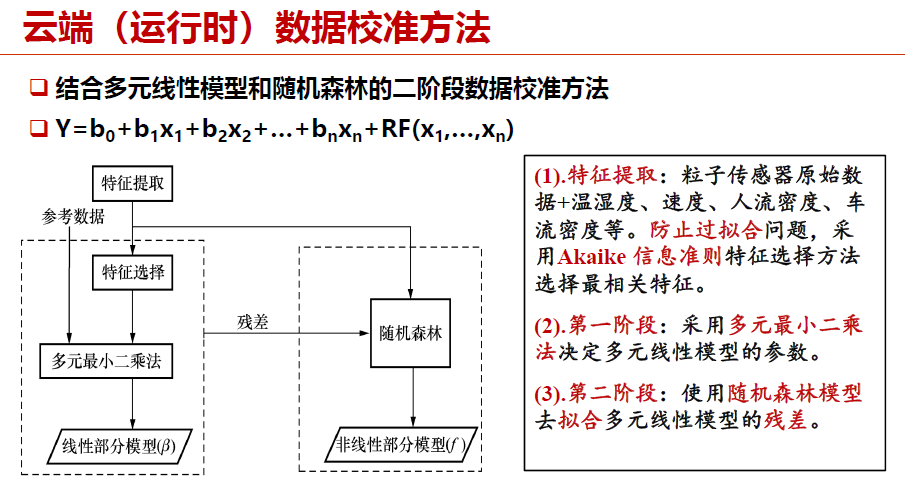
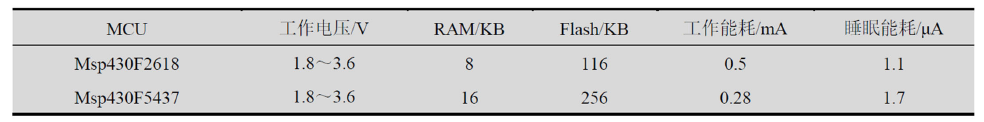
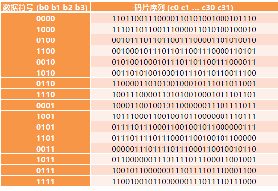

## quiz

### chapter 1

#### 1. 一个典型物联网应用架构包括哪些部分？

一个典型的物联网应用架构包括：**物联网设备、网关、物联网云平台、客户端**。

#### 2. 物联网开发与传统PC程序开发有什么不同？

传统PC程序的开发注重**提升性能**，由于有一定的主流终端类型因此可能存在**独裁垄断**；而物联网开发注重**低功耗、小体积**，由于其**碎片化、异构性**的特点，**还没有出现固定的终端类型**，因此没有独裁垄断。

#### 3. 在CMU GloTTO项目中，如何保证安全性？机器学习层起到了什么作用？

CMU GloTTO是卡内基梅隆大学与Google联合开展的智慧校园项目，任何在校学生能够开发和共享物联网应用程序。

安全性通过如下三层进行实现：

- **HTTPS**：在HTTP基础上加密通信
- **OAuth 2.0**：用于用户认证授权。用户利用账户名、密码登录中心服务器后，将获得唯一的ID和密钥。当需要访问GIoTTO数据库时，首先必须用ID和密钥获取OAuth令牌，才能获得数据的访问权限。令牌的有效期超时之后必须重新生成。
- **访问控制层**：进行访问控制。两种用户类型：管理员和普通用户。管理员具有所有传感器数据的访问权限，还能定义普通用户的访问权限，制定访问控制列表。普通用户根据访问控制列表中定义的权限，访问传感器数据。

机器学习层的作用是：**帮助用户轻松处理传感数据**。

机器学习层的工作过程为：

1. 用户选择特定数据打标签
2. 机器学习层训练分类器，得到虚拟传感器
3. 虚拟传感器实施分类，进行状态监测

机器学习层的优势：向用户隐藏了许多传感器细节，用户只需根据常识选择一些可能适用的传感器进行应用开发，不必纠结如何确定传感器数据阈值等细节，降低了开发难度。

#### 4. 在Mosaic项目中，PM2.5测量的原理是什么？使用一元线性模型做数据校准有什么缺陷？

PM2.5测量的原理是：**传感器一般搭载一个风扇，向上提供稳定的空气流。激光发射器发出一束红外激光。激光照射到空气流上，被空气流中的粒子反射，并被光传感器感知。空气中粒子的数据可以通过反射的强弱程度来测量。**

使用一元线性模型做数据校准会导致**很多细节特征丢失，刻画效果与预测效果均欠佳；例如温湿度、速度、人流密度、车流密度等参数，如果使用一元模型则只能对其中一个参数进行分析。**因此，目前使用的数据校准方法为：多元线性模型和随机森林的二阶段数据校准方法，具体设计如下图：



#### 5. 一个传感器节点电池总的电量为2800mAh，假设节点工作时电流消耗为20mA，休眠时电流消耗为0.5mA。

- a. 节点工作占空比为1%，节点工作时长为？
- b. 节点工作占空比为1%，且考虑电池自放电率为0.5%/天时，节点工作时长为？假设电池每天释放初始电量的5%。

a. 先计算平均耗电情况(注意占空比为**工作时长占全部时长的比重**)：

$$
I = 20 \times 0.01 + 0.5 \times 0.99 = 0.695mA
$$

再计算工作时长：

$$
T = 2800 / 0.695 = 4028h
$$

b. 这里“初始电量”理解为总的电量，即2800mAh；同理先计算正常情况下一小时的耗电量：

$$
I = (20 \times 0.01 + 0.5 \times 0.99) \times 1h + \frac{2800 * 0.005 }{24}mAh = 1.2783mAh
$$

再计算工作时长：

$$
T = 2800 / 1.2783 = 2190h
$$

### chapter 2

#### 1. 下表描述了两块MCU的部分属性，基于此表回答以下问题：



- a. 程序中有如下代码片段，为了支持该代码片段，应该选择哪块MCU？

```c
void setup(){
    char buf[10240];
    memset(buf, 0, sizeof(buf));...
}
```

- b. 对于一段给定程序，假设在Msp430F2618和Msp430F5437都执行了10s，当占空比为80%时，谁的能耗低？当占空比为0.1%时，谁的能耗低？（假设两个处理器工作电压恒定为3V）

a. 注意到，**RAM存数据，Flash存程序**；因此在代码中出现了大小为10KB的数据，必须要大于10KB的RAM提供支持，因此选择Msp430F5437。

b. 能耗计算方法如下：

$$
E = \sum_{i = 1}^{n}\Delta t_iI_ip_i
$$

其中t为时间，n为状态数（例如工作状态、休眠状态等），p为功率（IU）；当t大于0时，$I_i = 1$，当t等于0时，$I_i = 0$

具体计算不再展开说明。

#### 2. 如果UART的波特率设置为9600Bd/s，串口的接收中断处理时间为2ms，接收缓存应为多少字节？

需要缓存的原因是：串口处理中断需要一定时间，在这段时间里数据一直传入而未被处理，因此需要缓存存储这部分数据。

前置信息：每次UART传输11位，其中有8位数据位，2位标识位，1位校验位；忽略串口接收响应时间，假设缓存区只存数据位。

首先计算传输一位需要的时间：

$$
t_1 = 1 / 9600s
$$

在中断处理时间内到达的数据：

$$
n = \frac{2}{1000} \times t_1 = 96 / 5
$$

计算需要存储的数据位：

$$
n_1 = \frac{8}{11}n = 768 / 55
$$

计算缓存大小（以字节（Byte）为单位）：

$$
b = n_1 / 8 = 96 / 55 = 1.74Byte
$$

向上取整，则结果为2Byte。

#### 3. 一系列问题：

##### 3.1 哪些硬件平台属于Things类别？哪些硬件平台属于Smart Things类别？

传感节点、ESP32、Arduino、STM32等属于Things类别；树莓派、Jetson平台等属于Smart Things类别。

##### 3.2 RAM和flash有什么区别？

RAM一般用于存放程序运行时的数据，它具备易失性；

Flash一般用于存放程序代码，它具备非易失性。

##### 3.3 如果一个程序声明了一个4100字节的数据，它是否能运行在micaZ节点上？

MicaZ节点属于传感节点的一种，它的处理器频率为4MHz，处理器位数为8，RAM大小为4KB，Flash大小为128KB。

也就是说，MicaZ能够承载的最大数据量为4000字节。因此，如果程序中有一个4100字节的数据，它将无法运行在MicaZ上。

##### 3.4 Atmega系列处理属于什么架构？有什么特点？

Atmega系列处理器属于AVR架构（AVR是由挪威理工学院教授开发出的精简指令集计算机（RISC）体系结构）

它的特点是：

- 能耗低
- 存储体系结构为哈佛结构
- 具有分离的数据寻址空间和程序寻址空间

##### 3.5 STM32种一般有几种低功耗模式？哪种功耗最低？

STM32有三种低功耗模式：

- 睡眠模式：内核停止运行，外设保持运行状态。一般适用于等待外设的中断时降低功耗。
- 停机模式：所有时钟都停止，功耗在20微A左右。
- 待机模式：所有时钟都停止，且1.2V区域的电源完全关闭，功耗在2微A左右，功耗最低。

##### 3.6 盾板的功能作用是什么？适用于哪些硬件平台？

盾板为Arduino提供了非常强大的扩展能力。它适用于Arduino平台、树莓派。

##### 3.7 ESP32集成无线模块有哪些？这些无线协议能否同时运行？

ESP32包括蓝牙、Wi-Fi、射频等无线模块，它们能够同时运行。

##### 3.8 Jetson硬件平台的主要特点是什么？适用于哪些场景？

Jetson平台主要有如下特点：

- 强大的计算能力
- 低功耗设计
- 高度集成
- 支持多种AI框架

##### 3.9 TFLOPS是什么意思？

- TOPS：代表处理器每秒钟可进行一万亿次操作。
- TFLOPS：代表处理器每秒钟可进行一万亿次浮点运算。
- GFLOPS：代表处理器每秒钟可进行十亿次浮点运算。

### chapter 3

#### 1. 给定三个线程a、b、c，它们单独执行完的时间分别为10s、20s、30s

- （1）在非抢占式的调度方式下，时间点0s时，a,b,c顺序启动，三个线程完成时间分别是多少？
- （2）在抢占式调度方式下，线程的优先级为c>b>a（优先级高会抢占优先级低的线
  程），线程a、b、c的就绪时间点分别为第1s、第2s、第15s，三个线程的完成时间为多少？
- （3）在时间片轮转的调度方式下，时间片的长度为10s，线程a、b、c的启动时间点分别为第0s、第10s、第20s，三个线程的完成时间为多少？
  对CPU调度发那个是有如下几种：
- 抢占式：高优先级线程抢占低优先级线程的执行
- 非抢占式：系统一旦把处理器分配给某线程后，该线程便一直执行下去
- 协作式：只有在线程主动交出CPU的控制权（yield（））时，才可以让其他线程得到CPU的控制权
- 时间片轮转：系统默认给每个线程分配了相同时间片的CPU资源，当某个线程的CPU时间片用完时，即使该线程的任务尚未执行完，也必须交出CPU的控制权，让其他线程执行

那么：

对问题1，先执行a，再执行b，最后执行c；完成时间分别为第10s，第30s，第60s。

对问题2，从第1秒先跑a，第2秒到第15秒跑b，之后则为先c再b再a，完成时间分别为第61s，第52s，第45s。

对问题3，前10秒先跑a，之后跑b，之后跑c，然后每隔10秒切换一次任务，最终完成时间分别为第10s，第40s，第60s。

#### 2. 差分文件的计算

假设旧文件为：`A B C D E A C B C`

新文件为：`W A B C D E A C B C X D E A C B`

1. 求差分文件的大小以及具体指令

差分一共有如下两种操作（耗费空间单位均为Byte（字节））：

- 增加新字符：`ADD n <X, Y, Z, ...>`，其中n是这个ADD操作将添加的字符数目。ADD耗费1，n耗费2，每添加一个字符多耗费1
- 拷贝原文件：`COPY <n> <m>`，其中n是拷贝的字符数，m是旧文件开始拷贝的起始位置（从0开始），其中COPY耗费1，n、m格耗费2

对于上述情况，差分文件为：`ADD 1 W, copy 9 0, add 1 X, copy 5 3`，大小为$4+5+4+5=18$字节。

1. 根据差分的编码方式，在程序头部插入函数和在程序尾部插入函数，哪个差分升级包占用的空间更大？

在程序头部插入函数占用的空间更大。这里需要注意的是，差分文件升级包是在二进制视角下考虑的，而插入函数是在程序编码时考虑的。当在程序头部插入函数时，后续函数的地址都将发生变化，这意味着需要更新所有函数的调用地址，这将导致程序的大小增加。

#### 3. 一系列问题

1. Contiki OS的protothreads跟传统的多线程有什么区别？

protothreads的特点为：

- 基于协作式的调度模式（即支持主动yield以让出CPU的调度方式）
- 使用单个堆栈实现
- 不能使用局部变量

2. Contiki OS中的RPL协议与CTP协议有什么区别？

RPL是一种针对低功耗有损网络设计的IPv6距离矢量路由协议。

CTP仅提供了多对一的通信模式

RPL支持多种网络通信模式，例如一对多（数据分发模式）、多对一（数据收集模式）与一对一（点对点模式）

3. RIOT GNRC中哪一层实现了对下层的各类网络协议的一个抽象，使得GNRC可以兼容大量的链路层协议而无需对其代码进行修改

是gnrc_netdev层。

GNRC协议栈的结构如下所示：

- gnrc_sock：在应用层为开发者提供socket API使用GNRC协议栈的功能
- gnrc_udp与gnrc_tcp：实现了UDP和TCP协议
- gnrc_ipv6：完全实现了6LowPAN协议，向上提供对IPv6、UDP、TCP的支持
- gnrc_sixlowpan：实现了6LowPAN协议
- gnrc_netdev：实现了对各种网络协议的抽象，向上提供统一的网络接口

4. RIOT中一个外围设备对应SAUL中哪个数据结构？其传感器数据和控制执行器的参数存在哪个数据结构中？

每个外围设备在SAUL中使用了saul_reg_t类型的数据结构进行抽象，包含一个名为saul_driver_t的数据结构。所有的设备通过链表的形式进行存储。

SAUL通过这种方式为用户提供统一的读写接口，包括统一的phydat_t数据类型用于存储传感器数据和用于控制执行器的参数。

5. AliOS Things基于哪种实时操作系统内核？其主要特点是什么？

AliOS Things的内核是基于Rhino的实时操作系统进行研发的。

它具有如下特点：

- 小FootPrint（内存占用小）
- 低功耗
- 实时性（提供基于优先级的抢占式调度与循环调度）
- 多任务运行

6. AliOS Things中哪个协议实现自组织网络功能？哪个协议实现轻量级的TCP/IP功能？

AliOS Things有如下协议栈：

- uMesh: 提供了自组织网络和实现设备间本地互联的能力。uMesh的特点是自组织、自我修复和多跳，适用于需要大规模部署的场景。
- SAL: 加速具有不同连接能力的MCU通信芯片的开发
- LwIP: 深度定制和优化的协议栈，包括IPv4/IPv6、TCP/UDP、ICMP、ARP等
- LoRaWAN支持：支持LoRaWAN的Class A和Class C两种模式的开发

7. HarmonyOS中LiteOS-A、LiteOS-M分别适用哪些场景？

- LiteOS-A主要针对标准设备（参考内存≥128MB），可以支持有MMU的设备进行虚拟内存映射
- LiteOS-M则主要针对微设备（参考内存≥1MB）及迷你设备（参考内存≥128KB）这类没有MMU的设备

8. HarmonyOS分布式软总线是什么意思？

- 分布式软总线：参考计算机硬件总线，在1+8+N设备间搭建一条“无形”的总线，具备自发现、自组网、高带宽、低时延特点。全场景设备间可以基于软总线完成设备虚拟化、跨设备服务调用、多屏协同、文件分享等分布式业务。
- 分布式数据管理：基于分布式软总线实现应用程序数据和用户数据的分布式管理。用户数据不再与单一物理设备绑定，业务逻辑与数据存储分离，应用跨设备运行时数据无缝衔接，为打造一致、流畅的用户体验创造了基础条件。
- 分布式任务调度：基于分布式软总线、分布式数据管理，构建统一的分布式服务管理（发现、同步、注册、调用）机制，支持对跨设备的应用进行远程启动、远程调用、绑定/解绑、迁移等操作，能够根据不同设备的能力、位置、业务运行状态、资源使用情况并结合用户的习惯和意图，选择最合适的设备运行分布式任务。
- 分布式设备虚拟化：分布式设备虚拟化平台可以实现不同设备的资源融合、设备管理、数据处理，将周边设备作为手机能力的延伸，共同形成一个超级虚拟终端。

### chapter 4

#### 1. 现有数据流10111110，要通过IEEE 802.15.4 物理层发送，请给出经过物理层调制后，I相位与Q相位上的码元序列。

根据码元序列的对应表（如下所示）：



可导出10111110对应的码片序列如下：

`0110000001110111101110001100100110011100001101010010001011101101`

之后，分别提取其中的偶数位和奇数位（从0开始），则分别为I相位和Q相位上的码元序列。

I相位为：`01000101111010101010010001011110`

Q相位为：`10001111010010010110011100001011`