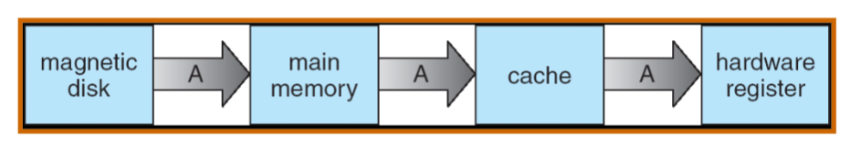
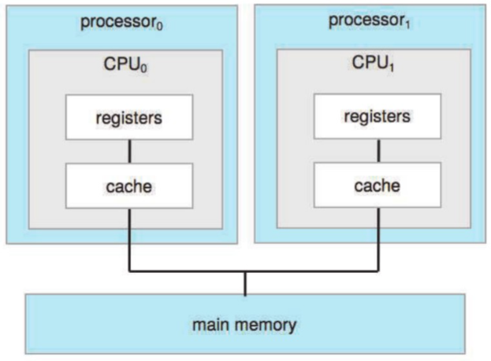
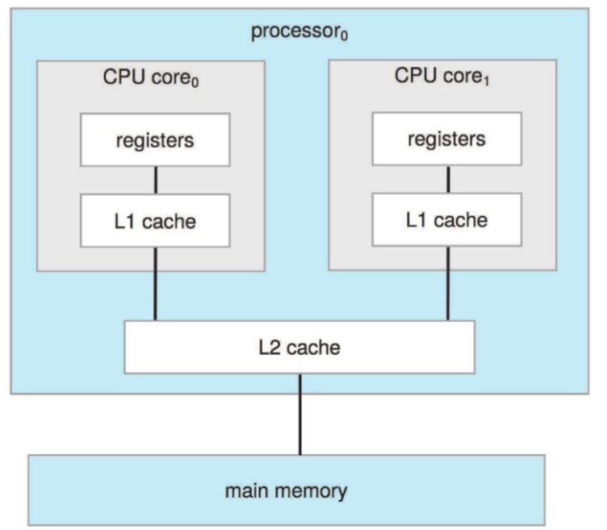

## Lecture 1: Overview

### 1. 课程结构

- Overview
- Process Management
- Memory Management
- Storage Management

### 2. OS的重要性

对计算机的发展而言，硬件不再成为驱动发展的唯一动力；软件设计也将参与进入驱动发展。

OS关注解决如下问题：

- CPU资源分配/CPU与GPU的协同问题
- 内存换入换出（内存分配）
- 存储优化
- 跨平台问题
- ...

### 3. 预置知识/参考书

本课程需要如下预置知识：

- 计算机组成/体系结构
- C
- 数据结构

### 4. Lab

lab0/1为独立完成；lab2-6为2人完成

1. lab0: RISC-V 64内核调试 5%
2. lab1: 内核引导：时钟和中断 15%
3. lab2: 线程调度，上下文切换 15%
4. lab3: 虚拟内存管理 15%
5. lab4: 用户模式(shell) 20%
6. lab5: page fault 20%
7. lab6: fork 10%
8. lab7: file system (bonus) 10%

命名：labX-姓名-学号

实验说明文档：https://zju-sec.github.io/os24fall-stu/

实验代码：https://github.com/ZJU-SEC/os24fall-stu/

### 5. 分数构成

- final: 50%
- homework: 5%
- quiz: 5%
- lab report: 20%
- lab demo: 20%

### 6. 概述

#### 6.1 怎样学好系统课程：

- 系统、全局的观察角度/微观、细致的想象能力
- 理论钻研/动手实践
- 寻找模式
  - 螺旋式上升/上下文/封装/抽象/过程式与声明式

#### 6.2 什么是操作系统？

> 一个介于计算机硬件与用户间的交互程序

为什么有必要学习操作系统？

- 云计算逐渐变为主流算力模型
- 虚拟化技术/软件定义下的存储/网络
- 容器
- 分布式环境

操作系统的定位

- 资源分配器
  - 管理所有的资源
  - 处理资源请求的冲突，达成一个平衡高效的资源利用
- 控制程序
  - 控制程序的运行，避免错误(error)以及电脑的不合理使用

操作系统的定义（并无一个具体的定义）

一个在电脑上一直在运行的程序叫做 **内核** (kernel)

#### 6.3 操作系统的启动

- **bootstrap program** 将在开启电源/重启时自动加载

> 一般存储在ROM/EPROM中，一般被称作firmware(固件)

- 初始化系统
- 加载操作系统内核(operating system kernel)并且开始运行

#### 6.4 计算机系统的架构

计算机系统通过这样的方式建立：

- 一个或多个CPU，设备的控制器（鼠标/键盘...）与内存通过总线（bus）相连
- 在CPU和设备并发运行，二者会对内存进行资源抢占

#### 6.5 计算机系统的执行

> 事实上，计算机系统执行过程中需要考虑并解决的问题为：I/O设备是慢的，而CPU是快的。这个需要我们对其进行异步处理。

- I/O设备和CPU并发运行

> 注意区分并发（concurrent）与并行（parallel），I/O与CPU是并发运行的，但它们不一定是并行运行的（可能I/O操作需要CPU进行兼顾）

- 每一个设备控制器控制一个特定的设备种类
- 每一个设备控制器有一个本地缓存（**local buffer**）

*local buffer的作用就是暂时存储I/O传入的数据，在完全准备好数据后传入CPU处理（发起中断）。它的目的是解决I/O与CPU的适配问题。*

- CPU在主存（main memory）和本地缓存（local buffer）之间进行数据的传输
- I/O就是指数据从设备传到控制器的local buffer上的过程
- 设备控制器会在操作结束后向CPU发出 **中断** 以处理数据

#### 6.6 中断

##### 6.6.1 处理架构

中断的处理架构如下所示：

CPU与中断处理器互相通信，告知对方发起中断/中断完成

##### 6.6.2 中断特性

中断有如下的特性：

- 中断将一般通过 **interrupt vector** 将控制传给 **中断服务例程** （interrupt service routine, ISR），在 **interrupt vector** 中存储着所有service routines的地址。
- 中断的结构必须存储被打断的指令地址。
- CPU在处理一个中断的时候又传来了一个中断请求，则后来的中断请求需要搁置（ **disabled** ），等待CPU处理完成后再进行中断的传输。否则会导致中断丢失（lost interrupt）。
- 对于软件生成的中断（software-generated interrupt），例如发生了error或者user request（又被称作system call，具体例子如读写文件）， 那么就会发生 **trap** 。（不同结构中可能命名不同）
- 一个操作系统应当具备支持中断处理的功能。

总结一下：

interrupt

- software-generated interrupt(trap)
  - error
  - user request
- I/O interrupt

在RISC-V中，命名会有区别，对应的命名如下：

*其中，ecalls为environment calls, 即环境请求*

##### 6.6.3 处理过程

中断的具体处理过程：

- OS要记录CPU的状态（可以通过存储寄存器（register）以及程序指针（program counter）来实现）

> program counter是指当前运行指令的下一条指令的地址。

TODO

- 根据不同的中断类型，有不同的处理方式

  - 通过轮询（polling） generic routine
  - 通过向量化的中断系统（vectored interrupt system）
- 恢复CPU状态

中断的时间线如下图所示：

处理中断的时序图如下所示：

#### 6.7 I/O结构

I/O结构有两种不同的方法（同步和异步）：

同步（Synchronous）：在I/O开启后，直到I/O操作结束才会将值返回给程序。

- 它需要等待整个数据传输结束后才能继续进行
- 一次最多只能有一个I/O请求，无法同时处理不同的I/O请求

TODO

异步（asynchronous）：

- system call
- device-status table
- OS的处理配置

它们的简图如下：

> 实际上，异步就相当于在I/O输入后立即返回新的I/O，而原来的I/O还没有运行完。

同步更慢，异步更快（但会有一定的资源冲突）

在异步过程中，需要一个device-status table来记录每一个设备的状态（idle or busy），它被储存在Kernel中。

#### 6.8 内存访问

内存访问（direct memory access, DMA）是一种local buffer与内存间直接传输，不经由CPU干预的技术。

- 它能够让高速的I/O设备能够以接近内存的速度进行信息的传递
- 每个block发生一个interrupt，由CPU来将读取的位置等信息传入local buffer，这样就不再是每byte都需要interrupt了。

#### 6.9 存储结构

由上到下，结构是这样的：

- 主存（main memory）：CPU可以直接访问的存储空间
- 次级存储结构（secondary storage）：存储一些非易失的数据
- 磁盘（magnetic disk）：物理层上存储非易失数据

存储的层级如下：

我们综合考虑如下三个机能：

- 速度
- 开销
- 是否易失

*caching：将信息存储到更快的存储系统中（更快针对的是main memory以下的结构）*

与caching策略最相关的即为 **cache** ，目前最复杂的cache有L1、L2、L3三层，L1最慢，L3最快。

整个内存结构的相关信息如下：

#### 6.10 多处理器结构

当一个数据从磁盘到寄存器中时，它将会被一层一层向上传输：

这个过程需要时间，但如果此时再次取出A（涉及到multitasking），我们需要保证A取出的值是最新的。

解决它的方案就是当在一个multiprocessor环境中，所有的CPU都要保证cache的一致性（cache coherency），即所有cache中的数据都是最新的。

##### 6.10.1 SMP架构

SMP架构可以更明显地看出这一点：

**多处理器结构并不意味着，有n个处理器就加速n倍，原因是存在一些额外的开销。**

##### 6.10.2 多核架构（multicore system）

multicore system的结构如下：

它的速度更快，能耗也更低，对移动设备较友好。

##### 6.10.3 NUMA架构

NUMA，即（none uniform memory access）

四个CPU各自有各自的memory，而互相是可以通过interconnect访问彼此的memory。

好处为，解决cache的一致性更加方便，伴随CPU的增加也可设计出相应的结构。

#### 6.11 OS架构

需求来源：多程序并行（multiprogramming）的优化，原因在于：

- 一个program不可能一直使用CPU **和** I/O设备
- 通过合理地分配工作顺序，我们可以让CPU一直有事情在运行（因为CPU资源更宝贵）
- 所有事务存在主存中
- 经过事务的调度（job scheduling）后，选取最优策略中的第一个事务运行
- 当这个事务需要等待（例如I/O设备），OS将切换到其他事务继续运行

分时系统（timesharing/multitasking）

> 举个例子，在同一台电脑上同时跑两个程序（比如边看视频边打游戏），此时CPU在同时处理两个不同的程序，如果它采用分时系统，则它会在二者中频繁更替；而由于CPU本身远远快于人的反应速度，所以人本身不会感受到CPU在二者之间的调度（也就是视频/游戏卡住）。

> 但这也就要求CPU的响应时间不能太高，否则人就反应过来了（bushi

memory中的多程序并行的部分如下所示：

#### 6.12 OS操作

- 双模式（dual-mode）
    - 用户模式（user mode）
    - 内核模式（kernel mode）
    - 某些模式有特权指令（privileged）

模式在寄存器中被存储，目的是让系统知道目前是在以怎样的模式运行的。

在用户模式中，可以通过系统调用（system call）来执行内核模式下的某些特权指令。

**注：但是system call本身不是特权指令（因为它可被用户调用）**

- 定时器/中断

定时器用于避免死循环/进程无限占用资源

- 它在一定的时间后会发出一个中断
    - OS设置一个自减的计数器
    - 当减到0时，发出一个中断
    - 报错：运行超时

#### 6.13 进程管理

进程的定义：一个正在执行的程序。是系统中的一个工作单元。

- 与程序的区别：
    - 程序（program）：被动
    - 进程（process）：主动

- 进程需要的资源：
    - CPU，memory，I/O，files
    - 初始化数据

一个单线程的进程有一个program counter（指向下一个要执行的指令的地址）

  - 进程是串行地对指令进行运行的。

多线程的进程，每个线程有一个program counter。

一个典型的系统，就是多个进程、多个用户、某个操作系统在一个或多个CPU上进行并行的运行。

在这个时候，同一个CPU往往会被多个进程使用，这就是 **多路复用** （multiplexing）

在OS中，要对进程中的以下事件进行管理：
- 对用户/系统进程进行创建与删除
- 暂停/继续进程
- 进程的同步
- 进程的交流
- 进程的死锁处理

#### 6.14 内存管理

内存中，存储有：
- 所有指令（依次执行）
- 所有进程使用前/后的数据

在OS中，要对内存的资源进行管理：
- 记录那些内存正在被使用，被谁使用
- 决定哪些进程/数据录入/移出内存
- 如何根据需要分配（allocate）与回收（deallocate）内存

#### 6.15 存储管理

与内存（memory）比较，存储（storage）为外部设备提供的存储空间。

存储空间通过一个标准的单元：文件（file）进行管理；每一个外设都有一个驱动来控制（disk drive/tape drive）

在OS中，要对存储的资源进行管理：
- 通过 **目录** （directory）对文件进行管理
- 对文件权限进行管理

当存储数据量很大时，同样需要更多的管理层面：
- 对空闲空间的管理
- 存储的分配
- 磁盘的调度

#### 6.16 I/O子系统

由于不同的I/O设备之间都存在不同的特征与兼容性问题，因此OS需要负责对不同的I/O设备进行管理（统一接口），并为用户提供一个简化的，易于操作的界面。

在OS中，需要对如下方面进行管理：
- 内存中对I/O的管理：
    - 缓存（buffering）：暂时存储传递的数据（如local buffer）
    - 高速缓存（caching）：对热数据进行存储（如cache）
    - 同步处理（spooling：simultaneous periphral operations on-line）：能够很好地处理向同一外设的多个申请
- 驱动的接口统一

### 7. 总结

OS的总体目的为：
- 抽象：界面+功能，为用户提供更便捷的方式直接与计算机交互
- 多路复用：对空间（内存）/时间（进程）上的复用
- 隔离：多个进程之间占用资源的隔离，不同操作模式的隔离
- 共享：对公用资源的调度与共享
- 安全：保证用户操作不会影响到系统本身
- 性能：对计算机运作性能进行提升
- 适用范围：跨平台使用