## chapter 10: File-System Interface

### 10.1 file concept

我们可以将整个文件系统看作一个黑盒

- 本章将主要介绍文件系统向外提供的接口（例如对文件的操作、文件的属性、数据结构（例如打开文件表，open file tables）等）
- 下一章将主要介绍文件系统内部的架构和数据结构。

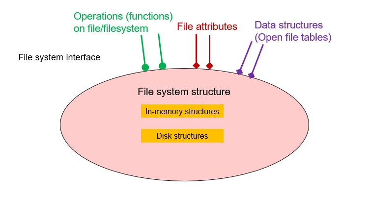

 **文件系统的定义** ：一种控制数据如何在存储媒体（storage medium）中存储、取用的方法。

- 文件命名
- 文件存放地点
- 元数据（metadata）
- 访问规则（access rules）

 **文件的定义** ：在连续的逻辑地址空间中的一系列bit/byte/line/record，需要创造者和使用者共同定义其中的含义（例如.exe/.doc/.pdf等）

 **文件的类型**：

- 数据：
    - numeric
    - character
    - binary
- 程序：
    - source
    - object
    - executable

 **文件结构**：

 - 无结构：就是一段words/bytes
 - 简单的记录结构：
     - 按行记录（`\n`为一条）
     - 固定长度的记录（方便取用）
     - 可变长度的记录（减少overhead）
 - 复杂的记录结构：
     - 格式化的文档（formatted document）（使用特定的扩展名进行解析）
     - relocatable load file（可重定位的文件；例如.exe，帮助系统更好地完成程序加载）

文件的结构是由操作系统以及程序（例如.docx由微软定义，而.pdf由Adobe定义）决定的。

 **文件的属性**：
 - 名称（name）：唯一的以面向用户的方式存储的属性
 - 标识（identifier）：唯一的标识符来标识该文件（通过名称区分可能会出现重名文件的问题）
 - 类型（type）：文件类型（例如：文本文件，可执行文件，目录等）
 - 位置（location）：指向文件所在位置的指针
 - 大小（size）：文件所占用的存储空间大小
 - 权限保护（protection）：设置权限保护，例如只读，只写，可执行等
 - 创建时间/修改时间/其他信息：用于监控
 - 对于文件的信息，它们被记录在 **目录结构** （directory structure）中。

 **文件的操作**：
 - 创建（create）
 - 写（write）：定义一个指针
 - 读（read）：通过指针读取数据
     - 往往通过预处理的方式获取当前文件位置的指针
 - 文件内的定位（seek）：指针移动到指定位置
 - 删除（delete）：释放存储空间
 - 截断（truncate）：截断文件（在文件中的某个位置处结束）
 - 打开（open）：将文件元数据加载到内存中，获得文件指针
 - 关闭（close）：释放文件指针

 **打开文件表** （open-file table）：

在调用`open()`的系统调用时，向用户返回的事实上是一个打开文件表的入口（entry）。

- per-process table
- 每个进程的PCB中都存在一个打开文件表，记录了当前进程打开的所有文件
    - 当前文件的指针
    - 访问的权限
    - ...
    - 对应一个system-wide table的入口
- system-wide table
- 全局具备一个打开文件表，记录了文件的具体信息等
    - 被打开的次数（多进程下的管理）
    - 文件的实际物理位置
    - ...

打开文件表主要需要如下的内容：

- 文件指针（file pointer）：指向文件中当前位置的指针，每个进程都有自己的文件指针（在per-process table中）
- 文件打开计数器（file-open counter）：记录了当前文件被打开的次数，当最后一个进程close后，将对应条目删除（在system-wide table中）
- 文件的磁盘位置（disk location fo the file）：记录了文件实际的物理位置（在system-wide table中）
- 文件的访问权限（access permission）：记录了当前进程对文件的访问权限（在per-process table中）

打开文件的锁：

对于文件的加锁，与读写锁类似，通过：

- shared lock(reader)
- exclusive lock(writer)

同时也可以通过：

- mandatory(强制锁)：基于锁与请求，强制规定访问权限
- advisory(建议锁)：基于请求与锁，提供建议，但不强制规定访问权限

文件类型：

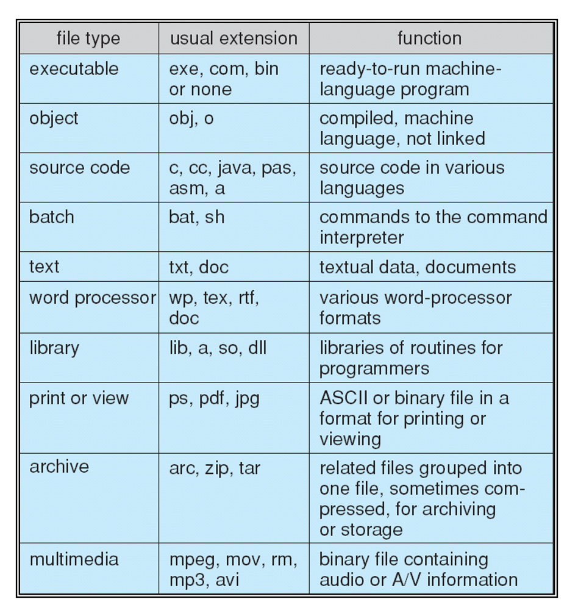

- MS-DOS
- MAC OS X
- UNIX

### 10.2 access methods

访问的方式有两种：

- 顺序访问（sequential access）：逐一进行顺序的访问
- 直接访问（direct/random access）：通过偏移量直接进行访问

#### 10.2.1 sequential access

顺序访问的文件部分可分为如下部分：

- rewind: 倒带
- current position: 当前位置
- read or write: 读或写

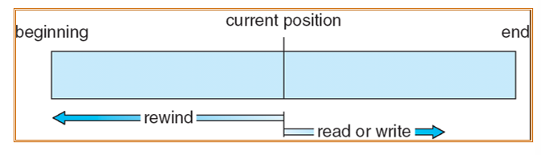

简单的相关操作为：

- reset: `cp = 0`
- read next: `read cp; cp++`
- write next: `write cp; cp++`

#### 10.2.2 direct/random access

通过管理一个索引文件进行直接访问。在索引中，包含对应字符在文件中的相对地址。

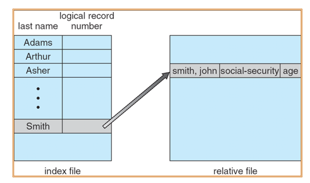

### 10.3 directory structure

目录可以被看作一个从文件名到文件控制块（file control blocks）的映射表（symbol table）

对于FCB（文件控制块）而言，可以理解为 **对应文件的一个项** ，包含了文件的一系列基本信息，包括文件名、文件大小、文件类型、文件在磁盘的位置等。可以通过文件控制块中存储的文件所在的磁盘位置进行文件的访问。

而多个FCB共同就构成了一个目录。

目录和文件，都存储于disk中。

#### 10.3.1 目录的典型结构

在一个磁盘中，可以分割成多个partition，每个partition由directory于file构成。逻辑上，每个partition可以被理解为一个 **卷** （Volume）。例如C/D盘等。

特别地，在分布式系统中，多个磁盘也可以共同组成一个大的partition（卷）。

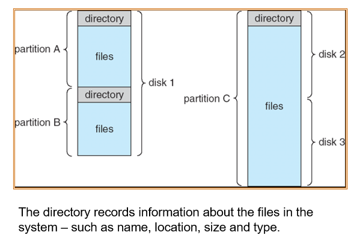

#### 10.3.2 目录相关的命令(Linux)

- 寻找文件：`find /path/to/search -name filename`
- 创建文件：`touch filename`
- 删除文件：`rm filename`
- 列出文件：`ls /path/to/directory`
- 重命名文件：`mv oldname newname`
- 压缩：`find /path/to/backup -print0 | tar -czvf backup.tar.gz --files-from=-`

#### 10.3.3 目录结构

在目录的设计中，需要考虑：

- 效率（Efficiency）：快速地定位到对应文件的位置
- 命名（Naming）：提供用户的便捷性
- 分组（Grouping）：将同类文件分在一组中，方便管理

1. single-level directory structure:

对于所有的用户设置同一个directory。

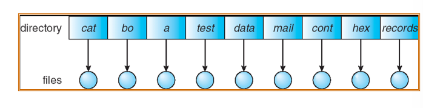

出现的问题：

- Naming problem: 不同用户的文件名可能相同，造成冲突
- Grouping problem: 所有文件在同一目录下，不方便管理

2. Two-level directory structure:

进一步，对每一个用户设置一个目录。

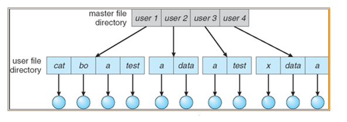

这样，不同的用户可以重名。

出现的问题：

- 搜索的效率不够高
- 仍然没有解决管理问题

3. tree-structured directories:

更灵活的设置directory，允许多级directory的存在（但需要注意的是，层数越多，磁盘I/O的次数越多，因为所有directory事实上都在磁盘中）

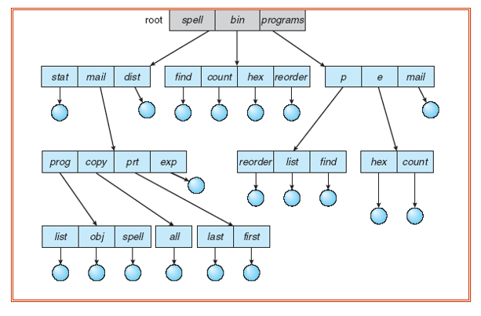

具体实现：

- 每个directory的入口都有一个标识符，标识这个入口是file（0）还是directory（1）

- 具备高效的搜索特点
- 方便grouping

4. acyclic-graph directories:
 
目前使用的就是无环图的目录结构（主要的目的为了在树结构的基础上提供共享文件的服务）：

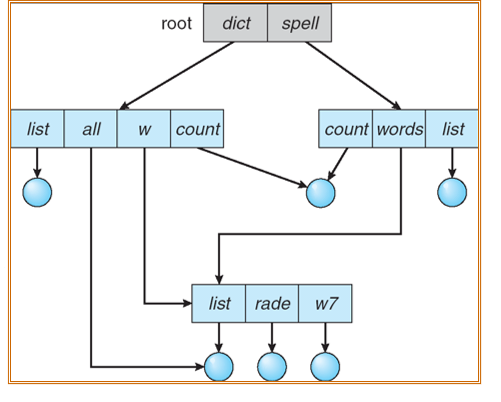

在共享文件时会出现问题：

- 在上面图中，如果`dict`删除了`count`，会导致count文件被删除两次，出现问题。

解决方法：

- 记录所有的文件引用情况（此时可以正确地删除所有的pointer）
    - 但这种方式会占用大量空间
- 使用新的类型：link
    - link分为soft link和hard link，但两者都通过不同的方式避免了对文件的直接引用。

1. general graph directory:

不再考虑是否有环，而是允许任意的图结构的存在。

问题：

- 这意味着删除操作的逻辑被破坏（因为存在环，会导致遍历循环）
- 同时会出现文件删除的问题（会因为共享计数器的问题会导致有的文件无法被正确删除）

对第二点的具体解释：

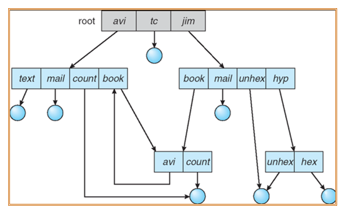

在上图中，假设以如下顺序进行删除：

- 1. 对二级右侧目录，删除`avi`目录
- 2. 对二级左侧目录，删除`avi`目录
- 3. 对根目录，删除二级左侧目录（失败）

这是因为，在第二步删除`avi`目录时，由于`avi`的被引用次数归零，因此会被真实地删除；但是此时对于二级左侧目录的被引用次数仍为2（即`avi`到二级左侧目录的引用并没有被处理），这就导致在第三步执行后虽然二级左侧目录已经不被任何目录引用，但是他的被引用次数仍为1，因此无法真正删除。

解决方法：避免环的存在

- 只允许创建指向文件的链接（对于硬链接而言）
- 使用垃圾回收的机制（garbage collection），清理无用的目录
- 进行每次加入新的link，加入并运行一个循环算法，判断是否有环的存在。

#### 10.3.4 soft link/hard link

软链接和硬链接是在文件共享的问题中使用的不同方法：

1. soft link: 软链接，当不同用户进行文件共享时，其他用户创建一个新的索引节点，但指向的文件中存储是目标文件的路径。

- 好处：可以实现文件系统间的跨越（span file systems），因为其实现的本质为路径。
- 问题：访问次数更多

2. hard link: 硬链接：将不同用户FCB中的索引节点指定为同一个节点，从而实现文件共享。

- 好处：访问次数比软链接少
- 问题：
    - 只能在同一个文件系统内使用（因为使用的是同一个索引节点）
    - 如果通过限制硬链接的方式防止环的产生，那么硬链接只能够指向文件，不能够指向目录。

### 10.4 file-system mounting

在一个文件系统被访问前，它需要先被挂载（mounted），即将它挂载到可以被访问的文件系统的目录下。

- 一个没有被挂载的文件系统，会被挂载到一个挂载指针（mount point）上

> 例如：U盘、不同规格的磁盘可能提供完全不同的文件系统，那么就需要通过挂载的方式，将不同文件系统挂载到同一个目录下。

在内存中设有一个`mount table`, 记录了所有挂载的文件系统的信息。

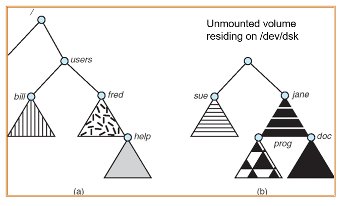

在上图中，通过将b中的内容挂载到users目录下，实现挂载。

同时，可以挂载到有内容的目录下（但原目录下的内容将无法被访问（被覆盖））。

### 10.5 file sharing

通过一个保护机制（protection scheme），来实现文件的共享。

特别地，在分布式系统中，文件也可以跨网络分享

- 通过网络文件系统（NFS）来管理文件共享的方法。

基本的数据：

- User IDs：区别每个用户，管理文件访问权限
- Group IDs：区别每个组，管理文件访问权限

Uses networking to allow file system access between systems

- Manually via programs like FTP
- Automatically, seamlessly using distributed file systems
- Semi automatically via the world wide web

在C/S架构下，支持：客户端从服务器挂载一些远程文件。

- NFS（UNIX）
- CIFS（Windows）

### 10.6 protection

文件的权限（RWX）：

- read
- write
- execute

一般的设置方法为：

- owner access: 7(RWX=111)
- group access: 6(RWX=110)
- public access: 1(RWX=001)

例如：`chmod 777 file`代表设置该文件的owner、group、public都有7的权限。

在`ll`后，可以看到每个文件的信息，其中：

`drwxrwxrwx`：标识该条目为目录，且三个权限值均为7。