## chapter 11: File System implementation

### 11.1 file system structure

有很多文件系统：

- tmpfs: 一般用在嵌入式系统中，读写很快但是易失，是一个临时的文件系统
- ext4: 目前Linux主流的文件系统，具备可靠性（因为通过日志进行管理）但性能较低
- ceph: 开源的、弹性的、分布式的文件系统
- FAT: 具备高兼容性的，简单的文件系统

其中，有一些共性的、通用的数据结构。

- 逻辑存储单元（logical storage unit）
- 相关信息的分类存储（collection of related information）
- 文件系统依赖于二级存储（磁盘）
- 文件系统以分层的方式进行管理
    - 分层的好处：进行模块化管理

文件系统的分层架构（从上往下）：

- application program
- logical file system(管理文件的元数据，进行安全与权限保护)
- file-organization module(将逻辑地址转化为物理地址，对空闲空间进行管理)
- basic file system: block I/O subsystem(进行对物理块的读写命令，对I/O操作进行管理，缓冲)
- I/O control: device drivers(将读写命令转化成磁盘设备进行实际操作的低级指令)
- devices(磁盘设备)

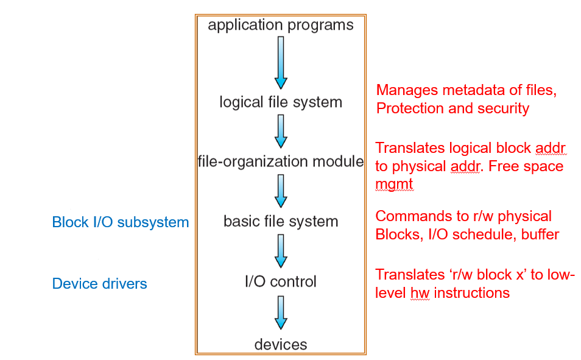

disk structures: 在每个卷的实际数据前，有一些管理信息

- boot control block(per volume)(BCB): volumn的启动信息，通常放在第一个扇区内
- volume control block per volumn(superblock in Unix): 这个卷本身的一些元信息
- directory structure per file system: 一个卷可以包含多个文件系统
- per-file FCB(inode in Unix)

in-memory structures: 内存中存储的一些数据

- in-memory mount table about each mounted volumn: 记录当前挂载的卷
- directory cache(dentry in Unix): 目录的高速缓存
- system-wide open-file table
- per-process open-file table

### 11.2 file system implementation

#### 11.2.1 FCB

典型的file control block(FCB)的结构如下：

- file permissions
- file dates(create, access, write)
- file owner, group, ACL
- file size
- file data blocks or pointers to file data blocks

**inode并不存储文件名，它是直接存在于目录项中。**

一般FCB：目录项就是FCB本身

inode: 目录项存文件名和索引节点编号的映射关系；inode中存放其他信息，包括到物理块的路径

#### 11.2.2 open file table

内存中的文件系统结构：

- a为打开文件
- b为读取文件

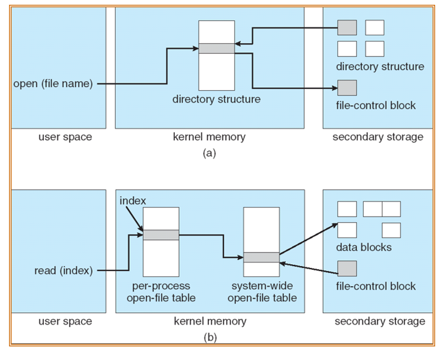

 **打开文件时，并不会将具体的文件内容进行加载或映射到内存中，而只是将FCB读入内存。** 

而在读文件后，通过per-process, system-wide的两级打开文件表，借助FCB可以直接访问到对应的数据块。

具体的打开文件方法可见下图：

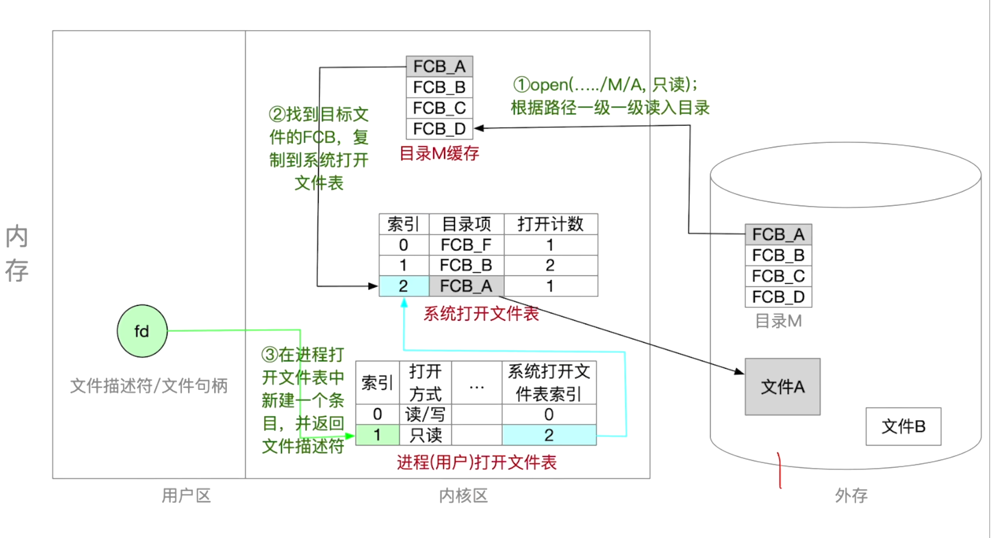

- 1. 在执行open()后，确认两级打开文件表中没有相关记录，就从目录中开始根据open()传入的路径一级一级进行读取（读入的目录会在内存的directory cache中进行缓存）
- 2. 找到对应的FCB后，将FCB复制到系统的打开文件表
- 3. 系统生成新的打开文件表的对应索引后，传回进程的打开文件表，让其与系统的打开文件表对应
- 4. 进程打开文件表新建一个条目，并将文件描述符进行返回（fd）（一般基于进程打开文件表的索引）
- 5. 用户可以直接根据fd进行读写操作。

#### 11.2.3 VFS

virtual file system(VFS): 提供了一个面向对象的文件系统实现方式。

- 定义了一个网络的结构：vnode

> 它介于file system接口与各个子文件系统之间

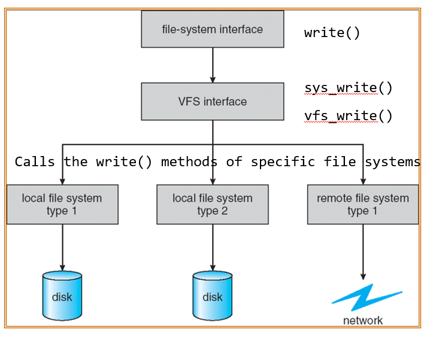

对于不同的文件系统类型，它可以将不同的read()/write()操作进行抽象，并向上层（file-system interface）提供统一的接口。

VFS的四个基本对象类型：

- superblock object: 一个特定的挂载了的文件，对应disk structure中的superblock
- inode object: 已给特定的文件，对应disk structure中的FCB
- dentry object: 一个目录入口
- file object: 一个进程打开的文件，在文件被打开时存在。

### 11.3 directory implementation

可以通过两种方式实现目录：

- 线性列表（linear list）：通过将文件名和对应的数据块一一对应
    - 实现简单
    - 执行需要时间（在遍历或搜索时）
- 哈希表（hash table）：加入哈希数据结构
    - 降低了目录的搜索时间
    - 碰撞：可能出现两个文件名哈希到同一个位置
    - 固定大小（哈希函数的输出域是一定的）
        - 可能出现overflow
        - 可以将哈希表再哈希到更大的哈希表中

### 11.4 allocation methods

给定了一个文件，将这个文件存放在哪里是一个问题。

常见的分配方法有：

- 连续分配（contiguous allocation）
- 链接分配（linked allocation）
- 索引分配（indexed allocation）

#### 11.4.1 contiguous allocation

每个文件占据磁盘中的一系列连续的块

特点：

- 简单：只需要获取文件的起始位置和文件长度即可对文件进行读写
- 支持随机访问
- 会造成空间的浪费，产生碎片（动态内存分配问题，dynamic storage allocation problem）
- 文件无法增长

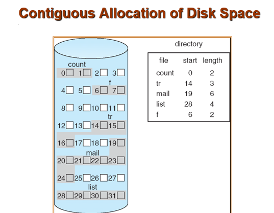

映射的方式（假设块为512KB）：

则逻辑地址LA对512取模，结果为块内偏移（R）；商为Q，则访问的块为$startno + Q$。

改进手段：extent-based system

将多个block组成一个extent，extent之间通过链表相互连接。

- 一个extent包含了多个block
- 在分配时，直接以extent为单位进行分配
- 一个文件可以包含一个或多个extent

改进后的方法仍然保持文件在一个extent内部保持连续，但是由于不同extent通过链表连接，这让文件可以增长。

问题：对于过小的文件，会出现内部碎片

#### 11.4.2 linked allocation

linked allocation可以理解为以block为单位的extent-based system。

这样的特点为：

- 简单：只需要知道起始地址，即可通过链表找到整个文件
- 没有任何空间的浪费

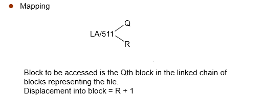

在映射中需要注意：LA是针对 **一个文件** 的。

因此，假如LA指向的是$2 \times 511 + 255$（即：第二块的255位置），那么：

- 文件描述符提取出start block
- start block往下找到链表第3个block（即跳转两次）
- 在第3个block中，找到255位置，就是对应的逻辑地址。

问题：

- 不能够进行随机访问（因为需要遍历链表才能找到文件的某个位置），较差的可靠性（poor reliability）

改进：FAT（file-allocation table）:

在内存中维护一个FAT，将disk中的block对应的链表的下一项进行存储（例如217的下一个为618，那么FAT中217的位置为618）。

这样，当需要访问某个block时，只需要查询FAT即可找到对应的链表的下一项，避免了更多的磁盘I/O。

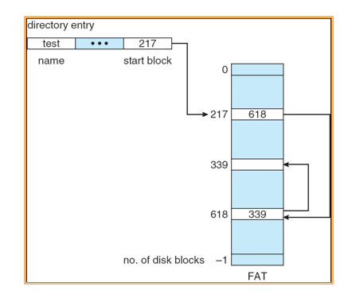

> 常规linked allocation为隐式链接，FAT为显式链接。

问题：存储FAT表会出现overhead

- 解决方法：加一个备份（backup）的FAT表，当主FAT表损坏时，可以从备份表中恢复。

#### 11.4.3 indexed allocation

将pointer相关的内容都放在一个index block中，在访问时先加载index block，然后通过计算得到对应随机访问的块的位置。

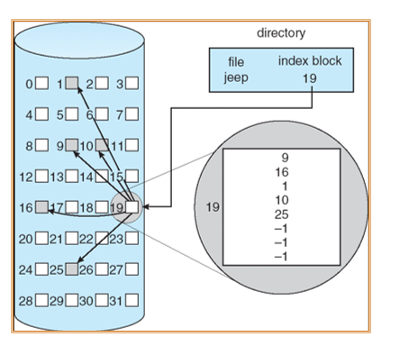

特点为：

- 可以随机访问
- 需要维护index table(可以类比page table)
- 在动态分配过程中不会产生外部碎片，但index block本身会产生overhead

映射：

When mapping from logical to physical in a file of maximum size of 256K words and block size of 512 words.  We need only 1 block for index table.

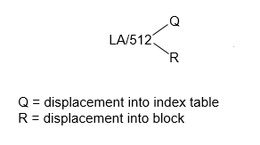

特别的，如果一个link block不足以存放所有的块号，那么在分配多个link block的同时，link block之间通过链表存储（ **注意：此时link block内部需要保留一个word用于存放下一个link block的位置** ）。

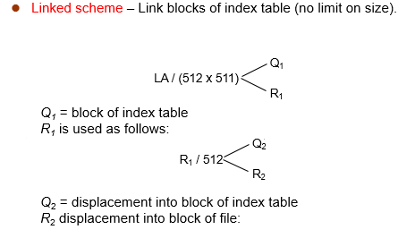

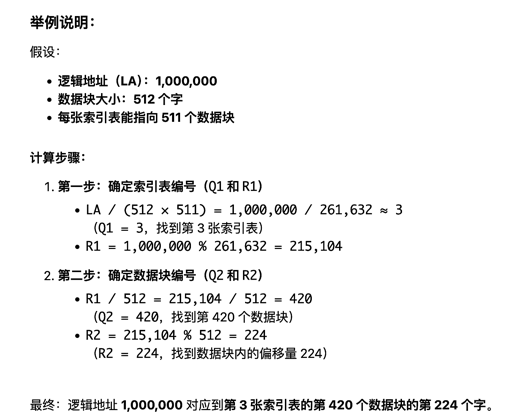

---

除了上述方法，也可以为index block设置index，从而组成多级index：

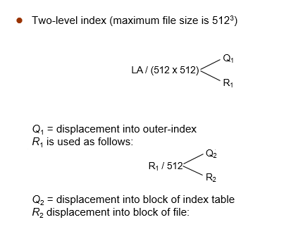

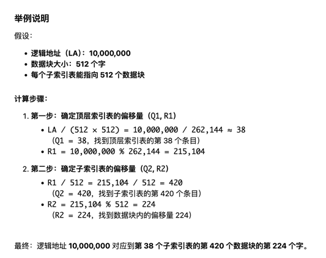

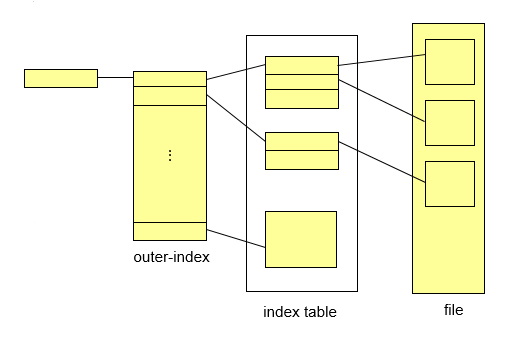

#### 11.4.4 combined scheme

对于UNIX，它同时使用了上述的几种方法，对文件进行分配管理：

- direct blocks: 直接存储一部分data的实际地址的指针
- single indirect: 指向一级index的指针
- double indirect: 指向二级index的指针
- triple indirect: 指向三级index的指针

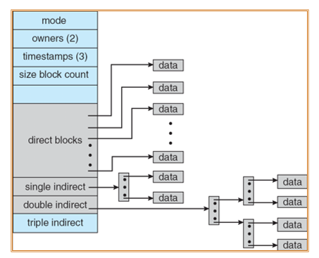

这种方式是为了避免为了创建一个小文件而设置了多级index表。

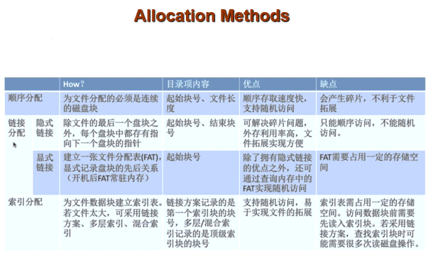

### 11.5 free-space management

### 11.6 efficiency and performance