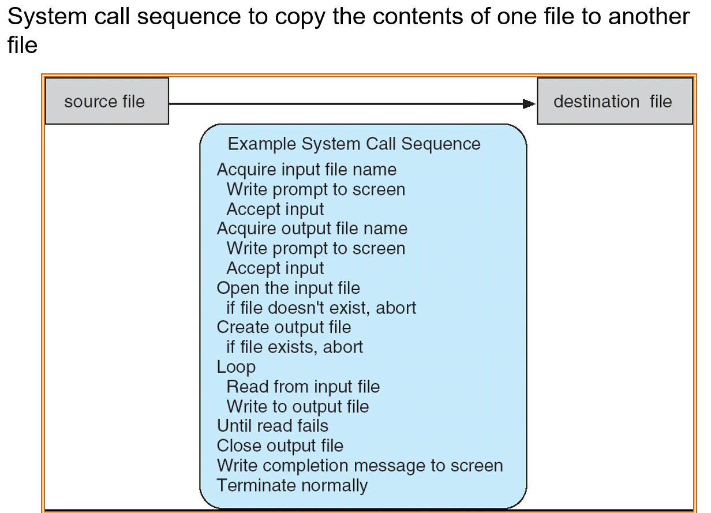
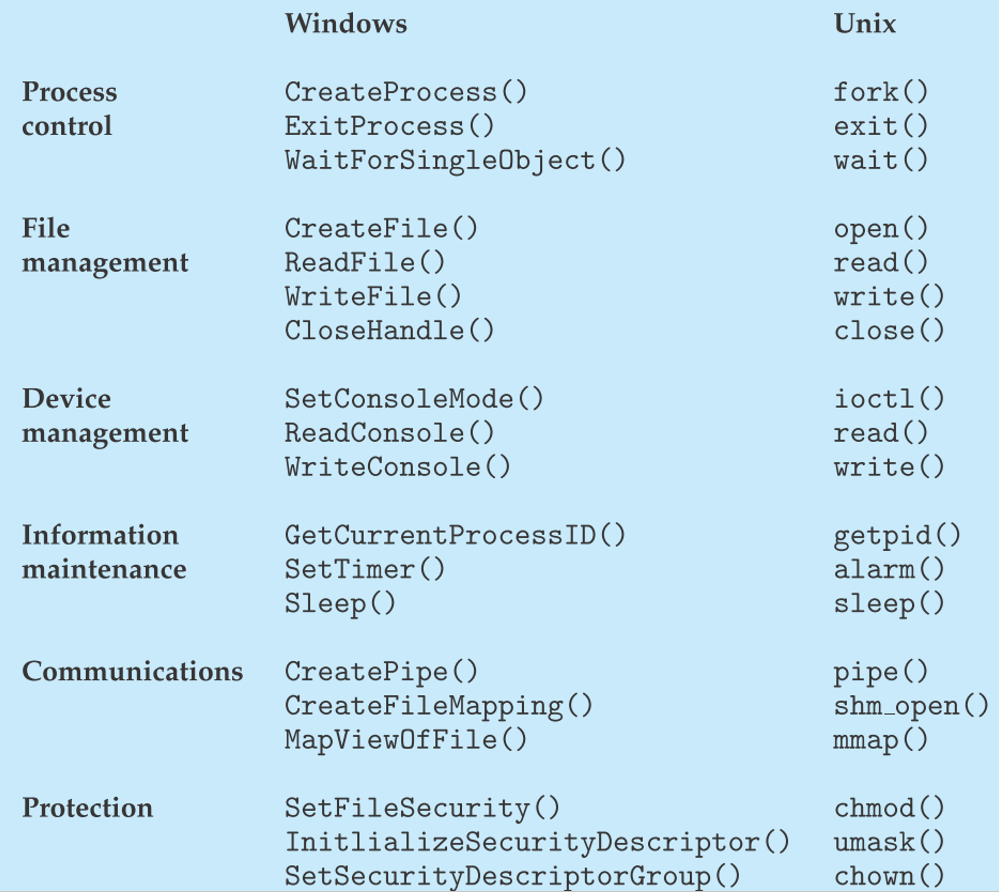
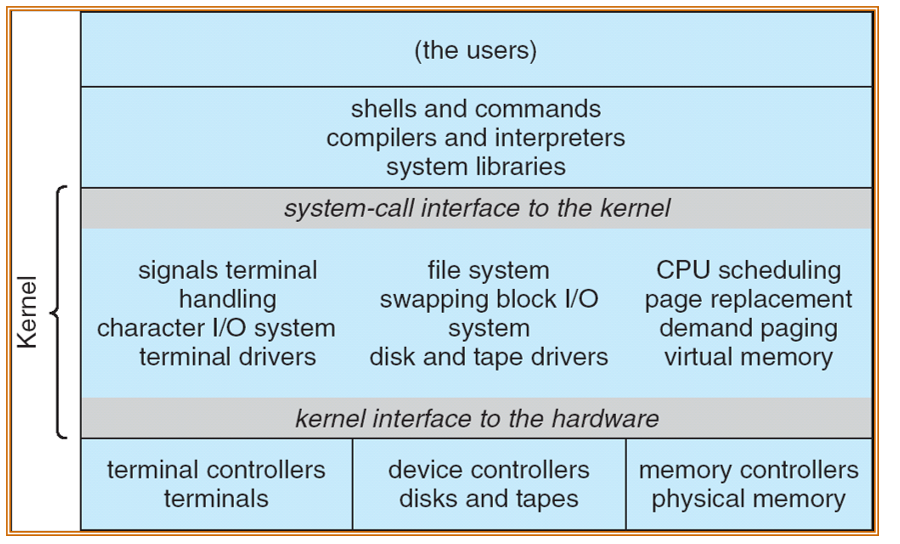
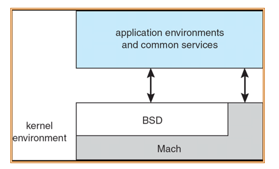
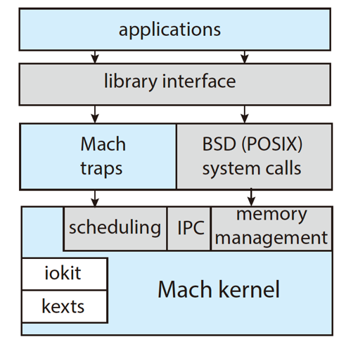
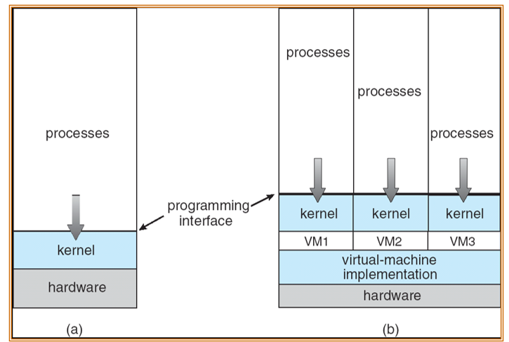

## class 2: Operating-System Structures

### 1. OS服务

一个好的操作系统，需要提供如下服务：
- 用户接口（user interface）：需要UI
    - 可以是命令行式（command-Line：CLI）
    - 可以是图形界面（graphics user interface：GUI）
    - 可以是批处理程序（Batch）
- 能够完成程序的运行
- I/O管理
- 文件管理
- 不同进程间的交互
- 错误检测
- 资源管理
- 资源使用记录
- 保护与安全

### 2. 操作系统用户接口

命令行 vs 图形界面
- 相比于图形界面，命令行有如下优势：
    - 与计算机更紧密地连接
    - 更适合完成大量重复性工作
    - 可以传递更多参数，细化具体工作内容
    - pip等一键包安装程序等

### 3. 系统调用（system calls）

相对于系统调用，大多操作系统将某些系统调用的功能封装为了API（application program interface）以方便用户完成相关操作，因此：
- system call更底层
- API更高层

典型的API有：Win32 API（Windows），POSIX API（all UNIX, Linux, Mac OS X），Java API（JVM，Java virtual machine）

> 举个例子，C语言中对文件的操作：fwrite/fread等，都隶属于POSIX API，从而调用system call对文件层面进行操作。

**为什么我们更多的使用API，而不是system call?**

API会对各种错误、默认的处理进行封装，这样就不必每次使用这些功能时都需要考虑各种情况。

#### 3.1 系统调用的实现

每个系统调用都有对应的number，而系统调用的接口会保有一个系统调用与number对应的表。

system call的接口包括在OS核中隐含的具体操作流程，返回值为当前的系统状态以及任何值。

调用system call的人不必清楚system call是如何运作的。

具体的关系如下图（事实上就是两个不同状态间的交互方式）：

#### 3.2 系统调用参数传递

传参的方法有如下三种：

1. 寄存器：直接将值存到寄存器中，让system call读取它即可（例如lab1中的sbi实现的system call）（但传参的数量和大小有限）
2. 块（block）：要把存储在block中的一系列参数传递，那么就将块的地址存在寄存器中传递到系统内（但由于不同状态间的隔离机制，不同的状态使用的地址是不同的，所以需要虚拟的技术来达成这个目的）
3. 栈（stack）：通过入栈出栈实现传参（不同mode下的栈不一定共享，需要根据不同的系统机制判断是否能通过共享的栈进行传参）

### 4. 系统调用的类型

system call一般可被分为如下6类：
- 进程控制（Process control）
- 文件管理（File management）
- 设备管理（Device management）
- 信息保存（Information maintenance）
- 交互（Communications）
- 保护（Protection）

具体例子可见下表：

- Unix中，fork()意为：**创建子进程**
- 注意到，Unix中对文件与外设都利用read()/write()，这是源于Unix的思想就是：*Everything is a file*，因此处理方式一致。

### 5. 系统程序（system programs）

举例：Solaris 10 dtrace

### 6. OS设计及实现

开发OS本身并不是一个 **“解决问题”** 的过程。因为并不清楚问题本身是怎样的，只能够尽可能优化OS的性能。

开发OS，首先从定义一些目标/指标等，同时它也受到硬件/系统的环境影响。

考虑策略（policy）和机制（mechanism）：
- 策略：what will be done? 具体做什么事
- 机制：how to do it? 定义做事方式

举例：

想让CPU中防止死循环是一种策略；使用计时器保护的手段就是一种机制。

讨论这个问题的目的是让policy和mechanism解耦，例如对于同一个问题是确定的，但mechanism是可变的，它的变化并不影响最终policy的结果。

再举例：对一个系统的policy：X协议

### 7. 操作系统结构

#### 7.1 主流内核

MS-DOS: 在最简洁的空间下实现尽可能多的功能。

操作系统的结构是分层的；layer 0为硬件，最高层为用户接口。

例如：UNIX系统的架构：

像UNIX系统这样，内核：

- 包含所有在system-call接口下的东西
- 提供基本所有OS的功能

这样的内核为**宏内核**（Monolithic structure）

而像某些系统，内核：

- 某个内核只负责某个特定的功能（例如仅负责文件管理）

这样的内核为**微内核**（Microkernel System structure）

宏内核利于数据的传输（直接传输即可，而微内核需要考虑不同模式下不同模块间的数据传输）；微内核利于延展开发、代码量小、可靠性、安全性等。

而Mac OS X或iOS系统将宏内核和微内核整合起来使用，这样的系统为“杂交系统”（hybrid structure）（也叫Darwin系统）

- 事实上，结合的本质在于将宏内核BSD和微内核Mach结合起来使用

#### 7.2 分层方式

操作系统的分层结构（layered approach），通过逐层封装的方式将操作系统分作不同层，不同层之间通过接口来通信。

但同时也导致:

- layer之间只能一层一层传递信息，而不能做到任意两个层之间都能够直接通信。
- 如何分层，在哪里分层是难以界定的。

从另一种方式，通过module的分级方法能够将不同的功能进行封装，与layer的结构相似，但更加灵活。

#### 7.3 其他结构

Exokernel：外部内核，高度简化kernel，只负责某一部分的操作，但深入低级的硬件操作。代价是必须通过定制library来供应用使用，难度大，兼容性差。

Exokernel实质相当于实现了宏内核原理的微内核。

Unikernel：打包整个OS系统为一段线性的代码，直接通过运行这段“进程”即可，因此实用性高，对云服务器快速启动等有较好的效果。

### 8. 虚拟机

虚拟机（virtual matchine）的原理，就是将硬件等资源也写成软件，通过这种方式实现运行不同操作系统内核的需求。这种虚拟叫做全虚拟化。

实现虚拟机主要需要如下系统：

效果图如下：

对不同虚拟机，需要一个Hypervisor进行管理。

### 9. 操作系统生成

### 10. 系统根