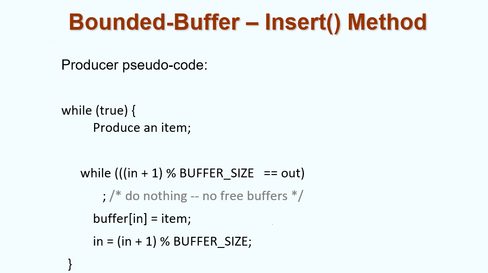

## chapter 3: 进程

### 1. 概念

#### 1.1 进程

在操作系统中，我们运行各种各样的程序：

- 批处理系统（Batch system）
- 分时系统（Time-sharing systems）

对进程（process）：进程是一个正在运行的程序。

一个进程包括：

- 文本段（text section）：代码
- 数据段（data section）：全局变量等
- 栈（stack）：函数参数、局部变量、返回地址等
- 堆（heap）：动态分配内存
- 程序指针（program counter）

> 这里的栈和堆只是用来描述不同的功能区域，与数据结构中的栈和堆无关。

大致的虚拟内存分配格局如下：

> 注意，图中的0-max不是实际地址，而是虚拟地址，通过一定的映射关系联系到实际地址。

#### 1.2 进程的状态

进程有如下状态：

- new：进程正在被创建
- running：指令正在被执行
- ready：进程正在等待使用处理器（正在等待被写入主存）
- waiting/blocked：进程正在等待某个事件的发生（比如I/O的输入等）
- terminated：进程已经完成执行

不同的状态间转化关系如下：

#### 1.3 进程控制块（Process Control Block，PCB）

进程中有一些信息需要记录，这些信息被记在进程控制块中，例如：

- Process state
- Program counter
- Content of CPU registers
- CPU scheduling information
- Memory management information
- Accounting information
- I/O status information

事实上，进程与CPU的关系是一对多的关系，一个进程可以被多个CPU执行。而在不同CPU间进行信息交接（包括不同时间点下的同一CPU）需要进程控制块中的信息。它的具体运作方式如下（图中可以理解为同一个CPU对两个进程的调度）：

同时，在进程执行PCB的换入换出时需要一定时间，这就是PCB相关的Overhead（开销）。

*补充：对于interruption对PCB的影响，某些进程可能在执行很重要/危险的操作（例如对内存相关的操作）时被中断，这时有其他的方式不令PCB优先写入，而是先等待危险操作处理完毕后再处理interruption，这种操作叫做mask.*

### 2. 进程调度（process scheduling）

#### 2.1 调度队列

对于不同的进程状态，有不同的队列进行存储：

- Job queue（任务队列）：系统中所有的进程
- Ready queue（就绪队列）：处于就绪状态的进程
- Device queues（设备队列）：等待I/O操作完成的进程
  - 因为有很多Device，所以有很多Device queue，共同构成一个队列组。

进程在各种队列之间漫游（migrate）

**事实上，队列之间存放的是不同进程的PCB，而不是进程本身。**

进程不可能同时在不同的队列，这是因为：

- 进程的实质其实是执行一系列线性的指令，这就意味着它在同一个时间段只可能处于一个状态；同时我们知道不同队列事实上代表的就是进程不同的状态。因此，进程只能在一个队列中，而不能同时在多个队列中。

而对多核CPU，可以有多个Ready queue，每个队列对应一个CPU；也可以只有一个Ready queue，但多个CPU共享这个队列；对每一个进程附加调度器，由调度器决定进程由哪个CPU执行。

一个比较好的，CPU处理进程的过程如下图（图中不同的行代表不同的特殊情况，则需要转入不同的队列）：

#### 2.2 调度器

调度器（scheduler）本身其实是一个程序。它一般分为如下两类：

- Long-term scheduler（长期调度器，or job scheduler）：负责选择哪些进程应当别加载进入内存。
  - Long-term scheduler控制了multiprogramming的度，它决定了系统中哪些进程被存入主存中。
  - 但目前由于分时系统的完善，一般都是用户主动选择将哪些进程调入内存。
- Short-term scheduler（短期调度器，or CPU scheduler）：负责决定下一个运行的进程，并且分配CPU资源。
- Medium-term scheduler（中期调度器）：当内存中的进程过多时，负责将内存中不活跃的进程换出到外存（它在磁盘中，是运行时的一片固定区域，调度成本很高，一般不用）。

*之所以命名为long/short-term scheduler，是因为它们的调度周期（频率）不同。长期调度器的周期一般为几分钟（这是由于异步处理较慢导致的），而短期调度器的周期一般为几十毫秒（这是由于CPU运行速度快导致的）。*

Long/short-term scheduler的工作位置如下：

对不同的进程，可以根据开销分类为两类：

- I/O bound process（I/O绑定型进程）：进程主要是等待I/O操作完成，因此它们的调度频率较低。
- CPU bound process（CPU绑定型进程）：进程主要是执行CPU计算，因此它们的调度频率较高。

我们需要考虑不同类型进程之间的结合。

#### 2.3 上下文切换

在不同的进程间进行切换时，需要加载/保存相应的PCB；这需要一定的时间开销。

> 为了加速上下文切换，可以将一些进程划分为一组，这样在进程切换时如果进程处于同一组中，就可以直接读取。但这将会产生额外的空间开销。

### 3. 进程操作（process operations）

#### 3.1 创建进程（creating processes）

父进程可通过fork创建子进程，这最终会生成一个进程相关的树。

父进程和子进程之间的关系有不同的设计方式：

- 资源共享方面（Resource sharing）
  - 父进程和子进程共享所有的资源
  - 子进程可分享一部分父进程的资源
  - 父进程与子进程不共享资源
- 执行方面
  - 父进程和子进程并发执行
  - 父进程等待，直至子进程结束后再继续执行
- 地址空间方面
  - 子系统和父系统公用（duplicate）地址空间
  - 子系统有一个载入其中的程序
- UNIX举例
  - fork 系统调用：创建子进程
  - exec 系统调用：在fork之后使用，用于将进程的内存空间更换为一个新的程序

具体的运行流程如下：

对于C代码，执行方法如下（假设子进程与父进程调用同一个main函数）：

实际代码中，注意到如下特点：

- 父进程结束后，子进程仍然在运行（无论是正常结束（terminated）还是被kill掉（经由interrupt/trap等方法））；当父进程调用wait()时，会等待子进程完成后才会继续执行。（即，wait()前的代码父子并行；wait()后的代码子进程先，父进程后）
- fork()生成的子进程会进入当前父进程正在执行命令的位置（可以理解为是对应汇编语句的PC）
- fork()返回值是子进程的PID
- 子进程返回的PID为0

#### 3.2 终止进程（terminating processes）

进程结束的方法有两种：

1. exit（正常结束）：进程运行到最后一个命令，并且向操作系统申请删掉自己。
   - 子进程结束时，信号会通过wait()函数传入父进程，让父进程通过wait()函数
   - 进程的资源由操作系统进行释放
2. abort（异常结束）：父进程可以终止子进程的运行，原因可能如下：
   - 子进程申请资源过多
   - 子进程的任务不再被需要
   - 父进程正在exit
     - 有的操作系统并不会由于父进程的结束而结束子进程
     - 父进程结束，对应子进程都结束，这种方法叫做级联终止（cascading termination）
     - 在某些操作系统，子进程get orphaned，父进程变为init process(PID = 1)

### 4. 进程协作（process cooperation）

#### 4.1 概述

根据进程的协作方式，有两种不同的分类：

- 独立进程（independent process）：不可影响其他进程，也不可被其他进程影响的进程
- 合作进程（cooperating processes）：可影响其他进程、也可被其他进程影响的进程

协作的优势有：

- 信息共享
- 计算速度提升
- 模块化
- 便捷性

#### 4.2 生产者/消费者模型（producer-consumer model）

将进程分为两种不同的身份：生产者/消费者；其中：

- 生产者主要负责向buffer中写入数据
- 消费者主要负责从buffer中读取数据

在这个模型中，存在两种不同的buffer:

- unbounded-buffer: 针对消费者，buffer没有大小的限制，只在没有新的数据需要处理时进行等待
- bounded-buffer: 针对生产者，buffer有大小的限制，当buffer满时，生产者等待，当buffer空时，消费者等待

其代码可以实现如下：

注意到，必然有 `out < in`，因为要先输入，再输出（out和in都假设从0开始）

根据刚才模型的思路，我们就可以设计出对应生产者与消费者的代码：

### 5. 进程通信（interprocess communication，IPC）

#### 5.1 概述

进程通信，即实现进程间信息交换并且同步它们的行动的策略（mechanism）。

两种不同的IPC方法：

- 消息传递（message passing）
  - 通过send/receive函数进行消息传递
  - 举例：pipe、socket等
- 共享内存（shared memory）
  - 通过某些两个进程均可访问的变量进行消息传递（例如全局变量）
  - 共享内存性能更好（不需要进行消息队列的管理），但实现方式更复杂（由于并发访问，需要加锁等机制）

IPC需要两个进程间建立conmmunication link。其实现方法大致有：

- 物理层面（shared memory/bus）
- 逻辑层面（sockets/pipes等properties）

#### 5.2 直接通信（direct communication）

例如如下函数：

- send(P, message)
- receive(Q, message)

这种communication link有如下特点：

- link是自动建立的
- link只能有一对（即一对一通信）
- 每对通信双方只有一个link（实现方式只有这么一种）
- 这种link可以是单向的（unidirectional）（例如中间有一个端口作为收发方，其他端口只需要持续做收/发操作即可），但一般都是双向的（bi-directional）

#### 5.3 间接通信（indirect communication）

信息通过在邮箱（mailboxes）或端口（ports）中进行传递。

- 每个mailbox有一个唯一的标识符（id）
- 进程必须共享一个mailbox，才能互发信息

这种communication link有如下特点：

- link只有在mailbox被共享时才能建立
- 一个link可以面向多个进程
- 每对进程可以共享多个link
- link可以单项也可以双向

在处理并发时，往往存在一些问题，例如：

- 当P1、P2、P3共享同一个mailbox
- P1发送，P2、P3同时接收
- 那么谁来获取这个信息？

解决方法有如下三种：

- 限定link最多只能连接两个进程
- 限定同时只有一个进程在接收消息
- 限定传输消息时必须明确receiver是谁

#### 5.4 同步（synchronization）

消息传递可以有如下两种分类：

- blocking(阻塞):同步式的消息传递，发出者必须等到接收者收到信息才能继续运行；接收者必须等待消息收到后才能继续运行
- non-blocking(非阻塞):异步式的消息传递，发出者可以发送消息，而不必等待接收者的确认；接收者可以处理消息，而不必等待消息到达(未收到消息时设置为直接收到NULL)

#### 5.5 buffering

这部分在4.2已说明，因此不再赘述。

### 6. C/S架构系统中的通信方式（communication in C/S architecture systems）
