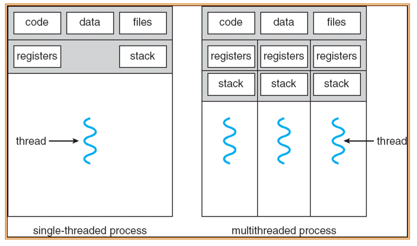
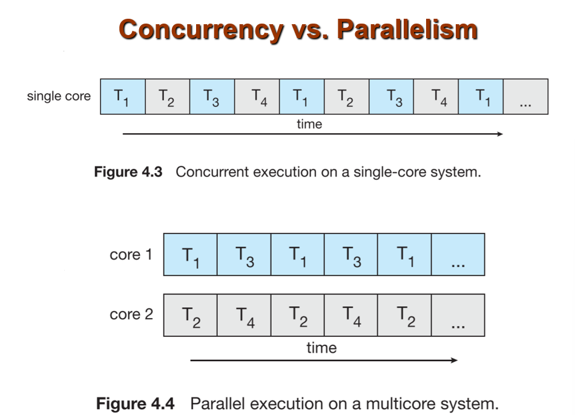
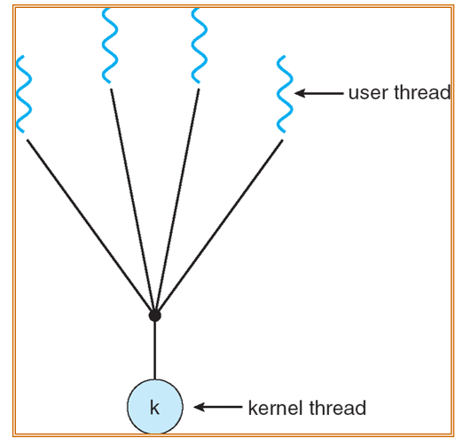
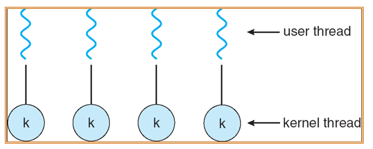
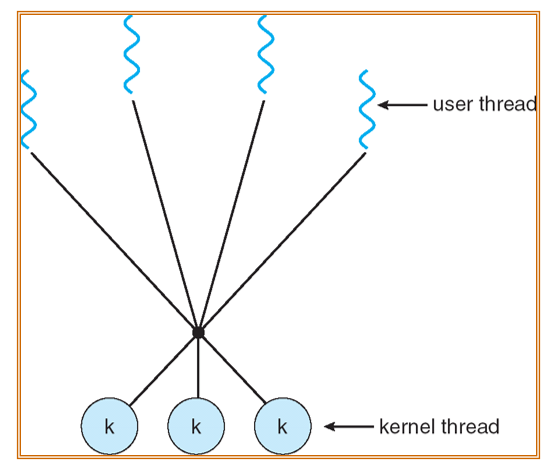
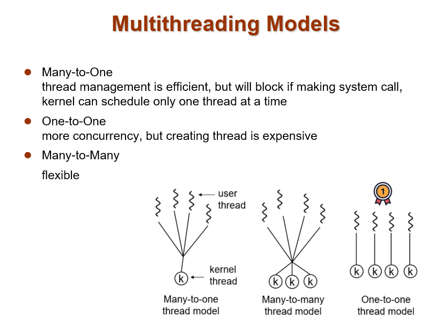
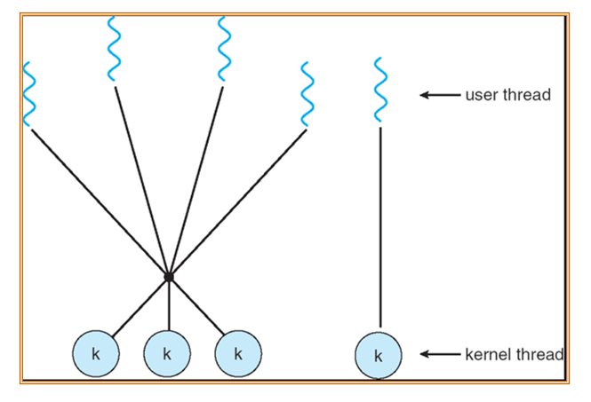

## chapter 4: 线程

### 1. Overview

#### 1.1 线程的作用

假设开发一个前端网页，需要如下功能：
- 拉取数据
- 展示数据
- 处理用户交互

如果对每一个功能函数提供1s的运行时间，那么用户每次交互都需要等待2s才能再次交互。

如果对每一个功能函数提供更短（如0.1s）的运行时间，也无法权衡用户使用方法和系统之间的异步性。

假设考虑对是否有数据传入/是否有交互来判断是否拉取数据/处理用户交互，导致if-else分支过多，性能也不够好。

我们需要如下的性能：
- 把操作砍成很小的片段
- 但出于性能考虑，我们又希望能够大片段地运行代码
- 更准确地说，我们希望**调度**这些操作

而操作系统中的**线程**管理就是为了解决这个问题。

通过如下类似代码，可以实现不同功能的多线程创建：

```
CreateThread(RetrieveData());
CreateThread(ShowData());
CreateThread(HandleUserInteraction());
WaitAllThreads();
```

#### 1.2 线程与进程

具体而言，操作系统会给每一个线程分配相应的寄存器与栈的空间；而一个进程内的所有线程都共享代码段、数据段与文件。

**注意：在多线程的概念引入后，操作系统cpu运行的最小单位已经从进程变为了线程。**

> 相应的，操作系统原本通过PCB来协助进程调度，现在也可以通过TCB来协助线程调度。



设计多线程的好处有：
- 性能优化（Responsiveness）：实现交互式应用
- 资源共享（Resource Sharing）：同进程内的线程可以共享内存
- 经济型（Economy）：创建进程开销往往更大
- 多处理器结构的实现（Utilization of Multi-Processor Architectures）：多个线程可以真正并行运行

> 因为对于多线程问题而言，我们实际上希望它们并行运行，而不是通过时分复用的方式串行运行（尽管这样能够实现类似并行的效果）。



#### 1.3 线程的分类

线程一般有如下分类：
- 用户级线程（User-Level Threads）：由User-level threads library管理并实现多线程的线程，而kernel只负责处理threads lib这一个进程即可。
    - POSIX Pthreads
    - Win32 threads
    - Java threads
- 内核级线程（Kernel-Level Threads）：由操作系统支持的线程。几乎目前所有的OS都已经实现了kernel threads。
    - Windows XP/2000
    - Solaris
    - Linux
    - Tru64 UNIX
    - Mac OS X

KLT与ULT的对比：
- KLT需要额外的上下文切换开销（而由threads lib管理的ULT只需要环境切换）
- 在涉及系统调用等的blocking操作时，KLT可以直接切换，而ULT需要等待系统调用返回

### 2. 多线程模型（Multithreading Model）

多线程模型实际上指的是ULT与KLT之间的映射。

#### 2.1 Many-to-One模型

多个ULT映射到单个KLT上。

例如：
- Solaris Green Threads
- GNU Portable Threads



#### 2.2 One-to-One模型

每个ULT映射到一个KLT上；即每个ULT都可以加入Ready queue由操作系统进行调度。这能最大化实现性能优化（即线程可起到进程的作用），但开销也很大。

例如：
- Windows NT/XP/2000
- Linux
- Solaris 9 and later



#### 2.3 Many-to-Many模型

是Many-to-One与One-to-One的trade-off。它允许多个ULT映射到多个KLT上。这允许了OS能够根据需要创建较少的KLT，来解决多个ULT的问题。

例如：
- Solaris prior to version 9
- Windows NT/2000 with the ThreadFiber package



#### 2.4 三种模型的对比



#### 2.5 多线程运行的方法

可以理解为：kernel可以调度的，作为并发运行的是ULT；而由Thread lib管理的，作为并发运行的是KLT。KLT中的处理如果涉及到了blocking操作，则需要等待系统调用返回（即权限有限）。

因此，不同的多线程模型就是ULT与KLT之间的映射关系，如果是一对一，那么KLT就相当于是ULT；如果多对一，那么就是cpu上单线程下的thread lib上多线程的程序。

#### 2.6 Two-level模型

即，在上述三种模型的情况下，同时支持多种模型的模型（例如同时使用Many-to-Many与One-to-One模型）。

举例：
- IRIX
- HP-UX
- Tru64 UNIX
- Solaris 8 and earlier



### 3. 线程问题（Thread Issues）

Threading Issues, 就是加入线程系统后，可能对操作系统产生的问题。

#### 3.1 语义问题（Semantics）

对于fork()与exec()的系统调用，在加入线程后会出现不同的语义。

例如：对一个具备多线程的父进程，在其中某个线程使用了fork()产生的子进程应当是多线程的还是单线程的？

不同操作系统对该问题的解决方法不同：
- 1. 将整个父进程进行拷贝，成立一个多线程的子进程：这种方法开销较大，但保证了不同线程的数据一致。
- 2. 将调用fork()的线程进行拷贝，成立一个单线程的子进程：这种方法开销较小，但可能导致数据不一致。

对于exec()，定义需要更改为：对原有进程的所有线程都抹掉，通过PCB替换为新的进程进行运行。

#### 3.2 线程的取消（Thread Cancellation）

除却正常退出（exit）外，通过如下两种方式取消线程：
- 异步取消（Asynchronous Cancellation）：直接调用某个函数kill掉线程；但这可能导致数据不一致或上下文出现问题（因为是异步操作，线程没有足够的时间进行数据同步）。
- 延缓取消（Deferred Cancellation）：时刻查询线程是否能被取消，等到线程进入某个特定状态时（即等待线程同步后），再进行取消操作；但这样会导致时刻都在查询，产生额外的开销。

#### 3.3 信号处理（Signal Handling）

对于不同的外部信号（例如I/O输入等），对于不同的信号种类，会定义不同的处理方式。（例如可将信号传递给每一个线程/特定的线程等）

#### 3.4 线程池（Thread Pools）

我们可以预先在线程池中创建一系列线程，让他们等待工作。

这样的优点是：
- 调用一个线程比创建新线程要快，那么在实际使用时性能会比重新创建新线程要快
- 可以限制线程的上限（其上限就是线程池的大小），避免过多的线程创建导致系统资源消耗过多。

#### 3.5 线程特用数据（Thread-Specific Data）

TLS（Thread-Local Storage）：它允许每个线程具备它们自己的数据，这些数据是线程隔离的，只有自己的线程可以访问。

在通过线程池管理线程时，可以通过TLS的存储来管理不同线程之间的数据隔离。

#### 3.6 调度激活（Scheduling Activations）

在Many-to-Many的场景下，一个的thread lib可能会被分配多个KLT。于是需要一个模块用于确定将多少个KLT分配给thread lib。这个过程叫做调度激活。

在调度激活过程中，kernel会向thread lib发送upcalls(上调用)，将相关信息传输给thread lib；thread lib通过upcall handler来处理这些信息。

这样的模块机制可以确保每一个application（每个application由一个或多个线程构成，而它们由同一个thread lib来管理）都保有正确个数的KLT。

### 4. Pthreads

### 5. Windows线程

### 6. Linux线程

### 7. Java线程