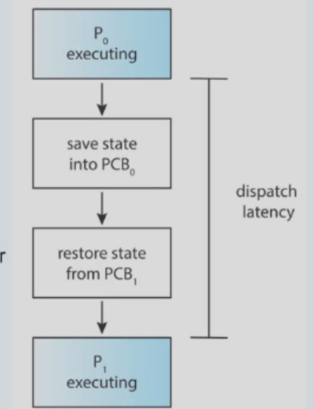
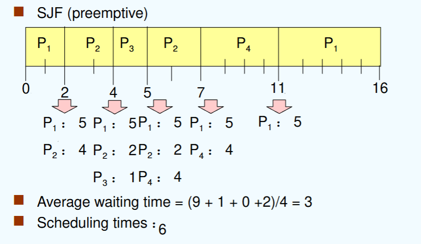
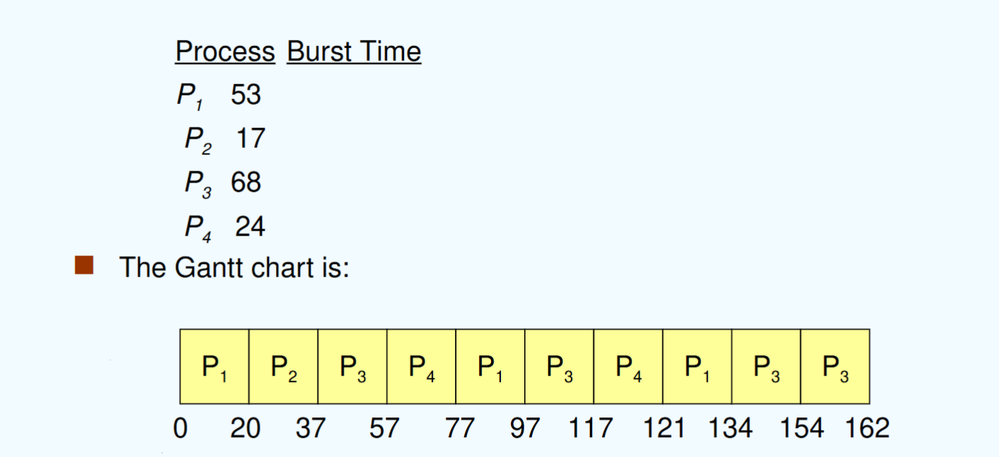

## chapter 5: CPU调度

### 0. overview

回顾：进程有如下几种状态变化：

因此，通过调度CPU资源，分配何时哪些线程/进程可用CPU，就是CPU调度的任务。

### 1. 基本概念

目标：在多道程序（multiprogramming）任务中，令CPU使用效率达到最高。

CPU-I/O Burst Cycle: CPU资源有限，I/O操作需要长时间等待，而一个程序往往是CPU burst->I/O burst->CPU burst的循环。

> CPU burst，即CPU任务爆发（很多），I/O burst同理

> CPU burst与CPU bound，一个是描述进程内的活动，一个是描述进程本身的特点。

可以根据CPU-burst的分布来分析调度算法的设计方式：

可见，CPU-burst往往会集中爆发在较短的时间内，因此一个好的CPU调度算法应当具备：

- 高频性（frequently）：能够在CPU-burst量级的时间下进行切换
- 高效性（efficient）：能够在高频的前提下完成大量的调度任务（为了实现它，往往要求调度算法本身不宜太过复杂）

CPU调度器：从memory中选取ready队列中的一个进程，并且分配一个CPU。

CPU调度可以在如下情况发生：

- 1. 当一个进程从running状态变为waiting状态时（因为waiting、I/O等原因）
- 2. 当一个进程从running状态变为ready状态时（因为interrupt等原因）
- 3. 当一个线程从blocked状态变为ready状态时（因为I/O完成等原因）
- 4. 当一个进程终止

在1、4情况下的调度叫做**非抢占式**调度（nonpreemptive scheduling）

在2、3情况下的调度叫做**抢占式**调度（preemptive scheduling）。

dispatcher module（调度员模块）：负责控制CPU调度中线程切换的过程控制，例如：

- 上下文切换（switching context）
- 切换到user mode（**这一步不一定需要**）
- 跳转到新进程的地址，并开始执行任务（program）

dispatch latency（调度延迟）：上述过程控制中消耗的时间

### 2. 调度准则（Scheduling Criteria）

#### 2.1 基本定义

CPU utilization（CPU利用率）：让CPU尽可能一直保持繁忙

Thoughput（吞吐率）：每个时间单位（time unit）内完成的作业数量

Turnaround time（周转时间）：对一个特定的进程，执行它所需的总时间（从提交到CPU到执行完毕（terminated））

- 周转时间 = 等待时间 + 运行时间

Waiting time（等待时间）：一个进程在ready queue中等待的总时间

- **Waiting time不是等待I/O的时间，而是进程在ready queue中等待CPU的时间**
- 再次注意：等待的时间**不包括**I/O!画甘特图时要注意：并不是所有等待时间都是waiting time
- **等待时间 = 进程开始的时间 - 进程提交的时间，要记得减去提交时间！**

Response time（响应时间）：从一个进程提交到CPU到进程返回第一个response的总时间（对于分时系统，并非截止到第一个output，而是第一个response）

下面图片是计算的例子（可以通过甘特图分析）：

如果换个顺序，先运行$P_2$、$P_3$，则结果如下：

可以发现：**运行的顺序会影响最终的性能。**

### 3. 调度算法（Scheduling Algorithms）

#### 3.1 先来先服务（First-come, first-served, FCFS）

- 最简单的调度算法，即按**提交顺序**进行调度，先提交的任务先运行。

显然，这是一种**非抢占式**调度。

> 注意到，进程提交的先后顺序会影响调度算法的性能。

其特点如下：

- 较常见
- 非抢占式
- 简单
- 护航效应（Convoy effect）：即短时间进程在长时间进程后面，平均等待时间会很长，导致I/O或CPU长时间处于空闲状态。
- 有利于长作业，不利于短作业
- 有利于CPU-bound，不利于I/O-bound（这是因为CPU-bound运行较快（I/O等待时间较短），I/O-bound运行较慢（CPU等待时间较长））

#### 3.2 短作业优先（Shortest-job-first, SJF）

- 根据每个进程的**下一个PCU burst的长度**进行调度，即先运行**最短的进程**，再运行**第二短的进程**，以此类推。

它分为两种不同的策略：

- 非抢占式：一旦CPU分配给了一个进程，它就必须运行完CPU burst区块，再进行调度。
- 抢占式：如果在运行过程中有一个新的进程插入，其CPU burst长度小于当前进程，则直接调度给新进程。这种策略又叫**最短时间优先**（shortest-remaining-time-first, SRTF）。

举例：对如下这些进程：

| 进程 | 到达时间 | burst time |
| ---- | -------- | ---------- |
| P1   | 0        | 7          |
| P2   | 2        | 4          |
| P3   | 4        | 1          |
| P4   | 5        | 4          |

1. SJF（非抢占式）：P1先运行（必须运行完），再调度P3（burst time最小），再P2、P4（burst time次小）。

**要注意对waiting time和scheduling time的计算。**

第一次调度（即从idle到P1）也算作一次scheduling time。

2. SJF（抢占式）：P1运行到2时由于2的burst更小因此转到P2，以此类推进行调度。

需要注意的是：并不能确定**next CPU burst**的大小。但我们可以预测它的大致长度。

例如：指数平均法（exponential averaging）：

$$
t_n 为当前实际的CPU~burst长度 \\
\tau _{n+1} 为预测的下一次CPU~burst长度 \\
\alpha 为衰减因子: 0 \leq \alpha \leq 1 \\
定义公式为：\tau_{n+1} = \alpha \cdot t_n + (1 - \alpha) \cdot \tau_n
$$

即：$\alpha$月接近0，对上一次预测结果的倾向性越大；$\alpha$接近1，对上一次实际结果的倾向性越大。

预测效果大致如下：

SJF的特点如下：

- 是最优解（平均等待时间最短）
- 抢占式/非抢占式不一定哪个更好，需要根据CPU burst进行判断
- 饥荒（在ready queue中有一个最大的进程，但不断进入短作业，导致它一直无法被运行）
- 对长作业（long process）不利

证明SJF为最优解：

1. 非抢占式：对第$i$个进程，其等待时间为$\sum_{j=1}^{i-1}T_j$，其中$T_j$为第$j$个进程的周转时间。在非抢占式SJF中，它是取$T$中的前$i$个最小值，因此必然有$T_i$最小。因此，非抢占式SJF的平均等待时间最短。
2. 抢占式：可用数学归纳法解决。

#### 3.3 优先级调度（Priority Scheduling）

即，每个进程伴随着一个优先级（priority），CPU分配给优先级最高的进程。

优先级的值越小，优先级越高（但我们之后只取后者的语义）

事实上，SJF也是一种优先级调度，其优先级就是next CPU burst time

优先级的定义分为两种方式：

- 静态优先级（static priority）：在进程创建时就确定，并不再更改。
  - 问题：饥荒（stavation）：优先级低的进程长期得不到调度，导致长时间等待。
- 动态优先级（dynamic priority）：根据进程的行为（如CPU burst time）进行动态调整。
  - 解决方法：老化（Aging）：进程的优先级伴随时间的增长而增长。

##### 3.3.1 高响应比优先（Highest Response Ratio Next, HRRN）

将响应比作为优先级的判定标准。响应比的计算方法为：

$$
响应比=1 + \frac{waiting~time}{CPU~burst}
$$

每次调度后，更新等待时间，并重新计算所有线程的响应比。

它的特点如下：

- 它一般理解为一种**非抢占式**的算法。
- 它是一种FCFS和SJF的折中（compromise）。
- 但它需要进行额外的（对响应比）计算。
- 尽量保证每个进程都能运行到。

#### 3.4 时间片轮转调度（Round-robin scheduling，RR）

每个进程有一个时间片（time quantum），即一个很小的CPU运行时间，当时间片耗尽后，CPU将被抢占，进程会排到ready queue的末尾。

**注意：如果进程所需时间小于时间片，则不需等到时间片耗尽再被抢占。**

它的周转时间（average turnaround）更高，但响应(response)更好

它的特点如下：

- 假设一共有n个进程，时间片为q，那么没有进程等待时间会超过$(n-1)q$。
- 性能：当q较大时与FCFS相似；当q较小时，q应当比上下文切换开销时间更大，否则overhead会很大。
- 应用场景：分时系统（time-sharing system/ multi-tasking system）

#### 3.5 多级队列（multilevel queue）

与KLT/ULT架构中的**two level**架构相似，在不同的进程模块使用不同的调度算法。（例如在前端使用RR，后端使用FCFS）

注：多级队列中**进程无法在队列间转移**。

队列间的调度有如下两种方法：

- 固定的优先级调度（例如先完成前端的所有进程，再完成后端的）
- 时间片（在不同队列之间使用类似时间片调度的算法）

#### 3.6 多级反馈队列调度（Multilevel Feedback Queue Scheduling）

与多级队列相似，但**进程可以在队列间转移**。

由于不同队列的优先级不同，因此进程的转移就相当于实现了进程的动态优先级调整（即aging可被实现）。

它往往由如下参数构成：

- 队列的数量
- 不同队列的调度算法
- 进程何时转移到优先级更高的队列（upgrade）
- 进程何时转移到优先级更低的队列（demote）
- 新进程需要被处理时，它初始应当在哪个队列

一个简单的调度方法如下：

- 设置多个ready queue, 优先级依次降低
- 优先级越高，时间片越短
- 每个队列都采用FCFS，若在时间片内完成则terminated，否则转到下一优先级队列
- 按照队列优先级调度，仅当上一级为空时才运行下一级

### 4. 多处理器调度（Multiprocessor Scheduling）

multiprocessor scheduling就需要对多个CPU资源进行调度。首先要关注如下问题：

- 暂时假设CPU都是**同构**(Homogeneous)的（即算力、性能等完全一致）
- 注意负载平衡(load balancing)，使不同CPU的运行时间尽量平衡
- 非对称式调度（asymmetric multiprocessing）：一个CPU负责调度所有CPU的进程，其他CPU只负责运行进程即可（问题在于中心CPU崩掉，整个系统就无法运行了）
- 对称式调度（symmetric multiprocessing）：每个CPU都有自己的调度器，但它们之间需要通信。

### 5. 实时系统调度（Real-Time Scheduling）

实时系统，就是指某些进程必须在**规定时间内**完成，加之这个限制的系统。

- 硬实时系统（hard real-time systems）：要求系统必须在规定时间内完成，否则系统会崩溃（例如军事、航天领域系统）。
- 软实时系统（soft real-time systems）：要求系统在规定时间内完成，但如果超时了也不会有太大问题（例如视频通话）。

经典的几个调度算法如下：

- 最早截止时间优先（Earliest Deadline First, EDF）：按到期时间排序，最先到期的任务优先运行。
- 最低松弛度优先（Least Laxity First）：进程的松弛度=A必须完成的时间点-当前时间点-A运行需要的时间。

### 6. 线程调度（Thread Scheduling）

就是对不同等级（KLT、ULT）的线程进行调度。

- 1. 本地调度（local scheduling）（process-contention scope），对Threads library如何对用户级线程进行调度。
- 2. 全局调度（global scheduling）（system-contention scope），对操作系统如何调度内核级线程进行调度。

  - Many to one
  - one the one

### 7. 操作系统实例（Operating System Examples）

- Solaris调度算法
- Windows XP调度算法
- Linux调度算法
