## chapter 6: 进程同步（Process Synchronization）

### 1. 背景

需要进行进程同步的原因：

- 对共享数据的并发访问（concurrent access）可能会导致数据的不一致（data inconsistency）

> 尤其是对于合作型进程，同步管理显得更为重要。

典型例子：生产者-消费者模型中的指针问题

假设使用count作为记录缓冲区内的数据总量：

- producer操作成功，count加1
- consumer操作成功，count减1

此时就出现了并发（写入）访问同一数据的问题，以及数据的同步问题。

例如，在调用 `count++`时，汇编中的语言对应的实质上是如下语句：

- `lw t0, count`
- `add t0, t0, 1`
- `sw count, t0`

同理，`count--`同样对应了三个语句。那么如果使用进程调度算法，在两个进程同时执行 `count++`和 `count--`时，会导致语句交错执行，最终导致数据出错：

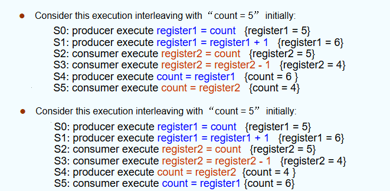

（即：在写入count时并未很好的保障数据一致性，导致数据出错）

竞态条件（Race condition）的定义为：一个内存地址被并发访问，且至少一个访问是写操作。

> 在这种条件下，可能会产生数据不一致的问题。

这种条件往往在抢占式调度算法（如RR、抢占式SJF等）触发；对于非抢占式算法，若场景为多处理器，则也可能触发。

**解决竞态条件问题，并不是由OS来负责的，而是通过程序对共享内存进行限制从而解决。**

### 2. the critical-section problem

critical-section：临界区：程序中访问临界资源的程序片段

critical-resource：临界资源：（在多线程或多进程环境中）被多个进程共享的资源，它需要使用适当的同步机制，使同一时刻只有一个县城霍金城可以访问这些资源。

举例：

- 临界资源：全局共享变量等
- 非临界资源：局部变量、只读数据、CPU等

**注意区分二者的区别：临界区是程序，临界资源是被访问的数据。**

临界区可以被改装成如下形式：

- Entry section: CPU是否能进入临界区，如不能则等待
- Critical section: 临界区内的操作
- Exit section: CPU退出临界区

如何分割临界区，是否要合并临界区，是需要考虑的问题（合并量过大则并发度低）

#### 2.1 解决方法

解决该问题，首先应当满足如下三个标准：

1. 互斥（Mutual Exclusion）：当一个进程在执行临界区代码时，其他进程不能进入临界区。
2. 空闲让进（Progress）：如果当前无进程在临界区，而有一些进程在等待进入临界区，则系统应当分配一个进程进入临界区。
3. 有限等待（Bounded Waiting）：当多个进程共同需要访问同一片临界区时，某一进程等待的次数必须要有上限。（有如下条件）：
   1. 假设每个进程都以非零的速度运行（不会停止）
   2. 不考虑不同进程执行的速度不同

**注意：所谓有限等待是等待的次数有限，而与等待的时间无关。**

因此，可以有算法不满足2而满足3（只需等待有限次，但由于不满足2而一直被卡住）

#### 2.2 具体同步机制

##### 2.2.1 软件实现方法

###### 2.2.1.1 单标志法

就是设置一个公共的整型变量turn，指示允许进入临界区的进程编号：

例如：`turn = i`时，允许$P_i$进入临界区；当进程退出临界区时，再修改turn为其他等待进入临界区的进程编号。

这样的方法可以实现**两个进程轮替**进入临界区：

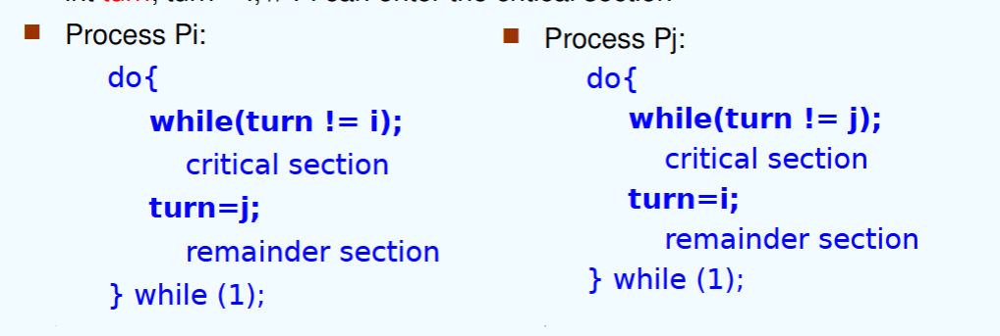

它的特点如下：

- 满足互斥条件：只有一个进程能进入临界区
- 不满足空闲让进条件：因为必须轮替，如果i多次需要进入临界区而j暂时不需要进入临界区，i必须等待j进入临界区后才能进入
- 满足有限等待条件：因为是轮替的执行方法

###### 2.2.1.2 双标志后检查法

设置 `flag[2]`记录各个进程进入临界区的意愿（`flag[i]=true`表示进程i想进入）

在执行时：

- 表达想要进入临界区
- 轮询对方是否想进入，如果不想进入后再进入
  - 即，若其他进程的flag为true，意味着它们想进入临界区或已经在临界区中了，那么就要等待它们退出（flag为false）
- 访问退出后设置 `flag[i]=false`，允许对方进入

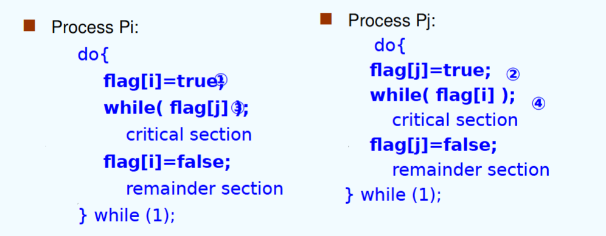

它的特点如下：

- 满足互斥条件：只有一个进程能进入临界区
- 不满足空闲让进条件：这是因为由于CPU调度，可能出现二者均设置为true，之后才开始死循环，最终导致两个进程都无法进入临界区
- 满足有限等待条件：因为轮询对方是否想进入，如果不想进入后再进入，因此最多一次等待。

###### 2.2.1.3 双标志先检查法

与双标志后检查法相似，但是先验其他进程的flag是否为false，再设置自己的flag为true。

它同样没有解决由于CPU调度可能产生的问题，而矛盾转嫁到了互斥条件上。

它有如下特点：

- 不满足互斥条件：通过CPU标度可能出现两个进程均进入了临界区，导致同时访问。
- 满足空闲让进条件：因为先检查对方是否想进入，因此必然不会卡死。
- 满足有限等待条件：因为轮询对方是否想进入，如果不想进入后再进入，因此最多一次等待。

###### 2.2.1.4 Peterson's solution

同时使用 `turn`和 `flag`变量，其中 `turn`用于轮流进入临界区，`flag`用于记录进程是否准备进入临界区。

运行流程如下：

- 进程首先表达自身意愿，设置 `flag[i]`为true
- 之后设置对方要进入（`turn=j`）（谦让的规则）
- 如果双方互相确定对方都想进入，那么turn只会为一个值，因此能够保证同时有且仅有一个进程进入临界区

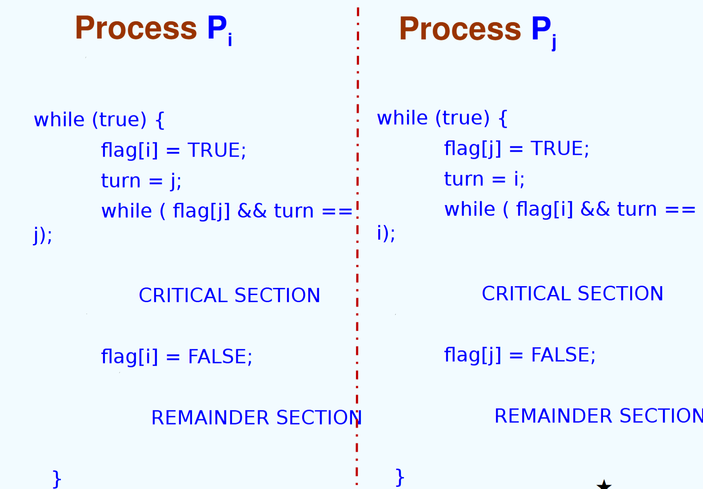

它三个条件都满足了（第三个条件bound为1）

**注意：不能够设置turn为自己，因为这样的话turn只有一次机会设置为自己，可能会由于CPU调度导致turn的数据被清掉，从而让这个进程卡死。**

**同时，也有可能导致互斥性不满足（当一个进程在临界区时进行调度，其他进程可以直接进入临界区）**

Peterson's solution可能在不同的机器架构下出错（这是由于编译上的优化问题）：

- 在编译时，编译器会希望先执行load，再执行store；这可能会导致while语句先执行，最终变成先验式算法

> 为什么会出现：在编译时将while语句移到前面执行？

事实上，编译器会对进程内的代码进行编译上的优化，使它能够更高效地运行。一般的，编译器会对**单个进程内的局部变量**进行优化（例如将while语句提前以提高性能），这是因为考虑到局部变量不会被其他进程所修改，因此采用这种编译方式还能够保证逻辑的正确性。

然而在Peterson's solution中，flag和turn不是局部变量，它会被其他进程修改，因此如果不加以限制让编译器不对其进行优化，那么就可能会出现错误。

解决方法：加入内存栅栏，强制让store语句先执行：

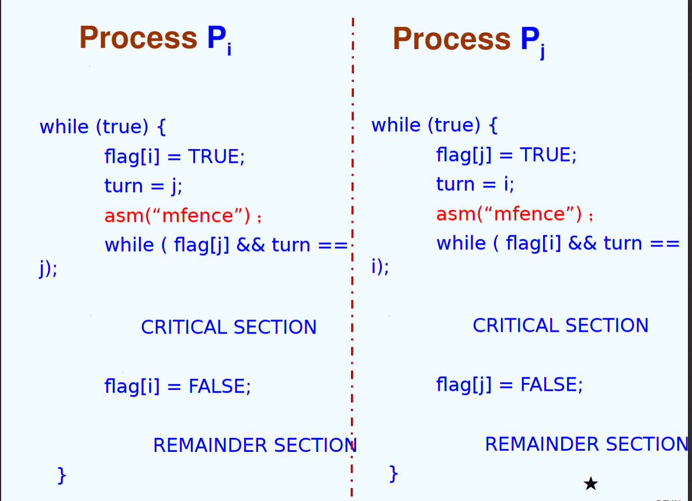

###### 2.2.1.5 Bakery algorithm

每个进程在进入临界区前先会取到一个号码（号码生成方法会确保号码递增）；号码最小的进程可以进入临界区。

所需的变量如下：

- `boolean choosing[n]`: 表示进程是否在取号
- `int number[n]`: 记录每个进程取到的号码

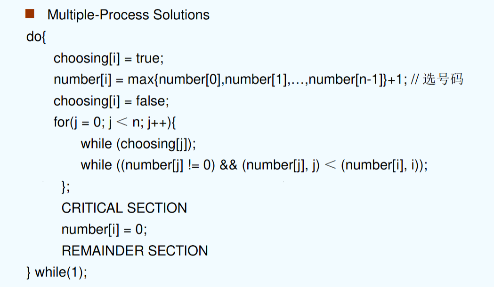

即：

- 先选号
- 遍历数组，如果有进程在选号则等它选完；
- 如果对应进程优先级大于自身（number更小），那就等待它直到它为0（退出临界区）
- 如果遍历结束，那么进入临界区

这样的方式能够保证**遍历过的进程**获取的号码必然更大（时间原因），那么它必然不可能与当前进程共同进入临界区（因为会卡在当前进程的遍历）

换句话说，遍历过的进程要么没叫号，即使叫号优先级也更低；而未遍历过的进程所有情况都有可能，因此只要遇到了优先级更高的进程就会等待。

它满足上述三个条件，其中bound为n-1（具体特例与遍历顺序有关，如果是从前往后，那么情况就是从第n个进程开始依次叫号直到第一个进程，那么这时第一个进程需要等待n-1次调度）

### 3. 同步硬件（synchronization hardware）

很多系统都有对于临界区的同步硬件支撑。

1. 通过中断的方法对其中的同步进行处理。
2. 通过原子性的硬件操作实现（原子性（atomic）事实上就是非中断的（non-interruptable））

**注意：从3.2开始的代码段的意思不是要作为代码写进程序中，而是这些函数是在硬件层面实现的，它们强制被设置为原子性（即一次性执行所有代码）。**

#### 3.1 关中断法/中断屏蔽法（disable interrupt）

- 在进入临界区前关闭中断，让其他程序不能够使用中断对临界区进行访问
- 使用后再打开中断

缺点：

- 关闭中断会严重影响CPU执行效率（并发效率降低）
- 不适用于多CPU系统，无法有效同步各CPU的操作
- 安全性问题：可能有一些重要的中断请求被错过，影响系统的稳定性和可靠性

#### 3.2 TestAndSet Instruction

通过小操作实现判断的原子性：

```c++

boolean TestAndSet(boolean *target)
{
    boolean rv = *target;
    *target = true;
    return rv;
}

```

即：若输入为False，返回False并更改它为True；否则返回True。

通过这种方法，避免了并发CPU调度时可能出现的问题（因为判断的是修改前的值，因此可以满足Progress条件）。

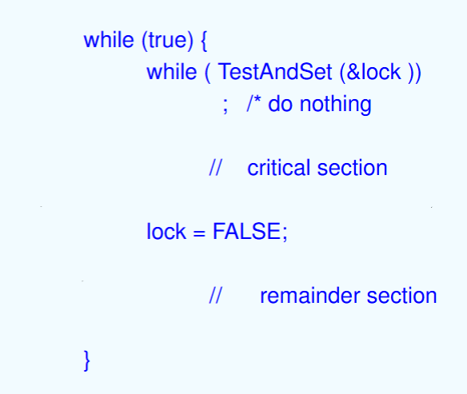

它的特点如下：

- mutual exclusion: Yes
- Progress: Yes
- Bounded Waiting: No （因为当lock被释放时，无法确定哪个正在等待的进程会得到访问的权限，因此有可能有进程一直得不到权限）

#### 3.3 swap instruction

通过Swap操作实现原子性：

```c++

void Swap(boolean *a, boolean *b)
{
    boolean temp = *a;
    *a = *b;
    *b = *temp;
}

```

实现的思想为：lock为全局变量，key为进程的局部变量（初始为True），在希望访问临界区时不停互换lock与key的值，如果lock为False则key在互换后会变为False，从而能够在访问临界区的同时将lock设置为True。

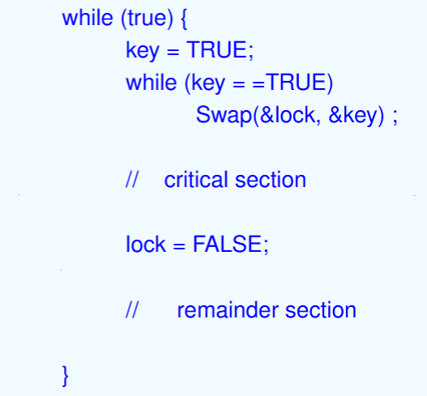

它的特点如下：

- mutual exclusion: Yes
- Progress: Yes
- Bounded Waiting: No （因为当lock被释放时，无法确定哪个正在等待的进程会得到访问的权限，因此有可能有进程一直得不到权限）

#### 3.4 The compare-and-swap instruction

通过CAS指令实现原子性：

```c++

int CAS(int *ptr, int oldval, int newval)
{
    int old = *ptr;
    if (*ptr == oldval) {
        *ptr = newval;
    }
    return old;
}

```

（事实上，就是在TestAndSet的基础上增加了对旧值判断）

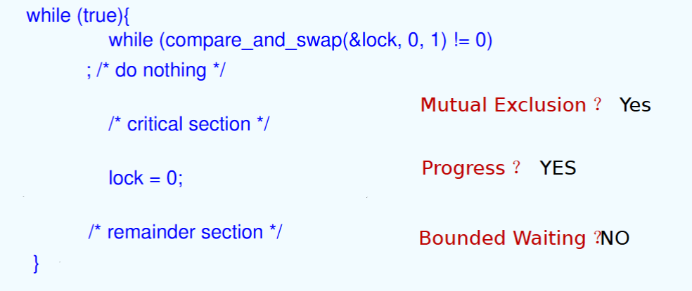

它的特点如下：

- mutual exclusion: Yes
- Progress: Yes
- Bounded Waiting: No （因为当lock被释放时，无法确定哪个正在等待的进程会得到访问的权限，因此有可能有进程一直得不到权限）

为了解决bounded waiting，可以设计一个等待队列来解决：

即：

- 对每个进程，只有当其waiting序列为false或lock=0时可以访问critical section：
- 先设置waiting为true，key=1
- 之后不断交换key与lock，直至发现lock为0则进入critical section（此时也会一直监听waiting是否被修改为false）
- 当一个进程成功进入critical section后
  - 设置其waiting为false
  - 执行临界区代码
  - 选择下一个进入临界区的进程（从当前进程序号开始依次往后遍历，找到waiting为true的其他进程）
    - 如果存在这样的进程，将它的waiting设置为false（则对应的进程可以跳出第三步循环）
    - 如果不存在，就将lock置为0

> 注：在这种方法下，lock仍然是必要的，因为它需要用来控制最基本的进程进入；同时由于lock本身也是临界区资源，所以必须使用原子性操作才能完成。

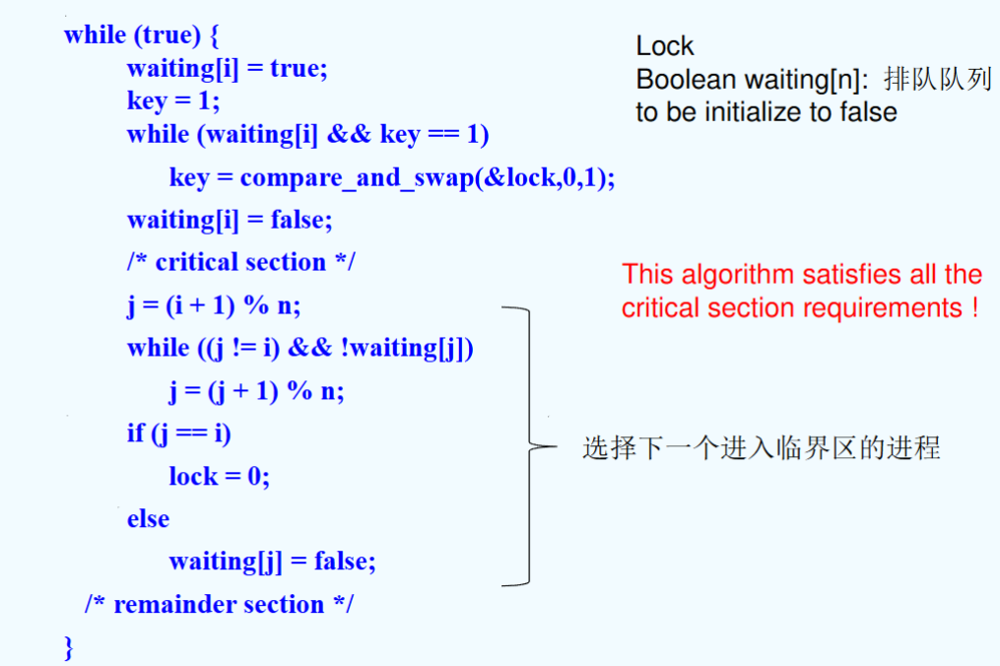

#### 3.5 mutex locks

互斥锁：硬件系统将锁封装好，程序员随调随用

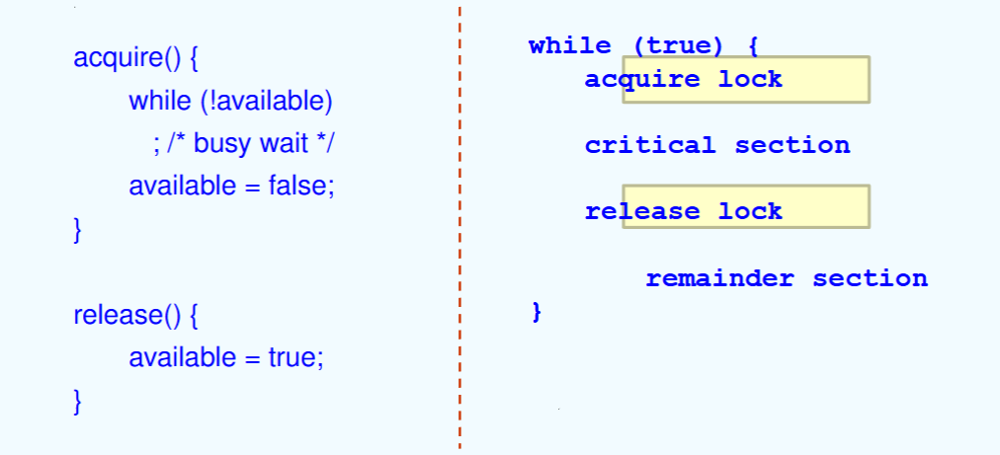

这种方案的缺点：

- 需要不断地空循环（busy waiting）

因此，这种锁叫做自旋锁（spinlock）

#### 3.6 总结

硬件实现方法有如下特点：

优点：

- 适用于任意数目的进程，单处理器/多处理器均可
- 简单，容易验证正确性
- 可以支持进程内存在多个临界区（只需增设布尔变量即可）

缺点：

- 耗费CPU时间，不能实现让权等待
- 可能不满足有限等待（有的进程可能一直无法获得授权）
- 可能死锁

### 4. 信号量（semaphores）

**重点**

信号量（S）：就是一个整型变量（integer variable）

可以对信号量执行两种操作进行更改：

- wait() / signal()
- originally called: P() / V()
- 即，Proberen（测试），Verhogen（增加）

**注意：上述两种更改都是原子性的，且信号量只能被它们操作，不能被其他操作改变**

简述它们分别做出地更改如下：

```c++

wait(S){
    while S <= 0 
        ;
    S--;
}

signal(S){
    S++;
}

```

它能够避免busy waiting

#### 4.1 信号量的类型

- 计数型（counting semaphore）：即取值为整数域
- 二进制型（binary semaphore）：即取值为0或1
  - 也被称作mutex locks

> 事实上，计数型和二进制型是可以互转的，因为信号量可以有多个

#### 4.2 信号量的使用

一个简单的使用方式如下：

- 实现互斥

```c++
enum Semaphore {0, 1};
Semaphore S = 1; // 注意，需要首先对信号量进行初始化，S为1时代表空闲，为0时代表占用
wait(S)
// critical section
signal(S)
// remainder section
```

- 进程同步

假设有两个进程，需要实现它们之间的同步：

- 先执行P1的S1语句段，再执行P2的S2语句段

```c++
Semaphore S = 0; // 显然P1要先占用S，因此需要初始化为0
// P1: 
S1;
Signal(S); // 通知S已经被改写
// P2:
wait(S);
S2; // 开始执行S2语句段
```

- 模拟场景考虑：
- 1. 四个房间，四个相同的钥匙，实现同步只需**1**个信号量（实现原理如上所示）
- 2. 四个房间，四个不同的钥匙，实现同步需要**4**个信号量（此时是面向房间设置信号量，而非面向钥匙设置信号量）

#### 4.3 信号量的实现

原则：

1. 必须保证两个进程不会在同一时间对同一信号量进行 `wait()`/`signal()`操作（否则信号量就变为了临界资源）

因此，Busy waiting是可以通过信号量实现的（但时间开销可能较大，并非较好的方案）

##### 4.3.1 with busy waiting

Busy waiting的实现：

```c++
struct semaphore {
    struct spinlock lock;
    int count;
};

void V(struct semaphore *s) {
    acquire(&s->lock)
    s->count++;
    release(&s->lock)
}

void P(struct semaphore *s) {
    while (s->count <= 0)
        ;
    acquire(&s->lock)
    s->count--;
    release(&s->lock)
}

```

简而言之，就是将信号量看作临界资源，而用一个自旋锁来解决对信号量的同步访问问题（因此造成了Busy waiting的情况）

- 它支持一个消费者与一个生产者，运行 `P`和 `V`操作，且必须在不同的CPU上运行。

**原因：P和V是原子操作，如果只有一个CPU，那么它会一直卡在P中出不来，所以不能在同一CPU上运行。**

- 同时，由于 `P`操作一直等待，因此运行 `P`的CPU会一直处于*busy waiting*状态，且无法通过调度跳出，因此会导致巨大的额外开销。

##### 4.3.2 with no busy waiting

非忙等待的思想就是：对正在等待的进程进行挂起（放在信号量附带的waiting queue中），直到被唤醒。因此，信号量的结构变为：

- value
- 一个PCB的指针链表（即waiting queue）

非忙等待主要有两个操作：

- block(sleep): 当信号量值不满足条件，就让当前进程block住
- wakeup: 当信号量值满足了条件，就唤醒相应的进程

因此，改装后的P和V操作如下：

```c++

void V(struct semaphore *s) {
    acquire(&s->lock)
    s->value++;
    if (s->value <= 0)
        wakeup(s); // 注意，在P中block住的进程都挂载到了s上，所以唤醒操作所需的参数只需要传入s即可
    release(&s->lock)
}

void P(struct semaphore *s) {
  
    while (s->value <= 0)
        block(s);
    acquire(&s->lock);
    s->value--;
    release(&s->lock);
}

```

> 在P中，为什么要使用while()而非if()?

这与block()和wakeup()内部的实现有关。

我们首先要明确，block()函数内部存储了该进程的PCB，即当前的PC、状态等；

在发现资源被占用后，这个进程会直接被挂起（放入等待队列），挂起的含义就是将这个进程卡死在P状态中。

在wakeup()函数中，会遍历等待队列，找到第一个满足条件的进程，将其唤醒，唤醒的含义就是将这个进程从挂起状态中唤醒，让它重新进入P状态。此时，**进程会重新运行P中的所有操作，这是因为P是原子性的，不可能从中继续运行。**

（但其实事实上，if也可以做且逻辑没有问题，但不够安全）

---

此时，与busy waiting不同的点在于，value可以取到负数，而value取负数时，它的绝对值就是**正在等待的进程个数**（不包括正在使用临界区的进程）

但是仍然存在问题：**lost wake-up**：

- 在多核情况下：P在执行sleep()的前一刻，V已经调用了wakeup()，（即P的while判断后的下一刻，s被释放了），那么会导致这个进程一直等待调用但得不到回应

方法一：通过扩展自旋锁的范围避免同时对s进行操作：

```c++
void V(struct semaphore *s) {
    acquire(&s->lock)
    s->value++;
    if (s->value <= 0)
        wakeup(s); // 注意，在P中block住的进程都挂载到了s上，所以唤醒操作所需的参数只需要传入s即可
    release(&s->lock)
}

void P(struct semaphore *s) {
    acquire(&s->lock);
    while (s->value <= 0)
        block(s);
    s->value--;
    release(&s->lock);
}
```

但这会导致在P中while语句一直执行，其他进程无法调用V来使用s进行释放，因此会导致死锁。

方法二：重写sleep函数，在sleep时释放掉s的锁：

```c++
void V(struct semaphore *s) {
    acquire(&s->lock)
    s->value++;
    if (s->value <= 0)
        wakeup(s); // 注意，在P中block住的进程都挂载到了s上，所以唤醒操作所需的参数只需要传入s即可
    release(&s->lock)
}

void P(struct semaphore *s) {
    acquire(&s->lock);
    while (s->value <= 0)
        block(s, &s->lock);// 在此处释放s的锁
    s->value--;
    release(&s->lock);
}
```

#### 4.4 分析比较

使用busy waiting还是no busy waiting?

- busy waiting: 当单个CPU时，无法使用busy waiting；且如果临界区执行时间较长，busy waiting会导致CPU效率降低。
- no busy waiting: 由于引入了进程链表，这意味着需要频繁使用进程调度，因此上下文切换的Overhead较大。当这个Overhead甚至大于临界区执行时间时，busy waiting的效率更高

#### 4.5 其他问题

1. 死锁：当多个信号量、多个进程进行使用时，可能出现死锁的问题：

```c++
P0: wait(S); wait(Q); ... ; signal(S); signal(Q);
P1: wait(Q); wait(S); ... ; signal(Q); signal(S);
```

在上述例子中，假设P0先执行了 `wait(S)`并占用S，随后P1执行了 `wait(Q)`并占用Q，此时P0在等待Q，而P1在等待S，这就出现了死锁。

2. 饥饿：当进程一直处于等待队列时（时间过长），会出现饥饿的问题。

### 5. 同步的典型问题

前言：

- 通常用信号量表示资源或临界区
- 信号量的含义：
  - S.value > 0: 有S.value个资源可用
  - S.value = 0: 无资源可用
  - S.value < 0: 有-S.value个资源被占用
- P/V操作必须成对出现：当为互斥操作时处于同一进程；当为同步操作时则不在同一进程中出现
- 如果两个wait操作相邻，那么它们的顺序至关重要（不当的设置会导致死锁）；但signal操作的顺序无关紧要。
- 当同步wait和互斥wait同时出现时，**同步wait应当在互斥wait之前**（如果互斥wait在前，会提前占用某个信号量，这可能会导致同步的另一个进程无法获得资源，最终导致死锁）

#### 5.1 Bounded Buffer Problem

情景：假设有N个buffer，每个buffer可以承载一个item。

- 对于互斥，需要一个信号量控制访问
- 对于同步：
  - 对于生产者，需要一个信号量查看buffer是否满了
  - 对于消费者，需要一个信号量查看buffer是否为空

```c++
semaphore mutex = 1;
semaphore full = 0;
semaaphore empty = N;
```

那么分别对于生产者和消费者，其结构如下所示：

生产者：

```c++

while (true) {
    // produce an item
    wait(empty); // 如果empty为0，那么说明满了，需要等待，否则empty--
    wait(mutex); // 获取访问权限
    // add the item to the buffer
    signal(mutex); // 释放访问权限
    signal(full); // full++
}

```

消费者：

```c++

while (true) {
    // consume an item
    wait(full); // 如果full为0，说明空了，需要等待，否则full--
    wait(mutex); // 获取访问权限
    // remove the item from the buffer
    signal(mutex); // 释放访问权限
    signal(empty); // empty++
}

```

- 为什么对于同样的操作，需要 `full`和 `empty`信号量？

这是因为面向生产者和消费者而言，资源的概念是不同的：对生产者而言，空位是资源；对消费者而言，占用位是资源，加之信号量的定义（在前言中），因此必须设置不同的信号量来进行管理。

#### 5.2 Reader-Writer Problem

读写问题：对于一个数据集，有如下两种角色

- Reader：只读，不允许修改数据
- Writer：可读可写

多个读者可以同时访问数据，但同时只有一个写者可访问数据。（读者优先）

信号量设置：

- 互斥信号量：`mutex`（这个“互斥”是针对 `readcount`设置的，因为这个场景下dataset是可被多个人使用的）
- 对于写者，需要信号量判断数据是否可写，因此需要信号量 `wrt`

其他变量：

- 对于读者，需要信号量统计数据被**多少读者**占用，因此需要 `readcount`

初始化如下：

```c++
mutex = 1;
readcount = 0; // 没人在读
wrt = 1; // 可以被写
```

具体实现：

写者：

```c++

while (true) {
    wait(wrt); // 等待信号量释放
    //  write the data
    signal(wrt); // 释放信号量
}

```

读者：

```c++
while (true) {
    wait(mutex); // 获取访问权限
    readcount++; // 读者数量+1
    if (readcount == 1) {
        wait(wrt); // 等待写者释放
    }
    signal(mutex); // 释放访问权限
    // read the data
    wait(mutex); // 获取访问权限
    readcount--; // 读者数量-1
    if (readcount == 0) {
        signal(wrt); // 释放写者
    }
    signal(mutex); // 释放访问权限
}
```

- 为什么 `readcount`作为临界资源，不需要考虑更多的问题？

因为它只会在读者函数中被调用/修改，事实上通过mutex就已经同时解决了同步和互斥的问题。

#### 5.3 Dining Philosophers Problem

假设五个人围坐在圆桌周围，每个人面前放着一只（不是一双）筷子。

限定：

- 必须同时拿起两只筷子才能吃饭
- 一只筷子同时只能由一个人使用
- 可以同时吃饭

信号量设置：

- 对每只筷子设置一个信号量 `chopstick`

初始化方法：

```c++

chopstick[5] = {1, 1, 1, 1, 1};

```

方法一：先尝试拿左边的，再尝试拿右边的

```c++

while (true) {
    wait(chopstick[i]) // 尝试拿左边的筷子
    wait(chopstick[(i+1)%5]) // 尝试拿右边的筷子
    // 吃饭
    signal(chopstick[i]) // 放下左边的筷子
    signal(chopstick[(i+1)%5]) // 放下右边的筷子
    // 思考
}

```

显然，上述方法会出现死锁问题（因为信号量的调用呈现环状，所以会出现死锁）。当所有人同时拿起左边筷子后，会导致死锁。

解决方法：

- 奇数位的人拿左边，偶数位的人拿右边
- 一个人先拿右边，其余人先拿左边
- 只允许4个人同时吃饭
- ...

### 6. 管程（monitors）

monitor是一种对进程同步的一种高级抽象。在Monitor中，同时只会有一个进程活跃。（即，其他进程在管程中都会处于睡眠状态）

```c++
monitor monitor_name {
    procedure P1() {};
    procedure P2() {};
    //...
    initialization code() {};
};
```

这种方式能够很好地管理进程的同步，但大大削减的并发性。

改进：引入条件变量（condition variables），它没有自己的值，可以理解为是一个进程的queue，只是对进程进行一个优化的管理

通过条件变量，解决的busy waiting的问题（即当一个进程在等待时，它不会一直占用管程，而是会让出管程来让其他程序使用管程

例如对于条件变量x：

- x.wait()：调用它的进程将进入睡眠状态（suspended）
- x.signal()：唤醒一个在x.wait()睡眠的进程

实例：对哲学家就餐进行monitor管理：

```c++
monitor DP {
    enum {THINKING, HUNGRY, EATING} state[5];
    condition self[5];

    void pickup(int i) {
        state[i] = HUNGRY;
        // 尝试吃饭
        test(i);
        if (state[i] != EATING) {
            self[i].wait();
        }
    }

    void putdown(int i) {
        state[i] = THINKING;
        test((i+4)%5);
        test((i+1)%5);
    }

    void test(int i) {
        // 如果这个人饥饿，且左右两边没人吃饭（占用筷子），那么就吃饭
        if ((state[i + 4 % 5] != EATING) && (state[i] == HUNGRY) && (state[(i+1)%5] != EATING)) {
            state[i] = EATING;
            // 下面这个signal，对于pickup函数无用，但对于putdown有用处
            self[i].signal();
        }
    }

    initialization_code() {
        for (int i = 0; i < 5; i++) {
            state[i] = THINKING;
        }
    }
};
```

通过这种方式即可让整个程序简化成如下形式：

```c++
DP dp;
dp.pickup(i);
// EAT
dp.putdown(i);
```

然而，管程同样存在饥饿的问题（starve），如果左右两者一直占用筷子，那么中间的人将一直得不到运行。

### 7. 同步的例子

- Solaris
- Windows XP
- Linux
- Pthreads

#### 7.1 Pthreads

Pthreads提供了一些API，包括：

- 互斥锁（mutex lock）
- 条件变量（condition variable）

同时在扩展中也包括了：

- 读写锁（read-write lock）
- 自旋锁（spin lock）

简单的例子如下：

```C++

void reader_function(void);
void writer_function(void);

char buffer;
int buffer_has_item = 0;
pthread_mutex_t  mutex;
struct timespec delay;
void main(void) {
    pthread_t reader;
    delay.tv_sec = 2;
    delay.tv_nsec = 0;
    pthread_mutex_init(&mutex, NULL);
    pthread_create(&reader, pthread_attr_default, reader_function, NULL);
    writer_function();
}

void writer_function(void) {
    while (1) {
        // 通过lock/unlock来保证互斥
        pthread_mutex_lock(&mutex);
        if (buffer_has_item == 0) {
            buffer = make_item();
            buffer_has_item = 1;
        }
        pthread_mutex_unlock(&mutex);
        pthread_delay_np(&delay);
    }
}

// ...

```

同样地，对于条件变量，通过：

```C++
pthread_cond_wait();
pthread_cond_signal();
```

来进行调用。

### 8. 总结

对于让权等待：

- 软件实现方法：满足
- 硬件实现方法：不满足（由于相当于忙等）
- 信号量：非忙等状态下满足
- 管程：满足
