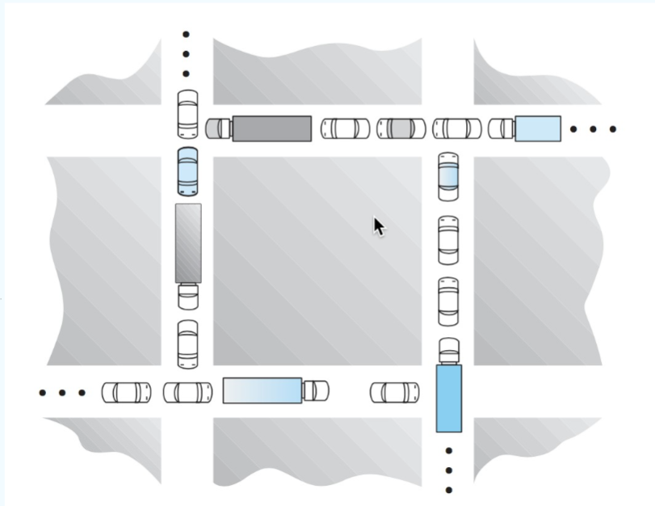
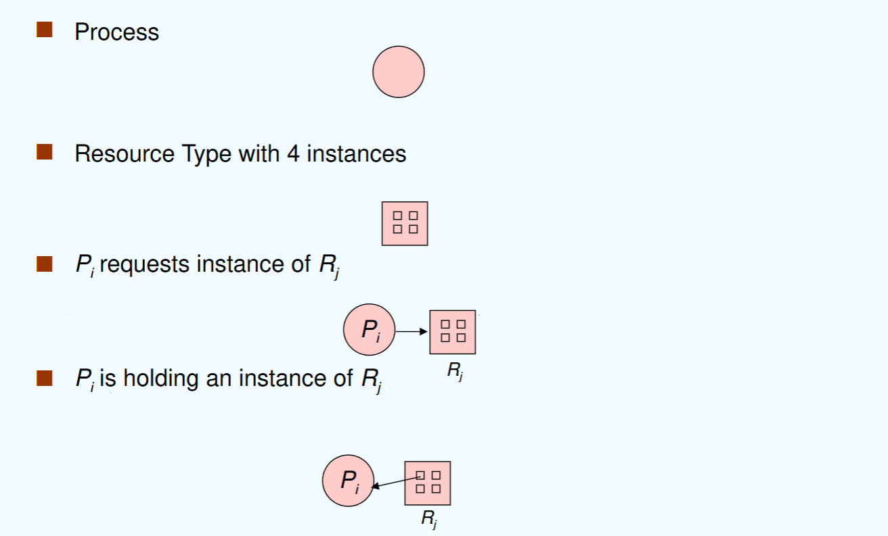
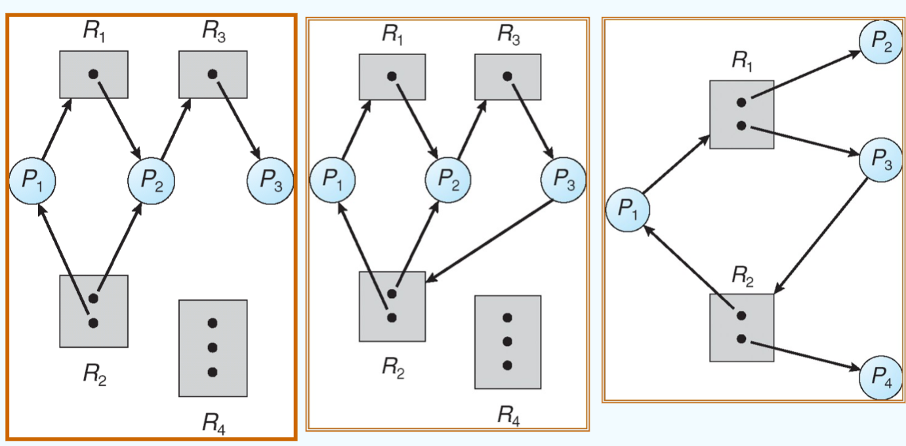

## class 7: 死锁

### 7.1 死锁问题

举例：
1. 过桥问题
- 对向的两个车都希望使用桥，这就导致互相等待，形成死锁。
- 如果一个车后退，就可以解决死锁（preept resources and rollback），即抢占式资源或者回滚操作。
- 多个车可能受到死锁的影响，甚至都需要后退才能解决死锁。
- 饥饿也是可能出现的问题。

2. four-way intersection
- 即：当进入一个四路口时，每辆车按照顺时针通过路口，其他车应当等待。
- 通过这样的方式避免不同路口同时进入的车互相等待。

更经典的死锁问题：



死锁问题的定义：

**多个进程因竞争共享资源而造成相互等待的一种僵局，若无外力作用，这些进程都将永远不能再向前推进。**

举例：对于两个信号量A，B：

```c++
semaphore A = 1;
semaphore B = 1;

process P1 {
    wait(A);
    wait(B);
}

process P2 {
    wait(B);
    wait(A);
}

```

当二者互相等待时，就会出现死锁的情况。

### 7.2 系统模型

系统模型通过如下方式建立：
- 有多种资源($R_1,R_2,...,R_n$)
- 每种资源有多个($W_1,W_2,...,W_m$)
- 每个进程能够通过如下操作使用资源：
    - 1. 请求资源（request）
    - 2. 使用资源（use）
    - 3. 释放资源（release）

资源分配图（Resource Allocation Graph）：

通过上述的资源模型构建，用这样的方式构建资源分配图：
- 点集分为进程点与资源点，分别代表每个相关进程与每种相关资源
- 边集包括：
    - 请求边(request edge):从P到R的有向边
    - 占用边(assignment edge):从P到R的有向边





可以通过这种方式来进行死锁的检测：
- 如果图中没有形成环，则不会产生死锁
- 如果图中形成了环，并且环中的资源仅供环中进程使用（即无法获取额外的空闲资源），则会产生死锁。
- 简单而言：
    - 如果环中资源只有一个，必然有死锁
    - 如果环中资源有多个，则不一定有死锁

根据这个原理可以判断：图1、3不存在死锁；图2存在死锁

### 7.3 死锁特征

死锁产生的条件为：如下四个条件同时发生：
- 1. 互斥条件（mutual exclusion）：同时只有一个进程可以使用资源
- 2. 请求和保持条件（hold and wait）：进程已经获得了资源，但又提出新的资源请求，而该资源已被其他进程占用
- 3. 不可剥夺条件（no preemption）：进程所获得的资源在未使用完毕之前，不能被抢占
- 4. 环路等待条件（circular wait）：存在一个进程——资源的环形链，该链中每个进程都在等待下一个进程所占用的资源

### 7.4 处理死锁的方法

处理死锁的方法：
- 死锁预防/死锁避免：保证系统永远不会进入死锁的状态
- 死锁检测/死锁解除：允许死锁进入死锁状态，定时检测系统是否死锁了，如果死锁则解除死锁
- 鸵鸟算法：忽略这个问题，假设死锁永远不会发生
    - 即：在设计操作系统时就尽可能避免死锁的出现（但与死锁避免不同）

### 7.5 死锁预防

死锁预防（deadlock prevention）：通过破坏产生死锁的必要条件之一来防止死锁的发生。

逐一分析：
- 1. 互斥条件：显然对于非共享资源（不可被同时访问的资源），这个条件是不能被破坏的。
- 

### 7.6 死锁避免

### 7.7 死锁检测

### 7.8 死锁恢复