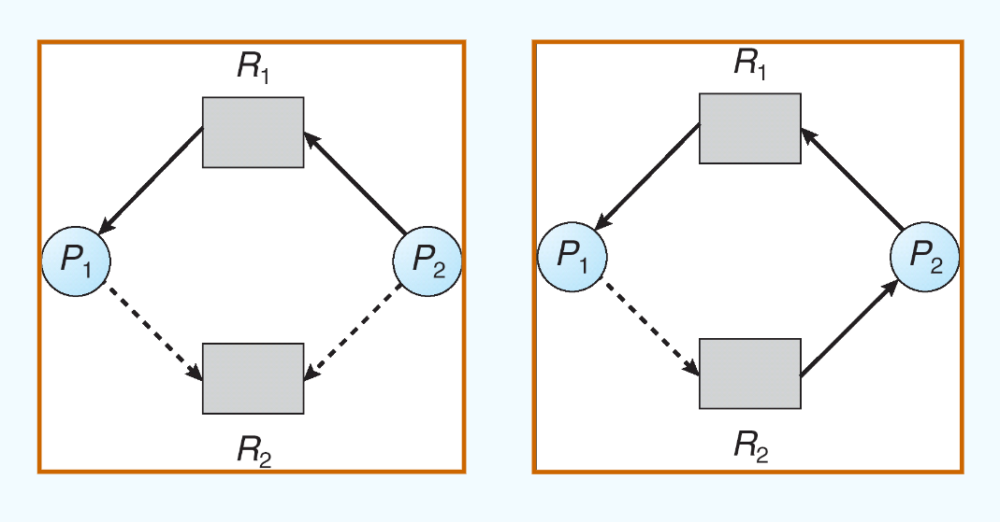

## class 7: 死锁

### 7.1 死锁问题

举例：

1. 过桥问题

- 对向的两个车都希望使用桥，这就导致互相等待，形成死锁。
- 如果一个车后退，就可以解决死锁（preept resources and rollback），即抢占式资源或者回滚操作。
- 多个车可能受到死锁的影响，甚至都需要后退才能解决死锁。
- 饥饿也是可能出现的问题。

2. four-way intersection

- 即：当进入一个四路口时，每辆车按照顺时针通过路口，其他车应当等待。
- 通过这样的方式避免不同路口同时进入的车互相等待。

更经典的死锁问题：


死锁问题的定义：

**多个进程因竞争共享资源而造成相互等待的一种僵局，若无外力作用，这些进程都将永远不能再向前推进。**

举例：对于两个信号量A，B：

```c++
semaphore A = 1;
semaphore B = 1;

process P1 {
    wait(A);
    wait(B);
}

process P2 {
    wait(B);
    wait(A);
}

```

当二者互相等待时，就会出现死锁的情况。

### 7.2 系统模型

系统模型通过如下方式建立：

- 有多种资源($R_1,R_2,...,R_n$)
- 每种资源有多个($W_1,W_2,...,W_m$)
- 每个进程能够通过如下操作使用资源：
  - 1. 请求资源（request）
  - 2. 使用资源（use）
  - 3. 释放资源（release）

资源分配图（Resource Allocation Graph）：

通过上述的资源模型构建，用这样的方式构建资源分配图：

- 点集分为进程点与资源点，分别代表每个相关进程与每种相关资源
- 边集包括：
  - 请求边(request edge):从P到R的有向边
  - 占用边(assignment edge):从P到R的有向边


可以通过这种方式来进行死锁的检测：

- 如果图中没有形成环，则不会产生死锁
- 如果图中形成了环，并且环中的资源仅供环中进程使用（即无法获取额外的空闲资源），则会产生死锁。
- 简单而言：
  - 如果环中资源只有一个，必然有死锁
  - 如果环中资源有多个，则不一定有死锁

根据这个原理可以判断：图1、3不存在死锁；图2存在死锁

### 7.3 死锁特征

死锁产生的条件为：如下四个条件同时发生：

- 1. 互斥条件（mutual exclusion）：同时只有一个进程可以使用资源
- 2. 请求和保持条件（hold and wait）：进程已经获得了资源，但又提出新的资源请求，而该资源已被其他进程占用
- 3. 不可剥夺条件（no preemption）：进程所获得的资源在未使用完毕之前，不能被抢占
- 4. 环路等待条件（circular wait）：存在一个进程——资源的环形链，该链中每个进程都在等待下一个进程所占用的资源

### 7.4 处理死锁的方法

处理死锁的方法：

- 死锁预防/死锁避免：保证系统永远不会进入死锁的状态
- 死锁检测/死锁解除：允许死锁进入死锁状态，定时检测系统是否死锁了，如果死锁则解除死锁
- 鸵鸟算法：忽略这个问题，假设死锁永远不会发生
  - 即：在设计操作系统时就尽可能避免死锁的出现（但与死锁避免不同）

### 7.5 死锁预防

死锁预防（deadlock prevention）：通过破坏产生死锁的必要条件之一来防止死锁的发生。

逐一分析：

1. 互斥条件：显然对于共享资源（不可被同时访问的资源），这个条件是不能被破坏的。
2. 请求和保持条件：解决方式就是不再Hold，也就是说，申请资源的进程不能占用着资源（每次申请必须一次申请完所有的资源），而是要等到资源被释放后才能申请新的资源。

问题：

- 低的资源利用率
- 有可能出现饥饿

方法一：非抢占式：资源只能被占用它的进程主动释放（一般为Terminated状态）。

避免非抢占式的方法：如果一个进程在申请资源时发现有部分资源无法即时分配，那么就需要释放所有已经获得的资源；被抢占的资源会被加入到资源等待队列中，等待被其他进程释放。如果一个进程可以获取所有的需要资源，它就会被重启。

3. 循环等待条件：可以通过对需求资源的种类对进程进行排序，需要种类少的就先申请。

### 7.6 死锁避免

死锁避免的方法为：在进程运行的过程中**动态**考虑一个不会造成死锁的资源分配顺序。

在这个过程中，资源分配的状态由available/accloated resources和进程的maximum demands定义。

安全状态（safe state）：当一个进程请求了一个可用资源，系统必须判断分配后系统是否处于安全状态。

安全状态具体的定义为：

- 某一进程的资源无法被立即满足，它可以等待其他进程结束后再获取资源
- 这种状态下所有的进程都能按某一个顺序执行，不会出现死锁

（即：安全状态的条件是能够找到一个让所有进程都顺利执行完毕的顺序）

安全状态与死锁的关系：

- 如果一个系统处于安全状态，那它不会产生死锁
- 如果一个系统处于不安全的状态，那它不一定产生死锁
  - 也有可能是因为在系统中资源本身就不够（例如一共只有7个资源，但需要8个，此时系统处于不安全状态，但并非死锁）

死锁避免的具体方法：

- 单个资源类型：使用资源分配图（resource-allocation graph）来检测死锁。
- 多个资源类型：使用资源分配矩阵（resource-allocation matrix，或称为银行家算法，Banker's algorithm）来检测死锁。

#### 7.6.1 资源分配图

资源分配图有如下边：

- claim edge: 进程P向资源R可能提出一个请求（但没有实际进行请求），用虚线表示
- request edge: 进程P向资源R提出了一个请求，用实线表示
- assignment edge: 资源R分配给了进程P，用实线表示

三者转化关系：

- claim edge -> request edge: 进程P向资源R提出了一个请求
- request edge -> assignment edge: 资源R分配给了进程P
- assignment edge -> claim edge: 进程P向资源R可能提出一个请求

则分配的机制为：**只有当将claim edge变为assignment edge后，图中没有环时**，才能进行转化。

（例如下面左图如果分配，就会变成右图（死锁））



#### 7.6.2 银行家算法

在银行家算法中使用如下几个矩阵（设m种可用资源，n个进程）：

- Available矩阵：一个m维向量，表示系统中每个资源的可用数量
- Max矩阵：一个mxn矩阵，表示每个进程最大需求的资源数量
- Allocation矩阵：一个mxn矩阵，表示每个进程当前占用的资源数量
- Need矩阵：一个mxn矩阵，表示每个进程还需要的资源数量

显然：$need = max - allocation$

安全性算法如下：

1. 设置一个Work矩阵（mxn），将其初始化为available；设置一个finish向量（用以表示进程是否完成），将其初始化为全False
2. 找到一个Finish为false且$Need<Work$的进程，如果找不到就跳到第四步
3. Work=Work+Allocation，Finish=True，重复2
4. 如果Finish为全True，说明系统处于安全状态

具体到银行家算法中，过程如下：

1. 如果进程的请求小于等于Need（不会申请超过其所需的资源）且小于等于Available（有足够的资源），则继续，否则拒绝或等待
2. 尝试将资源分配给进程，并做：相应的处理（Available/Allocation/Need/Work矩阵的更新）
3. 调用安全性算法，如果系统仍处于安全状态，则把资源实际分配；否则让进程继续等待。

### 7.7 死锁检测

死锁检测的原理是：允许死锁发生，对死锁进行定时检测，如果检测到死锁就需要进行死锁恢复。

死锁检测通过wait-for图（相比于资源分配图，将资源点删除，直接变为进程之间相互等待的关系图）中是否有环来进行判定是否产生了死锁。

检测算法的时间复杂度为$O(mn^2)$

另一种方式为：可完全化简图（completely reducible graph），即如果能够通过分配资源将所有边都消去，则可称为可完全化简图。

死锁定理：S为死锁的条件是：当且仅当S状态的资源分配图是不可完全简化的。

问题：什么时候检测死锁，多久检测一次死锁。

### 7.8 死锁恢复

死锁恢复的方法：

- 资源剥夺：把部分进程挂起并剥夺资源
- 撤销进程：撤销部分进程并释放资源
- 进程回退：让一个进程或多个进程回退到避免死锁的地步

依据：进程的优先级、已执行时间、剩余时间、已用资源、交互还是批处理等
