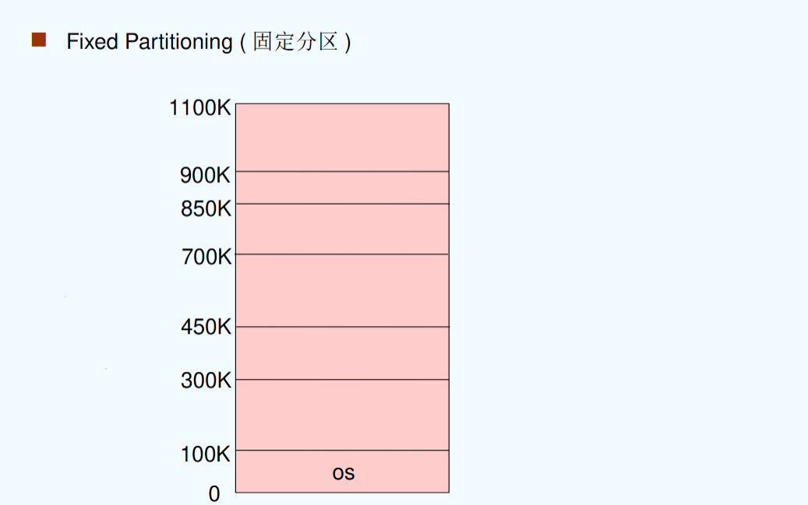

## chapter 8: 主存

### 8.1 背景

#### 8.1.1 概述

主存发展的历程：

- 磁鼓存储器（drum memory）
- 延迟线存储器（delay line memory）
- 磁芯存储器（core memory）

Semiconductor(半导体)：

- DRAM：动态随机存取存储器（需要不断刷新才能更新，用于内存）
- SRAM：静态随机存取存储器（不需要刷新即可更新，用于cache）
- ROM：只读存储器（只读，用于存储不可写的数据（如操作系统））

Memory wall:

主存（Memory）要远比进程慢，并且也消耗更多的能量。这意味着主存限制了进程性能的发展。

NVM技术：

NVM：非挥发性存储器（非易失性存储器）

- Phase-Change Memory(PCM): 相位变化存储器（原理是通过相变材料在晶态和非晶态之间的切换进行数据的存储）
- ReRAM/RRAM: 电阻式存储器（通过施加电压或电流，让材料的电阻在高低之间切换，从而实现数据的存储）

更多的方法：内存计算（processing in memory），即在内存中完成计算，不再需要CPU的介入。（通过忆阻器（memristor）等实现）

综述：

- 程序必须要从磁盘读取到主存，然后置入进程中进行运行
- 主存和寄存器是CPU可以直接访问的（唯一）存储资源
- 寄存器往往在一个时钟周期内被访问完成
- 主存可能会占用多个时钟周期进行访问
- cache位于主存和寄存器之间，用于缓存最近访问过的数据
- 需要对主存进行保护来保证正确的操作

#### 8.1.2 程序运行

举例：对于一个程序的运行

- compile: 对源代码进行编译，生成目标文件（.o）（为机器语言）
- link: 对目标文件（们）进行链接，生成可执行文件（.exe）
- load: 将可执行文件加载到主存中，并运行

#### 8.1.3 地址绑定

地址的表示：

- Symbolic Address(符号地址)：在源程序中的地址一般都是符号地址（例如变量，函数名）（符号地址往往用名称表示，因为其虚拟/物理地址均未知）
- Relocatable Address(可重定位地址)：在编译时，编译器会将符号地址转换为可重定位地址（它往往是一个基地址的偏移量（即，偏移量为可重定位地址））
- Absolute Address(绝对地址，也可理解为物理地址)：在链接和运行时，操作系统会将可重定位地址转换为物理地址（例如将内存中的物理地址转换为实际的物理地址）（如74014）

举例：

- 程序中有 `jal kernel_function`，其中 `kernel_function`为符号地址
- 编译后变为 `jal 0x1000`（实际为一系列机器码），其中 `0x1000`为可重定位地址（通常为另一个文件中这个符号的地址，例如 `14 bytes from the beginning of the module`）
- 在链接并装载后，将可重定位位置转换为绝对地址。

不同的地址绑定时间会根据具体的系统而有所不同。

- 编译时刻：如果编译器在编译时就能确定地址，则地址绑定在编译时刻完成。（生成absolute code）（但如果这样的话，如果程序的起始位置发生变化，就必须重新编译代码）
- 装入时刻：如果编译器在编译时不能确定地址，则地址绑定在装入时刻完成。（生成relocatable code）（需要loader进行地址重定位，增加了加载时间）
- 执行时刻：如果系统在运行时才能确定地址，则地址绑定在执行时刻完成。（但需要操作系统和硬件支持）

> 一般在执行时刻进行地址绑定。

在进程中，存在两个寄存器用于定义逻辑地址空间：

- 基址寄存器（Base Register）：指向当前进程的物理地址空间的起始位置（即内存中的起始地址）
- 限长寄存器（Limit Register）：当前进程的逻辑地址空间的大小

（例如：`base register = 300040`，`limit register = 120900`，则地址空间为300040-420940）

#### 8.1.4 逻辑地址与物理地址

- 逻辑地址（logiical address）：由CPU生成，又被称为虚拟地址（virtual address）
- 物理地址：内存单元可见的地址

（假设在执行时刻进行地址绑定）

- 在编译过程和加载过程中，逻辑地址和物理地址是 **一致** 的（因为都是在CPU内的视角下进行的）
- 在执行时（进行地址绑定后），逻辑地址与物理地址将 **不一致**

#### 8.1.5 MMU

MMU（内存管理单元，memory management unit）：用于将虚拟地址映射到物理地址的 **硬件** 单元。

其逻辑就是将每一个由用户态生成的地址加上 `relocation register`（也就是 `base register`）的值，将其映射到对应的物理地址。

> 使用硬件的原因是希望加速这个加的过程。

一个用户态程序使用虚拟地址进行处理：它并不能看到实际的物理地址。

#### 8.1.6 动态装入/链接

在将程序装入内存的时机中，动态装入意为“直到程序被调用之前，都不将其装入”。

- 动态装入具备更好的内存空间利用率
- 当大量代码需要被不频繁地执行时就具备较好的性能
- 不需要操作系统提供额外的支持

---

动态链接：直到执行之前，都不进行链接

好处：

- 动态链接尤其对库由较大作用
- 节省内存空间
- 减少可执行文件的大小
- 对新的库进行重链接（relinking）

这个实现方法也被称作 **共享库** （shared library）。

- 例如Win操作系统中的DLL文件

#### 8.1.7 总结

编译

- 从高级语言到目标模块的过程(实际是预处理、编译、汇编三个阶段的统称)
- 本质是一些机器可以“看懂”的0/1指令和数据文件

链接

- 把编译后的目标模块与所需库函数链接在一起形成一个整体
- 静态链接、装入时动态链接、运行时动态链接

装入

- 将虚拟地址映射为内存实际的物理地址
- 绝对装入、静态重定位(可重定位装入)、动态重定位(动态运行时装入)

### 8.2 交换（swapping）

当内存不足但需要进行进程调度时，需要进行换入/换出方法。

backing store：一个快速盘大到足够存储所有用户的所有内存镜像，这时换入换出直接进行部分内存镜像的交换。它必须提供直接的内存镜像的访问。

- Windows中使用交换文件`pagefile.sys`
- Linux中使用交换区

使用换入换出的逻辑（roll out, roll in）：根据优先权调度算法进行排序，低优先度的进程被换出，高优先级的进程被换入。

交换的主要开销在于交换时间；交换时间的大小直接取决于交换内容的大小。

同时，系统需要维护一个ready queue作为等待换入的进程队列。（即在disk中有内存镜像的进程）

### 8.3 连续内存分配（contiguous memory allocation）

内存往往被分为两个部分：

- 操作系统部分（Resident Operating System）：往往在低地址，伴随interrupt vector进行设置
- 用户进程部分（User Processes）：往往在高地址，用户态程序的运行空间

注：这里的地址为 **物理地址** ，实际在进程的虚拟地址中，操作系统部分在 **高地址** ，用户部分在 **低地址** 。

每个进程的虚拟地址中，都具备操作系统内核区，这部分地址空间是 **不可被用户进程访问** 的。

对于Relocation register:

- Relocation register存储最小的物理地址的值
- Limit register存储一个逻辑地址的范围
- MMU动态地映射逻辑地址

#### 8.3.1 分区方法

单一连续分配：内存分为系统区和用户区，用户区每次只调入一道程序运行；一次只放一道程序，无并发。

多分区分配（multiple-partition allocation）：将内存划分为若干连续区域，称为分区；每个分区只能存放一个进程

- 固定分区（fixed partitioning）
- 动态分区（dynamic partitioning）或可变分区（variable partitioning）

固定分区：

问题：进程大小不一致，导致内存浪费；会产生 **内部碎片**

动态分区：

- 动态划分内存，在程序装入内存时把可用内存“切出”一个连续的区域分配给该进程，且分区大小正好适合进程的需要。
- Hole：内存中一块可用的区域（多个Hole会共同组成一个列表）
- 当一个进程进入时，从hole中进行合适的空间分配
- OS保存着已经分配的空间信息以及空闲的空间信息

问题：会产生 **外部碎片**

分配的算法：

1. 顺序分配算法：

- First-fit（分配第一个足够大的hole）
  - 会产生许多小碎片，每次执行都要经过前面的小碎片，增加开销
- Next-fit（从上次分配位置开始，分配下一个足够大的hole）
  - 可能导致内存高地址部分没有大空闲分区可用，通常比first-fit差
- Best-fit（分配最合适的hole）(需要遍历整个列表)
  - 性能通常很差，因为会产生 **最多** 的外部碎片
- Worst-fit（分配最大的hole）（需要遍历整个列表）
  - 会很快导致没有大空闲分区可用

显然，在速度和存储空间利用率上，first-fit与best-fit要比worst-fit更好。（但同时，wrost-fit可以避免更多的内存碎片产生）

综合而言，first-fit是相对而言性能最好的算法。

1. 索引分配算法：

- 快速适应算法：
  - 也称分类搜索算法，将空闲分区按容量大小进行分类，设置素引表项，每一个空闲分区类型对应一项，挂成链(把原来一根变成多根)
  - 根据进程长度，从素引表项中找到能容纳他的最小空闲区链表；从链表中取下第一块进行分配。
- 伙伴系统：每个空闲分区大小必须是2的n次幂字节；对进程占用空间n计算一个i值使得2i>n，从剩余空闲分区找最适合的;若无则将分区逐层拆分;释放时则逐层合并
  - 初始内存空间为1024K，有一个进程请求150K空间。
- 哈希算法：根据空闲分区链表的分布规律，建立哈希函数，构建一张以空闲分区大小为关键字的哈希表，根据所需空间大小通过计算得到哈希表的位置。

#### 8.3.2 碎片

碎片分为如下两种：

外碎片：总共剩余的内存空间能够满足需求，但是它并不连续

内碎片：分配给进程的内存空间大于进程请求的空间，这意味着有一些空间进程没有用到，因此这部分空间被浪费，称为内碎片。

解决外碎片的方法： **compaction/defragmentation** （紧凑/拼接）；也可以使用非连续性的分配方法。

- 对内存内容进行调整，让所有空闲的内存空间在一个大的块中
- 只有在重定位（relocation）是动态的时候（即，链接和装入为动态的），compaction才能够使用；它是在执行时刻完成的。
- I/O操作中，也不允许进行compaction操作。
  - 因为I/O操作和compaction操作都是对内存进行读/写，这意味着可能出现不一致性。
  - 或者可以通过设置操作系统的缓冲区（OS buffer）来实现在I/O操作中也可以进行compaction操作。

### 8.4 分页（paging）

#### 8.4.1 基本概念

**分页是一种离散的内存分配方式**

一个进程的物理地址空间可以是非连续的。我们可以将物理地址划分为一个个固定大小的块，叫做 **frame** （（中文名为页框/页帧/物理块），一般为2的指数）

通过将逻辑地址进行分割，进入这些块的过程叫做 **paging** （分页）。

> 显然，如果一个进程占用n个page，那物理地址就需要n个frame进行存储。   
> 同时，分页机制也不会产生外部碎片。

同时需要维护一个page table（页表）进行逻辑地址和物理地址的转换

> page table 存储在内存中

分页会出现内部碎片的问题。

具体的映射方法如下：

一个虚拟地址（由CPU生成）分为两个部分：

- page number：页号，表示逻辑地址中的页的位置（也可以理解为是页表的索引）
- offset：页内偏移，表示在页中的偏移

> 上述二者占据的位数与页的大小相关。例如在32位系统、页大小为4KB的情况下，page number占20位，offset占12位。

在实际转化中，page number通过页表找到对应的物理地址，而offset保持不变（因为在初始映射时整个页内部是连续的，因此offset是一致的）

举例：

假设页面大小为4KB，虚地址2362H，1565H的物理地址分别是多少？

（页表如下）：

| 页号 | 页框号 |
| ---- | ------ |
| 0    | 101H   |
| 1    | 102H   |
| 2    | 254H   |

显然，虚地址使用十六进制表示的，因此页内偏移分别为362H和565H。二者对应的页号分别为2和1。所以答案为 `254362H`和 `102565H`。

---

对于frame，通过free-frame list对内存中空闲的帧进行管理。（与内存池的管理相似）

#### 8.4.2 页表的硬件实现方法

页表在主存（main memory）中进行保存。

具备两个页表寄存器：page-table base register（PTBR）指向页表；page-table length register（PTLR）表示页表的长度。在实际操作中，通过PTBR与页号相加找到页表中索引的实际位置（这里是物理地址）；通过PTLR判断页号是否超过了页表的长度（即非法的页号）。

> 这意味着每个指令需要访问两次内存，一次对页表进行访问，一次对数据进行访问。

为了解决这个两次访问的问题，通过将页表放在高速缓存（cache）中形成快表（translation look-aside buffers/associative memory, TLBs）。

TLB中存放一部分页号和对应帧号的映射关系，如果命中就直接访问，否则进行两次访问。

同时，有的TLB会存放address-space identifiers(ASIDs)，用于标识这个映射所属的进程，从而使不同的进程可以共用同一个TLB。

分析TLB技术是否有效：计算Effective Access Time(EAT)

- 假设一次cache中的查找为$\epsilon$
- 每次内存的访问周期时间为1 ms
- 命中的概率为$\alpha$
- 因此EAT为$(1+\epsilon)\alpha + (2+\epsilon)(1-\alpha) = 2 + \epsilon - \alpha$

事实上，$\epsilon$远比$\alpha$小，所以EAT会小于2，因此TLB的技术是有效的。

#### 8.4.3 分页的保护机制

在页表中不仅记录了对应的映射关系，还有相关的权限位（例如valid bit），用于表示这个页是否可以被访问。

典型的例子为：如果内存不够用，只有一部分页被分配了空间，那么页表中某些页会没有被映射到实际的物理地址（但是页表已经记录了这些页），那么这些页在页表中就是invalid的状态，代表无法访问该页。

#### 8.4.4 共享页（shared pages）

- 共享代码（shared code）：
    - 一个 **只读** 的代码被多个进程共享
    - 注意：共享代码在每个进程的逻辑地址应当一致，其目的如下：
        - 1. 减少TLB的条目数量（这是通过设置TLB的Global位以及ASID区域进行的，一般而言，如果Global位为1，则说明这个条目可被所有进程共享）
        - 2. 保证共享代码内部对地址的访问不会出错（包括指令的地址以及对全局变量、静态变量的访问）

### 8.5 页表结构（structure of the page table）

#### 8.5.1 多级页表（hierarchical paging）

即：对页表进行分页（page the page table）

一个简单的技术为两级页表。

以两级页表为例（32位系统，页大小为1KB）：

- page number一共22位
  - 12位为p1，表示一级页表的页号
  - 10位为p2，表示二级页表的页号（注：PPT中对该部分的解释为offset，但私以为难以信服，因为若为offset应当以4（页表项长度）为单位，因为offset表示的是页内偏移，使用这个定义意味着二级页表一定是在一个页内。在该题情境下，一个页内最多的页表项数目应当是$2^8$个。）
- page offset一共10位，表示页内偏移

具体实现方法就是：

- 已知一级页表的位置
- 通过p1在一级页表中进行页内偏移，找到其中的二级页表的页号
- 通过找到的虚拟地址重复一次上述步骤（页内偏移使用p2），找到在二级页表中存放的物理页号
- 通过物理页号找到对应的物理页（frame）
- 在物理页中利用page offset找到对应的数据位置

#### 8.5.2 哈希页表（hashed page tables）

哈希页表在地址空间大于32位的系统中较为常见。

哈希页表的实现方式为：将虚拟页号经由哈希函数得到对应的哈希值，因此在hash table中能够找到对应的索引，进而找到对应的物理页号。

由于哈希页表存在冲突的可能，因此每个索引对应的位置存放了一个链表，链表中的每个元素记录了虚拟页号、物理页号与下一个元素的指针，需要通过具体比对虚拟页号进一步找到自身对应的物理页号。

哈希页表的优点：

- 通过哈希函数，可以缩小页表的大小，进而节省内存空间。
- 每一个“页表项”对应了多个映射，而非一个
- 对稀疏的地址空间有用（因为碰撞较少）

> 特别地，对于64位地址可以使用聚簇页表（clustered page table）进行管理；原理是将多个虚拟地址映射到同一个物理地址上（如果出现碰撞，需要考虑数据的一致性）。同样地，对于稀疏地址空间更有效。

#### 8.5.3 反向页表（inverted page tables）

反向页表中，虚拟地址的结构为：

- pid：进程标识符
- p：页号
- d：页内偏移

反向页表内部可以理解为是对 **每个物理页的说明** ，它在页表中的每个页表项对应的就是每个物理页号（且是连续的）。

在page table中进行查找，直到找到pid/p的组合；此时当前的索引就是物理的页号。

反向页表的缺点为：需要遍历查找，速度较慢

解决方法：

- 将页表的入口放入哈希表中
- 使用TLB进行加速
- 硬件方法

### 8.6 分段（segmentation）

分段是相对于页表的另一种映射方法。

分段的思想为：将用户空间按照需求（主程序、函数、方法、对象等）分成多个segment，每个segment为其提供连续的物理地址空间。

- 优点：逻辑性强

分段分配的逻辑地址为：

- 段号（segment number）：表示段的位置
- 段内偏移（offset）：表示在段中的偏移

分段同样具备分段表（segment table）进行管理，每个table具备：

- base：包含这个段在内存的起始物理地址
- limit：包含这个段的大小

而对于整体的分段方式具备两个寄存器：

- segment-table base register（STBR）指向内存中的分段表
- segment-table length register（STLR）表示分段表的长度（一个程序使用的段数）

同样，它具备valid位表明是否为合法的segment。

由于segment的长度可能互不相同，所以内存分配方式必须为动态的内存分配方式。

> 可以注意到，分段的地址转换过程回到的基本的基地址+虚拟地址的转换方法。

相比于分页管理，分段管理大小不固定，地址空间是二维的，且易于实现共享。

### 8.7 举例：Intel Pentium

Intel Pentium使用 **段页混合** 的方式进行分配。

- 即：将用户空间分为多个段
- 对不同的段进行分页管理，最终在内存中还是以分页的方式呈现

其虚拟地址的设计如下：

- selector（16位）：段号
- offset（32位）：段内偏移

具体的方法为：

- 通过selector找到段表中的对应位置（段号中包含偏移量以及段表位置）
- 在段表中对应位置获取的地址与offset相加获取linear address
- 通过linear address通过页表方法（将linear address看作多级页表的“虚拟地址”，分割为页号和页内偏移）找到物理地址

