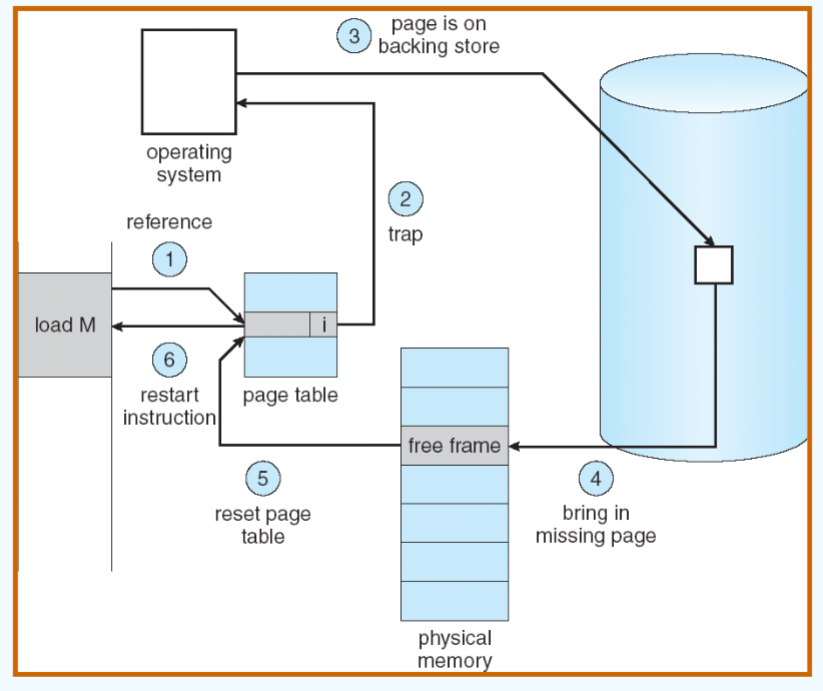

## chapter 9: 虚拟内存

### 9.1 背景

逻辑地址空间要比物理地址空间大的多，这意味着我们无法将所有的程序都存到实际的物理内存中。

因此需要虚拟内存，利用 **局部性原理** 进行进一步的内存管理，从而实现在逻辑上对内存容量进行扩充。

好处：例如写时复制（copy-on-write）：

- 父进程调用fork()创建子进程时，操作系统不会立即复制父进程的内存地址空间。
- 只有当父进程或子进程尝试写入某个共享页面时，操作系统才会通过缺页中断将对应的页面分配出去。（因此叫“写时复制”）

### 9.2 demand paging

简单而言，就是只有当某个页被需要时，才把它放到内存中。

- Lazy swapper: 只有当某个页被访问时，才把它放到内存中。

相关配置：

- 每个page table entry有一个valid-invalid bit, V表示在内存中，I表示不在内存中。
- 一开始，所有的入口全被设置为I
- 如果发现某个page table entry是I，就触发缺页中断，将对应的page从磁盘读入内存，并设置valid-invalid bit为V。

> 在disk中（内存换入换出的对象），页是连续存储的（在disk章节详述）

在外存中，分为文件区（离散存储）以及对换区（连续存储）。换出的目标外存一般为对换区（由于连续存储，因此对换区的速度要比文件区快）

对于每个处于内存中的页，可以通过如下几种位来标识页的情况：


当触发page fault时，操作系统会经过如下步骤：

- 判断是否是合法访问：若为非法访问（invalid reference），则直接终止（abort）
- 获取一个空的页空间（在物理地址中）
- 写入这个页
- 更新页表
- 设置有效位为v
- 重启触发page fault的进程



计算缺页中断的有效时间（EAT）：

假设触发page fault的概率为p，则EAT情况如下：

$$
EAT = (1 - p) \times memory~access + p(page~fault~time + swap~out + swap~in + restart~time)
$$

### 9.3 copy-on-write

写时复制的原理就是：当进行fork()操作时，父进程和子进程共享内存中的一些页（均为只读）；只有当父进程或子进程希望写入时，才进行实际的拷贝操作（通过触发缺页中断实现）。

**注意：拷贝后的页面是可读可写的，但原来的页面仍然保持只读状态，被其他的进程共享。**

其主要目的为：

- 减少内存使用
- 提高性能

### 9.4 page replacement 

如果没有空闲的页框（memory满了），那么就需要将某个page进行换出（swap out），以腾出空间。

需要考虑如下两点：

- 算法
- 性能（触发尽可能少的page fault）

页面替换的算法需要综合考虑：

- 避免过度的内存分配（不应当为某个进程提供过量的内存）
- 使用脏页位进行读写控制（如果被换出的页不是脏页，那直接丢弃即可，不必写回）

最基础的逻辑为:

- 在外存中（secondary storage）寻找到需要的页
- 在内存中找到一个空闲的页：
    - 如果有空闲的页，则直接分配
    - 如果没有，调用页面替换算法选择一个页（victim frame）
    - 将这个victim frame写入外存，并依据此进行页面和页表的更新
- 将需要的页读入内存，更新页和页表
- 继续执行page fault

**注意：无论是换入还是换出，都是先进行实际的操作，再对page table中的valid bit与相应内容进行更新。**

对page replacement algorithm的性能分析，采用如下方式：

- 输入为一系列对地址的需求（address sequence），例如（0100, 0432, 0101, 0612, 0102, 0103，0611...）
- 我们只关注每个地址所在的页的需求，而不在意页内的偏移情况；同时只关注对不同页的访问，而对于连续对同一页内的访问并不关注（因为它们显然不会触发page fault）（即将其简化为reference string：1，4，1，6，1，6，...）
- 通过对reference string的内容结合算法进行分析，判断触发page fault的次数，即可进行分析。


**显然，内存越大；触发page fault的次数越少。但内存无限大时，触发page fault的次数不会趋于0，因为第一次读取就需要触发page fault。**

#### 9.4.1 FIFO

显然，就是最简单的先进先出的算法。最先进入内存的页被最先换出。


在上图中会发现，frame个数增大的情况下，触发page fault的次数反而增多了。这就是belady现象（belady's anomaly）。

产生belady现象的原因在于： **没有考虑程序执行的动态特征** 。

可行的解决方法：

- 固定某些页不被替换，避免顺序访问时出现一直缺页的问题。

#### 9.4.2 最佳置换算法（optimal algorithm）

最佳置换算法的思想为：替换 **未来** 最长时间未被使用的页。

（同时，最佳置换算法产生的缺页次数是 **最少** 的，理论上是最优解）

但问题在于，它需要提前知道所有的访问序列的情况，但这在实际中显然是不可能的。

因此，这个算法往往作为理论分析或其他算法的性能基准。


#### 9.4.3 最近最少使用（LRU）算法

LRU算法的思想为：选择内存中最久没有引用的页面进行替换（利用局部性原理的思想）。

- LRU算法的性能接近最佳算法
- LRU算法由于需要记录页面的使用时间，因此开销也会很大


记录页面的使用时间的方法有三种（都是采用 **硬件** 的方法实现）：

- counter implementation: 每个页面具备一个计数器，访问一次就将当前时间存入计数器中。通过比较计数器的值判断引用时间的先后。
- stack implementation: 维护一个栈，栈底的页面是最近最久没有被引用的页面。当页面被访问时，将页面移到栈顶。
- 移位寄存器: 被访问时，寄存器的左边最高位置为1；定期向右移动并且将最高位补为0，则寄存器数值最小的就是最久没有使用的页面。

--- 

近似LRU的算法：clock algorithm（second chance algorithm）

其具体算法为：

- 每一个页含有一个reference bit，最开始置为0
- 当page被引用时，将其置为1

具体在寻找victim page时，算法为：

- 在页面列表中进行循环：
    - 如果某个页的reference bit为1，将其重置为0
    - 如果某个页的refence bit为0，则找到了替换的页，将其作为victim page。

加强的clock algorithm(enhanced second chance algorithm)：

使用两个bit: 引用位和修改位（当被引用时引用位置为1，当被修改时修改位置为1）

对于（reference bit, modified bit）的组合，有如下几种：

- (0,0): 未被引用，未被修改
- (0,1): 未被引用，已被修改（该情况在后续算法中会出现）
- (1,0): 已被引用，未被修改
- (1,1): 已被引用，已被修改

淘汰的次序为：(0,0) > (0,1) > (1,0) > (1,1)

具体算法为：

- 第一轮扫描：查找(0, 0)
- 第二轮扫描：查找(0, 1)：将所有的reference bit修改为0
- 第三轮扫描：查找(0, 0)（此时事实上找的是(1, 0)）
- 第四轮扫描：查找(0, 1)（此时事实上找的是(1, 1)）

> (0, 1)出现的情况在于：上一轮寻找的过程中将一个(1, 1)换为了(0, 1)；此时在下一轮寻找时它若仍为(0, 1)则会在第二轮扫描中被淘汰。

#### 9.4.4 counting-based algorithms

保存一个计数器，用于记录每个页面被访问的次数。

LFU (Least Frequently Used)算法：替换访问次数最少的页面

MFU (Most Frequently Used)算法：替换访问次数最多的页面（考虑的情况为：访问次数最少的页面可能刚刚被换入，因此不能被替换）

#### 9.4.5 page buffering algorithm

页面缓冲算法的目的为：

将被置换的页面暂时存在链表中，避免频繁地换入换出：

- 用FIFO算法选择被置换的页：
    - 若其被修改过：归为已修改的页面链表
    - 若其未被修改过：归为空闲页面链表的末尾
- 需要调入新的页面时：将内容读入到空闲页面链表的第一项所指的页面，将第一项删除

（因此，空闲页面和已修改的页面都会在内存中停留一段时间，如果被再次访问就可以直接调用）

当已修改的页面达到一定数目时，将它们一起调出外存，然后将它们归入空闲页面链表

### 9.5 allocation of frames

对于进程可以使用的页面数，需要进行控制。

每个进程可以使用的页面最小数目，往往由计算机结构决定。

分配的方式有：

- fixed allocation
- priority allocation

#### 9.5.1 fixed allocation

固定分配的思想为：为每个进程分配固定数量的页面。

- equal allocation: 简单地均分页面数。例如：100个页框与5个进程，那么每个进程20个页框
- proportional allocation: 根据进程的大小分配页框数目：

proportional allocation的计算如下：

$$
s: 一个进程的大小 \\
S: 所有进程的大小 \\
m: 页框数 \\
a = \frac{s}{S} \times m \\
$$

#### 9.5.2 priority allocation

优先级分配可以理解为仍然使用proportional allocation，但判断依据为优先级，而非大小。

如果一个进程产生了一个page fault，它可以：

- 从它自身的页面中分配
- 从其他低优先级的进程中获取一个页框

根据上述的分配范围，又分为了：

- global allocation: 某个进程可以获取其他进程的页框
- local allocation: 进程只能从自己的页框中分配

### 9.6 thrashing

抖动的产生在于：如果一个进程没有足够的页面，那么page fault就会频繁发生，导致进程的内存使用率急剧下降。

抖动产生的实际原因：

- 因为局部性原理：某些页面可能会被频繁调用（locality）
- 如果这些页面的大小之和大于了内存的大小，这就意味着总有某些被频繁调用的页面需要被换入换出

抖动会产生的问题：

- low CPU utilization
- 等待paging device的进程增多，导致ready queue中进程变少
- 操作系统误认为进程的数目较少，希望提高CPU利用率
- 操作系统引入更多的进程

抖动的定义为：一个进程在频繁的进行页面的换入/换出。

抖动的解决方案：

- 增加物理内存
- 优化页面置换算法
- 在cpu调度中引入工作集算法
- 动态调整进程的内存分配
- 限制并发进程数
- 内存压缩

#### 9.6.1 工作集算法

工作集算法仍然基于局部性原理的思想：

根据抖动产生的实际原因：

- 因为局部性原理：某些页面可能会被频繁调用（locality）
- 如果这些页面的大小之和大于了内存的大小，这就意味着总有某些被频繁调用的页面需要被换入换出

因此：

- 限制抖动出现的情况：在通过优先级分配策略中，避免对其他进程频繁调用的frame进行获取（但由于变为了local allocation，因此page device的压力变大，导致EAT增大）
- 避免抖动出现：专门分配内存去存储locality。

工作集算法（working-set model）的实现方法为：

- 设置一个working-set window（一个固定的page reference的数量）
- 对于每个进程在working-set window内的页面引用情况，确定工作集WS。
    - WS中为窗口内被引用的页面
- 显然，如果对于所有的进程中的working-set中的所有页面（即所有进程当前的locality），他们的总体大小如果大于了物理内存的大小，那么就会出现抖动。
    - 此时显然无法再通过分配策略的方法解决抖动问题，因此需要 **挂起** （suspend）一个进程。

对于窗口大小而言：

- 太小：无法覆盖所有的locality
- 太大：会覆盖多个不同的locality（进程在不同的时间点频繁调用的页面可能会不同）
- 过大（趋于无穷）：覆盖整个程序


跟踪工作集的方法：

- 使用间隔定时器（interval timer）加reference bit

每个页配置两个引用位，它的设置方法如下：

- 页面被引用时，将第一位设置为1
- 当发生定时器中断时，将第一位的值复制给第二位，并将第一位设置为0

在这样的配置下，在确认工作集时就进行一次对reference bit的判断：

- 如果两个位中有一个位为1，那么说明这个页面在工作集内
- 否则即不在工作集内

问题：间隔定时器的中断频率与工作集的实际变化之间存在时间差

- 改进方法：增大间隔定时器的终端频率，并增大reference bit的位数
- 这样，就能够记录更多的页面信息，从而更好地判断工作集的变化。

#### 9.6.2 可变分配策略下的情况

在可变分配策略下，会建立一个预期可接受的page-fault rate，如果：

- 实际比率过低，那么进程失去一部分空闲页帧（因为可能意味着占用页帧过多）
- 实际比率过大，那么进程获得一部分空闲页帧


### 9.7 memory-mapped files

内存映射文件，就是将一部分磁盘块上的文件映射到内存中。

这样，就将读写文件的I/O操作转化为了一个简单的系统调用（`read()`/`write()`）；同时也允许了多个进程对同一个文件进行映射，从而实现文件的共享。

### 9.8 allocating kernel memory

内核内存的分配与用户内存的分配不尽相同；内核内存的分配一般通过一个空闲内存池进行分配。

由于某些内核内存要求必须为连续的，并且大小也有所不同，因此 **不用页管理方式** 来管理内核内存。

#### 9.8.1 buddy system

通过伙伴系统来进行内核内存的管理（伙伴系统的具体内容在第八章已经介绍）

#### 9.8.2 slab allocator

slab allocator的思想为：将内核内存分割成固定大小的块，在装载时，kernel程序通过cache将内容装载到slab对应的连续的物理块中。


### 9.9 other considerations

#### 9.9.1 prepaging

预调页：在调用某个页面时，由于局部性原理，那么也可以同时将它附近的一些页面同步调入内存中。

- 减少在进程初始化的过程中，触发大量的page fault
- 但是如果这些页面没有被用到，那么就会导致I/O与内存资源的浪费。

#### 9.9.2 page size

页面大小的选择问题：

- 页面过大的问题（页面小可以解决的问题）：
    - 产生更多的碎片
    - 工作集（Locality）描述不够精确
- 页面过小的问题（页面大可以解决的问题）：
    - 页面数量过多，页表项过多
    - 可能触发频繁的page fault导致I/O时间增大

#### 9.9.3 TLB Reach

TLB Reach: `TLB size x Page size`: 指代快表可以到达的地址数目

因此，通过上述分析可以发现：页面大小越大，TLB覆盖的范围越大，TLB的命中率也会提高。

#### 9.9.4 program structure

对于程序本身的写法，也会影响到虚拟内存的性能。

举例：对于数组存储，一般为 **行优先** 的存储方式，即：`a[0][0], a[0][1], a[0][2],...`

那么在如下程序中：

```c
int a[128][128];

// program 1
for (j = 0; j < 128; j++) 
    for (i = 0; i < 128; i++) 
        a[i][j] = 0;
// program 2
for (i = 0; i < 128; i++) 
    for (j = 0; j < 128; j++) 
        a[i][j] = 0;
```

假设页面大小为512字节，那么：

- 程序1：每个page fault只能获取到所需要的一个元素（因为访问顺序为`a[0][0], a[1][0], ...`），所以总体page fault次数为$128 \times 128 = 16384$
- 程序2：由于按行访问，因此只会产生128次page fault.

#### 9.9.5 I/O锁定

对于I/O操作的处理，当进行I/O操作时，它对应的buffer（处在内存中）必须要被锁定，避免被置换。