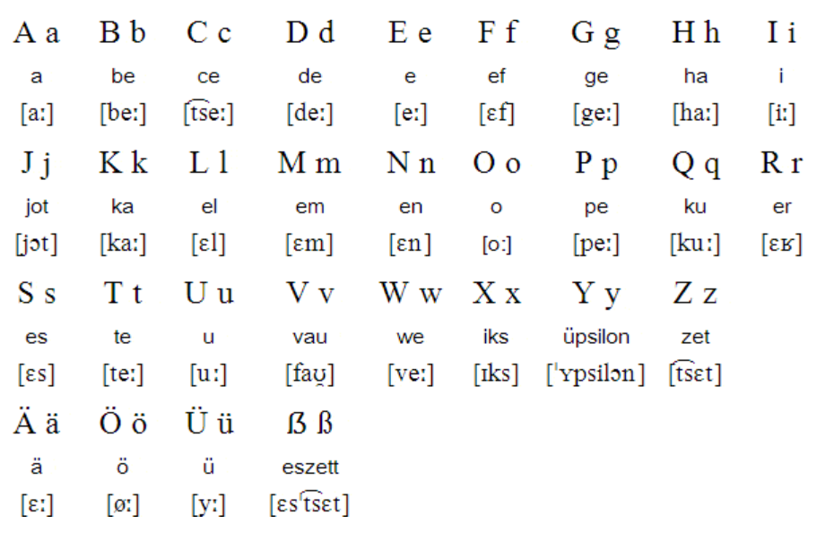

# class 1/2024.2.26

## chapter 0：课程要求/概述

- 德语国家/语系概述

德语属印欧语系-日耳曼语系，同属日耳曼语系的有英语。

> 法语/意大利语/西语属拉丁语系，但拉丁语系亦属于印欧语系

- 学习内容
  《新编大学德语》I chapter 1-10

- 分数构成

1. 平时成绩

- 不定时点名
- 随机回答问题
- 作文

2. 期末考试

## chapter 1：基本词汇表
### Teil 1：字母表
德语共30个字母，其中音标对应英语类似如下：

- /e:/类似/ei/
- /y/类似中文ü
- ö类似/err/
  

**重点区分！**
- a-ä-e-i-r
- l-m-n

跟读练习...
> 德语单词第一个字母需要大写

> 德语单词一般一重

### Teil 2：