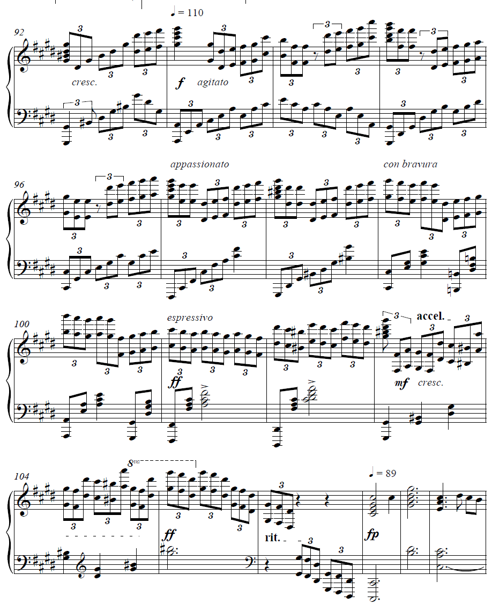

# 个人小记

## 音乐是一种表达

- 本人自5岁学习钢琴，至今已有十余载春秋。这里将本人的音乐体验与感悟记录于此，以作小结。
- 私以为，业余者对音乐的练习应当为“力-技-势-意-道”五次不同的跃迁与提升。
- 对于“力”，即个人的天赋，手指的跨度和先天的条件，这并非我们主观上可以改变的事物，因此暂且按下不表。

### 求技

- 由于小学毕业即获得央院业余九级，初中四年基本没有练什么较难的曲子，技术一路跌到大约6-7级的水准。
  高一开始，由于疫情的原因，居家与钢琴接触的时间大量增加，于是开始进行复健。
  从《鸟之诗》开始，本人历时半年的时间同时练习《鸟之诗》与《若能绽放光芒》，最终将搁置了4年的技术练回到钢琴九级的水准。
  （有一说一，这两首曲子确实适合作为复健的曲目，它们本身并不难，但恰好应当是业余巅峰的难度，同时也包括一些跑动和跳跃）
  而后开始练习《swordland》、《unravel》两个难度曲目，辅以数个与九级难度大致相当的曲目。
- 最终以小成的《my dearest》，很烂但是能弹下来的《冬风》作为高中阶段的最后成果。

### 成势

- 必须说明的是，**音乐不是一种技巧的展示，而是一种情绪的表达**。
  对于演奏者与歌唱者来说更是如此，一首曲目能否对听者有情绪的输出与共鸣，比它本身的技巧更为关键。
  我们选择一首曲目，第一要素往往是它**好听**，而好听与技巧的高低并没有直接的关系。
  这里以《euterpe》这首曲目为例，animenz在写此曲目的高潮部分如下：
  
  在短短十余个小节内，animenz连续用了数个表达标识来将整个演奏的情绪变化显式的注在谱面，目的昭然若揭。
  而显然，在演奏时也确实凸显出了这样的效果，全曲从“入境-风起-花飞-花落”四个小段落，直接把曲目要表达出的主题用音乐的方式外化出来。

> 诸如此般的曲子有很多，有兴趣的读者可以聆听animenz下面的曲目片段演绎：
> Fate/stay night HF组曲中的第三部分《春归》;
> butterfly 原版曲目中的第二次副歌;
> brave shine 中的最后一次副歌;
> 以及肖邦《革命练习曲》的开头，肖邦《逃亡圣咏练习曲》全曲。
> 我们可以清楚的感觉到，它们能够做到“好听”的效果，并不是因为谱面上有多么密集的音符（诸如春归第一次副歌只用了几个简单的和弦），而是因为它们形成了一种“势”，通过强/弱的变化，连贯/断奏的变化，延音/休止的变化，最终产生了一种曲目本身的特色。
> 不妨类比一下，五线谱事实上是一本书，而演奏就是将它朗读出来。绕口令或是贯口的确是一种表现形式，但朗诵显然在“朗读”这一层面上占据着很大的比重。
> 因此，此时需要我们能够从**读出**谱子，到**读懂**谱子。我们需要知道作者想要表达什么，才能够更好地演绎出相应的效果。
> （也许这就是为什么我很少练古典的原因，毕竟相比于古典音乐，流行音乐更好把握全曲的基调。）

### 至意

fjs老师在《歌唱艺术》课程中，对演唱的教学方式可以作为比较生动的例子。
老师在教学一首歌时，会将整个曲目的所有歌词逐词拆解体会，在确认完全领悟了整首曲子的歌词内涵后，才开始对“歌唱”本身进行教学。
这种教学方式，也许对*歌*和*曲*之间的关系，有一种更深层的阐述。
事实上，曲承载的是故事，但曲只是故事中的一个映射。
而其他的映射部分，往往要在歌中，在场景中，在感受中才能够找到。

### 悟道
