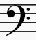

## class 1
### 基本的五线谱识谱
#### 五线谱构成
##### 谱号
- 高音谱号：一般用于描述高音区音符，一般用右手弹奏。

- 低音谱号：一般用于描述低音区音符，一般用左手弹奏。

##### 调号
- 共有12个调号，调号决定了曲目的演奏方式。

##### 拍号
- 拍号决定了曲目每个小节的拍数；常用的有：
- 4/4拍；

- 4/3拍；

##### 音符
- 全音符（4拍）

- 二分音符（2拍）

- 四分音符（1拍）

> 以下加一线的音符作为中央dol（C4），可以找到所有音符的位置。

##### 休止符
- 全休止符（4拍）

- 二分休止符（2拍）

- 四分休止符（1拍）

### 实践：试弹
- 练习1

- （选做：练习2演奏）
